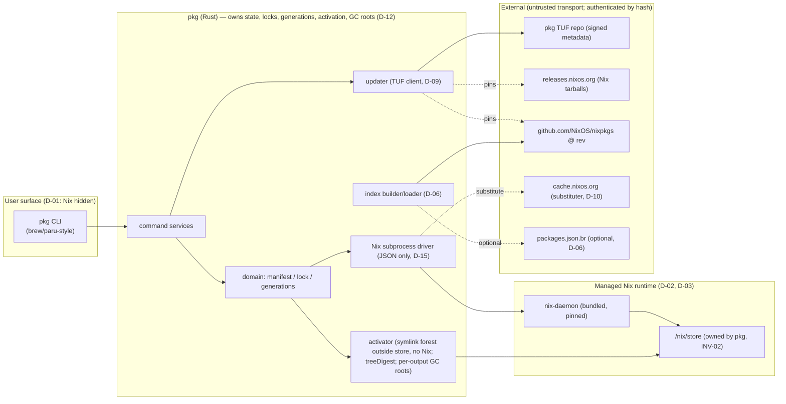
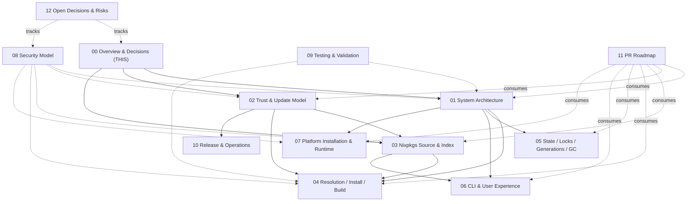

# 00 — Overview and Decisions

| | |
|---|---|
| **Status** | Draft (planning only — no implementation code) |
| **Owner** | Foundation planning track (docs 00–03) |
| **Depends on** | (none — this is the root document) |
| **Consumed by** | 01 System Architecture, 02 Trust & Update, 03 Nixpkgs Source & Index, 04 Resolution/Install/Build, 05 State/Locks/Generations/GC, 06 CLI/UX, 07 Platform Installation/Runtime, 08 Security Model, 10 Release/Ops, 11 PR Roadmap, 12 Open Decisions/Risks |

---

## 1. Purpose

This document is the **root of the planning tree**. It defines what the product is, the non-negotiable decisions that constrain every other document, the shared vocabulary, the supported platforms, and the high-level CLI surface. Every other plan file MUST be consistent with the decisions recorded here. When another document needs to reference a binding constraint, it cites a `D-NN` decision or `INV-NN` invariant from this file.

The product is referred to throughout by its working codename **`pkg`**. The codename is a placeholder and may be renamed; nothing in these documents hard-depends on the literal string.

## 2. Scope

In scope for V1:

- A single **Rust** binary (`pkg`) providing a brew-/paru-style imperative package workflow: search, info, install, remove, list, outdated, update, upgrade, pin/unpin, history, rollback, gc, doctor.
- A **bundled, pinned, product-managed Nix runtime** (the `nix-daemon` + store) that is hidden from the user.
- An **exactly pinned Nixpkgs revision** as the package catalog.
- A **disposable derived catalog index** for browsing (search/list/info); install re-evaluates the exact selected attribute on the host.
- A **small signed channel descriptor** distributed via mature signed-update metadata (TUF) that pins the Nix runtime, Nixpkgs revision, index hashes, substituters/keys, supported systems, and policy version/sequence/expiry.
- **`cache.nixos.org`** as the only artifact cache in V1.
- Platforms: **`x86_64-linux`, `aarch64-linux`, `x86_64-darwin`, `aarch64-darwin`**.

## 3. Non-scope (V1)

The following are explicitly **out of scope** and, in many cases, are **forbidden** by design:

- Exposing any raw Nix CLI, the Nix expression language, `nix repl`, `nix develop`, or arbitrary evaluation of user-supplied code.
- Arbitrary flake URLs, `nix flake {init,update,lock}`, overlays, `NIX_PATH`, `--impure`, `--override-input`, custom modules, or `nix profile`.
- User control of substituters (`substituters`), trust keys (`trusted-public-keys`/`trusted-substituters`), builders, remote builders, or `narinfo-cache-positive-ttl`.
- Linking against Nix's C++ libraries (`libstore`, `libexpr`, `libnixmain`, `libfetchers`). `pkg` only ever drives Nix as a **subprocess**.
- Custom/alternative store prefixes (e.g. a relocatable or per-user store). The store is `/nix/store`. (See §11 spike.)
- Building for **non-host** systems in v1: Rosetta fallback, cross-compilation, hardware
  emulation (e.g. QEMU), and remote/distributed builders. v1 builds only the host's **native**
  Nix system locally (D-11); anything for another system must come from the cache. (macOS
  *local* builds for the native Darwin system are explicitly **in scope** under D-11.)
- A web UI, a GUI, a daemon-control REST API, multi-user networked serving, or a package-authoring/upload workflow.
- Becoming a replacement for declarative system configuration (NixOS/nix-darwin/home-manager). `pkg` is imperative package management only.

## 4. Glossary

| Term | Meaning |
|---|---|
| **`pkg`** | The product (Rust package manager). Working codename. |
| **Managed Nix runtime** | The pinned `nix` binaries + `nix-daemon` + store that `pkg` installs, owns, and upgrades. |
| **Store** | The Nix store at `/nix/store`. ✅ Fixed by Nix and by `cache.nixos.org` path hashing (§11). |
| **Channel descriptor** | The signed JSON document pinning the Nix runtime, Nixpkgs revision, index hashes, substituters/keys, supported systems, and policy. Canonical schema in doc 02. |
| **Catalog** | The Nixpkgs source at the descriptor's pinned revision. |
| **Index** | A disposable, derived, content-addressed catalog of package *metadata* used only for search/list/info. Not authoritative. Canonical schema in doc 03. |
| **Intent (selector)** | What the user asked for, e.g. `ripgrep`. Lives in the **manifest**. |
| **Realization** | The exact store artifact: `{ attrPath, system, drvPath, outPath, narHash }`. Lives in the **lock**. |
| **Manifest** | Desired-state document (set of intents + constraints). Canonical name `manifest.json`. |
| **Lock** | Realized-state document (intent → realization). Canonical name `lock.json`. Full schema & migrations owned by doc 05. |
| **Generation** | An immutable snapshot of (manifest + lock + channel sequence + activation), identified by monotonic id. Owned by doc 05. |
| **Activation** | The deterministic **symlink forest** `pkg` (Rust) materializes **outside `/nix/store`** under `<user-state>/activations/gen-<id>/` from a generation's selected outputs; `current` is a relative symlink to it. Activation invokes **no Nix** — entries point at `/nix/store` targets or approved sources. A `treeDigest` binds the sorted path→store-target/source records. Owned by docs 05/07 (D-18). |
| **GC root** | A symlink under `/nix/var/nix/gcroots/pkg/users/<uid>/` pinning a realized **output** so the Nix GC keeps it. The **broker mediates and the privileged root helper is the sole filesystem writer** for **one GC root per selected output**, created before the `current` swap on behalf of an authenticated user (D-17, D-18, D-19). |
| **Broker** | The unprivileged **singleton** product-owned service that is the **sole general Nix daemon client and sole spawner of the bundled `nix` CLI for all normal operations**, the **sole mediator/requester** of per-output GC-root operations and of helper-run repair, and the host of the **broker-internal in-memory build/GC admission gates** (D-19). A daemon `allowed-user`, never a `trusted-user`. |
| **Root helper (maintenance client)** | The narrow **privileged** boundary that is the **sole root-set filesystem writer** (GC roots, service control, runtime upgrade, `/nix` ownership) and the sole fixed local-store repair executor, running two-phase `nix --store local store repair` as root on a closed broker request because Nix 2.34.8's daemon protocol does not implement `repairPath` (D-19). |
| **Repair** | `pkg repair` is a **user-initiated, two-phase, verified non-atomic** integrity restore: read-only verify (broker) → cache-only repair (helper, `max-jobs=0`/`builders` empty) → stop-before-build → approved local repair build (helper, bounded nonzero `max-jobs`/`builders` empty, broker build mutex + shared GC permit); raw Nix logs stay service-private (D-19, INV-12). |
| **Capability (maintenance)** | An **opaque, expiring, single-use** helper token bound **server-side** to uid / rooted generation / typed `StorePath` set / `RepairBuildPlan` digest / `policyVersion` / mode; stale/replayed/mismatched/cross-UID capabilities fail closed and are invalidated on restart (D-19). |
| **TUF** | The Update Framework — the mature signed-update metadata standard used to distribute the descriptor and pinned artifacts (doc 02). |
| **`packages.json.br`** | An optional upstream index artifact published by the nixos-search/Hydra pipeline. May accelerate but is not assumed permanent or cross-platform complete (doc 03). |

## 5. Legend (used in all plan documents)

- ✅ **Confirmed** — current, verifiable Nix/Nixpkgs behavior with a primary-source citation.
- 🛠 **Decision** — a `pkg` product design choice (not Nix behavior) that constrains implementation.
- ⚠️ **Spike** — requires a short verification spike before commitment; a default is stated.

## 6. Confirmed Nix facts that drive the architecture

These are load-bearing and are cited because they force specific decisions.

1. ✅ **The store path prefix is effectively fixed to `/nix/store`.** Nix's store directory is a build-time setting (`--storedir`); the official Nix binaries and `cache.nixos.org` substitute paths under `/nix/store`. Store path names are `<store>/<hash>-<name>` where the hash is derived from the derivation's contents/references. A store built under a *different* prefix cannot consume `cache.nixos.org` NARs directly. **Consequence:** `pkg` must own `/nix`. — *Nix Reference Manual, "Glossary" → "store path"; "Installation" → store dir; `conf-file`.*
2. ✅ **Nix's state/log/profile/daemon-socket/gcroots directories are configurable** via `nix.conf` and env vars (`NIX_STATE_DIR`, `NIX_LOG_DIR`, `NIX_DAEMON_SOCKET_PATH`, etc.), independent of the fixed store dir. — *Nix Reference Manual, "Environment variables" and "Configuration".*
3. ✅ **`nix profile` is an imperative profile manager** with its own history/rollback, and there is no stable in-band machine contract guaranteeing `pkg` could rely on it across Nix versions. **Consequence:** `pkg` does not treat `nix profile` as authoritative; it owns its own manifest/lock/generations and creates GC roots directly. — *Nix Reference Manual, `nix3-profile`.*
4. ✅ **Nixpkgs exposes packages under `packages.<system>` (flake schema) and `legacyPackages.<system>`** (the attribute tree, which may be infinite/lazy and can throw per-attribute). **Consequence:** browsing must tolerate per-attribute eval failures, and any catalog "list" is inherently a derived view, not ground truth. — *Nixpkgs Reference Manual + Nix manual `nix3-flake` flake output schema.*
5. ✅ **Nix release tarballs are published at `releases.nixos.org/nix/nix-<version>/`** with a `.sha256` sidecar (historically GPG-signed). **Consequence:** these are the artifact set `pkg` pins and verifies. — *`nixos.org/download`, `releases.nixos.org`.*

## 7. Binding decisions

These are the product's invariants. Other documents implement them; none may contradict them.

| ID | Decision | Rationale | Implemented in |
|---|---|---|---|
| **D-01** | **Nix is fully hidden.** Users never see, invoke, or configure raw Nix. | Predictability, safety, supportability. | 01, 06 |
| **D-02** | **`pkg` bundles and pins a managed Nix runtime** and drives it **only as a subprocess**; it does **not** link Nix C++ libraries. | Nix's C++ ABI is unstable across versions; subprocess JSON is the stable surface. | 01, 02 |
| **D-03** | **Exclusive managed ownership of the Nix installation.** V1 takes exclusive ownership of `/nix` and the bundled runtime. | Avoids dual-store corruption, ambiguous trust, and competing GC roots. | 01, 07 |
| **D-04** | **Fail closed on unmanaged existing Nix.** If `pkg` detects an existing unmanaged Nix (e.g. `/nix` from another installer, `nix` on PATH, launchd/systemd units), it **refuses to install/run** and prints manual remediation. It **never auto-removes** user installations. | Data loss / trust hazard; never destroy user state automatically. | 01, 07, 08 |
| **D-05** | **Nixpkgs at an exact pinned revision is the catalog.** No mutable channels, no `nixpkgs-unstable` floating, no overlays. | Reproducibility; predictable resolution. | 03 |
| **D-06** | **Search/list/info use a disposable derived index.** The index is never authoritative for what can be installed; it is rebuilt/fetched from the descriptor and may be incomplete. | Nixpkgs is too large and per-system-conditional to enumerate as ground truth cheaply. | 03 |
| **D-07** | **Install re-evaluates the exact selected attribute on the host.** The only authoritative statement that a package is realizable on *this* machine is the on-host evaluation. | Index staleness/completeness; cross-system conditionals; broken packages. | 03, 04 |
| **D-08** | **A small signed channel descriptor** selects the Nix runtime, Nixpkgs revision/narHash, index hashes, allowed substituters/keys, supported systems, policy version, sequence, and expiry. | Single pinned, verifiable source of truth per release. | 02 |
| **D-09** | **Updates use mature signed-update metadata (TUF)**; `pkg` does **not** invent custom "TUF-lite" cryptography. | Avoid ad-hoc crypto; get key rotation, threshold, rollback/freeze protection for free. | 02 |
| **D-10** | **`cache.nixos.org` is the only artifact cache in V1.** Users cannot change substituters or trust keys. | Reduce attack surface; single trust path. | 02, 04 |
| **D-11** | **Local builds are explicit and cross-platform.** Cache substitution is always tried first and preferred on every platform. On a cache miss, v1 may build locally for the host's **native** Nix system on Linux and macOS (`x86_64-linux`, `aarch64-linux`, `x86_64-darwin`, `aarch64-darwin`) — **never** via Rosetta, cross-compilation, emulation, or remote builders. A local build is never silent: `pkg` first shows a deterministic build preview (derivations/source inputs, downloads/closure, resource estimate or explicit unknowns, target system, sandbox status) and then requires explicit **single-operation** approval (cancel is the safe default). Builds run through the managed multi-user daemon's dedicated unprivileged build users (`nixbld*` on Linux; `_nixbld*` users in the `nixbld` group on macOS) with `sandbox=true` and `sandbox-fallback=false` on both platforms; `pkg` fails closed if sandbox or build-user readiness cannot be verified. | Substitution stays the fast/safe path; builds are opt-in per operation; the same preview/approval/sandbox/build-user controls apply to macOS as to Linux. macOS local builds need the host's native toolchain (Xcode/CLT); they are kept honest about Nix's macOS sandbox using different, generally narrower platform primitives than Linux. Installer/runtime signing & notarization are **separate** from building Nix packages — local Nix outputs are not individually Apple-notarized by `pkg`. | 04, 07, 08 |
| **D-12** | **Rust owns desired state, exact locks, generations, activation, and GC roots.** Nix profile state is **not authoritative**. | Single, versioned, migratable state machine; predictable rollback. | 01, 05 |
| **D-13** | **Package identity distinguishes intent from realization.** `pname@version` is **display metadata, not a unique identity.** Two intents may share a pname; one intent may resolve differently per system/channel. | Correctness of upgrade/pin/rollback semantics. | 04, 05 |
| **D-14** | **V1 platform set** is `x86_64-linux`, `aarch64-linux`, `x86_64-darwin`, `aarch64-darwin`. | User requirement. | 07 |
| **D-15** | **All `pkg` ↔ Nix communication uses machine-readable JSON** (never human-oriented output parsing). | Stability across Nix versions. | 01, 04 |
| **D-16** | **Failed operations leave the previous generation active** (atomic current-symlink, staging before commit). | Never break the user's working environment mid-operation. | 04, 05 |
| **D-17** | **Multi-user authoritative state split.** The immutable runtime, `/nix` store service, trust/config assets, and machine-global service ancestors are **root-owned and shared**. The unprivileged broker owns two distinct private domains: its `0700` home and mutable authenticated channel/index/source datastore leaves, and the separate `0700` raw-log leaf (`/var/lib/pkg/log/broker` on Linux; `/Library/Application Support/pkg/log/broker` on macOS). Users cannot access either domain. The **authoritative package environment state** — manifest, lock, generations, activation, journal — is **per-user, keyed by OS uid**, and owned by that user. Two narrow, distinct privilege boundaries exist (D-19): an **unprivileged singleton broker** (sole general daemon client and sole bundled-`nix`-CLI spawner for normal ops; sole mediator/requester of per-output GC-root operations and of helper-run repair; host of the broker-internal in-memory build/GC admission gates) and a **privileged root helper** (sole root-set filesystem writer and sole fixed local-store repair executor) | Safe isolation between users on shared hosts; the managed daemon is already multi-user (doc 01 §8), so per-user authoritative state is feasible and avoids accidentally making all package state globally shared. Supersedes the earlier single-shared-profile assumption (formerly UD-00.4). | 01, 05, 07 |
| **D-18** | **Activation is a Rust-owned symlink forest outside the store; activation invokes no Nix.** `pkg` (Rust) materializes each generation's activation as a deterministic **symlink forest** under `<user-state>/activations/gen-<id>/` (entries point at `/nix/store` targets or approved sources); `current` is a relative symlink to it. A `treeDigest` binds the sorted path→store-target/source records. **Nix owns downloads/builds/store only** — the activation tree is never a Nix `buildEnv` store object. The **broker mediates and the root helper is the sole writer** for **one GC root per selected output** before the `current` swap (D-19). | Activation stays deterministic and store-independent; no per-generation Nix build; collisions resolved per-file in Rust; a single root never has to protect a hand-built tree. | 01, 05, 06, 07 |
| **D-19** | **Broker/helper privilege split & two-phase store repair.** An **unprivileged singleton broker** is the **sole Nix daemon client and the sole spawner of the bundled `nix` CLI for all normal operations** (evaluate/build/substitute/path-info/read-only `nix store verify`/liveness-respecting GC) — a daemon `allowed-user`, **never** a `trusted-user` (root is the sole `trusted-user`; `trusted-users` are root-equivalent). The **sole narrow exception** is `pkg repair`: the **privileged root helper** is the **sole root-set filesystem writer** (GC roots, service control, runtime upgrade, `/nix` ownership) and the sole fixed local-store repair executor. Nix 2.34.8 reports `repairPath is not supported by store 'daemon'`, including for root, so the helper pins **`--store local`** against the exclusively managed store and never accepts a store selector — (Phase 0) read-only `nix store verify` via the broker computes the damage set; (Phase A) per-path cache-only `nix store repair` via the helper with **managed pinned substituters/keys, `max-jobs=0`, `builders` empty**, auto on a signed cache hit and **must stop before any build** on a cache miss; (Phase B) an approved local rebuild via the helper with **bounded nonzero `max-jobs`, `builders` empty**, serialized by the **broker's machine-wide build mutex** and holding a **shared GC-inhibit permit**, using the **ordinary public build preview / explicit single-operation approval** whose internal `RepairBuildPlan`/digest covers **every output Nix may rebuild**. The helper resolves an **opaque expiring single-use capability** bound **server-side** to uid, an existing pkg-owned rooted generation/closure, a typed `StorePath` set, the `RepairBuildPlan` digest, `policyVersion`, and mode; stale/replayed/mismatched/cross-UID capabilities **fail closed** and are invalidated on helper/broker restart. **Build admission and GC admission are broker-internal in-memory gates, not backing-file flocks**; the per-user state-mutation lease remains a filesystem `flock`. **Raw Nix logs are service-private only**; public/user-state logs are sanitized NDJSON. The detailed broker/helper framed RPC, peer auth, operation lifecycle, child containment, capability storage/expiry, and restart handshake are fixed by doc 13 / PR-39 before Real-Nix execution. | The broker is deliberately unprivileged and the daemon protocol cannot execute `repairPath`; direct local-store access is confined to one root helper method whose store, mode, jobs, paths, and policy are capability-bound and not caller-selectable. Admission/GC coordination stays inside the single broker process (a `flock` cannot represent independent shared holders portably). | 01, 04, 05, 07, 08, 13 |

### Invariants (global)

- **INV-01** There is exactly one Nix on a `pkg`-managed host: `pkg`'s managed runtime. (D-03, D-04)
- **INV-02** The store is `/nix/store`; `pkg` owns all of `/nix`. (D-03, §6.1)
- **INV-03** No user-supplied Nix expression, flake URL, overlay, or substituter/key ever reaches the bundled Nix. (D-01, D-10)
- **INV-04** The catalog revision is fixed by the currently-accepted channel descriptor as the authoritative default. Individual selectors may additionally be pinned to an older channel sequence or an explicit rev (manifest `sourceRev` = `channel:current` | `channel:pinned:<id>` | `rev:<gitsha>`), so a generation may legitimately contain outputs realized from multiple Nixpkgs revisions (mixed-rev); every such rev is exact/pinned, never floating. (D-05, D-08) — *downstream detail in doc 05 §7.*
- **INV-05** Every realized output pinned in a generation has its own GC root under `/nix/var/nix/gcroots/pkg/users/<uid>/` (**one root per selected output**, created before the `current` swap). (D-12, D-17, D-18)
- **INV-06** `pname@version` is never used as a key; identity is `(intent selector, channel sequence, system) → realization`. (D-13)
- **INV-07** The descriptor, its TUF metadata, and the index hashes are the only inputs `pkg` trusts for "what to install"; the index is UX-only. (D-06, D-07, D-08)
- **INV-08** Local builds (Linux and macOS, native system only) are never silent and never the default: substitution is tried first, then a deterministic build preview, then explicit single-operation user approval. Evaluation and planning never realize outputs (the exact pinned installable is evaluated with import-from-derivation disabled; `nix build` begins only at acquire — pure substitution first, then an approved local build). Builds run only through the managed daemon's unprivileged build users under `sandbox=true`/`sandbox-fallback=false`; `pkg` fails closed if sandbox or build-user readiness cannot be verified. A **broker-internal in-memory** machine-global local-build admission gate (not a backing-file `flock` — a single broker cannot represent independent shared holders portably), separate from the per-user state-mutation lease, serializes approved local builds across users: a second op waits or cancels, and revalidates approval/readiness once it acquires the gate. The machine-global GC admission gate is likewise broker-internal and in-memory; only the per-user state-mutation lease remains a filesystem `flock` (D-19). No Rosetta, cross-compilation, emulation, or remote builders in v1. (D-11)
- **INV-09** Update metadata is verified with TUF before any descriptor/Nix-runtime/index/source is used. (D-09)
- **INV-10** Authoritative package environment state (manifest/lock/generations/activation/journal) is **per-user keyed by uid**. Root owns immutable service/trust assets and machine-global ancestors; the broker owns its private home/datastore and separate private raw-log leaf. Package state is never globally shared across users. (D-17)
- **INV-11** Activation is a deterministic per-generation **symlink forest** under `<user-state>/activations/gen-<id>/`, materialized by `pkg` (Rust) **outside `/nix/store`**; activation invokes **no Nix** (no `buildEnv`, no `nix build` of an activation expression). `current` is a relative symlink into `activations/`. The `treeDigest` binds the sorted path→store-target/source records, so the forest is content-addressable and collisions are enforced in Rust. The private broker / root-helper creates **one GC root per selected output** (not one per generation) before the `current` swap. V1 collision policies are **only** `abort` (default), `keep-first`, `keep-last`; `keep-first`/`keep-last` pick a deterministic per-file winner while the losing package's other (non-colliding) files remain visible. (D-18)
- **INV-12** `pkg repair` is explicitly **user-initiated and verified non-atomic** (D-19). Cache repair **deletes the live path before restoring it**; an approved local repair **moves the old output aside before replacement**. `pkg repair` warns that affected commands may be temporarily unavailable, **journals per path**, runs a **final read-only `nix store verify`** before marking anything repaired, **automatically resumes only cache repair** after a crash, and **requires fresh single-operation approval before repeating a local repair build** (the `mode=build` capability is single-use and invalidated on restart). `pkg` never claims repair is atomic or generation-switched. (D-19; residual tracked as RISK-22 in doc 12.)

### Canonical data contracts (defined in 01–03)

`pkg` uses these named artifacts consistently across all documents. The *schema owner* column shows where the authoritative JSON/TOML shape is defined; doc 05 owns versioning/migrations.

| Artifact | File / dir | Schema owner | Referenced as |
|---|---|---|---|
| Channel descriptor | `/var/lib/pkg/broker-home/channel/descriptor.json` | **02 §7** | `descriptor.json`, `channelSeq` |
| TUF metadata | `/var/lib/pkg/broker-home/channel/tuf/` | **02 §6.4** | `root/timestamp/snapshot/targets` |
| Manifest (desired state) | `<user-state>/manifest.json` (per-user, keyed by uid; D-17) | **01 §10.1** (migrations: 05) | `manifest.json` |
| Lock (realization) | `<user-state>/lock.json` (per-user, keyed by uid; D-17) | **01 §10.2** (migrations: 05) | `lock.json` |
| Generation record | `<user-state>/generations/<id>.json` (per-user, keyed by uid; D-17) | **01 §10.3** (internals: 05) | generation `<id>` |
| Index (per system) | `/var/lib/pkg/broker-home/index/<seq>/<system>.json` | **03 §7** | index record |
| Nix subprocess invocations | (table) | **01 §11** | subprocess contract |

## 8. High-level system picture (normal flow, overview)

## 9. CLI surface (overview — doc 06 owns exact flags/exit codes)

Familiar brew/paru mapping. The product exposes **one** verb namespace; no Nix verbs leak.

| Intent | `pkg` command | Rough analog |
|---|---|---|
| Health check | `pkg doctor` | `brew doctor`, `paru -P` |
| Refresh channel metadata | `pkg update` | `brew update`, `paru -Sy` |
| Search catalog | `pkg search <term>` | `brew search`, `paru -Ss` |
| Package info | `pkg info <pkg>` | `brew info`, `paru -Si` |
| Install | `pkg install <pkg>...` | `brew install`, `paru -S` |
| Remove | `pkg remove <pkg>...` | `brew uninstall`, `paru -R` |
| List installed | `pkg list` | `brew list`, `paru -Q` |
| Show outdated | `pkg outdated` | `brew outdated`, `paru -Qu` |
| Upgrade one | `pkg upgrade <pkg>...` | `paru -S <pkg>` |
| Upgrade all | `pkg upgrade --all` | `brew upgrade`, `paru -Su` |
| Pin/unpin | `pkg pin` / `pkg unpin` | (pinning) |
| History | `pkg history` | `nix profile history` analog |
| Rollback | `pkg rollback` | `nix profile rollback` analog |
| Garbage collect | `pkg gc` | `nix-collect-garbage`, `brew cleanup` |
| Repair store | `pkg repair` | `nix store verify` + two-phase `nix store repair` (D-19; user-initiated, non-atomic — INV-12) |
| Shell completion | `pkg completion <shell>` | clap_complete |

`<pkg>` is an **intent selector** (D-13), not a Nix attribute path expression; resolution rules are owned by doc 04.

## 10. Cross-document map

- **01 System Architecture** owns: layered components, the **Nix subprocess contract table**, the **canonical state-directory layout**, and command-level flow sketches.
- **02 Trust & Update Model** owns: the **channel descriptor schema**, TUF role/target mapping, key/rotation policy, and the update sequence.
- **03 Nixpkgs Source & Index** owns: source acquisition/pinning, the **index schema**, the **on-host install-evaluation contract**, and the `packages.json.br` relationship.
- **04–07** (other agent) expand resolution/install/build, state machine, CLI, and platform installers — they consume the contracts defined in 01/02/03.
- **08–12** (other agent) own threat model, testing, release/ops, the PR DAG, and the risk register — they consume decisions D-01..D-17 here.

## 11. Required spikes (fed into doc 12)

> **Canonical spike IDs are `S1`–`S5`** as defined in **doc 12 §2** and sequenced on the PR DAG in **doc 11 §3** (each produces a Decision Record `DR-001`–`DR-005`). The legacy `SPK-NN` labels below are mapped to the canonical IDs for continuity. No irreversible architecture merges before the corresponding DR is `Accepted` (doc 11 §9).

| Canonical (doc 11/12) | Legacy label | Question | Owner of detail |
|---|---|---|---|
| **S1** (PR-4 → DR-001) | SPK-01 | Store-prefix constraint & managed/unmanaged Nix coexistence: confirm `pkg` can exclusively own `/nix/store` while running its own daemon socket/state under managed locations, and that no V1 scenario requires a relocatable store. Default: hard requirement on `/nix/store`; if a platform cannot grant exclusive `/nix` ownership, `pkg` fails closed (D-04). | doc 07; tracked in doc 12 |
| **S2** (PR-5 → DR-002) | SPK-03 | TUF library choice (`tough` vs `tuf` crate) against the target metadata layout, threshold + revocation. | doc 02 |
| **S3** (PR-7 → DR-003) | (new) | Darwin binary coverage on `cache.nixos.org` for `x86_64-darwin`/`aarch64-darwin` **and** real local-build readiness on macOS (native sandboxed build, `nixbld` build-user group / `_nixbld*` build users, Xcode/CLT toolchain availability, the honest resource boundary with **no** per-build memory/CPU/IO cap in stock Nix 2.34.8, `sandbox-fallback=false` fail-closed) + Apple signing/notarization feasibility for the installer/runtime. | doc 07 |
| **S4** (PR-6 → DR-004) | SPK-04 / SPK-04a | Single-attribute reevaluation cost (and index self-build meta-eval performance for four systems); confirm the flake-fetcher `narHash` vs raw GitHub archive hash difference. | doc 03 |
| **S5** (PR-8 → DR-005) | (new) | Managed-daemon sandbox / approval / resource-boundary on **both Linux and macOS**: does `sandbox=true`/`sandbox-fallback=false` work under the managed daemon with the `nixbld` build group (`nixbld*`/`_nixbld*` users); can `pkg` intercept a build for preview/approval; what resource boundary actually holds (`max-jobs=1` bounds concurrent derivations per client/connection, so `pkg` adds a machine-global local-build admission lease across users; daemon `timeout`/`max-silent-time`/`max-build-log-size` bounds; disk/free-space/load preflight; Nix `use-cgroups` is Linux process grouping/cleanup/accounting, not caps; service-manager ceilings are Pending); fail-closed readiness; and that evaluation/planning never realize outputs. | doc 04/07 |

> **SPK-02 (Nix-as-subprocess JSON stability)** is **not** a standalone spike: it is enforced continuously by pinning the managed Nix runtime version (doc 02/07) and isolating **all** Nix output — including the experimental `--log-format internal-json` stream — behind the **single versioned `nix-driver` adapter** (doc 01 §11, ARCH-INV-01; doc 04 I2). The exact set of stable `nix … --json` invocations for the pinned runtime is recorded in the doc 01 §11 subprocess-contract table and validated by the Fake↔Real parity job (doc 09 §4.3).

## 12. Security considerations (summary; full model in doc 08)

- **Trust minimization (INV-03, INV-07):** users cannot redirect trust. The only trust inputs are the pinned TUF root and the descriptor.
- **Fail closed (D-04):** never silently coexist with foreign Nix; never auto-delete foreign state.
- **No code execution from user input:** selectors are validated and never interpolated into Nix expressions.
- **Transport is untrusted:** `releases.nixos.org`, GitHub, `cache.nixos.org` are untrusted transports authenticated by hashes in TUF-authenticated metadata.
- **macOS hardening:** bundled Nix runtime and the `pkg` binary should be signed/notarized (V1 target); detail in docs 07/08.

## 13. Platform differences (summary; detail in doc 07)

| | Linux | macOS |
|---|---|---|
| Daemon | systemd unit managed by `pkg` | launchd plist managed by `pkg` |
| Local builds | Allowed for native system with explicit approval + `sandbox=true` + `nixbld` build users (D-11) | Allowed for native system with explicit approval + `sandbox=true` + `_nixbld` build users; Nix's macOS sandbox uses different, generally narrower primitives than Linux (D-11) |
| Store ownership | root `/nix` | root `/nix` (needs admin install) |
| Signing | — | codesign + notarization of installer/bundled runtime (target); **not** per-package notarization of locally-built Nix outputs |
| Architectures | x86_64, aarch64 | x86_64 (Intel), aarch64 (Apple Silicon) |

## 14. Failure & recovery (overview)

Doc 00 fixes the *policy* for recovery; per-operation matrices live in doc 01 §13, doc 04, doc 05, and the full model in doc 08.

- **Never break the working environment (D-16):** any failed install/upgrade/rollback leaves the previously-committed generation active via the atomic `current` swap; staged temp state is discarded.
- **Never trust unverifiable bytes (INV-09):** any hash/signature/sequence failure aborts the operation; no silent fallback to unsigned data.
- **Fail closed, never auto-delete (D-04):** foreign-Nix detection or store-ownership ambiguity refuses the operation and prints manual remediation; user data is never destroyed automatically.
- **Disposables are disposable (INV-07):** a corrupt or missing index never blocks a known-attribute install (it re-evaluates on host); a corrupt or stale descriptor is a hard stop that requires `pkg update`.
- **Restart-safe:** an interrupted operation is detected via the journal/lease (doc 05) and resumes from the last committed generation, never from a half-built `active/` tree.
- **Repair is user-initiated and non-atomic (D-19, INV-12):** `pkg repair` is never automatic; it warns affected commands may be temporarily unavailable, journals per path, and marks a path repaired only after a fresh read-only verify. Cache repair auto-resumes after a crash; an approved local repair build requires fresh approval (its capability is single-use and invalidated on restart). Raw Nix logs stay service-private; public/user-state logs are sanitized NDJSON.

## 15. Implementation checkpoints (foundation track only)

These are the order in which the **foundation** documents should be consumed/implemented, mirroring the PR DAG in doc 11:

1. Decisions frozen (this doc) → shared types/schemas sketched.
2. Directory layout & subprocess contract land (01) → `pkg` skeleton can be scaffolded.
3. Channel descriptor + TUF roles land (02) → updater stub possible.
4. Nixpkgs pinning + index schema + install-eval contract land (03) → `pkg info`/`pkg install` minimum path possible.

## 16. Acceptance criteria (foundation track)

- AC-00.1 Every downstream plan file (04–12) can resolve each cross-cutting concept it needs to a `D-NN`/`INV-NN`/named schema/path defined in 00–03.
- AC-00.2 All four foundation docs agree on: product codename, directory layout, channel descriptor schema fields, manifest/lock/generation names, index record fields, subprocess invocation set.
- AC-00.3 Every "Confirmed" claim in foundation docs cites a primary Nix/Nixpkgs source.
- AC-00.4 No foundation doc promises a feature that is out of scope (§3) or contradicts a decision in §7.
- AC-00.5 Each foundation doc explicitly names the downstream doc that owns the detailed expansion of any topic it only sketches.

## 17. Unresolved decisions

- UD-00.1 Final product name (replace codename `pkg`).
- UD-00.2 TUF library selection (tough vs tuf crate) — resolved in doc 02 / SPK-03.
- UD-00.3 Channel cadence and how "stable" vs "rolling" channels are exposed (if at all) in the UX — doc 02/06.
- UD-00.4 ~~Whether V1 ships a single global activation or supports per-user profiles on shared hosts~~ — **RESOLVED → multi-user authoritative state split (D-17 / INV-10).** Root owns immutable service/trust assets and machine-global ancestors; the broker owns its private home/datastore and separate private raw-log leaf; per-user authoritative package state (manifest/lock/generations/activation/journal) is keyed by uid. Detail in doc 01 §9, doc 05 §4, doc 07 §6.
- UD-00.5 Offline grace period for expired update metadata — doc 02.
- UD-00.6 Whether `pkg run`/`pkg shell` ephemerals are exposed in V1 (currently non-scope) — doc 06.

## 18. References (primary sources)

- Nix Reference Manual (stable): https://nixos.org/manual/nix/stable/ — glossary ("store path"), "Installation", "Configuration" (`conf-file`), "Environment variables", `nix3-profile`, `nix3-build`, `nix3-path-info`, `nix3-flake`, `nix3-flake-metadata`.
- Nixpkgs Reference Manual (stable): https://nixos.org/manual/nixpkgs/stable/ — `meta` attributes, `lib.platforms`, flake output schema.
- NixOS download / releases: https://nixos.org/download.html , `https://releases.nixos.org/nix/`.
- nix.dev ( tutorials ): https://nix.dev/.
- The Update Framework specification: https://theupdateframework.io/specification/latest/.
- `nixos/nixos-search` (index pipeline / `packages.json.br` provenance): https://github.com/NixOS/nixos-search.
