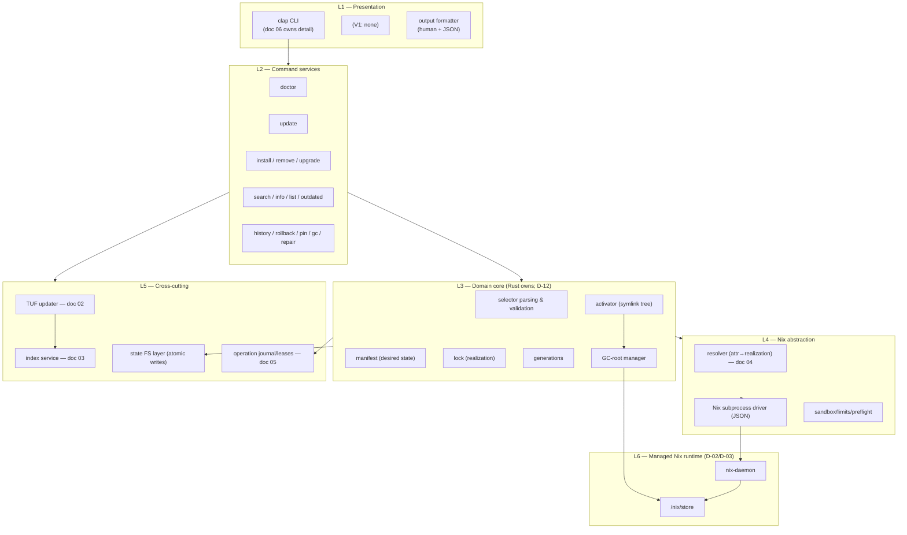
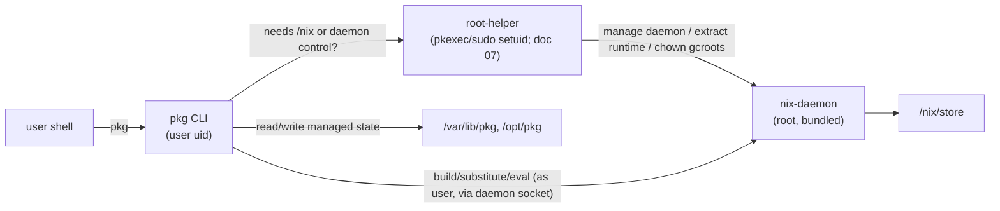
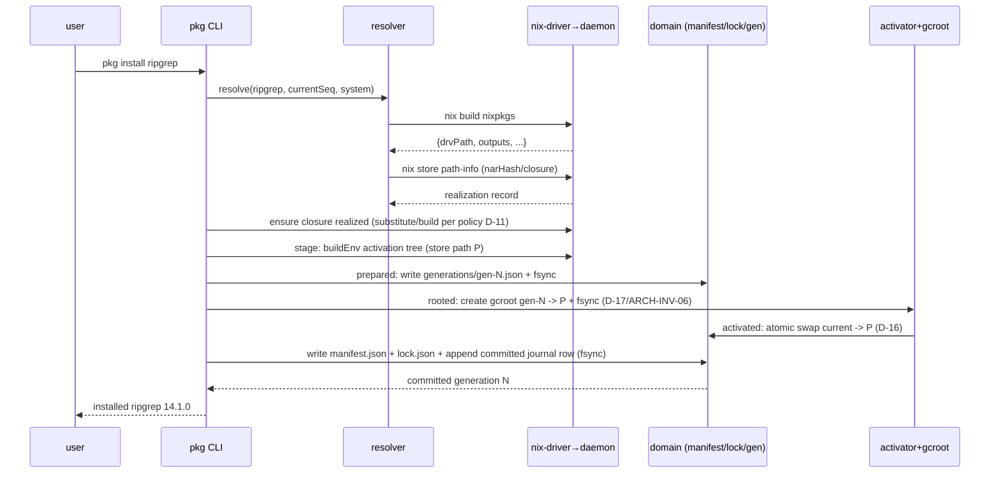
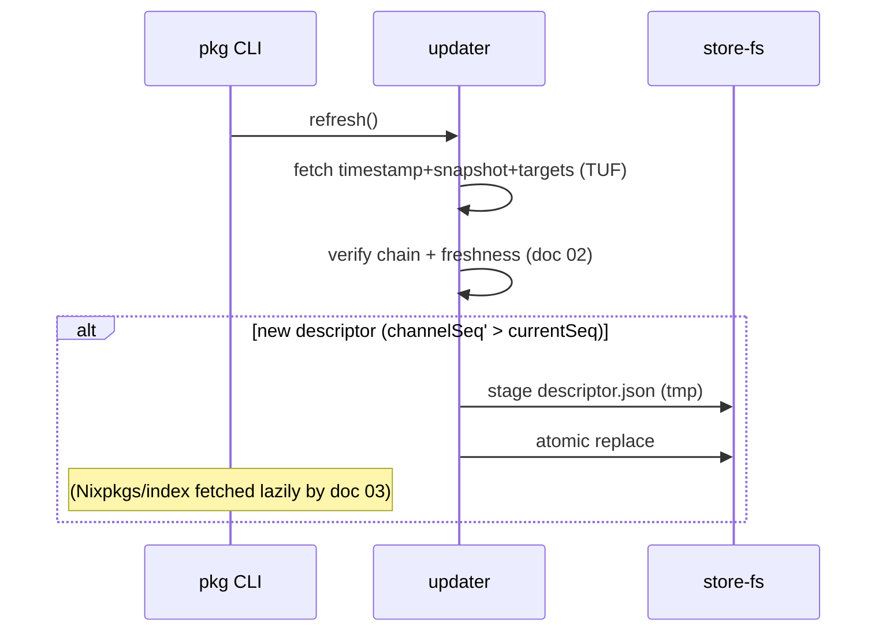

# 01 — System Architecture

| | |
|---|---|
| **Status** | Draft (planning only — no implementation code) |
| **Owner** | Foundation planning track (docs 00–03) |
| **Depends on** | 00 Overview & Decisions |
| **Consumed by** | 04 Resolution/Install/Build, 05 State/Locks/Generations/GC, 06 CLI/UX, 07 Platform Installation/Runtime, 08 Security Model, 09 Testing, 11 PR Roadmap |

---

## 1. Purpose

Define the **component architecture, process model, privilege model, subprocess boundary with the bundled Nix runtime, and the canonical state-directory layout** for `pkg`. This document is the single source of truth for "which Rust module owns what" and "how `pkg` talks to Nix." It sketches end-to-end command flows at the architectural level; the **exact per-command workflows** (flags, exit codes, prompts, progress events) are owned by doc 06; the **resolution/install/build state machine** is owned by doc 04; the **state schema/migrations** by doc 05; the **installer/daemon mechanics** by doc 07.

All decisions are inherited from doc 00 (D-01..D-17, INV-01..INV-10).

## 2. Scope

In scope: layered component model; module ownership table; process/privilege model; the **Nix subprocess contract** (invocations, JSON shapes, sandboxing, timeouts, env hygiene); the **state-directory layout** (Linux & macOS); the manifest/lock/generation/activation data-contract *names and shapes* (full migrations in doc 05); architectural flow diagrams for the core operations; failure/recovery at the architectural level.

## 3. Non-scope

Exact CLI flags/exit codes (doc 06); resolver algorithm and approval prompts (doc 04); state machine internals, migration SQL/TOML, journal internals (doc 05); installer scripts, launchd/systemd unit bodies, PATH/RCS integration (doc 07); threat-model depth (doc 08).

## 4. Invariants (architecture-specific)

- **ARCH-INV-01** `pkg` ↔ Nix traffic is **JSON over a subprocess or the local daemon socket only** (D-15). No regex on human output.
- **ARCH-INV-02** The bundled Nix is launched with **only `pkg`-controlled environment and config** (INV-03). No `NIX_PATH`, no user `~/.config/nix/nix.conf`, no `NIXPKGS_*`.
- **ARCH-INV-03** All long-lived state lives under the **canonical managed paths** in §9. Nothing authoritative is read from `nix profile` (D-12).
- **ARCH-INV-04** Every realized output in the active generation is reachable from a GC root under `/nix/var/nix/gcroots/pkg/users/<uid>/` (INV-05, D-17).
- **ARCH-INV-05** Privileged operations go through **one** controlled root helper; the CLI drops privileges for all non-privileged work.
- **ARCH-INV-06** The daemon authenticates the calling user via socket peer credentials; **authoritative package environment state is keyed by that uid** (D-17/INV-10). The **only** privileged store-side write performed on a user's behalf is GC-root creation/repair under that user's gcroots subdir.

## 5. Legend

- ✅ **Confirmed** (Nix behavior, primary source cited) · 🛠 **Decision** (`pkg` choice) · ⚠️ **Spike**. *(Full definitions in doc 00 §5.)*

## 6. Layered architecture



## 7. Component inventory & ownership

| Module (crate/logical) | Responsibility | Owns (state) | Depends on | Detailed in |
|---|---|---|---|---|
| `pkg-cli` | Argument parsing, dispatch, output formatting, exit codes | none | all command services | 06 |
| `cmd-doctor` | Health checks (Nix present/healthy, store ok, descriptor fresh, no foreign Nix) | none | nix-driver, updater | 06, 07 |
| `cmd-update` | Refresh TUF metadata + descriptor; (optionally) refresh index | `channel/` | updater, index | 02, 03 |
| `cmd-install/remove/upgrade` | Orchestrate resolve→preflight→acquire→verify→stage→activate→commit | generations dir | resolver, activator, gcroot, journal | 04, 05 |
| `cmd-search/info/list/outdated` | Read-only against index; `outdated` diffs index vs lock | index cache | index service | 03, 06 |
| `cmd-history/rollback/pin/gc/repair` | State mutation & Nix store ops | manifest, generations, gcroots | nix-driver, state | 05 |
| `domain` (selector/manifest/lock/generations) | Identity model, validation, serialization | `<user-state>/manifest.json`, `<user-state>/lock.json`, `<user-state>/generations/` (per-user; D-17) | store-fs | 05 |
| `activator` | Build activation store object (buildEnv) + `current` symlink; manage GC roots | `<user-state>/current`, `/nix/var/nix/gcroots/pkg/users/<uid>/` (D-17) | nix-driver, store-fs | 05, 07 |
| `nix-driver` | Spawn bundled `nix` with controlled env; parse JSON; timeouts | none | daemon | this doc §8 |
| `resolver` | Map selector → attr path → realization on this host | none | nix-driver, index | 04 |
| `updater` (TUF client) | Verify & apply signed metadata; pin artifacts | `channel/tuf/`, `channel/descriptor.json` | store-fs | 02 |
| `index-service` | Load/derive/refresh disposable catalog index | `index/<seq>/` | updater, nix-driver | 03 |
| `store-fs` | Atomic writes (temp→fsync→rename), migrations, integrity | whole managed tree | — | 05 |
| `journal` | Operation intent/progress/leases for restart recovery | `journal/` | store-fs | 05 |
| `root-helper` | The single privileged entry point (install/upgrade runtime, daemon control, /nix ownership) | `/nix`, daemon units | nix-driver | 07 |

**Rule:** a module may only write to the state paths listed in its "Owns" column.

## 8. Process & privilege model



- 🛠 The user `pkg` process connects to the daemon socket to build/substitute (multi-user model). Privilege escalation is reserved for: first-run bootstrap, runtime upgrades, daemon lifecycle, and creating/repairing `/nix` ownership. Detail/units in doc 07.
- ✅ In Nix's multi-user model, unprivileged clients talk to a root-owned `nix-daemon` over a socket; the daemon performs store writes. — *Nix Reference Manual, "Multi-user mode".*
- 🛠 `pkg` selects multi-user mode on all V1 platforms (even single-user hosts get a daemon) so the privilege boundary is uniform.
- 🛠 **Per-user authoritative state (D-17):** manifest/lock/generations/activation/journal are owned by the invoking uid under `<user-state>` (§9.3); the root-owned, shared layer is limited to the immutable runtime/channel/index/source/store service (§9.2). The daemon/root-helper touches a user's state **only** to create/repair GC roots under `/nix/var/nix/gcroots/pkg/users/<uid>/` and to manage the shared service — never to read or mutate another user's authoritative package state.

## 9. Canonical state-directory layout

`pkg` uses these paths **consistently across all docs**. Docs 05/07 own internals of the marked directories.

### 9.1 Nix-owned (under `/nix`; `pkg` has exclusive ownership per INV-02)

```
/nix/store/                                  # the store (FIXED prefix; §13/S1)
/nix/var/nix/daemon-socket/socket            # our daemon socket (configurable)
/nix/var/nix/gcroots/pkg/                    # INV-05: our GC roots (root-owned)
  users/<uid>/                               #   per-user roots (D-17/INV-10)
    gen-<id> -> <activation store path>      #   one per retained generation
  runtime/                                   #   roots pinning the managed runtime itself
/nix/var/nix/temproots/                      # Nix-managed transient roots
/nix/var/nix/profiles/                       # UNUSED by pkg (we do not use nix profile; D-12)
```

### 9.2 Managed runtime + machine-global service state (root-owned, shared; D-17)

```
/opt/pkg/                           # product install root (root-owned, read-only to users)
  bin/pkg                           # the Rust binary (+ platform helper)
  nix/<version>/                    # extracted bundled Nix runtime (versioned)
  nix/current -> nix/<version>/     # atomically switched at upgrade (doc 02)
  etc/pkg/                          # factory default config templates (read-only)
    nix.conf                        # generated, channel-locked trust config (doc 07)
  share/pkg/                        # bundled assets (completions, embedded TUF root.json)

/var/lib/pkg/                       # machine-global SERVICE state (root-owned; shared,
                                    # read-only to users; D-17/INV-10)
  channel/
    tuf/{root,timestamp,snapshot,targets}*.json   # TUF metadata cache (doc 02)
    descriptor.json                 # the accepted channel descriptor (doc 02)
  index/<channelSeq>/               # disposable derived index (doc 03); shared, read-only
  nixpkgs/<rev>/                    # fetched, pinned catalog source (doc 03); shared
  cache/                            # service downloads (Nix runtime tarballs) — root-owned
  log/                              # service-level logs (daemon/helper; rotated)

# NOTE: manifest.json, lock.json, generations/, current, activation, and the per-user
# journal are NOT machine-global — they are per-user authoritative state (§9.3). Only the
# immutable runtime/channel/index/source/store SERVICE is root-owned and shared.
```

`/var/lib/pkg/cache` and `/opt/pkg` are NOT under `/nix`; only `/nix/store` is the Nix store.

### 9.3 Per-user authoritative package state (user-owned, keyed by uid; D-17/INV-10)

```
# Canonical per-user state root <user-state>:
#   Linux : $XDG_DATA_HOME/pkg/   (default ~/.local/share/pkg/)
#   macOS : ~/Library/Application Support/pkg/
# A root-owned fallback /var/lib/pkg/users/<uid>/ is used for accounts whose HOME /
# XDG_DATA_HOME is unsuitable (e.g. system service accounts). Owned by that uid, mode 0700.

<user-state>/
  manifest.json                     # CURRENT desired state (doc 05) — authoritative, per-user
  lock.json                         # CURRENT realization (doc 05) — authoritative, per-user
  generations/
    <id>.json                       # immutable generation record (manifest+lock snapshot)
  current -> <activation store path># atomic activation pointer (D-16); points at the
                                    #   buildEnv activation store object (doc 04 §5.5),
                                    #   whose tree provides bin/, share/man/, ... on PATH
  journal/                          # per-user operation journal/leases (doc 05)
  cache/                            # per-user downloads / eval caches (verifiable)
  log/                              # per-user structured logs (rotated, 0600)
  shells/                           # shell-integration snippets (doc 07)

$XDG_CONFIG_HOME/pkg/config.toml    # user prefs ONLY (no trust/substituter keys; INV-03)
```

`current` is a symlink to a Nix `buildEnv` activation store object (doc 04 §5.5); that store
object's tree exposes `bin/`, `share/man/`, … and is what the user's PATH points at
(doc 07 §10). There is **no** competing hand-materialized activation tree — the activation
*is* a content-addressed store object, so collisions are detected by Nix and the tree is
reproducible (doc 04 I7).

🛠 The user config file **cannot** override trust, substituters, or the store. Any such key is rejected with an error. (INV-03.)

## 10. Data-contract names & shapes (canonical; migrations owned by doc 05)

Field names below are referenced verbatim by docs 02, 03, 04, 05, 06. Full versioning/migration logic lives in doc 05.

### 10.1 Manifest (desired state) — `manifest.json`

```json
{
  "schemaVersion": 1,
  "channelSeq": 42,
  "entries": [
    {
      "id": "sel_01HZX...",      // stable opaque id (ULID) for this intent
      "selector": "ripgrep",      // user intent string (D-13); NOT a Nix attr path
      "attribute": "ripgrep",     // resolved Nixpkgs attribute (filled at resolve; may equal selector)
      "versionPref": { "kind": "any" }, // any | exact | min | range (D-13)
      "outputs": null,             // null => meta.outputsToInstall (doc 04 §12.1)
      "sourceRev": "channel:current",     // channel:current | channel:pinned:<id> | rev:<gitsha>
      "pinned": false,             // D-13 pinning flag (skip on upgrade --all)
      "pinnedTo": null,            // realized.storePath when pinned (set by `pin`)
      "addedAt": "2025-01-02T03:04:05Z",
      "origin": "user:install"
    }
  ],
  "pins": ["sel_01HZX..."]        // convenience index of pinned selectors
}
```

### 10.2 Lock (realization) — `lock.json`

```json
{
  "schemaVersion": 1,
  "channelSeq": 42,
  "system": "aarch64-darwin",
  "entries": {
    "sel_01HZX...": {
      "attribute": "ripgrep",                 // resolved Nixpkgs attribute (D-05)
      "nixpkgsRev": "abc123…deadbeef",        // may differ per entry (mixed revs; doc 05 §7)
      "realized": {
        "storePath": "/nix/store/...-ripgrep-14.1.0",
        "deriver":  "/nix/store/...-ripgrep-14.1.0.drv",
        "outputs": { "out": "/nix/store/...-ripgrep-14.1.0", "man": "/nix/store/...-ripgrep-14.1.0-man" },
        "outputsToInstall": ["out", "man"],
        "system": "aarch64-darwin",
        "narHash": "sha256-...",               // SRI, via nix store path-info
        "closureNarSize": 4821034,
        "pname": "ripgrep",                    // display metadata ONLY (D-13)
        "version": "14.1.0"                    // display metadata ONLY (D-13)
      },
      "lockedAt": "2025-01-02T03:04:05Z",
      "provenance": "cache:cache.nixos.org",   // or "local-build" (Linux/macOS, doc 04)
      "sigsObserved": ["cache.nixos.org-1:..."]
    }
  }
}
```

> Note (D-13): `pname`/`version` are **never** used as keys. The key is the manifest `id` → realization (`storePath`); `pname@version` is rendered only. `storePath` is unique and content-addressed; it is the join key between lock, generation, GC roots, and the store (doc 05 §6).

### 10.3 Generation record — `generations/<id>.json`

```json
{
  "schemaVersion": 1,
  "uid": 1001,                     // OS uid this generation belongs to (D-17/INV-10)
  "id": "gen-0007",                // monotonic id (gen-%04d); "parent": "gen-0006"
  "createdAt": "2025-01-02T03:04:05Z",
  "channelSeq": 42,
  "manifestHash": "sha256-...",    // hash of <user-state>/manifest.json body
  "lockHash": "sha256-...",        // hash of <user-state>/lock.json body
  "generationHash": "sha256-..."   // content hash of THIS file (I4)
}
```

> Sketch only. The full record (`activation.storePath`, per-output `outputs[]`,
> `operation{opId,kind,approval}`, `collisionPolicy`) and the GC-root topology
> (`/nix/var/nix/gcroots/pkg/users/<uid>/gen-<id>`) are defined in doc 05
> §5.3/§8.3; migrations in doc 05.

### 10.4 Channel descriptor (name reference only)

The **canonical schema** for `descriptor.json` is defined in **doc 02 §7**. Doc 01 only fixes the *file location* (`/var/lib/pkg/channel/descriptor.json`) and that it is referenced from the generation via `channelSeq`.

### 10.5 Index record (name reference only)

The **canonical schema** for index records is defined in **doc 03 §7**. Doc 01 only fixes the *directory* (`/var/lib/pkg/index/<channelSeq>/`).

## 11. Nix subprocess contract (ARCH-INV-01)

This table is the **canonical set of Nix invocations** `pkg` depends on. Docs 04/03 consume it. `pkg` never invents new Nix calls outside this table; additions require a decision in doc 00. The exact stable surface for the pinned runtime is validated by the Fake↔Real parity job (doc 09 §4.3); subprocess-JSON stability is enforced by pinning the managed Nix version and isolating all Nix output behind the single versioned `nix-driver` adapter (§7), **not** by assuming cross-version stability. **Raw Nix JSON is never `pkg`'s public contract:** it is parsed by crate-private wire DTOs inside `nix-driver` only. Where a Nix command supports an explicit upstream JSON **format version**, the pinned adapter **requests that format explicitly** and **rejects any response whose format version it does not expect**, before normalizing into `pkg`-owned, `schemaVersion`-ed reports (doc 09 §4.2; T-DAEMON-2).

All invocations:
- use the **bundled** `nix` at `/opt/pkg/nix/current/bin/nix` (D-02),
- run with a **scrubbed, `pkg`-controlled environment** (ARCH-INV-02): only `HOME`, `TMPDIR`, `NIX_REMOTE=daemon`, `NIX_USER_CONF_FILES=""` (or a `pkg`-supplied conf), `NIX_STATE_DIR`/`NIX_DAEMON_SOCKET_PATH` to our paths, and **no** `NIX_PATH`/`NIXPKGS_*`/`NIX Flake` registries pointing at user data,
- reference Nixpkgs **by locked store path or `github:NixOS/nixpkgs/<rev>?narHash=...`** (doc 03), never by a mutable channel name or user URL,
- request **`--json`**, and where supported an **explicit upstream JSON format version**, and parse structured output; for commands that expose no machine payload, fall back to **exit status + independently validated filesystem/store postconditions** (see the compatibility caveat below) — **never** human stdout,
- enforce a **timeout** and stream progress over the journal/progress channel.

| Purpose | Invocation (sketch) | JSON key(s) consumed | Stable? | Owner |
|---|---|---|---|---|
| Eval/realize a selector | `nix build <nixpkgs>#<attr> --no-link --print-out-paths --json` | `outputs.*` | ✅ | 04 |
| Build path info / narHash | `nix store path-info --json --json-format <pinned-format> --recursive <out>` | `path, narHash, references, closureSize` | ✅ | 03/04 |
| Prefetch Nixpkgs source | `nix flake metadata github:NixOS/nixpkgs/<rev> --json` then verify narHash | `locks.nodes.nixpkgs.locked.rev`, `nar` | ✅ | 03 |
| Prefetch Nix runtime tarball hash | (no Nix call; verify against TUF target hash) | — | — | 02 |
| Copy/substitute closure | (handled by daemon automatically via substituters in nix.conf) | — | ✅ | 04 |
| Verify store | `nix store verify --recursive [--repair] <store-path>` | exit status + postconditions (JSON status not assumed; see caveat) | ✅ ⚠️ | 05 (`repair`) |
| GC | `nix store gc` (respects our gcroots; we never `--delete-generations` on nix profiles) | exit status + postconditions (reachable closures survive; JSON not assumed) | ✅ | 05 (`gc`) |
| Local build (Linux/macOS, approved, native system) | `nix build ... --substituters "" --builders ""` (force local) | `outputs.*` | ✅ | 04 |
| Index meta-eval (self-built) | `nix eval <nixpkgs>#legacyPackages.<system>.<expr-meta> --json` (doc 03) | meta records | ⚠️ S4 | 03 |

> ✅ *Stability basis:* the realization / path-info / flake-metadata / build / gc calls are part of the stable Nix **new CLI** (`nix3-*`); `--json` (and, for `path-info`, the explicit `--json-format`) is a documented flag for the commands that emit JSON. — *Nix Reference Manual, "Command reference" → new-cli.*
>
> 📐 *Upstream JSON is per-command and versioned, not universal.* Nix does **not** expose one shared JSON format, and the format versions drift across releases. **Nix 2.33 introduced the `nix derivation show` / `nix derivation add` JSON format v4 and the `nix store path-info` JSON format v2**; **Nix 2.35 adds a `path-info` format v3 with structured signatures.** (Note: `nix build` / `nix eval` are *not* what emits derivation v4 — that is the `nix derivation show` / `add` pair.) This cross-release drift is exactly why the pinned adapter **requests an explicit format version per command** — the `--json-format <pinned-format>` placeholder in the table is resolved to the managed runtime's pinned value, since the managed Nix version/format is pinned later (§7) — and **rejects any response whose format version it does not expect**, before normalizing into `pkg`-owned, `schemaVersion`-ed reports (doc 09 §4.2).[^nix-json-formats]
>
> ⚠️ *Three compatibility caveats, all isolated behind the single versioned `nix-driver` adapter (ARCH-INV-01) and pinned to the managed Nix runtime version:* (a) **`--log-format internal-json`** is Nix's documented machine-readable log channel (doc 04 §5.3/§10.1) but is *nominally internal* — `pkg` parses it only inside the adapter and re-pins it with each managed-Nix upgrade (validated by the parity job). (b) **`nix store verify`** mode specifics (NAR-integrity-only vs. trust-required) and whether **`verify`** or **`gc`** expose a JSON mode at all are runtime-dependent; the adapter **does not assume a JSON payload** for either. (c) For any command with no machine payload — `verify`, `gc`, and any other status-less op — `pkg` checks **exit status plus independently validated filesystem/store postconditions** (e.g. a corrupt path is gone or re-fetched after `repair`; reachable closures survive `gc`; the gcroot symlink exists and resolves to a live store path), **never by parsing human stdout**, and **never pretends such a command emits JSON**. The attested `--recursive` / `--repair` (`verify`) and bare (`gc`) forms are used; unverified flags such as a standalone `--all`, `--no-trust`, or an **invented** `verify`/`gc`/`build` `--json-format` are **not** assumed. Each form is pinned for the chosen managed Nix runtime and validated by the Fake↔Real parity job (doc 09 §4.3; this is the SPK-02 continuous-enforcement mechanism of doc 00 §11 — not a standalone spike).

[^nix-json-formats]: Per-command JSON format versions are documented in the Nix release notes for each pinned runtime and re-validated by the Fake↔Real parity job (doc 09 §4.3). Primary sources: Nix 2.33 release notes — <https://nix.dev/manual/nix/2.33/release-notes/rl-2.33> ; Nix 2.35 release notes — <https://nix.dev/manual/nix/2.35/release-notes/rl-2.35.html> .

### 11.1 Argument-injection safety

- Selectors are matched against the index, then validated against an **allowlist grammar** (`^[a-zA-Z0-9._-]+$` plus a version constraint DSL). They are **never** concatenated into an expression string.
- Attribute paths produced by the resolver are validated to consist only of Nix-legal attr-path tokens.
- No `--expr`, `--impure`, `--override-input`, `--inputs-from`, `--recreate-lock-file`, or `file://`/`path:` flakes are ever passed.

## 12. Architectural flows (high-level; per-command detail in docs 04/06)

### 12.1 First-run bootstrap

```mermaid
sequenceDiagram
  participant U as user
  participant CLI as pkg CLI
  participant RH as root-helper
  participant UP as updater (TUF)
  participant N as bundled nix-daemon
  U->>CLI: pkg doctor (or first cmd)
  CLI->>CLI: detect foreign Nix (D-04)
  alt foreign Nix present
    CLI-->>U: FAIL CLOSED: remediation instructions
  else clean host
    CLI->>RH: bootstrap (own /nix; extract runtime)
    RH->>N: start daemon (systemd/launchd)
    CLI->>UP: fetch+verify TUF root..targets (doc 02)
    UP->>CLI: descriptor (channelSeq N)
    CLI->>CLI: fetch Nixpkgs + index (doc 03)
    CLI-->>U: ready
  end
```

### 12.2 Install (happy path)



Detailed phase semantics (resolve→preflight→acquire→verify→stage→activate→commit) are owned by **doc 04**; the generation-transaction ordering and crash invariant (GC root created **before** the `current` swap; committed journal row appended **after**) are owned by **doc 05 §8.4**; atomic-commit internals and journaling by **doc 05**.

### 12.3 Update (channel metadata)



### 12.4 Rollback / gc / repair

- **Rollback** (doc 05): repoint `current` to a prior generation id, rebuild `active/` from that generation's lock, ensure its GC root exists. Never deletes generations.
- **gc** (doc 05): run `nix store gc`; rely on INV-05 (only non-rooted paths are collectable). Generations we want to keep must root their closures.
- **repair** (doc 05): `nix store verify --recursive [--repair]` then re-substitute corrupt paths; never touch user data outside `/nix`.

## 13. Failure & recovery (architectural level; matrices in doc 04/05/08)

| Failure | Detection | Recovery (architecture) |
|---|---|---|
| Interrupted install/upgrade | journal lease present at startup (doc 05) | Recover by transaction state (doc 05 §8.4): a pre-swap crash discards the unreachable staged generation (previous gen stays active); a post-swap crash finalizes `manifest`/`lock` + the committed row (the new gen is already rooted + documented). `current` is never half-built or unrooted. |
| Daemon down | nix-driver connect failure | `pkg doctor` prints remediation; root-helper can restart unit (doc 07). |
| Foreign Nix appeared later | D-04 re-check on each privileged op | Fail closed with remediation; do not auto-fix. |
| Corrupt manifest/lock | hash mismatch on load (doc 05) | Roll back to previous good generation; quarantine bad file. |
| Partial download (Nix/Nixpkgs) | hash mismatch vs TUF/descriptor | Discard, re-fetch; never use unverifiable bytes. |
| Store corruption | `nix store verify` non-zero | `pkg repair` re-substitutes; local rebuild on Linux or macOS (native) w/ approval (D-11). |
| Disk full during stage | write/atomic-rename failure | Abandon stage; previous generation stays active (D-16). |
| Expired update metadata | TUF timestamp expiry (doc 02) | Use cache within grace; else warn/refuse `update` (UD-00.5). |

## 14. Security considerations (architecture-level; full model doc 08)

- **Privilege minimization (ARCH-INV-05):** root helper is the only privileged path and exposes a fixed RPC surface; docs 07/08 define it.
- **Environment hygiene (ARCH-INV-02):** user `~/.config/nix`, `NIX_PATH`, flake registries, and `NIXPKGS_*` are *removed* from the child env, not merely overridden, to prevent inheritance.
- **TOCTOU on `/nix`:** the foreign-Nix check and bootstrap are done under the root helper with a single ownership claim; detail in doc 07/08.
- **No expression injection (§11.1).**
- **Logs:** structured logs at `/var/lib/pkg/log/` must not include secrets; `pkg` holds none client-side, but journal/log redaction policy belongs to doc 05/08.

## 15. Platform differences (architecture-level; detail doc 07)

| Concern | Linux | macOS |
|---|---|---|
| Daemon supervision | systemd unit (pkg-managed) | launchd plist `org.pkg.daemon` (pkg-managed) |
| Runtime install root | `/opt/pkg` | `/opt/pkg` |
| Local builds | allowed w/ explicit approval (D-11); `nixbld` build users | allowed w/ explicit approval (D-11); `_nixbld` build users; Nix macOS sandbox uses different, generally narrower primitives than Linux |
| Signing | n/a (LIC: distribute under our chosen license; out of scope here) | codesign + notarize the `pkg` binary + bundled Nix runtime (target V1) |
| Store | `/nix/store` (INV-02) | `/nix/store` (INV-02); install requires admin to create `/nix` |

## 16. Dependencies on other plan documents

- **00** — source of all `D-*`/`INV-*` and the platform set.
- **02** — owns the channel descriptor schema referenced in §10.4 and the update sequence in §12.3.
- **03** — owns the index schema (§10.5), Nixpkgs acquisition, and the install-evaluation contract consumed by §11.
- **04** — owns the resolution/build state machine that implements §12.2 phases.
- **05** — owns state schema versioning/migrations, the journal/leases in §13, and atomic-commit internals for D-16.
- **07** — owns installer scripts, daemon unit bodies, PATH/RCS integration, and the `/nix` ownership/bootstrap in §12.1.
- **08** — owns the threat model that refines §14.

## 17. Implementation checkpoints (foundation; feeds doc 11 PR DAG)

- CP-01.1 Define the module/crate boundaries in §7 and the state paths in §9 (no logic yet).
- CP-01.2 Implement `nix-driver` skeleton: spawn bundled `nix`, scrub env, parse JSON, timeouts (SPK-02).
- CP-01.3 Implement `store-fs` atomic-write primitives used by all state.
- CP-01.4 Implement `doctor` foreign-Nix detection + daemon-up check (depends on doc 07 units).
- CP-01.5 Wire `domain` (manifest/lock/generation) read/write with the shapes in §10 (doc 05 adds migrations).

## 18. Acceptance criteria

- AC-01.1 Every Nix invocation in `pkg` appears in the §11 table (ARCH-INV-01); no human-output parsing exists.
- AC-01.2 The managed-state tree matches §9 exactly on both Linux and macOS; nothing authoritative is read from `nix profile`.
- AC-01.3 The environment passed to the bundled `nix` is provably free of `NIX_PATH`, user `nix.conf`, and `NIXPKGS_*` (ARCH-INV-02), demonstrated by a test.
- AC-01.4 An interrupted install recovers by transaction state (doc 05 §8.4): a pre-swap crash leaves the previous committed generation active (staged generation discarded); a post-swap crash leaves the new generation active, rooted, and documented — `current` is never half-built or unrooted (D-16).
- AC-01.5 Each component writes only to the paths in its "Owns" column (§7).
- AC-01.6 `pkg doctor` detects each D-04 foreign-Nix signal and prints remediation without mutating anything.

## 19. Unresolved decisions (also tracked in doc 12)

- UD-01.1 Daemon transport: always multi-user, or single-user loopback where root unavailable? (Default: multi-user everywhere; doc 07.)
- UD-01.2 Whether `pkg` pins a single global `nix.conf` under `/opt/pkg/etc/pkg/nix.conf` and forces it via `NIX_USER_CONF_FILES`/`--option`. (Default: yes.)
- UD-01.3 Progress-event protocol shape (consumed by doc 06 TUI/UX). (Default: JSONL to journal + stderr line events.)
- UD-01.4 Exactly how multi-output packages map into `active/` (which output goes to `bin`). (Default: `bin`/`out`; detail doc 04/03.)

## 20. References (primary sources)

- Nix Reference Manual (stable): https://nixos.org/manual/nix/stable/
  - "Multi-user mode", "Installation", "Configuration" (`conf-file`), "Environment variables".
  - New CLI: `nix3-build`, `nix3-store-path-info`, `nix3-store-gc`, `nix3-store-verify`, `nix3-flake-metadata`, `nix3-profile`.
- Nixpkgs Reference Manual: https://nixos.org/manual/nixpkgs/stable/ (`meta`, `lib.platforms`).
- NixOS download/releases: https://nixos.org/download.html , `https://releases.nixos.org/nix/`.
- nix.dev: https://nix.dev/.
