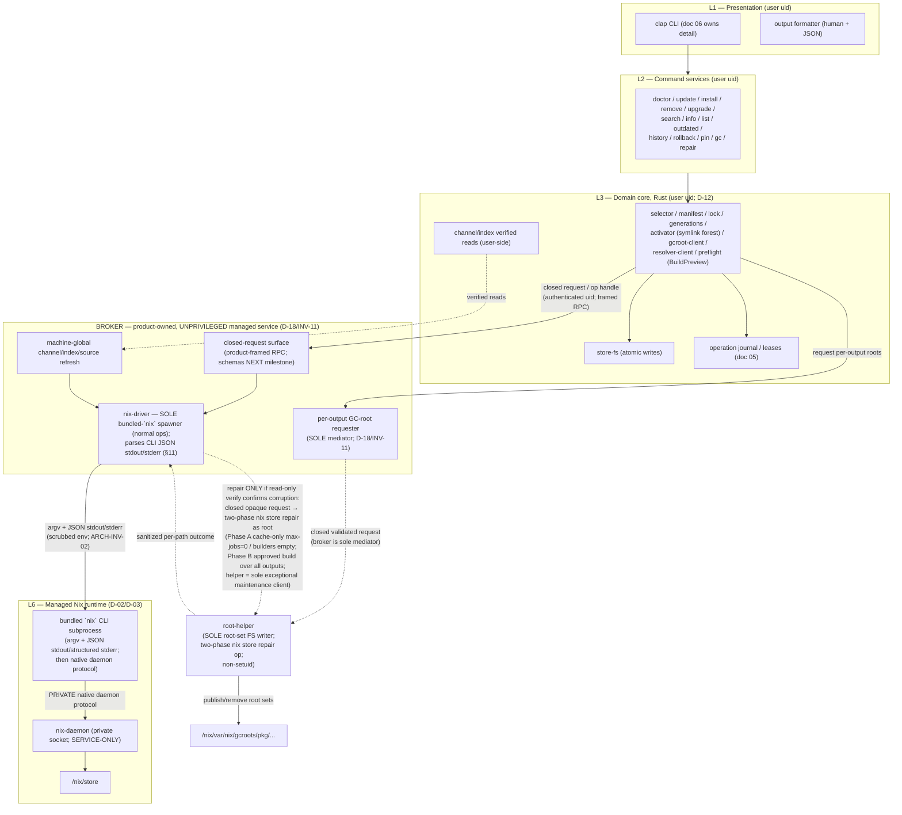
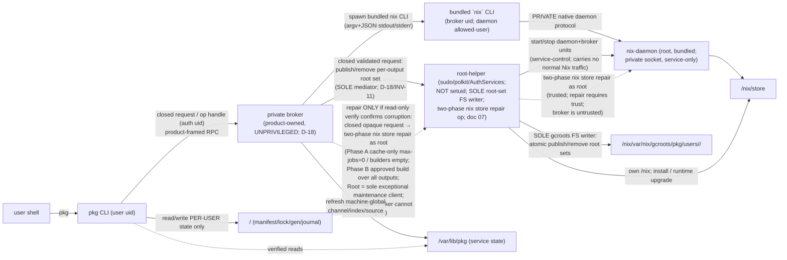
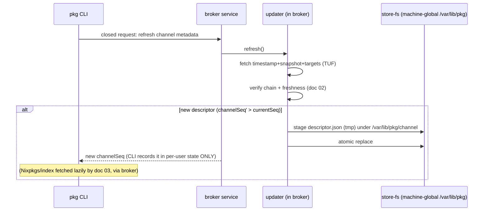

# 01 — System Architecture

| | |
|---|---|
| **Status** | Draft (planning only — no implementation code) |
| **Owner** | Foundation planning track (docs 00–03) |
| **Depends on** | 00 Overview & Decisions |
| **Consumed by** | 04 Resolution/Install/Build, 05 State/Locks/Generations/GC, 06 CLI/UX, 07 Platform Installation/Runtime, 08 Security Model, 09 Testing, 11 PR Roadmap |

---

## 1. Purpose

Define the **component architecture, process model, privilege model, subprocess boundary with the bundled Nix runtime, and the canonical state-directory layout** for `pkg`. This document is the single source of truth for "which Rust module owns what" and "how `pkg` talks to Nix." It sketches end-to-end command flows at the architectural level; the **exact per-command workflows** (flags, exit codes, prompts, progress events) are owned by doc 06; the **resolution/install/build state machine** is owned by doc 04; the **state schema/migrations** by doc 05; the **installer/daemon mechanics** by doc 07.

All decisions are inherited from doc 00 (D-01..**D-18**, INV-01..**INV-11**). The **private broker** boundary (D-18/INV-11) is the accepted hidden-Nix V1 shape; **detailed framed RPC schemas are the next milestone**, so this revision fixes the **boundary and ownership** only, not the wire formats.

## 2. Scope

In scope: layered component model; module ownership table; process/privilege model; the **Nix subprocess contract** (invocations, JSON shapes, sandboxing, timeouts, env hygiene); the **state-directory layout** (Linux & macOS); the manifest/lock/generation/activation data-contract *names and shapes* (full migrations in doc 05); architectural flow diagrams for the core operations; failure/recovery at the architectural level.

## 3. Non-scope

Exact CLI flags/exit codes (doc 06); resolver algorithm and approval prompts (doc 04); state machine internals, migration SQL/TOML, journal internals (doc 05); installer scripts, launchd/systemd unit bodies, PATH/RCS integration (doc 07); threat-model depth (doc 08).

## 4. Invariants (architecture-specific)

- **ARCH-INV-01** All Nix interaction is carried **exclusively by the product-owned private broker** (D-15, D-18) across a three-layer boundary: (a) **user CLI → broker** is a closed **product-framed RPC** (schema is the next milestone); (b) **broker's `nix-driver` → bundled `nix` CLI** is a controlled **subprocess** — argv plus **machine-readable JSON stdout / structured stderr** where the subcommand supports it (§11), under a scrubbed env (ARCH-INV-02); (c) **bundled `nix` CLI → `nix-daemon`** is Nix's **private native daemon protocol**, **not** JSON — `pkg` neither speaks nor parses it. The user CLI **never** connects to the raw daemon socket and **never** launches the bundled `nix` binary; the broker is the **sole general (unprivileged) daemon client and the sole spawner of the bundled `nix` CLI for all normal operations** (evaluate/build/substitute/path-info/read-only `nix store verify` and liveness-respecting GC). The **single narrow exception** is `pkg repair`: repair requests require a **trusted** daemon client, so the Nix daemon **rejects repair from untrusted / `allowed-user` clients** (the modern mutating command is `nix store repair`; verified against Nix 2.34.8), and since the broker is deliberately kept unprivileged (`allowed-users = pkg-nix-broker`, `trusted-users = root` — `trusted-users` are effectively root-equivalent), the broker **first verifies** with the modern read-only command **`nix store verify`** (there is **no** modern `nix store verify --repair` combination — `verify` is read-only, `repair` is the separate mutating command; verified Nix 2.34.8); only if corruption is confirmed does it send a **closed opaque/typed request** to the root helper, which is the **one exceptional maintenance client** and runs the modern mutating command **`nix store repair` as root in two phases** against a nonempty sorted validated set of registered StorePath targets — the corrupt targets plus any missing-on-disk but registered/expected closure targets — all within the FULL computed closure reachable from the generation's selected output roots (drawn from broker-held generation state, never from public/user input). **Phase A (cache-only):** per-path `nix store repair` with **managed pinned substituters/keys**, **`max-jobs = 0`** (disables local build), and **`builders` empty** (prohibits remote build); it may auto-repair a **signed cache hit** and **must stop before any local/remote build** when a substitute is unavailable — repair requests require a **trusted** daemon client, and `Store::repairPath` (what `nix store repair` drives) first tries Repair-mode substitution and, failing that with a valid deriver, rebuilds **all** outputs (`bmRepair`), so `max-jobs = 0` + empty `builders` makes the rebuild branch unable to proceed. **Phase B (fallback build):** any rebuild uses the **ordinary public build preview / explicit single-operation approval flow**, whose internal **`RepairBuildPlan`/digest covers every output Nix may rebuild, not just the corrupt output**, holding the broker's **machine-wide build mutex** (machine-global local-build admission permit; doc 04 §5.3.1) and a **shared GC-inhibit permit**, run **locally** with a **bounded nonzero `max-jobs`** and **`builders` empty**. The helper resolves an **opaque expiring single-use maintenance capability** bound **server-side** to the **caller UID**, an **existing pkg-owned rooted generation**, the **exact typed corrupt targets within the FULL computed closure reachable from that generation's selected output roots (not merely its top-level `outputRoots`)** — including any **missing-on-disk but registered/expected closure targets** — the **`RepairBuildPlan`/target digest**, the **policyVersion**, and the **mode**; stale, replayed, mismatched, or cross-UID capabilities **fail closed** (single-use and invalidated on helper/broker restart; resume/retry semantics in ARCH-INV-10). The helper accepts no public/raw path, installable, derivation, expression, flake ref, argv, option, substituter/key, environment override, output selection, or arbitrary verb; it executes per-path cache-only with **final read-only verification** (partial cache repairs resumable/idempotently reverified), and returns only sanitized per-path outcome to the broker — **raw Nix logs are service-private** and the public receives sanitized outcome/versioned events. No regex on human CLI output. *(Detailed framed RPC schemas — including the exact helper framing/capability fields — are the next milestone; these state invariants are accepted now.)*
- **ARCH-INV-02** The bundled Nix is launched by the **broker** with **only `pkg`-controlled environment and config** (INV-03). No `NIX_PATH`, no user `~/.config/nix/nix.conf`, no `NIXPKGS_*`.
- **ARCH-INV-03** All long-lived state lives under the **canonical managed paths** in §9. Nothing authoritative is read from `nix profile` (D-12).
- **ARCH-INV-04** Every realized output in the active generation is reachable from a GC root under `/nix/var/nix/gcroots/pkg/users/<uid>/` — **one root per selected output**, created before the `current` swap (INV-05/D-17/D-18).
- **ARCH-INV-05** Privilege is split across **two** narrow, distinct boundaries: the **private broker** — an **unprivileged** dedicated service that is the **sole general** daemon client (a daemon `allowed-user`, **never** a Nix `trusted-user`; root is the only `trusted-user`, and `trusted-users` are effectively root-equivalent, so the broker deliberately stays unprivileged) and the **sole mediator/requester** of per-output GC-root operations (D-18/INV-11) — and the **root helper** — the **sole root-set filesystem writer**, which atomically publishes/removes GC-root sets under `/nix/var/nix/gcroots/pkg` (plus install/service-control/runtime-upgrade) on a **closed validated request from the broker only**, and is additionally the **one exceptional maintenance client** that runs the **two-phase `nix store repair` maintenance operation** as root (the modern mutating command; there is **no** `nix store verify --repair` — `verify` is read-only, `repair` mutates; repair requests require a **trusted** daemon client — verified Nix 2.34.8) against a broker-chosen validated set of registered StorePath targets within the FULL computed closure reachable from the generation's selected output roots (incl. missing-on-disk targets) — invoked only after the broker's own read-only `nix store verify` confirms corruption (Phase A cache-only with managed pinned substituters/keys, `max-jobs = 0`, `builders` empty; Phase B ordinary build preview/approval with a `RepairBuildPlan`/digest over every rebuildable output; §11/§12.4). The user CLI **never** calls the root helper directly. **Neither is a Linux `setuid` binary in V1** (sudo/polkit/AuthorizationServices or a narrow root service; §8, doc 07). *(Detailed wire/capability design is the next milestone.)*
- **ARCH-INV-06** The **broker** (an unprivileged dedicated service) authenticates the calling user (uid) on its closed-request channel; **authoritative package environment state is keyed by that uid** (D-17/INV-10). The only privileged **per-user filesystem** write performed on a user's behalf is per-output GC-root publish/removal under that user's gcroots subdir — the broker is the **sole mediator/requester** for these operations and the **root helper is the sole filesystem writer** (closed validated request from the broker only; ARCH-INV-05). The one other privileged store-side operation is the **two-phase `nix store repair`** maintenance op (read-only `nix store verify` stays broker-mediated), which is **not** a per-user gcroots write and is run by the root helper as the sole exceptional maintenance client (ARCH-INV-01/§12.4). *(Detailed wire/capability design is the next milestone.)*
- **ARCH-INV-07 (broker boundary)** The CLI sends **only closed, product-owned, sanitized requests / operation handles** to the broker over product-framed RPC. The unprivileged broker owns the `nix-driver` adapter (§7/§11), spawns the absolute bundled `nix` CLI (argv + JSON stdout/stderr; ARCH-INV-01), is the **sole general** process that may reach the **private, service-only** daemon socket for all normal operations (via the bundled CLI over Nix's native protocol), is the **sole mediator/requester** of per-output GC-root operations (the root helper is the sole writer; D-18/INV-11), and is the **sole client** that may ask the root helper to run the **two-phase `nix store repair` maintenance operation** when the broker's own read-only `nix store verify` confirms corruption (repair requests require a **trusted** daemon client; verified Nix 2.34.8; ARCH-INV-01/§12.4). The raw daemon socket is never user-connectable.
- **ARCH-INV-08 (CLI write scope)** The user CLI writes **only per-user state** under `<user-state>/` (§9.3). It does **not** write `/var/lib/pkg` (machine-global service state) or `/opt/pkg` (runtime). Machine-global channel/index/source **refresh** is broker/service-mediated (§9.2); local **verified** channel/index reads may remain user-side.
- **ARCH-INV-09 (D-18/INV-11 inheritance)** Activation is a deterministic per-generation **symlink forest** under `<user-state>/activations/gen-<id>/`, materialized by `pkg` (Rust) **outside `/nix/store`**; activation invokes **zero Nix** commands, and the broker mediates creation of **one GC root per selected output** (the root helper is the sole writer) before the `current` swap. (D-18/INV-11; §9.3; doc 05.)
- **ARCH-INV-10 (repair execution & restart semantics)** `pkg repair` is an **explicit user action** (never automatic) and **warns that affected commands backed by a repairing path may be temporarily unavailable** while it is being repaired. Repair is **non-atomic even per path**: a **cache-only** repair **deletes the live (corrupt) path before restoring its NAR** from a signed substitute, and a **local rebuild** repair **moves the old output aside before replacing it** — so a target can be transiently absent mid-repair. Progress is **journaled per path** (doc 05 §10.6); **final read-only `nix store verify --recursive` governs success**, not intermediate exit codes. A helper/broker **restart never replays a stale capability** (capabilities are single-use and invalidated on restart): it **auto-retries only cache-only Phase A** from the per-path journal with a fresh capability; a **Phase B build is never auto-retried** — a repeated local repair build requires a **fresh preview/approval/capability**. **Normal repair neither creates nor swaps a generation** and does not touch activation (it repairs store paths in place); **activation recovery** (a damaged symlink forest) is **separate and Rust-only** — re-materialized from the generation record (ARCH-INV-09), not a Nix repair. *(The exact restart-handshake protocol, capability persistence/expiry mechanism, peer-auth uid forwarding, and child containment are a detailed-broker milestone — §17/CP-01.6 — not specified here; per-path journal mechanics are owned by doc 05 §10.6.)*

## 5. Legend

- ✅ **Confirmed** (Nix behavior, primary source cited) · 🛠 **Decision** (`pkg` choice) · ⚠️ **Spike**. *(Full definitions in doc 00 §5.)*

## 6. Layered architecture



## 7. Component inventory & ownership

| Module (crate/logical) | Responsibility | Owns (state) | Depends on | Detailed in |
|---|---|---|---|---|
| `pkg-cli` | Argument parsing, dispatch, output formatting, exit codes | none | all command services | 06 |
| `cmd-doctor` | Health checks (Nix present/healthy, store ok, descriptor fresh, no foreign Nix) | none | broker, updater | 06, 07 |
| `cmd-update` | Refresh TUF metadata + descriptor; (optionally) refresh index | `channel/` | updater, index | 02, 03 |
| `cmd-install/remove/upgrade` | Orchestrate resolve→preflight→acquire→verify→stage→activate→commit | generations dir | resolver, activator, gcroot, journal | 04, 05 |
| `cmd-search/info/list/outdated` | Read-only against index; `outdated` diffs index vs lock | index cache | index service | 03, 06 |
| `cmd-history/rollback/pin/gc/repair` | State mutation & Nix store ops | manifest, generations, gcroots | broker, state | 05 |
| `domain` (selector/manifest/lock/generations) | Identity model, validation, serialization | `<user-state>/manifest.json`, `<user-state>/lock.json`, `<user-state>/generations/` (per-user; D-17) | store-fs | 05 |
| `activator` | Materialize the activation symlink forest + `current` relative symlink; **request** per-output GC roots via the broker (**activation invokes ZERO Nix commands**) | `<user-state>/activations/`, `<user-state>/current` (gcroots published by the root helper on the broker's mediated request) | store-fs, broker | 05, 07 |
| `broker` | **Private, unprivileged product-owned managed service (D-18/INV-11):** sole **general** client of the private daemon socket for all normal operations — evaluate/build/substitute/path-info/read-only `nix store verify`/liveness-respecting GC — (a daemon `allowed-user`, **never** a Nix `trusted-user`; root is the only `trusted-user`, and `trusted-users` are root-equivalent; the two-phase `nix store repair` maintenance op is delegated to the root helper, §12.4); owns `nix-driver`; spawns the bundled `nix` CLI (argv + JSON stdout/stderr; ARCH-INV-01); **sole mediator/requester** of per-output GC-root operations (root helper is the sole writer); mediates machine-global channel/index/source refresh; authenticates caller uid | `/var/lib/pkg` machine-global service state (channel/index/source) | daemon (via bundled CLI), root-helper (GC roots), store-fs | this doc §8/§11 |
| `nix-driver` | Spawn bundled `nix` CLI subprocess with controlled env (argv); parse its JSON stdout/structured stderr where supported (§11); timeouts (**broker-owned; never invoked from the user CLI**). The bundled CLI→`nix-daemon` link is Nix's private native protocol, not JSON | none | daemon (via bundled CLI) | this doc §8/§11 |
| `resolver` | Map selector → attr path → evaluate-only derivation plan on this host | none | broker (evaluate-only), index reads | 04 |
| `updater` (TUF client) | Verify & apply signed metadata; pin artifacts. **Refresh of machine-global channel is broker-mediated** (writes `/var/lib/pkg/channel`); user-side does verified reads only | `channel/tuf/`, `channel/descriptor.json` (broker-owned, machine-global) | store-fs, broker | 02 |
| `index-service` | Load/derive/refresh disposable catalog index. **Refresh is broker-mediated**; verified reads may be user-side | `index/<seq>/` (broker-owned, machine-global) | updater, broker | 03 |
| `store-fs` | Atomic writes (temp→fsync→rename), migrations, integrity | per-user managed tree (user side) + machine-global tree (broker side) | — | 05 |
| `journal` | Operation intent/progress/leases for restart recovery | `journal/` (per-user) | store-fs | 05 |
| `root-helper` | Narrow privileged boundary: first-run bootstrap, runtime extraction/upgrade, daemon/broker lifecycle (service-control only), `/nix` ownership, and the **sole filesystem writer** that atomically publishes/removes GC-root sets under `/nix/var/nix/gcroots/pkg` on a closed validated request from the broker only. **NOT setuid in V1** (sudo/polkit/AuthorizationServices or narrow root service); carries **no normal Nix JSON traffic and no normal Nix operations** — its single Nix-touching exception is the **two-phase `nix store repair` maintenance operation** (the modern mutating command; there is no `nix store verify --repair`) run as root against a broker-chosen validated set of registered StorePath targets within the FULL computed closure reachable from the generation's selected output roots (incl. missing-on-disk targets), invoked only on a closed opaque/typed broker request after the broker's read-only `nix store verify` confirms corruption (§11/§12.4): **Phase A** per-path cache-only repair with managed pinned substituters/keys, `max-jobs = 0`, `builders` empty (auto-repairs a signed cache hit, stops before any local/remote build on an unavailable substitute); **Phase B** the ordinary build preview/approval flow with a `RepairBuildPlan`/digest over **every output Nix may rebuild**, holding the broker machine-wide build mutex + shared GC-inhibit permit, run locally with bounded nonzero `max-jobs`, `builders` empty; it resolves an opaque expiring single-use maintenance capability bound server-side to caller UID, an existing pkg-owned rooted generation, the exact typed corrupt targets within the FULL computed closure reachable from the generation's selected output roots (incl. missing-on-disk targets), the `RepairBuildPlan`/target digest, `policyVersion`, and mode (stale/replayed/mismatched/cross-UID fail closed), accepts no public/raw path, installable, derivation, expression, flake ref, argv, option, substituter/key, environment override, output selection, or arbitrary verb, executes per-path cache-only with final read-only verification (partial cache repairs resumable/idempotently reverified), and returns only sanitized per-path outcome (raw Nix logs service-private); the user CLI never calls it directly | `/nix`, `/nix/var/nix/gcroots/pkg/`, daemon/broker units | broker (GC-root requests) | 07 |

**Rule:** a module may only write to the state paths listed in its "Owns" column.

## 8. Process & privilege model



- 🛠 **The private broker is a distinct, unprivileged product-owned managed service boundary (D-18/INV-11).** It is the **sole general** process permitted to reach the daemon socket for all normal operations (a daemon `allowed-user`, **never** a Nix `trusted-user`; root is the only `trusted-user`, and `trusted-users` are root-equivalent), owns the `nix-driver` adapter, spawns the bundled `nix` CLI (argv + JSON stdout/stderr; the bundled CLI→daemon link is Nix's private native protocol), and is the **sole mediator/requester** of per-output GC-root operations (the root helper is the sole filesystem writer). The one operation the unprivileged broker cannot do — **repair** (`nix store repair` / `Store::repairPath` requires a **trusted** daemon client; verified Nix 2.34.8) — is delegated to the root helper as a **two-phase** operation (§12.4). The user CLI sends **only closed, sanitized requests** over product-framed RPC; it never sees the daemon socket, never launches bundled `nix`, and never calls the root helper (ARCH-INV-01/05/07). Detailed framed RPC + wire/capability schemas are the next milestone.
- 🛠 The **root helper** is a separate, narrow privileged boundary reserved for: first-run bootstrap, runtime upgrades, daemon/broker lifecycle (service-control), `/nix` ownership, and **atomically publishing/removing GC-root sets under `/nix/var/nix/gcroots/pkg` as the sole filesystem writer** (on a closed validated request from the broker only). It is **not** a `setuid` binary in V1 (sudo/polkit/AuthorizationServices or a narrow root service), carries **no normal Nix JSON traffic** — its single Nix-touching exception is the **two-phase `nix store repair` maintenance operation** (the modern mutating command; there is no `nix store verify --repair`) run as root against a broker-chosen validated set of registered StorePath targets within the FULL computed closure reachable from the generation's selected output roots (incl. missing-on-disk targets), invoked only by a closed opaque/typed broker request after the broker's read-only `nix store verify` confirms corruption (§11/§12.4): **Phase A** per-path cache-only repair (managed pinned substituters/keys, `max-jobs = 0`, `builders` empty; auto-repairs a signed cache hit, stops before any local/remote build on an unavailable substitute); **Phase B** the ordinary build preview/approval flow with a `RepairBuildPlan`/digest over **every output Nix may rebuild**, holding the broker machine-wide build mutex + shared GC-inhibit permit, run locally with bounded nonzero `max-jobs`, `builders` empty; it resolves an opaque expiring single-use maintenance capability bound server-side to caller UID, an existing pkg-owned rooted generation, the exact typed corrupt targets within the FULL computed closure reachable from the generation's selected output roots (incl. missing-on-disk targets), the `RepairBuildPlan`/target digest, `policyVersion`, and mode (stale/replayed/mismatched/cross-UID fail closed), accepts no public/raw path, installable, derivation, expression, flake ref, argv, option, substituter/key, environment override, output selection, or arbitrary verb, and returns only sanitized per-path outcome (raw Nix logs service-private) — and is never called directly by the user CLI. Detail/units in doc 07.
- ✅ In Nix's multi-user model, unprivileged clients talk to a root-owned `nix-daemon` over a socket; the daemon performs store writes. — *Nix Reference Manual, "Multi-user mode".*
- 🛠 `pkg` selects multi-user mode on all V1 platforms (even single-user hosts get a daemon) so the privilege boundary is uniform.
- 🛠 **Per-user authoritative state (D-17):** manifest/lock/generations/activation/journal are owned by the invoking uid under `<user-state>` (§9.3); the user CLI writes **only** here (ARCH-INV-08). The root-owned, shared layer is limited to the immutable runtime/channel/index/source/store service (§9.2), whose **refresh is broker-mediated**. The broker mediates per-output GC-root operations; the root helper is the sole writer that publishes/removes a user's root sets under `/nix/var/nix/gcroots/pkg/users/<uid>/` (D-18/INV-11) — and the broker manages the shared service without ever reading or mutating another user's authoritative package state.

## 9. Canonical state-directory layout

`pkg` uses these paths **consistently across all docs**. Docs 05/07 own internals of the marked directories.

### 9.1 Nix-owned (under `/nix`; `pkg` has exclusive ownership per INV-02)

```
/nix/store/                                  # the store (FIXED prefix; §13/S1)
/nix/var/nix/daemon-socket/socket            # our daemon socket (configurable)
/nix/var/nix/gcroots/pkg/                    # INV-05: our GC roots (root-owned)
  users/<uid>/                               #   per-user roots (D-17/INV-10)
    gen-<id>/                                #   one root SET per retained generation
      <safe-id> -> <output store path>       #   one root per selected output (each protects its closure)
  runtime/                                   #   roots pinning the managed runtime itself
/nix/var/nix/temproots/                      # Nix-managed transient roots
/nix/var/nix/profiles/                       # UNUSED by pkg (we do not use nix profile; D-12)
```

### 9.2 Managed runtime + machine-global service state (root-owned, shared; D-17)

```
/opt/pkg/                           # product install root (root-owned, read-only to users)
  bin/pkg                           # the Rust binary (+ platform helper)
  nix/<version>/                    # extracted bundled Nix runtime (versioned)
  nix/current -> nix/<version>/     # atomically switched at upgrade (doc 02)
  etc/pkg/                          # factory default config templates (read-only)
    nix.conf                        # generated, channel-locked trust config (doc 07)
  share/pkg/                        # bundled assets (completions, embedded TUF root.json)

/var/lib/pkg/                       # machine-global SERVICE state (root-owned; shared,
                                    # read-only to users; D-17/INV-10)
  channel/
    tuf/{root,timestamp,snapshot,targets}*.json   # TUF metadata cache (doc 02)
    descriptor.json                 # the accepted channel descriptor (doc 02)
  index/<channelSeq>/               # disposable derived index (doc 03); shared, read-only
  nixpkgs/<rev>/                    # fetched, pinned catalog source (doc 03); shared
  cache/                            # service downloads (Nix runtime tarballs) — root-owned
  log/                              # service-level logs (daemon/helper; rotated)

# NOTE: manifest.json, lock.json, generations/, current, activation, and the per-user
# journal are NOT machine-global — they are per-user authoritative state (§9.3). Only the
# immutable runtime/channel/index/source/store SERVICE is root-owned and shared.
# The user CLI NEVER writes here (ARCH-INV-08); channel/index/source REFRESH is performed
# by the broker/service, and the CLI performs only verified READS (§9.3 cache).
```

`/var/lib/pkg/cache` and `/opt/pkg` are NOT under `/nix`; only `/nix/store` is the Nix store.

### 9.3 Per-user authoritative package state (user-owned, keyed by uid; D-17/INV-10)

```
# Canonical per-user state root <user-state>:
#   Linux : $XDG_DATA_HOME/pkg/   (default ~/.local/share/pkg/)
#   macOS : ~/Library/Application Support/pkg/
# A root-owned fallback /var/lib/pkg/users/<uid>/ is used for accounts whose HOME /
# XDG_DATA_HOME is unsuitable (e.g. system service accounts). Owned by that uid, mode 0700.

<user-state>/
  manifest.json                     # CURRENT desired state (doc 05) — authoritative, per-user
  lock.json                         # CURRENT realization (doc 05) — authoritative, per-user
  generations/
    <id>.json                       # immutable generation METADATA record (doc 05 §5.3)
  activations/                      # Rust-materialized activation symlink forests (doc 05 §8)
    gen-<id>.staging/               #   transient staging forest (materialized, then renamed)
    gen-<id>/                       #   retained forest: merge dirs + leaf symlinks → /nix/store
  current -> activations/gen-<id>   # atomic RELATIVE activation pointer (D-16); the retained
                                    #   gen-<id> forest exposes bin/, share/man/, ... on PATH
  journal/                          # per-user operation journal/leases (doc 05)
  cache/                            # per-user downloads / eval caches (verifiable)
  log/                              # per-user structured logs (rotated, 0600)
  shells/                           # shell-integration snippets (doc 07)

$XDG_CONFIG_HOME/pkg/config.toml    # user prefs ONLY (no trust/substituter keys; INV-03)
```

`current` is a **relative** symlink (`current -> activations/gen-<id>`) to a
**Rust-materialized, user-owned symlink forest** (doc 04 §5.5, doc 05 §8) — **not** a Nix
store object, and activation invokes **zero Nix commands** (D-18/INV-11; ARCH-INV-09). Rust walks each selected output
store path **without following symlinks**, creates merge directories, and symlinks each leaf
entry to its absolute validated `/nix/store` target; traversal/path-escape and file-vs-directory
conflicts are rejected. The forest's `bin/`, `share/man/`, … is what the user's PATH points at
(doc 07 §10). The forest is reproducible and integrity-checked by `treeDigest` (SHA-256 over
RFC 8785/JCS canonical sorted records `{relativePath,storeTarget,sourceSelector,output}`; doc
04 §5.5). `current` is valid **only** if it is a relative link to an existing retained forest
whose `treeDigest` verifies (doc 05 §11); user ownership/tampering affects only that user but
fails integrity checks.

🛠 The user config file **cannot** override trust, substituters, or the store. Any such key is rejected with an error. (INV-03.)

## 10. Data-contract names & shapes (canonical; migrations owned by doc 05)

Field names below are referenced verbatim by docs 02, 03, 04, 05, 06. Full versioning/migration logic lives in doc 05.

### 10.1 Manifest (desired state) — `manifest.json`

```json
{
  "schemaVersion": 1,
  "channelSeq": 42,
  "entries": [
    {
      "id": "sel_01HZX...",      // stable opaque id (ULID) for this intent
      "selector": "ripgrep",      // user intent string (D-13); NOT a Nix attr path
      "attribute": "ripgrep",     // resolved Nixpkgs attribute (filled at resolve; may equal selector)
      "versionPref": { "kind": "any" }, // any | exact | min | range (D-13)
      "outputs": null,             // null => meta.outputsToInstall (doc 04 §12.1)
      "sourceRev": "channel:current",     // channel:current | channel:pinned:<id> | rev:<gitsha>
      "pinned": false,             // D-13 pinning flag (skip on upgrade --all)
      "pinnedTo": null,            // realized.storePath when pinned (set by `pin`)
      "addedAt": "2025-01-02T03:04:05Z",
      "origin": "user:install"
    }
  ],
  "pins": ["sel_01HZX..."]        // convenience index of pinned selectors
}
```

### 10.2 Lock (realization) — `lock.json`

```json
{
  "schemaVersion": 1,
  "channelSeq": 42,
  "system": "aarch64-darwin",
  "entries": {
    "sel_01HZX...": {
      "attribute": "ripgrep",                 // resolved Nixpkgs attribute (D-05)
      "nixpkgsRev": "abc123…deadbeef",        // may differ per entry (mixed revs; doc 05 §7)
      "realized": {
        "storePath": "/nix/store/...-ripgrep-14.1.0",
        "deriver":  "/nix/store/...-ripgrep-14.1.0.drv",
        "outputs": { "out": "/nix/store/...-ripgrep-14.1.0", "man": "/nix/store/...-ripgrep-14.1.0-man" },
        "outputsToInstall": ["out", "man"],
        "system": "aarch64-darwin",
        "narHash": "sha256-...",               // SRI, via nix path-info
        "closureNarSize": 4821034,
        "pname": "ripgrep",                    // display metadata ONLY (D-13)
        "version": "14.1.0"                    // display metadata ONLY (D-13)
      },
      "lockedAt": "2025-01-02T03:04:05Z",
      "provenance": "cache:cache.nixos.org",   // or "local-build" (Linux/macOS, doc 04)
      "sigsObserved": ["cache.nixos.org-1:..."]
    }
  }
}
```

> Note (D-13): `pname`/`version` are **never** used as keys. The key is the manifest `id` → realization (`storePath`); `pname@version` is rendered only. `storePath` is unique and content-addressed; it is the join key between lock, generation, GC roots, and the store (doc 05 §6).

### 10.3 Generation record — `generations/<id>.json`

```json
{
  "schemaVersion": 1,
  "uid": 1001,                     // OS uid this generation belongs to (D-17/INV-10)
  "id": "gen-0007",                // monotonic id (gen-%04d); "parent": "gen-0006"
  "createdAt": "2025-01-02T03:04:05Z",
  "channelSeq": 42,
  "manifestHash": "sha256-...",    // hash of <user-state>/manifest.json body
  "lockHash": "sha256-...",        // hash of <user-state>/lock.json body
  "generationHash": "sha256-..."   // content hash of THIS file (I4)
}
```

> Sketch only. The full activation record (`kind:"pkg-symlink-forest"`, relative
> `treePath`, `treeDigest`, `entryCount`, `collisionPolicy`, sorted `outputRoots[]`,
> collision resolutions), the per-output `outputs[]`, `operation{opId,kind,approval}`,
> and the GC-root topology (`/nix/var/nix/gcroots/pkg/users/<uid>/gen-<id>/<safe-id>`,
> one root per selected output) are defined in doc 05 §5.3/§8.3; migrations in doc 05.

### 10.4 Channel descriptor (name reference only)

The **canonical schema** for `descriptor.json` is defined in **doc 02 §7**. Doc 01 only fixes the *file location* (`/var/lib/pkg/channel/descriptor.json`) and that it is referenced from the generation via `channelSeq`.

### 10.5 Index record (name reference only)

The **canonical schema** for index records is defined in **doc 03 §7**. Doc 01 only fixes the *directory* (`/var/lib/pkg/index/<channelSeq>/`).

## 11. Nix subprocess contract (ARCH-INV-01)

This contract governs the **broker→bundled-CLI subprocess** boundary: the broker's `nix-driver` spawns the bundled `nix` CLI with argv and consumes its **machine-readable JSON stdout / structured stderr** where the subcommand supports it. The bundled `nix` CLI then reaches `nix-daemon` over Nix's **private native daemon protocol**, which `pkg` neither speaks nor parses (ARCH-INV-01); that link is out of scope here. This table is the **canonical set of Nix invocations** `pkg` depends on. Docs 04/03 consume it. `pkg` never invents new Nix calls outside this table; additions require a decision in doc 00. The exact stable surface for the pinned runtime is validated by the Fake↔Real parity job (doc 09 §4.3); subprocess-JSON stability is enforced by pinning the managed Nix version and isolating all Nix output behind the single versioned `nix-driver` adapter (§7), **not** by assuming cross-version stability. **Raw Nix JSON is never `pkg`'s public contract:** it is parsed by crate-private wire DTOs inside `nix-driver` only. Where a Nix command supports an explicit upstream JSON **format version**, the pinned adapter **requests that format explicitly** and **rejects any response whose format version it does not expect**, before normalizing into `pkg`-owned, `schemaVersion`-ed reports (doc 09 §4.2; T-DAEMON-2).

All invocations:
- are **issued only by the broker's `nix-driver`** for all normal operations (ARCH-INV-01/ARCH-INV-07); the user CLI never spawns `nix` and never opens the daemon socket. The **two-phase `nix store repair` operation** in the table is the exception — it is issued by the **root helper as root** (the one exceptional maintenance client), never by the user CLI, and only on a closed opaque/typed broker request after the broker's read-only `nix store verify` confirms corruption (§12.4),
- use the **bundled** `nix` at `/opt/pkg/nix/current/bin/nix` (D-02),
- run with a **scrubbed, `pkg`-controlled environment** (ARCH-INV-02): only `HOME`, `TMPDIR`, `NIX_REMOTE=daemon`, `NIX_USER_CONF_FILES=""` (or a `pkg`-supplied conf), `NIX_STATE_DIR`/`NIX_DAEMON_SOCKET_PATH` to our paths, and **no** `NIX_PATH`/`NIXPKGS_*`/`NIX Flake` registries pointing at user data,
- reference Nixpkgs **by locked store path or `github:<owner>/<repo>/<rev>?narHash=<sri>`** (doc 03), never by a mutable channel name or user URL,
- request **`--json`** where the command supports it (note: `nix derivation show` emits JSON unconditionally and takes **no** `--json` flag), and where supported an **explicit upstream JSON format version** (or, where no flag exists, read/validate the top-level `version` field from the envelope — as for `nix derivation show`), and parse structured output; for commands that expose no machine payload, fall back to **exit status + independently validated filesystem/store postconditions** (see the compatibility caveat below) — **never** human stdout,
- enforce a **timeout** and stream progress over the journal/progress channel.

| Purpose | Invocation (sketch) | JSON key(s) consumed | Stable? | Owner |
|---|---|---|---|---|
| Evaluate a selector into a derivation plan (resolve/preflight; evaluate-only, CAT-INV-03) | `nix derivation show --recursive <exact pinned installable>` (JSON unconditional; **no** `--json`/`--json-format` flag) | envelope `version`; `derivations[<drvPath>].{name,outputs,inputDrvs,inputSrcs,platform,env}` | ✅ | 03/04 |
| Realize (acquire) selected outputs (post-approval) | `nix build /nix/store/<x>.drv^<out,man> --no-link --print-out-paths --json` (explicit **derived-output paths**; `^*` for all outputs — never a bare opaque `.drv`) | `outputs.*` | ✅ | 04 |
| Build path info / narHash | `nix path-info --json --json-format 2 --recursive <out>` (the path-info **v2** envelope already carries `deriver`, `narSize`, `references`, `signatures`; there is **no** `--deriver` flag) | `path, narHash, narSize, deriver, references, signatures` | ✅ | 03/04 |
| Prefetch Nixpkgs source | `nix flake metadata --no-use-registries github:<owner>/<repo>/<rev>?narHash=<sri> --json` (**direct locked ref**: the `owner`/`repo`/`rev`/`narHash` fields come from authenticated descriptor metadata, are grammar/allowlist-validated, and are then assembled into **fixed argv** — no caller-supplied raw URL/ref is accepted; scrubbed env ARCH-INV-02; `metadata` performs **no** `flake.lock` write; doc 03 §6.2 direct-ref model). Nix 2.34.8 still accepts the older `--no-registries` spelling but marks it deprecated; the adapter uses the canonical `--no-use-registries`. | top-level `locked.rev`, `locked.narHash` (cross-check top-level `revision`/`path` if present); **never** `locks.nodes.*` — a direct root flake has no guaranteed `nixpkgs` child node | ✅ | 03 |
| Prefetch Nix runtime tarball hash | (no Nix call; verify against TUF target hash) | — | — | 02 |
| Copy/substitute closure | (handled by daemon automatically via substituters in nix.conf) | — | ✅ | 04 |
| Verify store (read-only NAR check; broker, unprivileged) | `nix store verify --recursive <store-path>` — the modern **read-only** verify command; it has **no** repair mode (repair is the separate `nix store repair` command below; there is **no** modern `nix store verify --repair` combination). An untrusted `allowed-user` may verify; repair requires trust (verified Nix 2.34.8) | exit status + postconditions (JSON status not assumed; see caveat) | ✅ ⚠️ | 05 (`repair`) |
| Repair store (**exceptional maintenance; root helper only; two-phase**) | Modern mutating command is **`nix store repair`** (there is **no** modern `nix store verify --repair` combination; verified Nix 2.34.8). `Store::repairPath` (which `nix store repair` drives) first tries **Repair-mode substitution**, and only if that fails **and** the output has a valid deriver does it **rebuild ALL outputs of that deriver** (`bmRepair`), not just the corrupt output; a repair request requires a **trusted** daemon client, so the unprivileged broker cannot repair and the op is delegated to the root helper. **Phase A (cache-only):** the helper runs `nix store repair` **one path at a time** against a **nonempty sorted validated set of registered StorePath targets** — the corrupt targets plus any missing-on-disk but registered/expected closure targets, all within the FULL computed closure reachable from the generation's selected output roots (drawn from broker-held generation state) — with **managed pinned substituters/keys** (from root-owned `nix.conf`, never per-call flags), **`max-jobs = 0`** (disables local build), and **`builders` empty** (prohibits remote build); it may auto-repair a **signed cache hit** and **must stop before any local/remote build** when a substitute is unavailable (`max-jobs = 0` + empty `builders` makes the rebuild branch unable to proceed). **Phase B (fallback build):** a corrupt path with no signed substitute but a valid deriver rebuilds via the **ordinary public build preview / explicit single-operation approval flow**, whose **`RepairBuildPlan`/digest covers every output Nix may rebuild, not just the corrupt output**, holding the broker **machine-wide build mutex** + **shared GC-inhibit permit**, and run **locally** with **bounded nonzero `max-jobs`** and **`builders` empty**. Invoked **only** on a closed opaque/typed broker request after the broker's read-only `nix store verify` confirms corruption; the helper resolves an **opaque expiring single-use maintenance capability** (bound server-side to caller UID, an existing pkg-owned rooted generation, the exact typed corrupt targets within the FULL computed closure reachable from the generation's selected output roots — incl. missing-on-disk but registered/expected closure targets — the `RepairBuildPlan`/target digest, `policyVersion`, and mode; stale/replayed/mismatched/cross-UID fail closed) and accepts **no** public/raw path, installable, derivation, expression, flake ref, argv, option, substituter/key, environment override, output selection, or arbitrary verb | exit status + postconditions + **sanitized per-path outcome** returned to broker (never raw Nix JSON; raw Nix logs service-private only; public receives sanitized outcome/versioned events) | ✅ ⚠️ | 05 (`repair`), 07 |
| GC | `nix store gc` (respects our gcroots; we never `--delete-generations` on nix profiles) | exit status + postconditions (reachable closures survive; JSON not assumed) | ✅ | 05 (`gc`) |
| Approved local build (Linux/macOS, native system) | `nix build ... /nix/store/<x>.drv^<out,man>` (explicit derived-output paths; **no** `--substituters ""`/`--builders ""` — managed config has fixed cache/trust and empty remote builders; a binary appearing meanwhile may safely substitute, with actual provenance recorded) | `outputs.*` | ✅ | 04 |
| Index meta-eval (self-built) | `nix eval <nixpkgs>#legacyPackages.<system>.<expr-meta> --json` (doc 03) | meta records | ⚠️ S4 | 03 |

> ✅ *Stability basis:* the realization / path-info / flake-metadata / build / gc calls are part of the stable Nix **new CLI** (`nix3-*`); `--json` (and, for `path-info`, the explicit `--json-format`) is a documented flag for the commands that emit JSON. — *Nix Reference Manual, "Command reference" → new-cli.*
>
> 📐 *Upstream JSON is per-command and versioned, not universal.* Nix does **not** expose one shared JSON format, and the format versions drift across releases. **The pinned Nix 2.34.8 `nix derivation show` emits the derivation JSON v4 envelope `{"version":4,"derivations":{"<drvPath>":{…}}}` unconditionally — it takes no `--json` and no `--json-format` flag, so the top-level `version` field is read and validated from the envelope, not requested**; **`nix path-info` exposes a `--json-format` selector (v2 on 2.34.8; the v2 envelope already includes `deriver`/`narSize`/`references`/`signatures`, so there is no `--deriver` flag)** and **Nix 2.35 adds a `path-info` format v3 with structured signatures.** (Note: `nix build` / `nix eval` are *not* what emits derivation v4 — that is `nix derivation show`.) This cross-release drift is exactly why the pinned adapter **negotiates an explicit upstream JSON format version where a flag exists (e.g. `path-info --json-format`) and otherwise reads/validates the top-level `version` field from the envelope (`derivation show`)** — the `--json-format <pinned-format>` placeholder in the table is resolved per command to the managed runtime's pinned value (or is absent where no flag exists), since the managed Nix version/format is pinned later (§7) — and **rejects any response whose version it does not expect**, before normalizing into `pkg`-owned, `schemaVersion`-ed reports (doc 09 §4.2).[^nix-json-formats]
>
> ⚠️ *Three compatibility caveats, all isolated behind the single versioned `nix-driver` adapter (ARCH-INV-01) and pinned to the managed Nix runtime version:* (a) **`--log-format internal-json`** is Nix's documented machine-readable log channel (doc 04 §5.3/§10.1) but is *nominally internal* — `pkg` parses it only inside the adapter and re-pins it with each managed-Nix upgrade (validated by the parity job). (b) **`nix store verify`** mode specifics (NAR-integrity-only vs. trust-required) and whether **`verify`** or **`gc`** expose a JSON mode at all are runtime-dependent; the adapter **does not assume a JSON payload** for either. **Repair command & privilege split (verified Nix 2.34.8):** the modern mutating command is **`nix store repair`** (there is **no** modern `nix store verify --repair` combination — `verify` is read-only, `repair` mutates); `Store::repairPath` (driven by `nix store repair`) first tries Repair-mode substitution and, failing that with a valid deriver, rebuilds **all** outputs (`bmRepair`); and a repair request requires a **trusted** daemon client. The unprivileged broker (a daemon `allowed-user`, never a `trusted-user`; `trusted-users` are root-equivalent) may run `nix store verify` (read-only) but **cannot** repair — repair is delegated to the root helper as the one exceptional maintenance client, in **two phases** (Phase A per-path cache-only `nix store repair` with managed pinned substituters/keys, `max-jobs = 0`, `builders` empty; Phase B ordinary build preview/approval with a `RepairBuildPlan`/digest over every rebuildable output, holding the broker build mutex + GC-inhibit permit, run locally with bounded nonzero `max-jobs`, `builders` empty; §12.4). The broker never issues `nix store repair`. (c) For any command with no machine payload — `verify`, `repair`, `gc`, and any other status-less op — `pkg` checks **exit status plus independently validated filesystem/store postconditions** (e.g. a corrupt path is gone or re-substituted/rebuilt after `nix store repair`; reachable closures survive `gc`; the gcroot symlink exists and resolves to a live store path), **never by parsing human stdout**, and **never pretends such a command emits JSON**. The attested `--recursive` (`verify`) and bare (`repair`/`gc`) forms are used; unverified flags such as a standalone `--all`, `--no-trust`, or an **invented** `verify`/`repair`/`gc`/`build` `--json-format` are **not** assumed. Each form is pinned for the chosen managed Nix runtime and validated by the Fake↔Real parity job (doc 09 §4.3; this is the SPK-02 continuous-enforcement mechanism of doc 00 §11 — not a standalone spike).

[^nix-json-formats]: Per-command JSON format versions are documented in the Nix release notes for each pinned runtime and re-validated by the Fake↔Real parity job (doc 09 §4.3). Primary sources: Nix 2.33 release notes — <https://nix.dev/manual/nix/2.33/release-notes/rl-2.33> ; Nix 2.35 release notes — <https://nix.dev/manual/nix/2.35/release-notes/rl-2.35.html> .

### 11.1 Argument-injection safety

- Selectors are matched against the index, then validated against an **allowlist grammar** (`^[a-zA-Z0-9._-]+$` plus a version constraint DSL). They are **never** concatenated into an expression string.
- Attribute paths produced by the resolver are validated to consist only of Nix-legal attr-path tokens.
- No `--expr`, `--impure`, `--override-input`, `--inputs-from`, `--recreate-lock-file`, or `file://`/`path:` flakes are ever passed.
- Realize/acquire targets are **derived-output paths** (`/nix/store/<x>.drv^out,man`, or `^*`), constructed by the adapter from the **validated output selection** parsed out of the derivation document — **never** from public/user input, and never a bare opaque `.drv` (which does not build outputs).

## 12. Architectural flows (high-level; per-command detail in docs 04/06)

### 12.1 First-run bootstrap

```mermaid
sequenceDiagram
  participant U as user
  participant CLI as pkg CLI
  participant RH as root-helper
  participant BRK as broker service
  participant UP as updater (TUF, in broker)
  participant N as bundled nix-daemon
  U->>CLI: pkg doctor (or first cmd)
  CLI->>CLI: detect foreign Nix (D-04)
  alt foreign Nix present
    CLI-->>U: FAIL CLOSED: remediation instructions
  else clean host
    CLI->>RH: bootstrap (own /nix; extract runtime; start broker + daemon)
    RH->>N: start daemon (systemd/launchd)
    RH->>BRK: start broker service
    CLI->>BRK: closed request: initialize channel/index/source
    BRK->>UP: fetch+verify TUF root..targets (doc 02)
    UP->>BRK: descriptor (channelSeq N)
    BRK->>BRK: fetch Nixpkgs + index into /var/lib/pkg (machine-global; doc 03)
    CLI->>CLI: init per-user <user-state> (manifest/lock/gen-0)
    CLI-->>U: ready
  end
```

### 12.2 Install (happy path)

```mermaid
sequenceDiagram
  participant U as user
  participant CLI as pkg CLI
  participant R as resolver
  participant BRK as broker (→nix-driver→bundled nix CLI→daemon)
  participant RH as root-helper (SOLE gcroots writer)
  participant DOM as domain (manifest/lock/gen)
  participant ACT as activator
  U->>CLI: pkg install ripgrep
  CLI->>R: resolve(ripgrep, currentSeq, system)
  R->>BRK: closed eval request: nix derivation show --recursive <exact pinned installable>
  BRK-->>R: {version:4, derivations:{<drv>:{...}}}  (evaluate-only; NO realization)
  CLI->>R: preflight: cache NarInfo traversal over the full closure → private canonical BuildPlan (digest-bound) + public sanitized BuildPreview (buildPlanDigest)
  CLI->>BRK: closed acquire request (post-approval): ensure closure realized (substitute per D-10; or explicit native build D-11)
  BRK->>BRK: nix-driver spawns bundled nix CLI: nix build /nix/store/<drv>^out,man ; nix path-info --json --json-format 2 --recursive (realized identity; post-acquire only)
  BRK-->>R: realization record (storePath, narHash, sigs)
  CLI->>ACT: stage: materialize activations/gen-N.staging forest (Rust; ZERO Nix) -> rename activations/gen-N
  CLI->>DOM: prepared: write generations/gen-N.json (treeDigest/outputRoots) + fsync
  CLI->>BRK: rooted: publish per-output root set gen-N (closed request; D-17/D-18/INV-11; broker is SOLE mediator)
  BRK->>RH: closed validated request: publish gcroots/.../gen-N/<safe-id> -> each output + fsync
  RH->>RH: SOLE gcroots writer: atomically publish root set under /nix/var/nix/gcroots/pkg/users/<uid>/gen-N/
  RH-->>BRK: root set committed
  BRK-->>ACT: roots committed
  ACT->>DOM: activated: atomic swap current -> activations/gen-N (relative link; D-16)
  CLI->>DOM: write manifest.json + lock.json + append committed journal row (fsync)
  DOM-->>CLI: committed generation N
  CLI-->>U: installed ripgrep 14.1.0
```

Detailed phase semantics (resolve→preflight→acquire→verify→stage→activate→commit) are owned by **doc 04**; the generation-transaction ordering and crash invariant (GC root created **before** the `current` swap; committed journal row appended **after**) are owned by **doc 05 §8.4**; atomic-commit internals and journaling by **doc 05**.

### 12.3 Update (channel metadata)



### 12.4 Rollback / gc / repair

- **Rollback** (doc 05): repoint `current` (relative link) to a prior generation id — reusing its retained forest or re-materializing it from the generation record + rooted outputs — and ensure its per-output root set exists (roots re-published via the broker; the root helper is the sole writer). Never deletes generations.
- **gc** (doc 05): the CLI issues a closed request to the broker, which runs `nix store gc`; rely on INV-05 (only non-rooted paths are collectable). Generations we want to keep must root their closures.
- **repair** (doc 05 §10; two-phase privilege-split per ARCH-INV-01/§11). `nix store verify` and `nix store repair` are **separate** modern commands (verified Nix 2.34.8): `verify` is **read-only**, `repair` **mutates** (there is **no** modern `nix store verify --repair` combination). `Store::repairPath` (what `nix store repair` drives) first tries a **Repair-mode substitution**, and only if that fails **and** the output has a valid deriver does it **rebuild ALL outputs of that deriver** (`bmRepair`), not just the corrupt output. A repair request requires a **trusted** daemon client, so the unprivileged broker (a daemon `allowed-user`, never a `trusted-user`; `trusted-users` are root-equivalent) **cannot** repair — every repair mutation runs as the **one fixed maintenance operation of the root helper** (the one exceptional maintenance client); read-only verify stays **broker-mediated**. (0) The CLI issues a closed request to the broker; the broker runs **`nix store verify --recursive`** (read-only, no repair) via its `nix-driver` as an unprivileged `allowed-user` to detect corruption and compute the **damage set** (doc 05 §10.1). (1) **Only if** verification confirms actual corruption does the broker send a **closed opaque/typed request** to the root helper; the helper resolves an **opaque expiring single-use maintenance capability** to a **nonempty sorted validated set of registered StorePath targets** — the corrupt targets plus any missing-on-disk but registered/expected closure targets, all within the FULL computed closure reachable from the generation's selected output roots (drawn from broker-held generation state). The capability is bound **server-side** to: the **caller UID**, an **existing pkg-owned rooted generation**, the **exact typed corrupt targets within the FULL computed closure reachable from the generation's selected output roots (incl. missing-on-disk but registered/expected closure targets)**, a **`RepairBuildPlan`/target digest**, the **policyVersion**, and the **mode** ∈ {`cache-only`, `build`}; stale, replayed, mismatched, or cross-UID capabilities **fail closed** (single-use and invalidated on helper/broker restart; resume/retry semantics in ARCH-INV-10). The helper accepts **no** public/raw path, installable, derivation, expression, flake ref, argv, option, substituter/key, environment override, output selection, or arbitrary verb. *(Exact helper framing/RPC fields remain the next broker milestone; these state invariants are accepted now.)* **Phase A — cache-only repair (auto; no build).** The root helper runs **`nix store repair` one path at a time** (doc 05 §10.3) with the **managed pinned substituters/keys**, **`max-jobs = 0`** (disables local build), and **`builders` empty** (prohibits remote build); it may auto-repair a **signed cache hit** (Repair-mode substitution), and **must stop before any local/remote build** when a substitute is unavailable (`max-jobs = 0` + empty `builders` makes the rebuild branch unable to proceed). Partial cache repairs are **resumable/idempotently reverified**. **Phase B — fallback repair build (ordinary build preview/approval).** When a corrupt path has no signed substitute but a valid deriver exists (so `Store::repairPath` would rebuild **all** outputs via `bmRepair`), the fallback rebuild uses the **ordinary public build preview / explicit single-operation approval flow** (D-11; same surface as install builds). Its internal **`RepairBuildPlan`/digest covers every output Nix may rebuild, not just the corrupt output** (doc 05 §10.4); it is **serialized by the broker's machine-wide build mutex** (machine-global local-build admission permit; doc 04 §5.3.1) and holds a **shared GC-inhibit permit**. Once approved, the root helper runs the repair **locally** with a **bounded nonzero `max-jobs`** and **`builders` empty** (doc 05 §10.5). (2) **Final read-only verification**: a fresh `nix store verify --recursive` (read-only) confirms every target path verifies clean before any state is marked repaired (doc 05 §10.7). The helper returns **only sanitized per-path outcome** to the broker; **raw Nix logs are service-private only** and the public receives **sanitized outcome/versioned events** (CLI/broker public output sanitized). **GC stays in the unprivileged broker** (liveness must never be ignored). Never touches user data outside `/nix`.

  **(3) Execution & restart semantics (ARCH-INV-10).** Repair is an explicit user action that warns affected commands may be temporarily unavailable; it is **non-atomic per path** (cache repair deletes the live path before NAR restore; local repair moves the old aside before replacement, so a target may be transiently absent), **journaled per path** (doc 05 §10.6), with **final read-only `nix store verify --recursive` governing success**. A restart never replays a stale capability (single-use, invalidated): **only cache-only Phase A auto-retries** from the per-path journal with a fresh capability; a **Phase B build is never auto-retried** and needs a fresh preview/approval/capability. Normal repair does **not** create/swap a generation and does not touch activation; activation recovery is separate and Rust-only (ARCH-INV-09).

## 13. Failure & recovery (architectural level; matrices in doc 04/05/08)

| Failure | Detection | Recovery (architecture) |
|---|---|---|
| Interrupted install/upgrade | journal lease present at startup (doc 05) | Recover by transaction state (doc 05 §8.4): a pre-swap crash discards the unreachable staged generation (previous gen stays active); a post-swap crash finalizes `manifest`/`lock` + the committed row (the new gen is already rooted + documented). `current` is never half-built or unrooted. |
| Daemon down | broker cannot reach the private daemon socket | `pkg doctor` prints remediation; root-helper can restart unit (doc 07). The CLI never connects directly, so it surfaces "broker unavailable", not a raw socket error. |
| Foreign Nix appeared later | D-04 re-check on each privileged op | Fail closed with remediation; do not auto-fix. |
| Corrupt manifest/lock | hash mismatch on load (doc 05) | Roll back to previous good generation; quarantine bad file. |
| Partial download (Nix/Nixpkgs) | hash mismatch vs TUF/descriptor | Discard, re-fetch; never use unverifiable bytes. |
| Store corruption | broker's read-only `nix store verify --recursive` non-zero | `pkg repair` two-phase (§12.4): broker verifies read-only (unprivileged `allowed-user`); only confirmed corruption is forwarded as a closed opaque request to the root helper, which runs **`nix store repair` as root** — **Phase A** per-path cache-only (managed pinned substituters/keys, `max-jobs = 0`, `builders` empty: auto-repairs a signed cache hit, stops before any local/remote build on an unavailable substitute), then **Phase B** ordinary build preview/approval with a `RepairBuildPlan`/digest over **every output Nix may rebuild** (`Store::repairPath` rebuilds all outputs via `bmRepair`), holding the broker build mutex + GC-inhibit permit, run locally with bounded nonzero `max-jobs`, `builders` empty (D-11). |
| Disk full during stage | write/atomic-rename failure | Abandon stage; previous generation stays active (D-16). |
| Expired update metadata | TUF timestamp expiry (doc 02) | Use cache within grace; else warn/refuse `update` (UD-00.5). |

## 14. Security considerations (architecture-level; full model doc 08)

- **Privilege minimization (ARCH-INV-05/ARCH-INV-07):** privilege is split across two narrow boundaries — the **unprivileged private broker** (sole **general** daemon client / `allowed-user`, never a `trusted-user`; `trusted-users` are root-equivalent so the broker deliberately stays unprivileged; sole mediator/requester of per-output GC-root operations; D-18/INV-11) and the **root helper** (sole root-set filesystem writer; install/service-control/runtime-upgrade; **not** a `setuid` binary in V1; accepts a closed validated request from the broker only, never the user CLI; and is the **one exceptional maintenance client** that runs the **two-phase `nix store repair` maintenance operation** as root — the broker first verifies read-only with `nix store verify` (repair requests require a **trusted** daemon client; verified Nix 2.34.8), and only confirmed corruption is forwarded as a closed opaque/typed request against a validated set of registered StorePath targets — the generation's full closure, incl. missing-on-disk targets (Phase A cache-only with managed pinned substituters/keys, `max-jobs = 0`, `builders` empty; Phase B approved build over all rebuildable outputs; §12.4). The CLI holds no daemon/socket privilege and sends only closed requests. Detailed framed RPC + wire/capability surfaces live in docs 07/08.
- **Environment hygiene (ARCH-INV-02):** user `~/.config/nix`, `NIX_PATH`, flake registries, and `NIXPKGS_*` are *removed* from the child env, not merely overridden, to prevent inheritance.
- **TOCTOU on `/nix`:** the foreign-Nix check and bootstrap are done under the root helper with a single ownership claim; detail in doc 07/08.
- **No expression injection (§11.1).**
- **Logs:** structured logs at `/var/lib/pkg/log/` must not include secrets; `pkg` holds none client-side, but journal/log redaction policy belongs to doc 05/08.

## 15. Platform differences (architecture-level; detail doc 07)

| Concern | Linux | macOS |
|---|---|---|
| Daemon supervision | systemd unit (pkg-managed) | launchd plist `org.pkg.daemon` (pkg-managed) |
| Broker supervision | systemd unit `pkg-broker` (pkg-managed) | launchd plist `org.pkg.broker` (pkg-managed) |
| Runtime install root | `/opt/pkg` | `/opt/pkg` |
| Local builds | allowed w/ explicit approval (D-11); `nixbld` build users | allowed w/ explicit approval (D-11); `_nixbld` build users; Nix macOS sandbox uses different, generally narrower primitives than Linux |
| Signing | n/a (LIC: distribute under our chosen license; out of scope here) | codesign + notarize the `pkg` binary + bundled Nix runtime (target V1) |
| Store | `/nix/store` (INV-02) | `/nix/store` (INV-02); install requires admin to create `/nix` |

## 16. Dependencies on other plan documents

- **00** — source of all `D-*`/`INV-*` and the platform set.
- **02** — owns the channel descriptor schema referenced in §10.4 and the update sequence in §12.3.
- **03** — owns the index schema (§10.5), Nixpkgs acquisition, and the install-evaluation contract consumed by §11.
- **04** — owns the resolution/build state machine that implements §12.2 phases.
- **05** — owns state schema versioning/migrations, the journal/leases in §13, and atomic-commit internals for D-16.
- **07** — owns installer scripts, daemon unit bodies, PATH/RCS integration, and the `/nix` ownership/bootstrap in §12.1.
- **08** — owns the threat model that refines §14.

## 17. Implementation checkpoints (foundation; feeds doc 11 PR DAG)

- CP-01.1 Define the module/crate boundaries in §7 and the state paths in §9 (no logic yet).
- CP-01.2 Implement `nix-driver` skeleton: spawn bundled `nix`, scrub env, parse JSON, timeouts (SPK-02).
- CP-01.3 Implement `store-fs` atomic-write primitives used by all state.
- CP-01.4 Implement `doctor` foreign-Nix detection + daemon-up check (depends on doc 07 units).
- CP-01.5 Wire `domain` (manifest/lock/generation) read/write with the shapes in §10 (doc 05 adds migrations).
- CP-01.6 Define the private broker service boundary (unprivileged; sole **general** daemon client / `allowed-user`; owns `nix-driver`; sole mediator/requester of per-output GC-root ops — root helper is the sole writer; sole client that may ask the root helper to run the two-phase `nix store repair` maintenance op; machine-global channel/index/source refresh) and its closed-request surface. **Detailed framed RPC + wire/capability schemas (including the broker→helper opaque expiring single-use repair/maintenance capability and its exact framing fields) are the next milestone**, not CP-01.6. (D-18/INV-11.)

## 18. Acceptance criteria

- AC-01.1 Every Nix invocation in `pkg` appears in the §11 table (ARCH-INV-01); no human-output parsing exists.
- AC-01.2 The managed-state tree matches §9 exactly on both Linux and macOS; nothing authoritative is read from `nix profile`.
- AC-01.3 The environment passed to the bundled `nix` is provably free of `NIX_PATH`, user `nix.conf`, and `NIXPKGS_*` (ARCH-INV-02), demonstrated by a test.
- AC-01.4 An interrupted install recovers by transaction state (doc 05 §8.4): a pre-swap crash leaves the previous committed generation active (staged generation discarded); a post-swap crash leaves the new generation active, rooted, and documented — `current` is never half-built or unrooted (D-16).
- AC-01.5 Each component writes only to the paths in its "Owns" column (§7).
- AC-01.6 `pkg doctor` detects each D-04 foreign-Nix signal and prints remediation without mutating anything.
- AC-01.7 The user CLI **never** opens the raw daemon socket and **never** spawns the bundled `nix`; all **normal** Nix traffic is carried by the broker (ARCH-INV-01/07) — the **sole exception** is the **two-phase `nix store repair`** maintenance operation, run by the root helper as root on a closed opaque/typed broker request after the broker's read-only `nix store verify` confirms corruption (Phase A cache-only; Phase B approved build; §12.4); the user CLI never reaches the daemon or the helper — and the CLI writes **only** per-user state (`<user-state>/`), never `/var/lib/pkg` or `/opt/pkg` (ARCH-INV-08).
- AC-01.8 `pkg repair` follows the two-phase model (§12.4): the broker runs read-only `nix store verify --recursive` (ARCH-INV-01); the root helper's **Phase A** runs per-path cache-only `nix store repair` with managed pinned substituters/keys, `max-jobs = 0`, `builders` empty — auto-repairing a signed cache hit and **stopping before any local/remote build** when a substitute is unavailable (demonstrable: `max-jobs = 0` + empty `builders` makes the `Store::repairPath` rebuild branch unable to proceed); **Phase B** uses the ordinary build preview/approval flow with a **`RepairBuildPlan`/digest over every output Nix may rebuild** (`Store::repairPath` rebuilds all outputs via `bmRepair`), holding the broker machine-wide build mutex + shared GC-inhibit permit, run locally with bounded nonzero `max-jobs`, `builders` empty; the helper resolves an opaque expiring single-use maintenance capability (caller UID / existing pkg-owned rooted generation / exact typed corrupt targets within the FULL computed closure reachable from the selected output roots, incl. missing-on-disk targets / `RepairBuildPlan`/target digest / `policyVersion` / mode; stale/replayed/mismatched/cross-UID fail closed), partial cache repairs are resumable/idempotently reverified, and it returns only sanitized per-path outcome (raw Nix logs service-private).

- AC-01.9 (Repair execution & restart semantics; ARCH-INV-10). `pkg repair` is an explicit user action that warns affected commands may be temporarily unavailable; it is **non-atomic per path** — a cache-only repair deletes the live (corrupt) path before restoring its NAR, and a local rebuild moves the old output aside before replacing it (a target can be transiently absent). Progress is journaled per path; a fresh read-only `nix store verify --recursive` governs success. On helper/broker restart no stale capability is replayed (single-use, invalidated): **only cache-only Phase A auto-retries** from the per-path journal with a fresh capability; a **Phase B build is not auto-retried** and requires a fresh preview/approval/capability. Normal repair never creates or swaps a generation and never touches activation; activation recovery (damaged symlink forest) is separate, Rust-only re-materialization from the generation record (ARCH-INV-09).

## 19. Unresolved decisions (also tracked in doc 12)

- UD-01.1 Daemon transport: always multi-user, or single-user loopback where root unavailable? (Default: multi-user everywhere; doc 07.)
- UD-01.2 Whether `pkg` pins a single global `nix.conf` under `/opt/pkg/etc/pkg/nix.conf` and forces it via `NIX_USER_CONF_FILES`/`--option`. (Default: yes.)
- UD-01.3 Progress-event protocol shape (consumed by doc 06 TUI/UX). (Default: JSONL to journal + stderr line events.)
- UD-01.4 Exactly how multi-output packages map into `active/` (which output goes to `bin`). (Default: `bin`/`out`; detail doc 04/03.)

## 20. References (primary sources)

- Nix Reference Manual (stable): https://nixos.org/manual/nix/stable/
  - "Multi-user mode", "Installation", "Configuration" (`conf-file`), "Environment variables".
  - New CLI: `nix3-build`, `nix3-path-info`, `nix3-store-gc`, `nix3-store-verify`, `nix3-flake-metadata`, `nix3-profile`.
- Nixpkgs Reference Manual: https://nixos.org/manual/nixpkgs/stable/ (`meta`, `lib.platforms`).
- NixOS download/releases: https://nixos.org/download.html , `https://releases.nixos.org/nix/`.
- nix.dev: https://nix.dev/.
