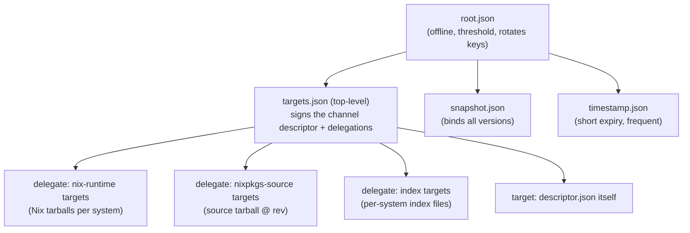
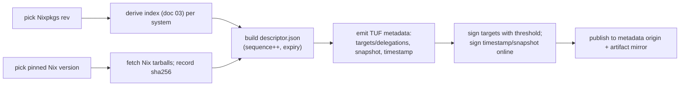

# 02 — Trust and Update Model

| | |
|---|---|
| **Status** | Draft (planning only — no implementation code) |
| **Owner** | Foundation planning track (docs 00–03) |
| **Depends on** | 00 Overview & Decisions, 01 System Architecture |
| **Consumed by** | 03 Nixpkgs Source & Index, 04 Resolution/Install/Build, 05 State, 07 Platform Install/Runtime, 08 Security Model, 10 Release/Ops, 11 PR Roadmap, 12 Open Decisions |

---

## 1. Purpose

Define how `pkg` **securely distributes and verifies** the channel descriptor, the pinned Nix runtime, the Nixpkgs source, and the catalog index, and how it **applies updates** (metadata refresh, Nix runtime upgrades, channel rev bumps). This document owns the **canonical channel-descriptor schema**, the TUF role/target mapping, trust bootstrap, key/rotation policy, freshness, and the update flow.

This implements decisions **D-08, D-09, D-10** (signed descriptor via mature TUF; `cache.nixos.org` only; no user trust controls) and invariants **INV-03, INV-07, INV-09**.

## 2. Scope

In scope: threat model for the update channel; the choice of TUF and the candidate libraries; TUF repository layout & role delegation; the **channel descriptor schema**; trust bootstrap (pinned root); the update sequence; Nix runtime upgrade lifecycle; failure/recovery (tampering, rollback, freeze, expiry, key compromise); release/signing pipeline sketch (publisher side).

## 3. Non-scope

The Nixpkgs *source* fetch mechanics (doc 03); the index *derivation* algorithm (doc 03); installer/daemon units (doc 07); the full threat model beyond the update channel (doc 08); the complete CI release pipeline (doc 10).

## 4. Invariants (trust/update-specific)

- **TRU-INV-01** No descriptor, Nix tarball, Nixpkgs source, or index is ever used before its TUF-authenticated target hash matches (INV-09).
- **TRU-INV-02** Users cannot supply or override trust keys, substituters, or the TUF root at runtime (D-10, INV-03).
- **TRU-INV-03** A newer descriptor is accepted only if its `sequence` is strictly greater **and** its TUF metadata version counters are greater than the stored ones (rollback protection).
- **TRU-INV-04** A descriptor past `expiresAt` is refused for *new* installs; cached use is bounded by the offline grace policy (UD-02.1).
- **TRU-INV-05** The Nix runtime is upgraded atomically (`/opt/pkg/nix/current` swap); a running operation is never left pointing at a half-extracted runtime.
- **TRU-INV-06** `cache.nixos.org` is trusted only as an **untrusted transport** authenticated by hashes derived from TUF-authenticated metadata (substitution trust is the single pinned key in the descriptor; see §6.5).

## 5. Legend

- ✅ **Confirmed** (Nix/Nixpkgs behavior, primary source cited) · 🛠 **Decision** (`pkg` choice) · ⚠️ **Spike**. *(Full definitions in doc 00 §5.)*

## 6. Why mature signed-update metadata (TUF)

### 6.1 The requirement

D-08 calls for a small signed descriptor selecting a handful of pinned artifacts (Nix runtime, Nixpkgs rev, index, substituters/keys, supported systems, policy). D-09 forbids inventing custom "TUF-lite" crypto. The target set is small and slowly changing, which is *exactly* the regime TUF is designed for: key rotation, threshold signatures, rollback/freeze protection, and delegation — without bespoke cryptography.

### 6.2 Threats addressed (TUF-standard)

| Threat | How TUF addresses it |
|---|---|
| Tampered descriptor/artifact | Target hashes in signed `targets.json`; download verified byte-for-byte. |
| Rollback (serve an older good version) | Monotonic `version` on every metadata role; clients reject lower versions. |
| Freeze (stop serving updates) | `timestamp.json` short expiry → client detects staleness (TRU-INV-04). |
| Mix-and-match | Single consistent snapshot (`snapshot.json`) binds all targets' versions together. |
| Key compromise | Threshold signing + offline root role + root rotation; revoke via new root. |
| Mirror compromise | Mirrors are untrusted; only TUF metadata (from a trusted publisher path) is trusted. |

### 6.3 Library selection (⚠️ SPK-03, tracked doc 12)

🛠 Candidate Rust TUF implementations to evaluate (pick one in a spike before implementation):
- **`tough`** (awslabs/tough) — mature, used in production (Bottlerocket), MIT/Apache, good spec coverage. **Default candidate.**
- **`tuf`** crate (the Rust ecosystem `tuf`) — closer to the reference, smaller scope.

Either must support: custom repository layout, threshold root, delegations, and loading a pinned `root.json` from the binary/embedded resource. Selection is recorded in doc 12 before doc 11 PRs begin.

### 6.4 TUF repository layout & role mapping



- **Targets (the "small target set"):**
  1. `descriptor.json` — the channel descriptor (§7). Its *integrity* is guaranteed by being a TUF target; its *semantic fields* are policy.
  2. `nix/<version>/<system>.tar.xz` — the bundled Nix runtime per system (✅ from `releases.nixos.org`).
  3. `nixpkgs/<rev>/src.tar.gz` — the pinned catalog source (doc 03).
  4. `index/<seq>/<system>.json{,.br}` — the derived catalog index (doc 03).
- 🛠 **Mirroring:** `pkg` fetches TUF metadata from the product's metadata origin (HTTPS, pinned in the binary). The *artifacts* (2–4) may be served from the product CDN or transparently mirrored; transport is untrusted (TRU-INV-06). `cache.nixos.org` is **not** used for metadata or for the runtime/index/source — only for **substituting built store paths** (§6.5).

### 6.5 cache.nixos.org role (D-10)

✅ `cache.nixos.org` substitutes Nix store paths using `narinfo` files authenticated by the cache's signing key (`cache.nixos.org-1:6NCHdD59X431o0gWypbMrAURkbJ16ZPMQFGspcDShjY=`). — *Nixpkgs/Nix `substituters` docs; the well-known `cache.nixos.org` public key.*

🛠 `pkg` configures the bundled Nix (via the `pkg`-controlled `nix.conf`, doc 01 §11) with **exactly** `substituters = https://cache.nixos.org` and `trusted-public-keys = cache.nixos.org-1:...`, taken from the descriptor. The descriptor pins these values so a descriptor update can rotate them in the future without V1 user action. Users cannot change them (D-10). ✅ Nix verifies every substituted path's signature against `trusted-public-keys` before linking it into the store. — *Nix Reference Manual, "Substituters" / `conf-file`.*

## 7. Channel descriptor schema (canonical — `descriptor.json`)

This is the schema referenced by doc 01 §10.4 and consumed by docs 03/04/05/10.

```json
{
  "schemaVersion": 1,
  "channel": "pkg-stable-1",
  "policyVersion": 1,
  "sequence": 42,
  "expiresAt": "2025-04-01T00:00:00Z",
  "supportedSystems": [
    "x86_64-linux", "aarch64-linux",
    "x86_64-darwin", "aarch64-darwin"
  ],
  "buildPolicy": {
    "localBuildsOn": ["x86_64-linux", "aarch64-linux"],
    "macosBinaryOnly": true
  },
  "nixRuntime": {
    "version": "2.24.10",
    "perSystem": {
      "x86_64-linux":   { "url": "https://releases.nixos.org/nix/nix-2.24.10/nix-2.24.10-x86_64-linux.tar.xz",   "sha256": "…" },
      "aarch64-linux":  { "url": "https://releases.nixos.org/nix/nix-2.24.10/nix-2.24.10-aarch64-linux.tar.xz", "sha256": "…" },
      "x86_64-darwin":  { "url": "https://releases.nixos.org/nix/nix-2.24.10/nix-2.24.10-x86_64-darwin.tar.xz", "sha256": "…" },
      "aarch64-darwin": { "url": "https://releases.nixos.org/nix/nix-2.24.10/nix-2.24.10-aarch64-darwin.tar.xz","sha256": "…" }
    }
  },
  "nixpkgs": {
    "owner": "NixOS",
    "repo": "nixpkgs",
    "rev": "abc123…",
    "narHash": "sha256-…",
    "sourceTarget": "nixpkgs/<rev>/src.tar.gz"
  },
  "index": {
    "source": "self-built",                  // or "upstream-packages-json-br"
    "perSystem": {
      "x86_64-linux":   { "target": "index/42/x86_64-linux.json.br",  "sha256": "…" },
      "aarch64-linux":  { "target": "index/42/aarch64-linux.json.br", "sha256": "…" },
      "x86_64-darwin":  { "target": "index/42/x86_64-darwin.json.br", "sha256": "…" },
      "aarch64-darwin": { "target": "index/42/aarch64-darwin.json.br","sha256": "…" }
    }
  },
  "substituters": {
    "urls": ["https://cache.nixos.org"],
    "trustedPublicKeys": ["cache.nixos.org-1:6NCHdD59X431o0gWypbMrAURkbJ16ZPMQFGspcDShjY="]
  }
}
```

Field semantics:
- `schemaVersion` — descriptor format version (doc 05 owns migrations).
- `channel` — human label (display only).
- `policyVersion` — monotonic; bumping signals a breaking policy change (e.g., new buildPolicy). `pkg` refuses to downgrade `policyVersion`.
- `sequence` — monotonic per channel; **the** key referenced by generations as `channelSeq` (doc 01 §10). TRU-INV-03 enforces strict increase.
- `expiresAt` — RFC3339; TRU-INV-04.
- `supportedSystems` — superset of platforms V1 supports (D-14); `pkg` errors if its host system is not listed.
- `buildPolicy` — implements D-11 (Linux local builds allowed; macOS binary-only).
- `nixRuntime`/`nixpkgs`/`index` — each entry is a **TUF target**; the `url`/`sha256`/`narHash`/`target` values must match the hash recorded in the corresponding TUF `targets`/delegation metadata. `pkg` cross-checks both (defense in depth).
- `substituters` — pinned per D-10; baked into the bundled `nix.conf` (doc 01 §11).

> The descriptor is itself signed as a TUF target. We do **not** add a second ad-hoc signature layer on the descriptor (that would be the "TUF-lite" custom crypto D-09 forbids). TUF is the single trust mechanism.

## 8. Trust bootstrap

- 🛠 **Embedded root:** a `root.json` (TUF root role, v1) is shipped **inside the `pkg` binary** (embedded resource / `include_bytes!`) and is the only a-priori trust anchor. It is NOT read from disk at first run; disk-stored copies must match or be re-derived.
- 🛠 **First run:** `pkg update` fetches `timestamp.json` → `snapshot.json` → `targets.json`, verifies the chain to the embedded root, then downloads `descriptor.json` and its target hashes. Nothing is used before verification (TRU-INV-01).
- 🛠 **Root rotation:** future roots are signed by the threshold root role per TUF. `pkg` follows the TUF root-chain rule (a new root must be signed by both the old threshold and the new threshold) so the embedded anchor stays valid across rotations. — *TUF spec §5.1 "Root role".*

## 9. Update flow (normal)

```mermaid
sequenceDiagram
  participant CLI as pkg update
  participant TUF as TUF client
  participant FS as store-fs
  participant IDX as index service
  CLI->>TUF: refresh()
  TUF->>TUF: fetch timestamp.json (check expiry, version > stored)
  TUF->>TUF: fetch snapshot.json (version > stored)
  TUF->>TUF: fetch targets.json (+ delegations)
  TUF->>TUF: verify chain to embedded root; check thresholds
  TUF->>FS: atomically store new metadata under channel/tuf/
  TUF->>TUF: fetch descriptor.json; verify hash vs targets
  alt sequence(newDescriptor) > sequence(current)
    TUF->>FS: stage descriptor.json; atomic replace (TRU-INV-03)
    Note over IDX: Nixpkgs source + index are fetched lazily by doc 03<br/>(and verified vs descriptor hashes)
  else same/older
    TUF-->>CLI: up to date / refused (rollback)
  end
```

**Offline behavior:** if the network is unreachable, `pkg` continues to operate on the *currently accepted* descriptor (already on disk). `pkg update` that cannot refresh warns and exits non-zero with a clear code; it never silently serves stale-as-fresh. Grace window for *expired* metadata is **UD-02.1** (default: refuse new installs after expiry; allow read-only commands within 7 days).

## 10. Nix runtime upgrade lifecycle (TRU-INV-05)

```mermaid
flowchart LR
  Detect["descriptor.nixRuntime.version != /opt/pkg/nix/current"]
  Detect --> Download["download <newVer>/<system>.tar.xz<br/>verify vs TUF target hash"]
  Download --> Extract["extract to /opt/pkg/nix/<newVer>/"]
  Extract --> Sanity["sanity: run nix --version with new binary"]
  Sanity --> Swap["atomic symlink swap<br/>nix/current -> nix/<newVer>/"]
  Swap --> Restart["restart daemon via root-helper (doc 07)"]
  Restart --> Retire["old version kept until pkg gc"]
```



- A runtime upgrade is gated behind the root helper (doc 07). The daemon is drained/stopped, swapped, restarted.
- Existing generations and GC roots are unaffected (the store `/nix/store` is unchanged by a Nix-version bump). ✅ Store paths are stable across Nix versions. — *Nix Reference Manual, "Store path" hashing.*
- If sanity-check fails, `nix/current` is **not** swapped; the previous runtime stays active (TRU-INV-05).

## 11. Failure & recovery

| Failure | Detection | Recovery |
|---|---|---|
| Tampered metadata/artifact | TUF signature/hash failure | Discard; refuse; report. Never fall back to "use unsigned". |
| Stale `timestamp` (freeze) | expiry passed (TRU-INV-04) | Refuse `update`; allow cached reads within grace (UD-02.1). |
| Rollback attempt (older version/sequence) | TRU-INV-03 version check | Refuse; keep current metadata. |
| Partial download | hash mismatch mid-write | Delete temp; retry with backoff; never link partial bytes. |
| Expired descriptor for new install | `expiresAt` < now | Refuse install; instruct `pkg update`; if offline, honor grace policy. |
| Key compromise (publisher) | out-of-band | Publisher revokes via root rotation + new threshold keys; clients pick up new root through the existing chain (§8). Incident process in doc 10/08. |
| Runtime upgrade sanity failure | `nix --version` non-zero/wrong | Keep `nix/current`; do not swap; quarantine `<newVer>/`. |
| Corrupt `channel/tuf/` on disk | load-time verification | Re-derive from embedded root → re-fetch. |

## 12. Security considerations (trust-channel; full model doc 08)

- **Defense in depth:** artifact hashes appear in *both* the descriptor and the TUF target metadata; `pkg` requires both to agree.
- **No metadata from `cache.nixos.org`:** the cache only substitutes store paths; it is never a metadata source.
- **Time source:** TUF freshness relies on a clock; `pkg` treats implausible clocks (e.g., before build date) as suspect and refuses metadata refresh until resolved (doc 08).
- **Downgrade across policy:** `policyVersion` cannot decrease (§7); protects against re-introducing a relaxed policy.
- **Key custody:** publisher signing keys are held offline/CI-protected (threshold); operational detail in doc 10.

## 13. Platform differences

- **macOS:** the bundled Nix runtime tarball and the `pkg` binary are codesigned/notarized (V1 target, doc 07); TUF still authenticates them by hash (codesign is defense-in-depth, not the trust root).
- **Linux:** no code signing; TUF hashes are the trust mechanism for the runtime.
- **All:** trust logic is identical; only artifact URLs per system differ.

## 14. Release/signing pipeline (publisher side — sketch; detail in doc 10)



- `timestamp.json`/`snapshot.json` are regenerated frequently (cadence UD-02.2); `targets.json` per descriptor release.
- This pipeline is **planning only** here; full CI/key-custody/cadence in doc 10.

## 15. Dependencies on other plan documents

- **00** — D-08/D-09/D-10, INV-03/07/09.
- **01** — state paths (`channel/`, `/opt/pkg/nix/`), subprocess/env hygiene, the `nix.conf` that bakes substituters.
- **03** — owns how Nixpkgs source & index are fetched/verified against the descriptor hashes defined here.
- **07** — owns the root helper that performs the runtime upgrade swap (§10) and daemon restart.
- **08** — refines the trust-channel threat model (§12) and key-compromise incident response.
- **10** — owns the concrete release/signing pipeline (§14) and key custody.

## 16. Implementation checkpoints (foundation; feeds doc 11)

- CP-02.1 Embed TUF `root.json`; implement TUF client refresh+verify against chosen library (SPK-03).
- CP-02.2 Define & serialize `descriptor.json` per §7 with strict validation (sequence/policy monotonicity, expiry, supportedSystems).
- CP-02.3 Implement atomic metadata storage + rollback check (TRU-INV-03).
- CP-02.4 Implement Nix-runtime download/verify/extract/sanity/swap (with doc 07 helper).
- CP-02.5 Stand up a **test** TUF repo fixture (publisher stub) for the test lanes (doc 09).

## 17. Acceptance criteria

- AC-02.1 Any single bit flipped in `descriptor.json`, a Nix tarball, the Nixpkgs source, or an index file is detected and refused before use (TRU-INV-01) — demonstrated by a fault-injection test.
- AC-02.2 An older `sequence`/`version`/`policyVersion` is refused (TRU-INV-03).
- AC-02.3 An expired `timestamp`/descriptor beyond the grace window blocks new installs but permits cached reads (TRU-INV-04, UD-02.1).
- AC-02.4 A runtime upgrade that fails sanity leaves `nix/current` unchanged (TRU-INV-05).
- AC-02.5 The user has no CLI/config path to change `substituters`, `trustedPublicKeys`, or the TUF root (TRU-INV-02) — verified by config-rejection tests.
- AC-02.6 `cache.nixos.org` substitution works with the descriptor-pinned key and fails closed if the key is removed (D-10).

## 18. Unresolved decisions (tracked in doc 12)

- UD-02.1 Offline grace window for expired metadata (default: 7 days read-only).
- UD-02.2 `timestamp.json` refresh cadence and max expiry.
- UD-02.3 TUF library choice (SPK-03): `tough` vs `tuf`.
- UD-02.4 Whether artifacts are self-hosted on a product CDN or mirrored from upstream (TRU-INV-06 holds either way).
- UD-02.5 Key custody model (offline HSM vs threshold CI keys) — doc 10.

## 19. References (primary sources)

- The Update Framework specification (latest): https://theupdateframework.io/specification/latest/ (root role §5.1, targets, snapshot, timestamp, delegations, key rotation/threshold).
- `tough` (Rust TUF): https://github.com/awslabs/tough .
- Nix Reference Manual (stable): https://nixos.org/manual/nix/stable/ — "Substituters", `conf-file` (`substituters`, `trusted-public-keys`, `trusted-substituters`), "Store path" hashing.
- NixOS download / `releases.nixos.org`: https://nixos.org/download.html ; `https://releases.nixos.org/nix/`.
- `cache.nixos.org` public key (well-known): `cache.nixos.org-1:6NCHdD59X431o0gWypbMrAURkbJ16ZPMQFGspcDShjY=`.
