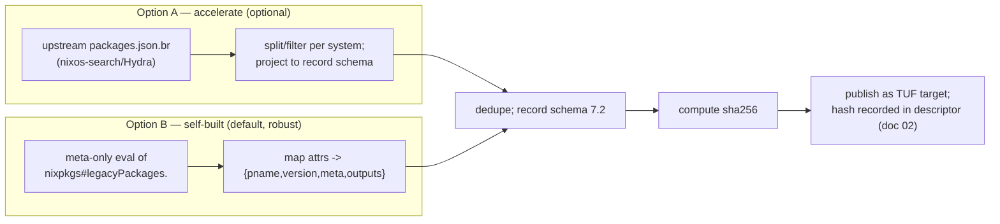
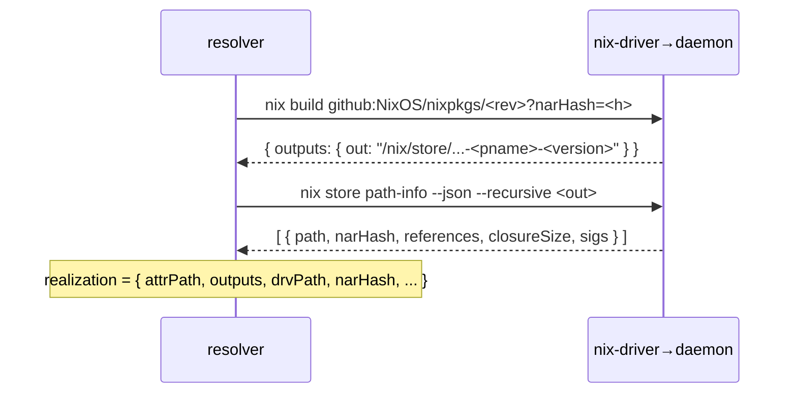

# 03 — Nixpkgs Source and Index

| | |
|---|---|
| **Status** | Draft (planning only — no implementation code) |
| **Owner** | Foundation planning track (docs 00–03) |
| **Depends on** | 00 Overview & Decisions, 01 System Architecture, 02 Trust & Update Model |
| **Consumed by** | 04 Resolution/Install/Build, 06 CLI/UX, 08 Security Model, 10 Release/Ops, 11 PR Roadmap |

---

## 1. Purpose

Define how `pkg` **obtains and pins the Nixpkgs source** at the descriptor's exact revision, how it **builds and maintains the disposable catalog index** used by search/list/info, the **index data contract**, and the **on-host install-evaluation contract** that turns an intent into an authoritative realization. This implements decisions **D-05, D-06, D-07, D-13** and invariants **INV-04, INV-06, INV-07**.

Key principle (D-06/D-07): **the index is disposable and never authoritative**; the only authoritative statement that a package is realizable on *this* host is the on-host evaluation during install.

## 2. Scope

In scope: Nixpkgs source acquisition and verification against the descriptor; index definition, schema, derivation pipeline (self-built vs `packages.json.br`); per-system coverage; the install-evaluation Nix contract; the relationship to upstream `packages.json.br`; caching; failure/recovery for missing/corrupt index and failed evals.

## 3. Non-scope

The resolver's full selection algorithm and approval flow (doc 04); the CLI presentation of search/info (doc 06); index publisher CI pipeline detail (doc 10); TUF mechanics (doc 02 — this doc consumes the descriptor hashes, it does not re-spec trust).

## 4. Invariants (catalog/index-specific)

- **CAT-INV-01** The Nixpkgs source is always referenced by the **descriptor's exact `rev` + `narHash`** (D-05); never by a mutable channel name or a user URL (INV-03/INV-04).
- **CAT-INV-02** The index is keyed by `(channelSeq, system)` and its bytes are verified against the descriptor's `index.perSystem.<system>.sha256` (INV-07). Mismatch → index is discarded/rebuilt (disposable).
- **CAT-INV-03** No code path uses the index to *decide what store path to trust*. The index only suggests attribute paths; realization always comes from on-host `nix build`/`path-info` (D-07).
- **CAT-INV-04** `pname@version` from the index is **display metadata only** (D-13); it is never a key and never gates install/upgrade identity.
- **CAT-INV-05** Darwin cache misses never build silently; an approved native sandboxed build is allowed. A cache miss on `*-darwin` is **not** an automatic error — it triggers the same deterministic build preview + explicit single-operation approval + sandbox/build-user gates as Linux (D-11). It becomes an error (`ACQUIRE_NO_BINARY`) only when building is impossible or disallowed for a concrete reason (unsupported package/system, sandbox/build-user unavailable, policy-blocked derivation).

## 5. Legend

- ✅ **Confirmed** (Nix/Nixpkgs behavior, primary source cited) · 🛠 **Decision** (`pkg` choice) · ⚠️ **Spike**. *(Full definitions in doc 00 §5.)*

## 6. Nixpkgs source acquisition

### 6.1 What we pin

The descriptor (doc 02 §7) provides:
```json
"nixpkgs": {
  "owner": "NixOS", "repo": "nixpkgs",
  "rev": "<40-char git sha>",
  "narHash": "sha256-...",
  "sourceTarget": "nixpkgs/<rev>/src.tar.gz"
}
```

### 6.2 How we fetch and verify

✅ Nixpkgs is consumed as a flake input `github:NixOS/nixpkgs/<rev>`; its content is authenticated by the flake `narHash` (SRI). — *Nix Reference Manual, `nix3-flake`, `nix3-flake-metadata`; flake.lock format.*

⚠️ **S4 (a)** The `narHash` of `github:owner/repo/<rev>` (flake tarball) differs from the raw `https://github.com/.../archive/<rev>.tar.gz` hash because flakes normalize the source. `pkg` therefore **fetches via the flake fetcher** (`nix flake metadata github:NixOS/nixpkgs/<rev> --json`) and verifies the returned `locks…nar` against `descriptor.nixpkgs.narHash`, rather than hashing a GitHub archive directly. (Default; verified in spike.)

🛠 Concrete steps (owned here, consumed by docs 01/04):
1. `nix flake metadata github:NixOS/nixpkgs/<rev> --json` → read `locks.nodes.nixpkgs.locked.rev` and `…nar` (or `narHash`).
2. Assert `rev == descriptor.nixpkgs.rev` and `nar == descriptor.nixpkgs.narHash`. (CAT-INV-01; if either mismatches → abort, this is a trust event.)
3. The fetched source is materialized under the Nix store by Nix; we cache a reference at `/var/lib/pkg/nixpkgs/<rev>/` (a marker + the flake-ref) for index derivation. The authoritative copy lives in `/nix/store` (Nix-managed).

### 6.3 Why not `NIX_PATH` / `nixpkgs` channel

✅ Mutable `nixpkgs` channels and `NIX_PATH` float over commits and are exactly what D-05 forbids. `pkg` never sets `NIX_PATH` and never references `nixpkgs` by channel name. — *Nix Reference Manual, "NIX_PATH".*

## 7. Index: definition & data contract (canonical)

The index is a **disposable, derived** catalog. Stored per system at `/var/lib/pkg/index/<channelSeq>/<system>.json` (optionally `.br` on disk). Its bytes are verified against `descriptor.index.perSystem.<system>.sha256` (CAT-INV-02).

### 7.1 Envelope

```json
{
  "schemaVersion": 1,
  "channelSeq": 42,
  "system": "aarch64-darwin",
  "nixpkgsRev": "abc123…",
  "generatedAt": "2025-01-01T00:00:00Z",
  "source": "self-built",
  "records": [ /* see 7.2 */ ]
}
```

### 7.2 Record (one per discovered attribute)

```json
{
  "attrPath": "python3Packages.requests",
  "pname": "requests",
  "version": "2.31.0",
  "description": "Python HTTP for Humans.",
  "homepage": "https://requests.readthedocs.io",
  "licenses": ["Apache-2.0"],
  "platforms": ["x86_64-linux", "aarch64-linux", "x86_64-darwin", "aarch64-darwin"],
  "availableHere": true,
  "broken": false,
  "position": "pkgs/development/python-modules/requests/default.nix:42",
  "outputs": ["out"],
  "aliases": ["requests2"]
}
```

Notes:
- `attrPath` is the **resolver-facing key** (D-13). `pname`/`version` are display-only.
- `availableHere`/`platforms`/`broken` are best-effort signals from meta; the index may be wrong, so install re-checks on host (CAT-INV-03).
- `outputs` is informational; the real output set comes from on-host eval (doc 04 owns multi-output policy).
- `aliases` helps `pkg install <alias>` map to a canonical attr (resolution detail in doc 04).

### 7.3 What the index is NOT

- Not a source of store paths or hashes (those come from on-host eval — CAT-INV-03).
- Not complete or guaranteed consistent (broken attrs may be dropped; per-system availability is meta-derived — §10).
- Not user-editable and not part of trust (INV-07).

## 8. Index derivation pipeline

Two sources, selected per descriptor via `index.source` (doc 02 §7):



### 8.1 Option A — upstream `packages.json.br` (acceleration only)

✅ The nixos-search/Hydra pipeline publishes a brotli-compressed JSON catalog (commonly referenced as `packages.json.br`) describing Nixpkgs packages for a channel. Provenance/schema live in the `nixos/nixos-search` repository. — *`NixOS/nixos-search`.*

🛠 **Non-assumptions (D-06):** `pkg` treats this artifact as **optional and not cross-platform-complete**:
- Its existence/URL/schema may change without notice.
- It is filtered to the **descriptor's `supportedSystems`** and projected into the §7.2 record schema; `pkg` never exposes its raw shape to the rest of the codebase.
- It is **only used if** its projected bytes hash to the descriptor's `index.perSystem.<system>.sha256`. Otherwise `pkg` falls back to Option B (self-built) or fails with a clear message. (CAT-INV-02.)

### 8.2 Option B — self-built (default, robust)

🛠 `pkg` (or the publisher pipeline) evaluates a **meta-only** expression over `legacyPackages.<system>` to emit `{pname, version, meta, outputs, position}` for each attribute, **without building anything**:

```nix
# sketch (doc 11 will own the maintained expression)
# pkgs here = import <fetched nixpkgs> { system = <system>; }
let
  pkgs = import <nixpkgs> {};
  metaOf = name: drv:
    if builtins.tryEval (builtins.seq drv.meta or drv)
    then { inherit name; value = {
      pname = drv.pname or null;
      version = drv.version or null;
      meta = builtins.removeAttrs (drv.meta or {}) ["outputsToInstall"];
      outputs = builtins.attrNames (drv.outputs or {});
    }; }
    else { inherit name; value = { skipped = true; }; };
in
  builtins.mapAttrs metaOf pkgs
```

⚠️ **S4** Performance/cost of this meta-eval for four systems must be measured (default expectation: minutes, disposable, cached per `channelSeq`). Mitigations: lazy attr traversal, `tryEval` to swallow per-attr failures, publisher-side precompute (doc 10) so clients normally just download Option-A/self-built bytes by hash.

✅ **Tolerating per-attribute eval failures** is required because `legacyPackages` is lazy and individual attributes can throw (e.g. `meta.broken` triggers, `assert`s, unsupported system). `builtins.tryEval` is the documented mechanism. — *Nix Reference Manual, `builtins.tryEval`; Nixpkgs flake output schema (`legacyPackages`).*

## 9. Install-evaluation contract (D-07) — the authoritative step

This is the contract doc 04 implements. It is the **only** place `pkg` decides a package is realizable.

### 9.1 Selector → attr path (resolver, doc 04)

The resolver maps a user selector (D-13) to one or more candidate `attrPath`s using the index (§7), then disambiguates (e.g. prefer top-level over `python3Packages.x`; resolve aliases). The resolver may yield **multiple candidates** → doc 06 owns the UX; doc 04 owns the algorithm.

### 9.2 Realize the exact attribute on this host (CAT-INV-03)



- ✅ `nix build … --print-out-paths --json` returns the realized output path(s) without creating a `result` link; substitution from `cache.nixos.org` happens automatically per the `pkg`-controlled `nix.conf`. — *Nix Reference Manual, `nix3-build`.*
- ✅ `nix store path-info --json --recursive` yields per-path `narHash` (SRI), references, and closure size — the data `pkg` records in the lock (doc 01 §10.2). — *Nix Reference Manual, `nix3-store-path-info`.*
- 🛠 The `narHash` and `sigs` from `path-info` are how `pkg` later confirms a path is present and (via Nix's own substitution-trust) trustworthy. `pkg` does not re-implement Nix signature verification (D-10).

### 9.3 Cache-miss build policy is cross-platform (D-11, CAT-INV-05)

On **any** v1 system (`*-linux`, `*-darwin`), substitution from `cache.nixos.org` is tried first and preferred. A cache miss is **not** automatically an error: it triggers the **explicit local-build preview/approval** flow owned by doc 04 (closure, derivations/source inputs, download bytes, resource estimate or explicit unknowns, target system, sandbox status). After explicit single-operation approval, `pkg` runs `nix build … --substituters "" --builders ""` (force local) for the host's **native** system only — no Rosetta, cross-compilation, emulation, or remote builders in v1.

The miss becomes an **error** (`ACQUIRE_NO_BINARY`, doc 04/06) only when there is no acceptable substitute **and** building is impossible or disallowed for a concrete reason — e.g. the package is `meta.broken`/unsupported on this `system`, the derivation requires forbidden impurity or unsandboxed execution, the sandbox or build users cannot be made ready, or the descriptor's `buildPolicy` denies the system. A cache miss on `*-darwin` is therefore **not** grounds for `ACQUIRE_NO_BINARY` by itself; macOS local builds are explicitly allowed (D-11) and require the same gates as Linux.

## 10. Cross-platform coverage & per-system availability

- The index is **per-system** (`index/<seq>/<system>.json`). A package present for `x86_64-linux` may be absent/broken for `aarch64-darwin`. (CAT-INV-02.)
- `record.platforms` / `broken` / `availableHere` are derived from Nixpkgs `meta.platforms`/`meta.broken`/`lib.systems.inspect.patterns`. ✅ — *Nixpkgs Reference Manual, "Meta-attributes"; `lib.platforms`.*
- `pkg search`/`info`/`list-outdated` filter to the **host system** by default but can show cross-system availability as display metadata. They never claim installability (CAT-INV-03).
- `pkg install <attr>` on a system where the attr is `broken`/unsupported: the index may warn, but the authoritative answer is the on-host eval (which will fail with a structured error that doc 04 maps to a clear message).

## 11. Search / list / info / outdated behavior (contract; UX in doc 06)

- **search `<term>`:** fuzzy/substring over `pname`, `attrPath`, `description`, `aliases`; ranked; host-system-filtered default.
- **info `<selector>`:** resolve to a single record (or present candidates); show display metadata; mark "realizability unknown until install" (CAT-INV-03).
- **list:** reads the **lock** (realized state, doc 01 §10.2), not the index — shows what's actually installed.
- **outdated:** diffs the lock's `pname@version`+`attrPath` against the index for the current `channelSeq`; flags candidates. (Display metadata only; the *real* upgrade decision is made at install-eval, doc 04.)

## 12. Failure & recovery

| Failure | Detection | Recovery |
|---|---|---|
| Index missing for `(seq,system)` | file absent / hash mismatch (CAT-INV-02) | Disposable: re-download from TUF target; if unavailable, **Option B** self-build; if that fails, degrade search/info to "index unavailable" but **do not** block install (install uses on-host eval directly). |
| Index corrupt | hash mismatch | Discard; rebuild/refetch. Never partial-use. |
| On-host eval: attr not found | `nix build` error (attr undefined) | Map to "not found" (check selector/alias; doc 04). |
| On-host eval: ambiguous attr | resolver yields >1 candidate | Disambiguate via doc 04; doc 06 presents choice. |
| On-host eval: `broken`/unsupported | eval error / `meta.broken` | Structured error; on Linux may offer nothing (it's broken), on macOS binary-miss is separate. |
| On-host eval: substitution miss (any v1 system) | build cannot substitute | Preview/approval → optional native local build (D-11, doc 04). |
| Nixpkgs source hash mismatch | `nix flake metadata` nar != descriptor | Abort; treat as trust event (CAT-INV-01); re-run `pkg update`. |
| Self-build meta-eval too slow (SPK-04) | timeout | Prefer publisher-precomputed index (Option A or prebuilt Option B bytes); document expected time. |

## 13. Security considerations (catalog; full model doc 08)

- **Index is untrusted-for-trust (CAT-INV-03):** a poisoned/old index can at worst cause a confusing search result or a wrong *candidate*; it can never cause a wrong *realized store path*, because realization is re-computed on host and the store path is authenticated by Nix substitution (`cache.nixos.org` signature, D-10).
- **Meta fields are display-only:** `homepage`/`description`/`position` are rendered with sanitization (no shell/HTML execution); they are never used as commands or URLs to fetch.
- **No arbitrary attr execution from user input:** the resolver only emits attr paths that exist in the index and pass the grammar in doc 01 §11.1.
- **Reproducible index hash:** the publisher computes `index.perSystem.<system>.sha256` deterministically (sorted keys, stable JSON) so clients can verify (CAT-INV-02).

## 14. Platform differences

| | Linux (`*-linux`) | macOS (`*-darwin`) |
|---|---|---|
| Index per system | yes | yes |
| Meta-eval host | can eval Linux index on Linux | must eval darwin index on darwin (lazy `legacyPackages` is system-bound) → publisher precompute recommended |
| Install on cache miss | preview → optional **native local build** (D-11) | preview → optional **native local build** (D-11); `ACQUIRE_NO_BINARY` only if the build is impossible/disallowed (CAT-INV-05) |
| Realization command | identical (`nix build … --json`, `nix store path-info`) | identical |

## 15. Dependencies on other plan documents

- **00** — D-05/D-06/D-07/D-13; INV-04/06/07.
- **01** — state paths (`index/`, `nixpkgs/`), the Nix subprocess contract table (§11 of doc 01) that this doc's commands must belong to, and env hygiene.
- **02** — the descriptor schema that supplies `nixpkgs.{rev,narHash}` and `index.perSystem.<system>.sha256`, and TUF verification of index bytes.
- **04** — owns the resolver and the install/build state machine that consumes the §9 contract.
- **06** — owns the search/info/list/outdated UX against the §7 schema.
- **10** — owns the publisher-side index precompute (Option A ingestion / Option B meta-eval at scale).

## 16. Implementation checkpoints (foundation; feeds doc 11)

- CP-03.1 Implement Nixpkgs source fetch+verify via `nix flake metadata` (CAT-INV-01).
- CP-03.2 Define & serialize the index record schema (§7) with stable hashing.
- CP-03.3 Implement index loader/verifier (download TUF target → verify sha256 → load; else Option B self-build).
- CP-03.4 Implement Option B meta-eval expression with `tryEval` per-attr tolerance (SPK-04).
- CP-03.5 Implement the install-evaluation contract (§9) → realization record (feeds doc 04/05 lock).
- CP-03.6 Implement read-only `search`/`info`/`list`/`outdated` minimum paths against the schema (UX polish in doc 06).

## 17. Acceptance criteria

- AC-03.1 Nixpkgs is never referenced except by `descriptor.nixpkgs.rev`+`narHash`; a mismatch aborts (CAT-INV-01) — testable with a tampered rev.
- AC-03.2 A flipped bit in the index is detected by hash and triggers rebuild/refetch, never partial use (CAT-INV-02).
- AC-03.3 No code path derives a store path or `narHash` from the index; all realizations come from `nix build`/`path-info` on host (CAT-INV-03) — enforced by module boundaries + tests.
- AC-03.4 `pname@version` is never a key in manifest/lock (CAT-INV-04); identity is `manifestId → realization`.
- AC-03.5 On `*-darwin`, a cache miss that can be built natively produces a build preview (not an automatic error); a build that is impossible/disallowed (unsupported/broken/impure derivation, or sandbox/build-user unavailable, or `buildPolicy` denies the system) fails with `ACQUIRE_NO_BINARY` (CAT-INV-05). Cache misses are never built silently.
- AC-03.6 Search returns host-system-filtered results and never claims installability (display-only); install is the authority.
- AC-03.7 An absent/corrupt index does not block a known-attr install that re-evaluates on host (§12).

## 18. Unresolved decisions (tracked in doc 12)

- UD-03.1 Default index source ordering (Option A vs self-built) when both are available — default: prefer the descriptor-declared `index.source`.
- UD-03.2 Multi-output selection policy for `active/bin` (which output's binaries land on PATH) — default: `bin` else `out`; detail doc 04.
- UD-03.3 Whether to surface `pkg search` cross-system availability and how (doc 06).
- UD-03.4 The exact meta-eval expression & its maintained home (doc 11 PR).
- UD-03.5 Whether the publisher precomputes per-system indexes centrally (doc 10) vs clients self-build on first use (cost tradeoff, SPK-04).

## 19. References (primary sources)

- Nix Reference Manual (stable): https://nixos.org/manual/nix/stable/
  - Flake input/ref & narHash: `nix3-flake`, `nix3-flake-metadata`, flake.lock format.
  - Realization: `nix3-build` (`--print-out-paths`, `--json`), `nix3-store-path-info` (`--recursive`, `--json`, `narHash`).
  - `NIX_PATH` semantics; `builtins.tryEval`.
- Nixpkgs Reference Manual (stable): https://nixos.org/manual/nixpkgs/stable/
  - Meta-attributes (`meta.platforms`, `meta.broken`, `meta.license`, `meta.homepage`), `lib.platforms`, flake output schema (`packages`, `legacyPackages`).
- `NixOS/nixos-search` (provenance/schema of the upstream `packages.json.br` catalog): https://github.com/NixOS/nixos-search .
- nix.dev: https://nix.dev/ .
