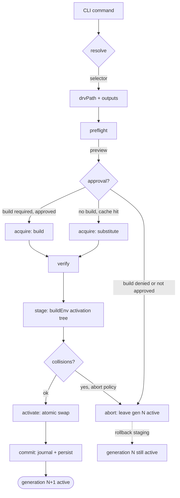
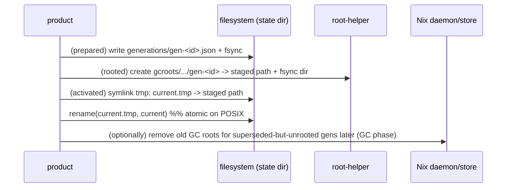

# 04 — Resolution, Install & Build Pipeline

> Owner: execution track. This document is **planning only**; it specifies no Rust code.
> Sibling plans it depends on are cross-referenced by number. See [Dependencies](#dependencies-on-other-plans).

## 1. Purpose

Define the **exact end-to-end machine-readable pipeline** that turns a user
command (`install`, `remove`, `upgrade …`) into a realized, activated,
content-addressed set of store paths owned by this product — while never
exposing raw Nix inputs to the user and never leaving the previous working
generation inactive on failure.

Concretely this document specifies, for the lifecycle of one mutating
operation:

1. **Resolve** — turn a *user-intent selector* into an *exact realized
   identity* (derivation + outputs + narHash + Nixpkgs revision).
2. **Preflight** — preview closures, builds, downloads, collisions, disk and
   policy violations *before* mutating anything.
3. **Acquire** — fetch from the trusted substituter (cache.nixos.org) or, on a
   cache miss, build locally for the host's native system after explicit user
   approval (Linux and macOS; D-11).
4. **Verify** — confirm NAR integrity and required signatures.
5. **Stage** — build a candidate generation (activation tree) in a staging
   area that the live `current` pointer does not see.
6. **Activate** — atomically swap `current` to the staged generation.
7. **Commit** — transactionally persist desired-state, lock, generation
   manifest, and the operation journal.

It also defines cache-hit/cache-miss semantics, the build preview/approval
gate, cancellation, restart recovery, resource/sandbox limits, structured
logs/progress, exit codes, and package/binary collision + multi-output
handling.

All Nix interaction is via the bundled, pinned Nix runtime (plan 07) using
**JSON output only**. The product never parses human-oriented Nix output.

## 2. Scope / Non-scope

**In scope**

- The seven-phase pipeline and its state machine.
- Machine-readable subprocess contracts for every Nix invocation (argv +
  JSON response shapes + error shapes).
- Selector → identity resolution rules (including pins and version ranges).
- Cache-hit vs cache-miss, cross-platform local-build preview/approval (Linux
  **and** macOS, native system only), and the concrete conditions under which a
  cache miss becomes `ACQUIRE_NO_BINARY`.
- Collision policy and multi-output selection.
- Progress event protocol, structured logs, exit codes.
- Cancellation, restart recovery, resource and sandbox limits.
- Failure matrix and the "previous generation stays active" invariant.

**Non-scope (owned elsewhere)**

- Trust, signing, the channel descriptor, and key management → **plan 02**.
- The disposable search index and the Nixpkgs catalog snapshot → **plan 03**.
- State schema, migrations, generations, GC roots, leases, corruption
  recovery → **plan 05**.
- CLI flag grammar, TUI, human output formatting, completion → **plan 06**.
- Installer, daemon, store prefix, privilege, PATH, uninstall → **plan 07**.
- Threat model, test lanes, release ops → **plans 08–10**.

## 3. Invariants

| # | Invariant | Enforcement |
|---|-----------|-------------|
| I1 | A failed operation leaves the **previous generation active** and the desired-state/lock **byte-for-byte unchanged**. | All mutation happens under a staging path; commit is one atomic `rename(2)`/`symlink(2)` swap (plan 05). |
| I2 | Every Nix subprocess is invoked with `--json` (or `--log-format internal-json`); the product never regex-scrapes human output. | A single `nix` adapter module is the only legal caller; CI lint forbids other `Command::new("nix*")`. |
| I3 | Only the channel descriptor's pinned Nixpkgs revision(s) and approved substituters/keys are used. No arbitrary flakes/URLs/overlays/trust edits. | Adapter references Nixpkgs **only** by the descriptor-pinned flake-ref `github:NixOS/nixpkgs/<rev>?narHash=<h>` (or its locked store path) — never a mutable channel or user URL. `--expr`, `--impure`, `--override-input`, `--inputs-from`, and `file://`/`path:` flakes are **never** passed (doc 01 §11.1); substituters/trusted keys fixed via generated `nix.conf` + per-call reinforcement flags. |
| I4 | A realized identity is identified by its **store path** (which embeds the content hash), not by `pname@version`. Display metadata is never used as a key. | Lock and generation manifest key on store path; `pname`/`version` are display-only fields. |
| I5 | Local builds occur **only for the host's native Nix system** (Linux and macOS), **only after** the user has seen a deterministic build preview and explicitly approved a single operation, and **only** under `sandbox=true`/`sandbox-fallback=false` through the daemon's unprivileged build users. No Rosetta/cross-compilation/emulation/remote builders. Approval never overrides a hard policy refusal (unsupported/broken/impure derivation, or sandbox/build-user unavailable). | Preflight computes the build plan; a `BuildRequired` event gates on `Host::nativeSystem ∈ descriptor.buildPolicy.nativeLocalBuilds(mode=allow-with-gates) && sandbox_ready && build_users_ready && user_approval == true`. A cache miss with no buildable path, or a disallowed build, yields `ACQUIRE_NO_BINARY`. |
| I6 | Acquire/verify/stage are **idempotent and resumable**; restarting the product resumes from the persisted operation journal without redoing completed Nix work unnecessarily. | Journal is append-only + fsynced; Nix daemon keeps realised paths so re-running `nix build` is cheap. |
| I7 | The product never writes the activation tree by hand into `/nix/store`; the activation tree is a Nix-built `buildEnv` store object, so collisions are detected by Nix and the tree is content-addressed. | Stage phase issues `nix build` of a generated `buildEnv` expression. |

## 4. Concepts and data model

### 4.1 User-intent selector vs realized identity (summary; full schema in plan 05)

```jsonc
// Selector — what the user typed/installed (intent). Stored in manifest.json (doc 01 §10.1).
{
  "id": "sel_018f",                       // stable within the manifest
  "selector": "ripgrep",                  // user intent string (D-13)
  "attribute": "ripgrep",                 // resolved Nixpkgs attribute (may equal selector)
  "versionPref": { "kind": "any" },       // "any" | "exact" | "min" | "range"
  "outputs": null,                        // null => meta.outputsToInstall
  "sourceRev": "channel:current",         // or "channel:pinned:<id>" | "rev:<gitsha>"
  "pinned": false,
  "pinnedTo": null                        // realized.storePath when set by `pin`
}

// Realized identity — the exact thing activated. Stored in lock.json + generation manifest.
{
  "storePath": "/nix/store/a1b2...-ripgrep-14.1.0",
  "deriver":  "/nix/store/9z8y...-ripgrep-14.1.0.drv",
  "outputs": { "out": "/nix/store/a1b2...-ripgrep-14.1.0", "man": "/nix/store/...-ripgrep-14.1.0-man" },
  "outputsToInstall": ["out", "man"],
  "system": "x86_64-linux",
  "nixpkgsRev": "abcd1234...deadbeef",
  "narHash": "sha256-...",
  "pname": "ripgrep", "version": "14.1.0",
  "closureNarSize": 4821034,
  "license": ["MIT"], "broken": false, "insecure": []
}
```

`pname@version` is **display metadata, not a key.** Two distinct attributes can
share `pname`; only `storePath` is unique. See plan 05 §"Identity".

### 4.2 Pipeline phase state

```jsonc
// One row in the operation journal (plan 05) per phase transition.
{ "opId": "op_2024-...-a1", "phase": "stage", "status": "started",
  "prevStateHash": "sha256-...", "channelSeq": 42,
  "ts": "2024-08-02T23:14:00Z" }
```

## 5. Pipeline overview



### 5.1 Resolve

**Goal:** map selectors to exact derivations using only the channel's pinned
Nixpkgs.

The product never lets the user pass a raw `nixpkgs#…` URL or flake ref. It
constructs the evaluation invocation from the channel descriptor (plan 02).

For each selector the adapter issues exactly one evaluation call and reads
JSON. Two equivalent strategies; **strategy A is preferred** because it returns
the full derivation document and meta in one round trip.

**Strategy A — `nix derivation show` (JSON):**

```
nix derivation show --json \
  github:NixOS/nixpkgs/<rev>?narHash=<h>#legacyPackages.<system>.<attribute>
```

The `<rev>` and `<narHash>` come **only** from the signed channel descriptor
(plan 02). The flake-ref-with-`narHash` form is the canonical Nixpkgs reference
(doc 01 §11, plan 03 §9.2): no `--override-input`, no `--expr`, no mutable
channel, no `NIX_PATH`.

Response shape (documented behavior of `nix derivation show`
— *confirmed current Nix behavior* [^drv-show]):

```jsonc
{
  "/nix/store/9z8y...-ripgrep-14.1.0.drv": {
    "name": "ripgrep-14.1.0",
    "outputs": { "out": { "path": "...", "hashAlgo": "...", "hash": "..." },
                 "man": { "path": "...", ... } },
    "inputSrcs": [...], "inputDrvs": {...}, "platform": "x86_64-linux",
    "builder": "...", "args": [...], "env": { "pname": "ripgrep", "version": "14.1.0", ... }
  }
}
```

**Strategy B — `nix eval` for cheap drvPath lookups** when only the path is
needed (e.g., checking if already installed): `nix eval --raw github:NixOS/nixpkgs/<rev>?narHash=<h>#legacyPackages.<system>.<attr>.drvPath`.

Meta (outputsToInstall, license, broken, knownVulnerabilities) is read via
`nix eval --json ….<attr>.meta` or extracted from the derivation's `env`.
`meta.outputsToInstall` is a **confirmed nixpkgs convention** [^outputs-to-install].

**Resolve rules:**

1. `attribute` must resolve to a single derivation (not a nested attrset of
   packages). Ambiguous attribute → `RESOLVE_AMBIGUOUS` with candidates.
2. `version_pref`:
   - `any` → the attribute's current derivation.
   - `exact:<v>` → reject if `version != v` (no fuzzy). Suggest the matching
     sibling attribute (e.g., user asks `python@3.11` → candidate `python311`).
   - `min:<v>` / `range` → evaluate; reject if out of range.
3. If selector is `pinned_to` an existing realized identity (set by `pin`), the
   pinned `store_path` is the target and Resolve is a no-op (verify it still
   exists in store; if GC'd, re-acquire from substituter, else error).
4. Mixed Nixpkgs revisions are **expected and legal**: each top-level selector
   resolves against its own `source_rev` (current channel for new installs /
   upgrades; pinned rev for unchanged packages). The generation manifest may
   list multiple `nixpkgs_rev` values. Closures are content-addressed so this
   is sound.

**Resolve failures → exit codes (see §11):** `RESOLVE_NOT_FOUND`,
`RESOLVE_AMBIGUOUS`, `RESOLVE_BROKEN` (`meta.broken`),
`RESOLVE_UNSUPPORTED_SYSTEM` (`meta.badPlatform`/not built for this `system`),
`RESOLVE_INSECURE` (`meta.knownVulnerabilities` non-empty and not allowlisted).

### 5.2 Preflight

Compute a **preview** with **no mutation**:

- **Closure** for each target: `nix store path-info --json --recursive --closure-size
  --deriver --sigs <drv-out>` (*confirmed* [^path-info]). Yields the **full recursive
  closure**, per-path download/NAR sizes, and total `closureSize`.
- **Download vs build classification — over the FULL closure, not just the output root:**
  for **every** path in the recursive closure, determine substitute availability
  against the configured substituter without realising (`nix store prefetch` / the
  narInfo lookup path). Concretely, the adapter calls
  `nix store path-info --json --substituters <cache> <path>` per closure path; a
  present narInfo ⇒ cache hit. A **single** closure path with an absent narInfo
  (and a non-empty builder) ⇒ **build required** for that path and thus a build
  preview for the op. The preflight **never** reports "binary available" unless
  **every** closure path is a cache hit.
- **Build plan**: list of derivations needing local build, estimated time
  (from historical mean per `system` × input size, with wide error bars),
  `max-jobs`/cores budget, expected disk.
- **Disk budget**: sum of new closure sizes vs free space at `/nix/store`
  (`statvfs`) plus a 20% safety margin.
- **Policy checks**: deny if `meta.license` is in the denylist, if
  `meta.unfree` and the product policy forbids unfree (configurable, default
  allow with notice), if `meta.broken`/`meta.insecure`.
- **Collision preview** (heuristic): from a lightweight index of `bin/` names
  in the current closure, flag *likely* file collisions between candidate
  packages and existing install set. Authoritative detection happens at Stage
  via `buildEnv` (§5.5).

Emit a **PreflightReport** (NDJSON to stdout when `--json`, else human):

```jsonc
{
  "type": "preflight",
  "targets": [
    { "selector": "ripgrep",
      "store_path": "/nix/store/...-ripgrep-14.1.0",
      "closure_size_bytes": 4821034,
      "new_bytes": 1234567,            // bytes not already in store
      "download_bytes": 1234567,       // == new_bytes when all cache hits
      "build_required": false,
      "outputs_to_install": ["out","man"] }
  ],
  "totals": { "new_bytes": 1234567, "download_bytes": 1234567, "build_count": 0,
              "disk_free_bytes": 9000000000, "disk_ok": true },
  "removals": [], "upgrades": [],
  "build_plan": null,
  "policy": { "ok": true, "notices": ["unfree: ripgrep is MIT (ok)"] },
  "collision_warnings": [],
  "approval_required": false
}
```

### 5.3 Acquire

Bring all target closure paths into the store.

**Cache hit (default path on both OS):** let Nix substitute from
cache.nixos.org. The bundled Nix is configured (plan 07) with
`substituters = https://cache.nixos.org` and the channel descriptor's
`trusted-public-keys`. Signature verification is performed by Nix per
`trusted-public-keys` / per-substituter `public-keys` (*confirmed* [^substituters][^trustedkeys]).

```
nix build --json --no-link --out-link /dev/null \
  --max-jobs 0 \           # never build during a pure-substitute acquire
  --substituters https://cache.nixos.org \
  --trusted-public-keys <keys...> \
  <exact drv paths or flake refs>
```

`--max-jobs 0` makes a missing substitute a hard error rather than silently
falling back to a local build — this keeps the **pure-substitution** acquire
phase build-free on every platform at the Nix invocation level, not merely as
UI policy (I5). A miss here is not yet `ACQUIRE_NO_BINARY`: it hands control to
the explicit build path below.

**Cache miss → explicit build (Linux and macOS, native system only):**
preflight already produced a `build_plan` and `approval_required: true`. If the
build is disallowed for a concrete reason — the descriptor's `buildPolicy`
denies the host system; the package is `meta.broken`/unsupported on this
`system`; the derivation requires forbidden impurity or unsandboxed execution;
or sandbox/build-user readiness cannot be verified — acquire fails with
`ACQUIRE_NO_BINARY` and a calm reason naming the path(s) and suggesting
`pkg info <attr>`. **Approval never overrides a hard policy refusal** (§8, I5).
Otherwise, if the user approved (`--yes`/`PKG_YES_TO_BUILDS=1` or an interactive
prompt sourced from the PreflightReport), acquire runs **with building enabled**
for the host's native system:

```
nix build --json --no-link \
  --max-jobs <N> --cores <C> \
  --max-silent-time <S> --timeout <T> \
  --keep-going \
  --log-format internal-json \
  <targets>
```

If the build was required but not approved, acquire exits
`ACQUIRE_NEEDS_APPROVAL` and stages nothing (cancel is the safe default).
`--log-format internal-json` is the **confirmed machine-readable log channel**
[^log-format]; the adapter parses it into the product's ProgressEvent stream
(§10). `--keep-going` lets one failing build not abort unrelated targets; the
product then reports partial results and refuses to stage.

### 5.4 Verify

After acquire, confirm what was realised is what was resolved and is intact:

- **Store-path identity match**: the realised `outputs[*].path` equals the
  resolved `store_path`. (Defends against evaluator nondeterminism.)
- **NAR + signature verification**: `nix store verify --recursive <store-path>`
  recomputes NAR hashes (*confirmed* [^store-verify]); whether a given path is
  "trusted" (signed by a key in the descriptor's `trusted-public-keys`) vs.
  locally built is determined by the path's `.narinfo` signatures observed at
  substitution time (`sigsObserved` in the lock) and the build-provenance tag —
  **not** by an unverified verify flag. The exact trust-mode flag (if any) for
  the pinned runtime is pinned for the chosen managed Nix runtime and validated
  by the Fake↔Real parity job (doc 09 §4.3; doc 01 §11 / doc 00 §11 SPK-02 — not
  a standalone spike). For local builds (Linux and macOS), the locally built path is **not**
  signed by cache.nixos.org — NAR integrity is verified and the sandbox (§8)
  provides build integrity; the path is tagged `provenance: local-build` in the
  **lock** (doc 01 §10.2 / doc 05 §5.2), not the manifest (the manifest holds
  desired-state selectors only).
- **Closure completeness**: `nix path-info --json --recursive` of the target
  must list all referenced paths as present.

### 5.5 Stage

Build the **activation tree** for the candidate generation **without touching
`current`**. The activation tree is a Nix `buildEnv` store object — this is the
same primitive `nix-env`/`nix profile` use to assemble a profile
(*confirmed nixpkgs mechanism* [^buildenv]).

The product generates a tiny, trusted expression referencing the **exact
output store paths** (so the tree is reproducible and not re-evaluated against
potentially-shifting attributes):

```nix
# generated, evaluated with the pinned nixpkgs in scope for buildEnv only
pkgs.buildEnv {
  name = "pkg-gen-<id>";
  paths = [ <exact out store paths of outputs_to_install for every selector> ];
  ignoreCollisions = false;            # default; collision policy overrides
  extraOutputsToInstall = [];          # handled by per-selector outputs
}
```

Stage steps:

1. Write the generated `.nix` to a temp file under the per-user state dir (`<user-state>`).
2. `nix build --json --no-link --out-link <user-state>/generations/gen-<N+1>.staging
   <expr-file>`.
3. **Collision detection**: with `ignoreCollisions = false`, `buildEnv` errors
   on the first colliding file pair and reports the two store paths
   (*confirmed* [^buildenv]). The adapter parses the structured error
   (`--log-format internal-json` includes the offending paths) and emits a
   `CollisionDetected` event with the selector pairs and the colliding file
   names, then applies the configured collision policy
   (`--on-collision=abort` default; `keep-first`/`keep-last` rebuild with the
   corresponding selector omitted or reordered).
4. Compute the staged tree's store path and record `staging_path`.
5. **No `current` change yet.**

### 5.6 Activate

Make the new generation the live activation. Per the generation transaction
(§5.7; full crash-consistency contract in plan 05 §8.4), the immutable record is
written (**prepared**), the GC root is created (**rooted**), and only then is
`current` swapped (**activated**). The root always precedes the swap, so the
swap lands on a durably-rooted, fully-documented tree.



`rename(2)`/`symlink` swap is atomic on the local filesystem (*POSIX*); see
plan 05 §8.2/§8.4 for the exact temp + `rename` + directory-`fsync` recipe. The
previous generation's store path remains rooted by its own GC root until
`history`/`gc` pruning, so **rollback is free**. Because the new generation's
GC root already exists when `current` is swapped, a crash *after* the swap can
never leave `current` pointing at an unrooted tree; a crash *before* the swap
leaves the previous generation active and the prepared/rooted generation
unreachable from `current` (recovery deletes it — plan 05 §8.4).

### 5.7 Commit

The generation transaction (canonical crash-consistency contract in plan 05
§8.4) orders every filesystem step so the `current` swap is the linearization
point and the GC root always precedes it. Pipeline view (phase names are
illustrative; the ordering and four states are normative):

1. **stage** (§5.5): build the `buildEnv` tree → store path `P`. `current`
   unchanged; the lease protects `P`.
2. **prepared**: write the immutable `generations/gen-<N+1>.json`
   (`activation.storePath=P`, `manifestHash`/`lockHash`, `outputs[]`,
   `generationHash`); `fsync` the file + `fsync` the `generations/` dir.
   `current` unchanged.
3. **rooted**: create the GC root `gcroots/pkg/users/<uid>/gen-<N+1>` → `P` via
   the authenticated root-helper (gcroots tree root-owned; D-17/ARCH-INV-06;
   the helper `fsync`s the dir); **no** `nix-store --add-root` is used (see
   [^add-root]). `P`'s closure is now durably rooted. `current` unchanged.
4. **activated**: atomic `current` swap → `P` (temp symlink + `rename` +
   directory `fsync`). `current` now points at a rooted, documented tree.
5. write `manifest.json` and `lock.json` (temp + `fsync` + `rename` + directory
   `fsync`); assert each hashes to the value recorded in `gen-<N+1>.json`.
6. **committed**: append `phase=commit, status=committed` (with `nextStateHash`)
   to the journal; `fsync` the journal + `journal/` dir. Emit `Committed` with
   `generationId`.

**Crash behavior** (full recovery-state table in plan 05 §8.4): a crash before
step 4 (the swap) leaves generation N active; the prepared/rooted `gen-<N+1>`
(+ its root) is unreachable from `current` and recovery deletes it. A crash at
or after step 4 leaves `current` → `P`, which is already rooted and documented;
recovery finalizes `manifest`/`lock` (if stale) and the `committed` row
(idempotent forward recovery). The transaction is restart-safe and idempotent
because the staged tree is content-addressed and the Nix daemon retains
realised paths (§9).

## 6. Cache-hit / cache-miss behavior matrix

| OS | substituter has path | build allowed & approved? | Action | Exit on failure |
|----|----------------------|--------------------------|--------|-----------------|
| Linux | yes | n/a | substitute | `ACQUIRE_NETWORK` |
| Linux | no  | allowed & approved | native local build (sandboxed) | `BUILD_FAILED` |
| Linux | no  | allowed, not approved | refuse, emit `BuildRequired` requiring approval | `ACQUIRE_NEEDS_APPROVAL` |
| Linux | no  | disallowed (unsupported/broken/impure; sandbox/build-user unavailable; policy-deny) | refuse | `ACQUIRE_NO_BINARY` |
| macOS | yes | n/a | substitute | `ACQUIRE_NETWORK` |
| macOS | no  | allowed & approved | native local build (sandboxed; `_nixbld`) | `BUILD_FAILED` |
| macOS | no  | allowed, not approved | refuse, emit `BuildRequired` requiring approval | `ACQUIRE_NEEDS_APPROVAL` |
| macOS | no  | disallowed (unsupported/broken/impure; sandbox/build-user unavailable; policy-deny) | refuse | `ACQUIRE_NO_BINARY` |

**Substituter reachability:** preflight probes the narInfo HEAD/GET; if the
substituter is unreachable, the product surfaces `CACHE_UNREACHABLE` and does
**not** silently fall back to a build. The user may run `pkg doctor` to
diagnose.

## 7. Build preview & user approval (Linux and macOS, native system)

The build preview is the `build_plan` field of the PreflightReport. The
interactive prompt (plan 06) shows:

```
Target system: aarch64-darwin   (native; sandbox=on, build users=_nixbld)
The following need to be BUILT locally (no signed binary on cache.nixos.org):
  • ffmpeg-6.1            closure ≈ 320 MB   est. 8–14 min  (sandboxed)
  • libx264-<ver>         closure ≈  12 MB   est. 1–2 min   (sandboxed)
New downloads: 0 B   New disk: 332 MB   Free: 9.0 GB
Proceed with local build? [y/N]
```

Approval is **per-operation**, recorded in the journal
(`approval: {granted: true, policy_version, ts}`). `--yes`/`PKG_YES_TO_BUILDS=1`
pre-approves (CI-friendly). Approval never persists across invocations for
safety, unless the user sets a config toggle `build.always_local_after_preview`
(default off, flagged risky in plan 12).

## 8. Sandbox & resource limits

Applies to **local builds on Linux and macOS** (native system only; I5). Configured
in the generated
`nix.conf` (plan 07) and overridable per-call:

| Knob | Default | Source |
|------|---------|--------|
| `sandbox` | `true` (both platforms) | Nix conf `sandbox` [^sandbox] |
| `sandbox-fallback` | `false` (both platforms; fail closed, never build unsandboxed) | Nix conf `sandbox-fallback` |
| `build-users-group` | `nixbld` (Linux); `_nixbld` group/users (macOS) — both created by the installer | multi-user [^multiuser] |
| `max-jobs` | `1` (tunable) | conf `max-jobs` |
| `cores` | `0` (use all) | conf `cores` |
| `max-silent-time` | `3600` s | conf `max-silent-time` |
| `timeout` | `0` (none) per-drv override | conf `timeout` |
| `system-features` | host features | conf `system-features` |
| `require-sigs` | `true` | conf `require-sigs` [^requiresigs] |
| `substituters` | `https://cache.nixos.org` (channel-locked) | conf `substituters` |

CPU/disk guard: preflight refuses to start a build if free disk at `/nix` <
`new_bytes * 1.2` or if `loadavg` exceeds a configurable ceiling
(`build.max_loadavg`, default unset).

**Platform-appropriate controls (I5):** Linux uses cgroup CPU/memory/IO caps
(where available) plus RLIMIT and the `bwrap`/namespace sandbox; macOS has no
cgroup equivalent, so `pkg` applies RLIMIT-style caps and disk/load guards plus
Nix's macOS sandbox primitives and **never invents cgroup controls on macOS**.
Nix's macOS sandbox is supported but uses different, generally narrower platform
primitives than the Linux sandbox (D-11); the preview states `sandbox=on`
honestly without claiming identical isolation. Before any local build, `pkg`
verifies `sandbox=true`/`sandbox-fallback=false` and that build users are ready,
and **fails closed** if not.

## 9. Cancellation & restart recovery

- **Cancellation (Ctrl-C / SIGTERM):** the product traps the signal, sends
  `SIGTERM` to the Nix subprocess group, waits up to `cancel_grace_ms`
  (default 5000), then `SIGKILL`. It records `phase=acquire,
  status=cancelled` in the journal, removes the staging symlink if present,
  and leaves generation N active. Exit code `CANCELLED`.
- **Restart recovery:** on startup the product scans the journal tail
  (plan 05). If the last op has no `committed`/`aborted`/`cancelled` row:
  - If staging tree exists and verifies → finish Activate+Commit (resume).
  - Else → mark `aborted`, leave gen N active, emit a `RecoveryNotice`. The
    Nix daemon retains already-realised paths, so a re-run of the same op is
    cheap (no re-substitution of completed paths).
- **Partial multi-target failure:** with `--keep-going`, some targets succeed
  and some fail. The product **does not stage** on any failure; it reports
  per-target results and exits `PARTIAL_FAILURE` with generation N unchanged.

## 10. Progress events, logs, exit codes

### 10.1 Progress event protocol

The adapter consumes Nix `--log-format internal-json` and emits a normalized
**NDJSON** event stream to a named pipe / log file (and to `--json` stdout for
`install`). Consumers (TUI plan 06, machine callers) see:

```jsonc
{ "type":"build_started", "op_id":"op_...", "drv":"/nix/store/...-.drv",
  "system":"x86_64-linux", "name":"ffmpeg-6.1" }
{ "type":"download_started","op_id":"op_...","path":"/nix/store/...","bytes":1234567 }
{ "type":"download_progress","op_id":"op_...","path":"...","done":700000,"total":1234567 }
{ "type":"build_progress","op_id":"op_...","drv":"...","pct":0.42 }   // best-effort
{ "type":"verify_ok","op_id":"op_...","path":"...","sigs":2 }
{ "type":"phase","op_id":"op_...","phase":"stage","status":"started" }
{ "type":"collision","op_id":"op_...","file":"bin/x","selectors":["a","b"] }
{ "type":"committed","op_id":"op_...","generation_id":"gen-42" }
```

Progress percentages are **best-effort** (Nix's internal-json does not
guarantee a percentage; the product derives one from download bytes and a
build heuristic). All events are append-only to
`<user-state>/logs/<opId>.ndjson`.

### 10.2 Logs

- Structured NDJSON logs per operation under `<user-state>/logs/`.
- A rotating `product.log` for non-operation events (startup, doctor, gc).
- The bundled Nix's own logs are captured to `<user-state>/logs/<opId>.nix.log`.
- No secrets are logged (channel descriptor keys are public keys; private keys
  never exist on the client — signing is server-side, plan 02/10).

### 10.3 Exit codes

| Code | Symbol | Meaning |
|------|--------|---------|
| 0 | `OK` | success |
| 2 | `USAGE` | bad CLI usage (plan 06) |
| 64 | `RESOLVE_*` | selector resolution failed (not found/ambiguous/broken/unsupported/insecure) |
| 65 | `PREFLIGHT_FAIL` | policy/disk/collision-preview blocked the op before mutation |
| 66 | `ACQUIRE_NETWORK` | substituter unreachable / download failed |
| 67 | `ACQUIRE_NO_BINARY` | no acceptable substitute **and** building is impossible or disallowed (unsupported package/system, sandbox/build-user unavailable, policy-blocked derivation) — not merely a Darwin cache miss |
| 68 | `ACQUIRE_NEEDS_APPROVAL` | build required, not approved (`--dry`/no `--yes`) |
| 69 | `BUILD_FAILED` | local build failed |
| 70 | `VERIFY_FAIL` | NAR/signature/identity mismatch |
| 71 | `STAGE_COLLISION` | buildEnv collision, policy=abort |
| 72 | `STATE_LOCKED` | another operation holds the lease (plan 05) |
| 73 | `STATE_CORRUPT` | state/journal corruption detected |
| 74 | `UNMANAGED_NIX` | unmanaged Nix detected, refusing (plan 07) |
| 75 | `CANCELLED` | user/system cancellation |
| 76 | `PARTIAL_FAILURE` | some targets failed with `--keep-going`; nothing staged |
| 77 | `PERMISSION` | needed privileges not available |
| 78 | `CONFIG` | misconfiguration (store path, channel, PATH) |
| 80 | `RECOVERED` | op recovered from a prior crash; informational (non-default, with `--strict`) |

Codes follow the `sysexits.h` spirit (`64–78` = EX__BASE range) and are
defined once here; plan 06 maps each command's outcomes to them.

## 11. Failure matrix (selected)

| Phase | Failure | Detection | State after | Exit |
|-------|---------|-----------|-------------|------|
| resolve | attribute missing | `nix derivation show` empty/404 | unchanged | 64 `RESOLVE_NOT_FOUND` |
| resolve | meta.broken | eval of `meta.broken` | unchanged | 64 `RESOLVE_BROKEN` |
| preflight | disk < 1.2× new | statvfs | unchanged | 65 |
| preflight | insecure | meta.knownVulnerabilities | unchanged | 65 |
| acquire | substituter offline | narInfo GET error | unchanged; daemon may have partial paths (harmless) | 66 |
| acquire | build fail (Linux/macOS) | build exit≠0 | unchanged | 69 |
| acquire | kill -9 mid-build | journal tail | gen N active, op `aborted` on next start | 75/`RECOVERED` |
| verify | NAR mismatch | `nix store verify` | unchanged; quarantined path; SECURITY event | 70 |
| stage | collision | buildEnv error | unchanged | 71 |
| stage | eval drift | staged tree path ≠ expected | unchanged | 70 |
| activate | rename fails (EIO) | errno | gen N active; op aborted | 73 |
| commit | crash during the transaction (§5.7) | journal tail + fs state | pre-swap states (prepared/rooted) discard the unreachable staged gen (N active); post-swap states (activated) finalize `manifest`/`lock` + the `committed` row (gen N+1 already rooted + documented) | `RECOVERED` |
| any | lease held by other pid | flock/lease (plan 05) | unchanged | 72 |

## 12. Package & binary collisions and multi-output

### 12.1 Multi-output selection

- Default outputs = `meta.outputsToInstall` from the resolved derivation
  (*confirmed nixpkgs convention* [^outputs-to-install]); fallback `["out"]`.
- `--with-outputs out,lib,dev` overrides per selector; persisted in
  desired-state selector.
- Only the selected outputs' store paths are passed to `buildEnv`; the full
  closure of those outputs is what gets rooted.

### 12.2 Collision policy

- Authoritative detection: `buildEnv` at Stage (§5.5).
- `--on-collision`:
  - `abort` (default) → `STAGE_COLLISION` with the offending selector pairs
    and file names.
  - `keep-first` → drop the later selector's contribution to the colliding
    file and re-stage.
  - `keep-last` → the reverse.
  - `keep-all` → re-stage with `ignoreCollisions = true` (buildEnv symlinks
    only one; the loser's file is silently shadowed). Requires `--force` and
    emits a warning; recorded in the manifest.
- Preflight heuristic (§5.2) warns *before* approval so users don't waste a
  build on an obviously-colliding pair (e.g., two `python` interpreters).

## 13. Security considerations (detailed model in plan 08)

- **No arbitrary evaluation surface:** all `nix` invocations are constructed
  by the adapter from the channel descriptor; user selectors are validated
  against an allowlist grammar (attribute name regex + structured version
  pref) before becoming argv. No shell interpolation; argv arrays only.
- **Trust is channel-locked:** substituters and trusted keys come from the
  signed channel descriptor (plan 02) and are written to a root-owned
  `nix.conf`; the product ignores user env overrides (`NIX_SUBSTITUTERS`,
  `NIX_TRUSTED_PUBLIC_KEYS`) and `--override` of trust knobs.
- **Local build integrity (Linux and macOS):** `sandbox=true` + `sandbox-fallback=false`, build-user isolation (`nixbld` / `_nixbld`),
  `require-sigs` for substitutes. `pkg` fails closed if sandbox or build-user
  readiness cannot be verified; approval never overrides a hard policy refusal
  (unsupported/broken/impure derivation). Platform-appropriate resource caps
  apply (cgroups on Linux where available; RLIMIT/disk/load guards on macOS —
  never invented cgroups). Locally-built paths are tagged
  `provenance: local-build` and never claimed to be cache-signed; on macOS they
  are **not** individually Apple-notarized by `pkg`.
- **Verify-before-activate:** Stage never activates an unverified tree.
- **No network at activate/commit:** those phases are local-only.
- **Reproducibility audit:** the generation manifest records exact store paths
  + narHash + nixpkgs_rev per output, so any generation is independently
  reproducible/verifiable later (foundation for `repair`, plan 05).

## 14. Dependencies on other plans

- **plan 00** — product decisions & naming referenced here as authoritative.
- **plan 01** — layered architecture: where the Nix adapter, resolver, and
  pipeline live; the bundled-runtime boundary.
- **plan 02** — signed channel descriptor schema (substituters, keys,
  Nixpkgs rev, policy version) consumed by Resolve/Preflight/Verify.
- **plan 03** — disposable index used for `search`/`info`; Resolve itself
  re-evaluates the pinned Nixpkgs (index is not authoritative for identity).
- **plan 05** — state schema, generations, current-swap, GC roots, leases,
  journal, recovery — the storage substrate this pipeline writes to.
- **plan 06** — CLI flags, prompts, human output, completion that drive this
  pipeline; exit-code mapping.
- **plan 07** — bundled Nix version, `nix.conf`, store prefix, daemon, the
  unmanaged-Nix refusal that gates all of the above.
- **plans 08–10** — threat model, fault-injection test lanes, release signing.

## 15. PR-shaped implementation checkpoints

> Sized for serious review; exact module paths finalized when implementation
> begins (see plan 11 PR DAG). Each checkpoint is independently mergeable and
> tested against the acceptance criteria.

- **PR-A — Nix adapter & JSON contracts (no pipeline).** Wraps the bundled
  `nix`; implements `derivation_show`, `eval`, `path_info`, `build`,
  `store_verify`, `add_root` with typed JSON deserialization and the
  `internal-json` log parser. *Acceptance:* golden-file JSON round-trips for
  each call; CI lint that this is the only `nix*` caller.
- **PR-B — Resolver.** Selector grammar + validation; resolve against a
  fixture Nixpkgs; emits RealizedIdentity. *Acceptance:* unit tests for
  not-found/ambiguous/broken/unsupported/insecure; pinned-rev determinism.
- **PR-C — Preflight.** Closure preview, cache-hit/build classification,
  disk/policy checks, collision heuristic. *Acceptance:* PreflightReport
  schema tests; dry-run parity with real acquire.
- **PR-D — Acquire (substitute-only).** `--max-jobs 0` path on Linux+macOS;
  verify phase; progress events. *Acceptance:* cache-hit install of a small
  package end-to-end against a fake substituter; verify-fail → 70.
- **PR-E — Local build (cross-platform).** Build preview (with target system
  + sandbox status), approval gate, sandboxed native build, `BUILD_FAILED`
  mapping, and `ACQUIRE_NO_BINARY` for impossible/disallowed builds. *Acceptance:*
  hermetic build of a trivial derivation in the test lane on Linux **and** macOS
  (native sandboxed build under `nixbld`/`_nixbld`); a build that is disallowed
  (unsupported/impure derivation, or sandbox/build-user unavailable, or
  policy-deny) returns `ACQUIRE_NO_BINARY`; a required-but-unapproved build
  returns `ACQUIRE_NEEDS_APPROVAL`.
- **PR-F — Stage + collision policy.** Generated buildEnv expression, staging
  symlink, collision detection + policies. *Acceptance:* collision fixture
  for each policy.
- **PR-G — Activate + Commit + Journal integration** (depends on plan 05 PRs
  for state primitives). *Acceptance:* kill -9 at each transaction state
  (prepared/rooted/activated/committed, plan 05 §8.4) recovers correctly; the
  GC root always exists before `current` switches; a failed stage leaves
  gen N active.
- **PR-H — Cancellation & resource limits.** Signal handling, per-call
  knobs, disk/load guards. *Acceptance:* SIGINT during build → 75, gen N
  intact.
- **PR-I — End-to-end wiring for `install`/`upgrade`/`remove`** (command
  shells live in plan 06). *Acceptance:* full acceptance criteria below.

## 16. Testable acceptance criteria

1. `pkg install ripgrep` (cache hit, Linux and macOS) results in: a new
   generation manifest listing the exact `store_path`/narHash/nixpkgs_rev;
   `current/bin/rg` resolves to that store path; the previous generation's
   store paths are still GC-rooted and `rollback` restores them instantly.
2. Killing the product with `SIGKILL` during acquire or the generation
   transaction (§5.7), then re-running, either resumes and commits or aborts
   cleanly — **generation N is always still active and `current` is never a
   broken or unrooted symlink** (the GC root always precedes the swap).
3. On macOS, a package that is `meta.broken`/unsupported on `aarch64-darwin`
   (or whose derivation requires forbidden impurity/unsandboxed execution, or
   when the sandbox/build users cannot be made ready) fails with exit 67
   `ACQUIRE_NO_BINARY` and a calm reason, even with approval; a buildable cache
   miss does **not** fail at 67.
4. On Linux and macOS, a buildable cache-miss install without approval exits
   68 `ACQUIRE_NEEDS_APPROVAL` and stages nothing; with `--yes` it builds under
   `sandbox=true`/`sandbox-fallback=false` (native system, `nixbld`/`_nixbld`)
   and commits; cancelling the preview leaves generation N active.
5. A collision between two selectors with default policy exits 71 and leaves
   the previous generation active; with `--on-collision=keep-first` it commits
   and the manifest records the resolution.
6. No Nix subprocess is ever invoked without `--json`/`internal-json`
   (enforced by adapter unit tests + CI lint).
7. `pkg install --json` emits a valid NDJSON stream including at least one
   event of each of: resolve, preflight, acquire/download, verify, stage,
   activate, commit.
8. After a forced verify failure (corrupted path), the product exits 70,
   writes a SECURITY event, and leaves generation N active.
9. Mixed-rev generation: install `a` at channel rev R1, then `update` to R2
   and `install b`; manifest shows `a.nixpkgs_rev=R1`, `b.nixpkgs_rev=R2`,
   and the tree activates without error.
10. `nix store verify --recursive` on every output in generation N+1 passes
    (NAR integrity) for cache-sourced paths.

## 17. Unresolved questions / spikes

- **Q4.1 buildEnv vs Rust symlink farm.** Should the activation tree be a
  Nix `buildEnv` store object (current design) or a Rust-materialized symlink
  farm outside the store? buildEnv is chosen for collision detection +
  content-addressing; revisit if activation latency or extra evaluation cost
  matters. *(Default: buildEnv.)*
- **Q4.2 Build-time estimation.** Source of per-system build-time priors for
  the preview. *(Default: ship a coarse heuristic table; refine from
  opt-in telemetry in a later release — see plan 12.)*
- **Q4.3 `internal-json` stability.** The internal-json log format is
  nominally internal; confirm version-pinning of the bundled Nix (plan 07)
  makes it a stable contract for us. *(Required spike — see plan 07 §"bundled
  runtime pinning".)*
- **Q4.4 Multi-user authoritative state (RESOLVED → D-17).** Package environment
  state (manifest/lock/generations/activation/journal) is **per-user, keyed by uid**;
  only the runtime/channel/index/source/store service is root-owned and shared. This
  plan operates on `<user-state>` (doc 01 §9.3). Mixed Nixpkgs revisions remain
  per-selector within a user's lock.
- **Q4.5 Partial substitution races.** If a narInfo appears between preflight
  and acquire, a "build required" preview may turn into a cache hit (fine) or
  vice-versa (needs re-approval). *(Default: re-run preflight if the
  classification flips; never silently build.)*

## 18. Sources (current Nix behavior)

[^drv-show]: `nix derivation show --json`, Nix Reference Manual, command
reference → https://nixos.org/manual/nix/stable/command-ref/new-cli/nix3-derivation-show.html
[^path-info]: `nix store path-info --json --recursive --closure-size`,
https://nixos.org/manual/nix/stable/command-ref/new-cli/nix3-path-info.html
[^outputs-to-install]: `meta.outputsToInstall`, Nixpkgs Reference Manual,
"Meta-attributes" → https://nixos.org/manual/nixpkgs/stable/#sec-meta
[^buildenv]: `pkgs.buildEnv`, Nixpkgs Reference Manual,
"buildEnv" → https://nixos.org/manual/nixpkgs/stable/#sec-building-env
[^substituters]: `substituters`, Nix conf →
https://nixos.org/manual/nix/stable/command-ref/conf-file.html#conf-substituters
[^trustedkeys]: `trusted-public-keys` / per-substituter `public-keys`, Nix conf
→ https://nixos.org/manual/nix/stable/command-ref/conf-file.html#conf-trusted-public-keys
[^requiresigs]: `require-sigs`, Nix conf →
https://nixos.org/manual/nix/stable/command-ref/conf-file.html#conf-require-sigs
[^store-verify]: `nix store verify`, Nix Reference Manual →
https://nixos.org/manual/nix/stable/command-ref/new-cli/nix3-store-verify.html
[^add-root]: `--add-root` is an **option** on `nix-store` operations
(`--realise`/`--install`/…), **not** a standalone subcommand and **not** the mechanism
`pkg` uses to register an already-realized path. `pkg` creates GC roots by placing a
symlink directly in the daemon's scanned gcroots directory
(`/nix/var/nix/gcroots/pkg/users/<uid>/`); Nix treats any symlink in a scanned gcroots
directory as a root. → https://nixos.org/manual/nix/stable/command-ref/nix-store.html#opt-add-root ;
garbage-collection roots → https://nixos.org/manual/nix/stable/package-management/garbage-collection.html
[^log-format]: `--log-format internal-json`, Nix Reference Manual →
https://nixos.org/manual/nix/stable/command-ref/new-cli/nix3.html#description
(common options, log-format)
[^sandbox]: `sandbox`, Nix conf →
https://nixos.org/manual/nix/stable/command-ref/conf-file.html#conf-sandbox
[^multiuser]: Multi-user installation, Nix Reference Manual →
https://nixos.org/manual/nix/stable/installation/multi-user.html
