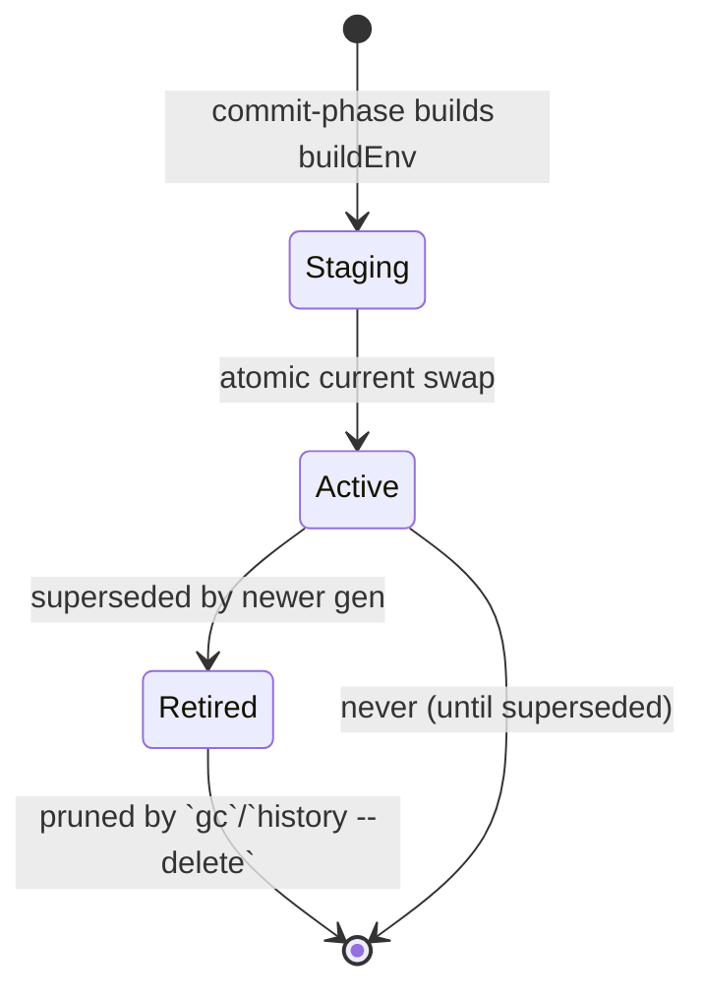

# 05 — State, Locks, Generations, GC

> Owner: execution track. **Planning only**; no Rust code. Cross-references by
> number; see [Dependencies](#dependencies-on-other-plans).

## 1. Purpose

Define the **authoritative state model** the product owns and operates on.
Because the product hides Nix, **Rust-owned state is the source of truth**;
the Nix profile/store is a materialization that we rebuild from this state.
This document specifies:

- State directory layout and ownership.
- Exact schema (versioned) for: desired state, lock, generation manifest,
  channel cache, journal/leases.
- User-intent selector vs realized identity (canonical definition, referenced
  by plan 04).
- Mixed Nixpkgs revisions during selective upgrades.
- Generations, the atomic `current` swap, GC roots.
- Operation leases and the append-only journal that drive crash recovery.
- Migrations, corruption detection, and recovery procedures.

## 2. Scope / Non-scope

**In scope**

- All on-disk state the pipeline (plan 04) reads/writes.
- Schema, versioning, migrations, integrity (checksums/fsync).
- Concurrency model (leases), recovery model (journal).
- GC root topology and how `gc` interacts with generations.

**Non-scope**

- *What* gets resolved/built and *how* (plan 04).
- *Where* the Nix store/daemon live and privilege (plan 07).
- CLI verbs that surface this state (`history`, `rollback`, `gc`, `list`)
  (plan 06), though their semantics are defined here.
- Signing of the channel descriptor (plan 02) and the search index (plan 03).

## 3. Invariants

| # | Invariant | How enforced |
|---|-----------|--------------|
| I1 | **Rust state is authoritative.** Nix profile contents are derived; the product never reads Nix profile state as ground truth. | Activation writes both; recovery rebuilds activation from manifest, never the reverse. |
| I2 | Every persisted file is **fsynced before the pointer to it is renamed**, and carries a checksum + schema version. | Write-temp → fsync → atomic rename; `sha256` footer / sidecar. |
| I3 | At most one mutating operation runs at a time; readers are non-blocking. | Lease via `flock` on `state/run/lease` + pid/nonce in the lease record. |
| I4 | A committed generation is **immutable and content-addressed by its manifest hash**. | Manifest written once under `generations/<id>.json`; never edited. |
| I5 | Every active generation's activation store path has a live GC root for the lifetime of that generation — and the root is created **before** `current` is switched to it. | The generation transaction (§8.4) creates `/nix/var/nix/gcroots/pkg/users/<uid>/gen-<id>` (§8.3) at the **rooted** step, *before* the atomic `current` swap (the **activated** step); the operation lease (§12) protects the staged path only during stage→rooted, after which the root protects it durably (so the swap never lands on an unrooted tree). Pruning removes roots only when the generation is deleted. |
| I6 | `current` is **always a valid symlink** to an activated generation's store path, or absent (pre-first-install). | Atomic `symlink`+`rename`; never unlink-then-recreate. |
| I7 | The journal is **append-only** and **self-describing**; any prefix is recoverable. | Each row carries opId, phase, status, prev/next state hashes, ts. |

## 4. Directory layout

> **Two roots (D-17/INV-10).** (a) A **root-owned, machine-global service root**
> `/var/lib/pkg/` holds the immutable runtime/channel/index/source/cache/log service
> (shared, read-only to users). (b) A **per-user authoritative root** `<user-state>`,
> keyed by OS uid, holds manifest/lock/generations/current/journal/cache/logs and is
> owned by that uid (mode `0700`):
>   Linux `$XDG_DATA_HOME/pkg/` (default `~/.local/share/pkg/`);
>   macOS `~/Library/Application Support/pkg/`;
>   root-owned fallback `/var/lib/pkg/users/<uid>/` for accounts without a usable HOME.
> Concrete OS paths/permissions are finalized in **plan 07**. Authoritative package
> state is **never** globally shared across users.

```
# (a) machine-global service root — root-owned, shared (D-17)
/var/lib/pkg/
  channel/
    tuf/{root,timestamp,snapshot,targets}*.json  # TUF metadata cache (plan 02)
    descriptor.json           # the currently-trusted channel descriptor; its
                              #   integrity is a TUF TARGET (plan 02 §7) — there
                              #   is NO separate .asc sidecar
    previous/                 # retained previous descriptor(s) for rollback
  index/<channelSeq>/         # disposable search index (plan 03); shared, read-only
  nixpkgs/<rev>/              # pinned catalog source (plan 03); shared
  cache/                      # service downloads (root-owned)
  log/                        # service logs (daemon/helper)

# (b) per-user authoritative root <user-state> — owned by <uid>, mode 0700 (D-17)
<user-state>/
  manifest.json               # what the user wants (selectors + pins) [I1]  (a.k.a. desired state)
  lock.json                   # exact realized identity per selector [I1]
  generations/
    gen-0001.json             # immutable manifest, content-addressed [I4]
    gen-0002.json
    ...
    gen-<id>.staging          # transient symlink to a staged activation tree
  current                     # symlink -> active generation's activation store path [I6]
  run/
    lease                     # flock + lease record (pid, nonce, opId, ts) [I3]
    pid
  journal/
    journal.ndjson            # append-only operation journal [I7]
  logs/
    product.log
    <opId>.ndjson
    <opId>.nix.log
  cache/
    narinfo/                  # optional local narInfo cache (best-effort)

# user prefs ONLY (no trust/substituter keys; INV-03)
$XDG_CONFIG_HOME/pkg/config.toml
```

The **daemon-visible** GC roots live where Nix scans them. On a standard
multi-user install Nix scans `/nix/var/nix/gcroots` (*confirmed* [^gc-roots]).
The product therefore creates, **per user**, symlinks under
`/nix/var/nix/gcroots/pkg/users/<uid>/gen-<id>` → each retained generation's
activation store path. These are created by the authenticated root-helper (the
gcroots tree is root-owned; D-17/ARCH-INV-06); Nix treats any symlink in a
scanned gcroots directory as a root, so **no** `nix-store --add-root` operation
is used (see [^add-root]).

## 5. Schemas (versioned; current `schemaVersion = 1`)

> **Naming authority:** the *canonical shapes* of manifest/lock/generation live in
> **doc 01 §10**; this document owns **migrations, integrity, and the storage contract**
> (doc 00 §7 contract table). Field names are **camelCase** everywhere (matching the
> channel descriptor in doc 02 §7).

Every top-level file begins with `schemaVersion` and ends with a sidecar
`<file>.sha256` containing the sha256 of the file body (excluding the sidecar).
Writers compute the sidecar after fsync; readers verify and refuse on mismatch
(plan 04 §verify applies to internal state too).

### 5.1 `manifest.json` — user intent (a.k.a. desired state)

```jsonc
{
  "schemaVersion": 1,
  "channelSeq": 42,
  "uid": 1001,                          // OS uid this manifest belongs to (D-17)
  "entries": [
    {
      "id": "sel_018f",
      "selector": "ripgrep",            // user intent (D-13)
      "attribute": "ripgrep",           // resolved Nixpkgs attribute (may equal selector)
      "versionPref": { "kind": "any" }, // any | exact | min | range
      "outputs": null,                  // null => meta.outputsToInstall
      "sourceRev": "channel:current",   // channel:current | channel:pinned:<id> | rev:<gitsha>
      "pinned": false,
      "pinnedTo": null,                 // realized.storePath or null
      "addedAt": "2024-08-02T23:14:00Z",
      "origin": "user:install"
    }
  ],
  "pins": [ "sel_018f" ]                // convenience index of pinned selectors
}
```

- `entries[].id` is **stable** for the lifetime of that selector in this
  file; `remove` deletes the entry; `upgrade` may rewrite `sourceRev` but
  keeps `id` (so the lock entry maps cleanly).
- `pinnedTo` non-null ⇒ the selector is pinned (set by `pin`); Resolve
  targets that exact `storePath` (plan 04 §5.1 rule 3).

### 5.2 `lock.json` — realized identity

Keyed by entry `id`. **One selector maps to one or more realized outputs.**
Identity = `storePath`, never `pname@version`.

```jsonc
{
  "schemaVersion": 1,
  "channelSeq": 42,                          // from descriptor (doc 02 §7)
  "system": "x86_64-linux",
  "uid": 1001,                               // OS uid this lock belongs to (D-17)
  "entries": {
    "sel_018f": {
      "attribute": "ripgrep",
      "nixpkgsRev": "abcd1234...deadbeef",          // may differ per entry (§7)
      "realized": {
        "storePath": "/nix/store/a1b2...-ripgrep-14.1.0",
        "deriver":  "/nix/store/9z8y...-ripgrep-14.1.0.drv",
        "outputs": { "out": "...", "man": "..." },
        "outputsToInstall": ["out","man"],
        "system": "x86_64-linux",
        "narHash": "sha256-...",
        "closureNarSize": 4821034,
        "pname": "ripgrep", "version": "14.1.0"
      },
      "lockedAt": "2024-08-02T23:14:05Z",
      "provenance": "cache:cache.nixos.org",         // or "local-build" (Linux/macOS native sandboxed)
      "sigsObserved": ["cache.nixos.org-1:..."]
    }
  }
}
```

**Mixed Nixpkgs revisions are normal.** `upgrade <one>` re-resolves only that
selector against `channelSeq` and updates its `nixpkgsRev`; every other
entry keeps its locked rev. A generation therefore frequently contains outputs
from several Nixpkgs commits — this is sound because every store path is
content-addressed and its closure is self-contained.

### 5.3 Generation manifest — `generations/gen-<id>.json`

Immutable snapshot of an activation. `<id>` is monotonic
(`gen-%04d`), assigned at commit. The file is content-addressed: its
`generationHash` is the sha256 of its canonical JSON (excluding the
`generationHash` field) and is recorded in the journal.

```jsonc
{
  "schemaVersion": 1,
  "uid": 1001,                               // OS uid this generation belongs to (D-17)
  "id": "gen-0042",
  "parent": "gen-0041",                       // previous generation (for history)
  "createdAt": "2024-08-02T23:14:06Z",
  "channelSeq": 42,
  "manifestHash": "sha256-...",              // hash of <user-state>/manifest.json body
  "lockHash": "sha256-...",                   // hash of <user-state>/lock.json body
  "activation": {
    "storePath": "/nix/store/zz99...-pkg-gen-0042",   // buildEnv tree (plan 04 §5.5)
    "builder": "nix-buildenv",
    "buildenvInputs": [ "/nix/store/...-ripgrep-14.1.0", "..." ]
  },
  "outputs": [
    { "id": "sel_018f", "attribute": "ripgrep",
      "nixpkgsRev": "abcd1234...deadbeef",
      "storePath": "/nix/store/a1b2...-ripgrep-14.1.0",
      "deriver":  "/nix/store/9z8y...-ripgrep-14.1.0.drv",
      "outputsToInstall": ["out","man"],
      "narHash": "sha256-...",
      "closureNarSize": 4821034,
      "provenance": "cache:cache.nixos.org",
      "pinned": false }
    /* ...one entry per installed selector... */
  ],
  "collisionPolicy": "abort",
  "operation": { "opId": "op_2024-...-a1", "kind": "install",
                 "approval": { "build": "not_required" } },
  "generationHash": "sha256-..."             // content hash of THIS file (I4)
}
```

A generation is **reproducible**: given `outputs[].storePath`/`narHash` and
`nixpkgsRev`, the product can re-verify (`nix store verify`) or re-acquire any
missing path independently — the basis for `repair` (§10) and for surviving a
Nix store wipe.

### 5.4 `journal.ndjson` — append-only operation log

```jsonc
{ "opId":"op_...","seq":1,"ts":"...","kind":"install",
  "phase":"resolve","status":"started","prevStateHash":"sha256-...",
  "channelSeq":42 }
{ "opId":"op_...","seq":2,"phase":"preflight","status":"ok",
  "reportHash":"sha256-..." }
{ "opId":"op_...","seq":3,"phase":"acquire","status":"ok" }
{ "opId":"op_...","seq":4,"phase":"stage","status":"ok",
  "stagingPath":"/nix/store/...-pkg-gen-0042","generationId":"gen-0042" }
{ "opId":"op_...","seq":5,"phase":"commit","status":"prepared",       // gen-0042.json fsynced
  "generationId":"gen-0042","generationHash":"sha256-..." }
{ "opId":"op_...","seq":6,"phase":"commit","status":"rooted",          // GC root created + dir fsynced
  "generationId":"gen-0042","gcroot":"/nix/var/nix/gcroots/pkg/users/1001/gen-0042" }
{ "opId":"op_...","seq":7,"phase":"activate","status":"activated",     // atomic current swap
  "generationId":"gen-0042" }
{ "opId":"op_...","seq":8,"phase":"commit","status":"committed",       // manifest/lock written + committed row
  "nextStateHash":"sha256-...","generationId":"gen-0042" }

The `prepared`→`rooted`→`activated`→`committed` statuses are the four recovery
distinguishable transaction states (§8.4); recovery scans the tail to identify
the op's state and the filesystem to confirm which durable side-effects landed.
```

`prevStateHash`/`nextStateHash` are sha256 of the *post-commit*
`manifest.json`+`lock.json` bodies, letting recovery detect partial
writes.

### 5.5 Lease record — `run/lease`

```jsonc
{ "opId":"op_...","pid":12345,"nonce":"...","started":"...",
  "host":"...","tty":"..." }
```

Held by an exclusive `flock(LOCK_EX)` on `run/lease` for the duration of a
mutating op. Read-only commands take `LOCK_SH` or none.

## 6. Identity: selector vs realized (canonical)

- **Selector** = intent (attribute + version pref + outputs + source rev +
  optional pin). Lives in `manifest.json`.
- **Realized identity** = exact artifact (`storePath` + deriver + outputs +
  narHash + system + nixpkgsRev). Lives in `lock.json` and the manifest.
- `pname@version` is **display metadata**. The product will render it, search
  by it (plan 03), and use it for `versionPref` checks — but it is **never**
  a unique key. Two attributes can share `pname`; one attribute can ship the
  same `pname@version` from different commits with different hashes.
- `storePath` is unique and content-addressed; it is the join key between
  lock, manifest, GC roots, and the Nix store.

## 7. Selective upgrades with mixed revisions

```mermaid
sequenceDiagram
    autonumber
    participant U as user
    participant P as product
    participant L as lock.json
    participant N as Nixpkgs (pinned)
    Note over L: a@revR1, b@revR1 (after initial install)
    U->>P: update (channel R1 -> R2; plan 02)
    U->>P: upgrade b
    P->>N: resolve b @ channelSeq(R2)
    P->>L: entries[b].nixpkgsRev = R2; realized = new storePath
    Note over L: a@revR1, b@revR2  (mixed, legal)
    U->>P: upgrade --all
    P->>N: resolve a,b @ R2
    P->>L: entries[*].nixpkgsRev = R2
```

Rules:

1. `update` changes `channelSeq` only; it touches no lock entry.
2. `upgrade <sel>` re-resolves exactly that selector at `channelSeq`.
3. `upgrade --all` re-resolves every non-pinned selector at `channelSeq`.
4. Pinned selectors are never touched by `upgrade`/`upgrade --all` unless
   `--bump-pinned` is given (off by default; flagged in plan 12).
5. `outdated` (plan 06) compares each lock entry's realized `storePath`
   against a fresh resolution at `channelSeq` and reports per-selector.

## 8. Generations, `current`, activation

### 8.1 Generation lifecycle



- Creating a generation: pipeline commit (plan 04 §5.7).
- `current` → the active generation's activation `storePath` (a buildEnv store object).
- `history` lists generations with timestamps and operation kind.
- `rollback` (no arg) sets `current` → parent of the active generation;
  `rollback <id>` sets `current` → that generation. Rollback **creates a new
  generation row** referencing the same activation store path (so history is
  linear and monotonic) — mirroring Nix profile rollback semantics
  (*confirmed* [^profile-rollback]) but in Rust-owned state. Rollback uses the
  same generation transaction (§8.4): the new row's GC root is created before
  `current` is repointed.

### 8.2 Atomic `current` swap (the **activated** step)

This swap is the linearization point that makes the new generation live. It is
performed **only after** the generation record is fsynced (**prepared**, §8.4)
and the GC root is created (**rooted**, §8.3/§8.4), so the swap always lands on
a durably-rooted, fully-documented tree. POSIX recipe (no unlink gap):

1. `symlink(<target>, "<user-state>/current.tmp.<nonce>")`
2. `fsync` the directory `<user-state>`
3. `rename("<user-state>/current.tmp.<nonce>", "<user-state>/current")`
4. `fsync` the directory again.

`rename(2)` over an existing symlink is atomic on Linux/macOS. There is never
a window in which `current` is missing. If step 1 succeeds but step 3 fails
(very unlikely), recovery sees `current.tmp.*` detritus and cleans it; the
previous `current` is untouched.

### 8.3 GC roots

- Per active/retained generation: one root
  `/nix/var/nix/gcroots/pkg/users/<uid>/gen-<id>` → activation `storePath`,
  created by the authenticated root-helper as a plain symlink (the gcroots tree
  is root-owned; D-17/ARCH-INV-06). Nix treats any symlink in a scanned gcroots
  directory as a root, so **no** `nix-store --add-root` operation is used (see
  [^add-root]). The root is created at the **rooted** step of the generation
  transaction (§8.4), *before* the `current` swap, so a crash after the swap
  can never leave `current` pointing at an unrooted tree.
- The activation tree's closure transitively roots every installed output's
  closure, so a single root per generation suffices to protect the whole
  profile. (The product additionally roots each top-level output for clarity
  and to survive a damaged activation tree — defense in depth; this also
  protects a generation if the activation tree itself is damaged.)
- Pruning a generation (§9) removes its root; the next `nix store gc`
  reclaims the orphaned closure.

### 8.4 Generation transaction: ordering, crash invariant, recovery states

This section is the **canonical crash-consistency contract** for activating a
generation (referenced by plan 01 §12.2, plan 04 §5.5–§5.7, plan 09 §6.5). The
whole transaction runs under the per-user operation lease (§12), which also
serializes `gc` (§9), so **no `gc` can run mid-transaction** — the lease and
the V1 sole-manager assumption (Q5.1) mean our `gc` is the only collector.

**Crash invariant.** For every per-user activation, at every instant observable
after any crash or forced kill: `current` is either absent (pre-first-install)
or resolves to a store path `P` such that (a) `P`'s entire closure is protected
by a durable GC root `gcroots/pkg/users/<uid>/gen-<id>` → `P`, (b) the immutable
generation record `generations/gen-<id>.json` exists, is fsynced, and records
`activation.storePath = P` with its `outputs[]`, and (c) the `manifest.json`/
`lock.json` current views are consistent with `gen-<id>` (enforced by recovery
using the committed journal row; rebuildable from the `generations/` snapshots,
§11.3). Equivalently: **`current` is never observed pointing at an unrooted,
undocumented, or partially-written tree.** A crash *before* the `current` swap
leaves the previous generation active and the new generation unreachable from
`current` (deletable); a crash *after* the swap always leaves a fully-rooted,
fully-documented active generation needing at most finalization of the current
views and the committed journal marker.

**Transaction ordering** (phase names from plan 04 are illustrative; the
ordering and the four states are normative). Each filesystem step is followed
by the fsyncs needed to make it durable:

1. **stage** — build the `buildEnv` activation tree; store path `P`
   (content-addressed; Nix makes realized store paths durable). `current`
   unchanged. `P` is not yet rooted; the lease protects it from `gc`.
2. **prepared** — write the immutable record `generations/gen-<id>.json`
   (`activation.storePath = P`, `manifestHash`/`lockHash` from the finalized
   in-memory manifest/lock, `outputs[]`, `generationHash`); `fsync` the file;
   `fsync` the `generations/` directory. `current` unchanged. Journal:
   `phase=commit,status=prepared`.
3. **rooted** — create the GC root `gcroots/pkg/users/<uid>/gen-<id>` → `P` as a
   plain symlink via the authenticated root-helper (§8.3; the helper `fsync`s
   the gcroots directory). `P`'s closure is now durably protected, independent
   of the lease. `current` unchanged. Journal: `phase=commit,status=rooted`.
4. **activated** — atomic `current` swap to `P` (§8.2):
   `symlink(current.tmp.<nonce>, P)` → `fsync(<user-state>/)` →
   `rename(..., current)` → `fsync(<user-state>/)`. `current` now resolves to a
   rooted, documented tree. Journal: `phase=activate,status=activated`.
5. write `manifest.json` and `lock.json` (temp → `fsync` file → `rename` →
   `fsync(<user-state>/)` dir) to the finalized content; assert each hashes to
   the value recorded in `gen-<id>.json` (else hand off to recovery).
6. **committed** — append `phase=commit,status=committed` (with
   `nextStateHash`) to `journal/journal.ndjson`; `fsync` the journal file and
   the `journal/` directory.

> The `current` swap (step 4) is the linearization point. Steps 1–3 only
> prepare durable, `current`-invisible state; steps 5–6 only finalize
> bookkeeping once the activation is already correct. The GC root precedes the
> swap so the swap can never land on an unrooted tree — this is strictly safer
> than root-after-swap, which would rely on the lease to bridge an
> activate→root gap and would break `current` if any collector ever ran in that
> window. No verified Nix semantic forbids this ordering: a rooted-but-not-yet-`current`
> path is exactly how Nix retains multiple profile generations, so creating the
> root first is consistent with Nix semantics.

**How `manifest`/`lock` (current views) relate to immutable generation copies.**
`generations/gen-<id>.json` is the immutable, content-addressed, authoritative
snapshot of a generation (its realized `outputs[]`, activation store path, and
the `manifestHash`/`lockHash` of the views it was built from; the matching
manifest/lock bodies are also snapshotted into `generations/` by hash, §11.3).
`manifest.json`/`lock.json` are the mutable *current views* — rewritten each
commit (step 5) to match the now-active generation. They are a **projection**
of the active generation, not independent state: recovery always makes them
consistent with the generation that `current` points to, using the committed
journal row plus the `generations/` snapshots. They are written *after* the
swap (not before) so that a pre-swap crash never leaves the views ahead of
`current`; the only inconsistency a crash can expose is the views lagging
`current`, which is forward-recoverable because `current` is already rooted and
documented.

**Directory-fsync discipline.** POSIX does not make a directory entry durable
until its parent directory is `fsync`'d after the create/rename/unlink/symlink.
The transaction therefore `fsync`s: each new file's fd before renaming it; the
`generations/` dir after writing `gen-<id>.json`; the per-uid gcroots dir after
creating the root (inside the root-helper); the `<user-state>/` dir after the
`current` symlink and again after the `rename`; and the `journal/` dir after
appending the committed row. File-data durability without the directory fsync
is insufficient — a crash can lose the name binding while the bytes persist.

**Recovery states** — detected by scanning the journal tail and the filesystem
(is `gen-<id>.json` present? is the GC root present? does `current` → `P`? is
there a `committed` row for this op?):

| State | `gen-<id>.json` | GC root | `current` | committed row | Recovery action |
|-------|:--:|:--:|:--:|:--:|---|
| **prepared** | ✓ | ✗ | old gen | ✗ | delete `gen-<id>.json`; previous generation stays active |
| **rooted** | ✓ | ✓ | old gen | ✗ | remove the GC root; delete `gen-<id>.json`; previous generation stays active (`P` becomes unrooted, reclaimed by a later `gc`) |
| **activated** | ✓ | ✓ | → `P` | ✗ | new generation is already rooted + documented; finish: write `manifest`/`lock` if stale, then the `committed` row (idempotent forward recovery) |
| **committed** | ✓ | ✓ | → `P` | ✓ | no-op; optionally finalize `manifest`/`lock` if stale |

In the **prepared** and **rooted** states the staged generation is unreachable
from `current`, so deleting its record (and root) is safe and loses no live
activation. In the **activated**/**committed** states `current` already resolves
to a rooted, documented tree, so recovery only finalizes bookkeeping. There is
no state in which `current` points at an unrooted or undocumented tree.

## 9. `gc` semantics

`gc` runs the Nix collector **scoped to the product's roots only is not
possible** — `nix store gc` is global to the store [^nix-gc]. Implications:

- The product's `gc` invokes `nix store gc` (via the daemon). Because the
  product is the **exclusive** manager of this Nix install (plan 07), there
  are no other managers' roots in v1; **per-user** roots under
  `/nix/var/nix/gcroots/pkg/users/<uid>/` are all the product roots (D-17).
- **Generations must be pruned before GC** for their paths to become
  collectable. `gc` therefore:
  1. Determines the protected set = active generation + generations within the
     retention window (`gc.keep_generations`, default 10) and
     `gc.max_age_days` (default 30).
  2. Deletes the manifests + removes GC roots for generations outside the
     window (except the active one is never pruned).
  3. Runs `nix store gc`.
- `gc --dry-run` prints what would be pruned and the estimated reclaimed bytes
  without removing anything.
- `gc` requires the lease (§5.5); concurrent install is refused with
  `STATE_LOCKED` (exit 72).
- Nix's own `nix-collect-garbage -d` also removes *profile* generations — but
  the product does **not** use Nix profiles as state (I1), so this is a no-op
  for us; we never call it. Cite: profile-based GC is Nix-specific and not
  used here [^profile-gc].

## 10. `repair` semantics

`repair` brings the active generation (or a named one) back to a verified,
complete state:

1. Load the manifest; for each output, run `nix store verify --recursive`.
   Record any failed/missing path. (Trust-mode specifics for the pinned runtime
   are pinned for the chosen managed Nix runtime and validated by the
   Fake↔Real parity job — doc 09 §4.3; doc 01 §11 / doc 00 §11 SPK-02, not a
   standalone spike.)
2. For missing paths (e.g. after a store wipe) re-acquire from the substituter
   using the manifest's `storePath`/`narHash`/`nixpkgsRev` (plan 04
   acquire). For corrupt paths, Nix provides `nix store verify --repair`
   (*confirmed* [^store-verify]) which re-downloads/rebuilds.
3. Rebuild the activation tree if any output changed; if the store path changed,
   re-root the new path and only then swap `current` atomically (same
   root-before-swap discipline as §8.4); idempotent otherwise.
4. Append a `repair` op to the journal; never weaken the active generation.

`repair` never deletes user state; worst case it reports paths it cannot
re-acquire (e.g., removed upstream) and exits non-zero.

## 11. Corruption detection & recovery

### 11.1 Detection

- On every startup and before every mutating op: verify all sidecar checksums;
  verify `current` is a valid symlink to an existing store path; verify the
  active generation's `generationHash` recomputes; verify the journal tail's
  `nextStateHash` matches current `manifest`+`lock` (if a `committed`
  row is the tail).
- If `current` points to a missing store path (e.g., user manually deleted
  it): the product refuses mutating ops and points the user to `pkg repair` or
  `pkg rollback`.

### 11.2 Recovery flows

| Symptom | Detection | Recovery |
|---------|-----------|----------|
| Truncated `manifest.json` (no valid checksum) | sidecar mismatch | restore from last `committed` journal row: re-materialize desired state from the generation manifest's `manifestHash` snapshot kept in `generations/`. If unavailable, refuse with manual instructions. |
| `current` symlink broken | startup check | pick the most recent *intact* generation, atomically repoint `current`, log `RecoveryNotice`. |
| Unfinished op in journal tail (no `committed`/`aborted`) | journal scan | recover by transaction state (§8.4): **prepared** → delete `gen-<id>.json`; **rooted** → remove GC root + delete `gen-<id>.json`; **activated** → finish `manifest`/`lock` + `committed` row (forward). Previous gen stays active in the first two; the new (rooted, documented) gen stays active in the third. |
| Manifest missing for the active generation | startup check | refuse; require `repair --from-lock` (rebuild manifest from lock + store reality). |
| Checksum mismatch on a manifest | sidecar | quarantine file; refuse ops; `repair`. |
| Two ops raced (shouldn't, due to lease) | lease nonce check | second op exits 72. |

### 11.3 Backups

- The previous N generations of `manifest.json`/`lock.json` are snapshotted
  into `generations/` as part of each manifest (by hash), giving point-in-time
  recovery without a separate backup mechanism.
- The product does **not** auto-copy state off-host (deferred; plan 12).

## 12. Concurrency & leases

- Mutating ops acquire an exclusive lease (`flock LOCK_EX` on `run/lease`).
  Lease record includes pid+nonce+opId; on start the holder writes its pidfile
  `run/pid`.
- Read-only ops (`list`, `info`, `history`, `outdated`) take `LOCK_SH` (or read
  a snapshot) so they don't block on a long install but see a consistent
  pre-op or post-op state (never a half-written one, thanks to atomic rename).
- Stale lease: if the holder pid is not alive (`kill(pid,0)`), the lease is
  considered abandoned; the next op rewrites it (after verifying no live
  Nix subprocess for the dead op via the journal). To be safe, the product
  also refuses to steal a lease younger than `lease_min_age` (default 60s).
- `doctor` (plan 06) reports lease state and can `--force-release` (requires
  confirmation; logs a SECURITY event).

## 13. Failure matrix (selected)

| Scenario | Outcome |
|----------|---------|
| Crash during the generation transaction (§8.4) | Resume on next start; recovery acts by state — **prepared**/**rooted** discard the unreachable staged generation (prev gen active); **activated** finalizes `manifest`/`lock` + the `committed` row (new gen already rooted + documented). |
| Crash during `current` rename | `current.tmp.*` cleaned; previous `current` intact. |
| Disk full mid-write | Temp file discarded; previous state intact; exit 65. |
| Concurrent `install` + `gc` | `gc` blocked by lease or itself takes the lease; refusable. |
| `nix store gc` ran externally (root) | Since product is sole manager in v1, this is unexpected; `doctor` warns. Paths rooted by product survive. |
| Corrupt `lock.json` sidecar | Refuse mutating ops; `repair --from-manifest <gen-id>`. |
| Pinned path was GC'd by external action | `install`/`upgrade` of that selector reports it; suggests `unpin` then resolve. |

## 14. Security considerations (full model: plan 08)

- State dir owned by an admin/product user with `0750`; files `0640`; the
  lease/journal writable only by the product. No world-writable paths.
- **No privilege via state:** the product never `setuid`s; elevation is via
  the daemon/helper in plan 07.
- **Tamper-evidence:** checksums detect edits; the journal is append-only and
  also checksummed per record (Merkle-style chain optional — see Q5.2).
- **Rollback attack surface:** rolling back to an old generation with known
  vulnerabilities is a user choice; `outdated`/`doctor` flag vulnerable pinned
  outputs. Channel rollback protection is in plan 02.
- **Logs:** no secrets (only public keys); op logs may contain attribute names
  (considered user data).

## 15. Dependencies on other plans

- **plan 00** — product decisions (multi-user authoritative state per D-17; retention defaults).
- **plan 01** — where the state module sits in the layering.
- **plan 02** — channel descriptor consumed as `channelSeq`; signing.
- **plan 03** — disposable index lives under `/var/lib/pkg/index/<channelSeq>/`
  (root-owned, shared, read-only; doc 03 §7), **not** under per-user `<user-state>`.
- **plan 04** — the pipeline that writes generations/lock/journal; §5–10 here
  are its storage contract.
- **plan 06** — `list`/`history`/`rollback`/`gc`/`repair`/`outdated` CLI that
  surface this state.
- **plan 07** — concrete paths, ownership, daemon, GC root topology.
- **plans 08–10** — corruption fault-injection tests, release ops, retention
  policy governance.

## 16. PR-shaped implementation checkpoints

- **PR-S1 — State module skeleton + checksummed read/write.** Atomic
  temp+fsync+rename, sidecar sha256, schemaVersion checks. *Acceptance:*
  kill -9 mid-write leaves prior file intact; sidecar mismatch → clear error.
- **PR-S2 — Desired-state & lock schemas + migrations.** v1 schemas, migration
  registry, `from_v0`/`to_v1` hooks. *Acceptance:* golden round-trip tests;
  migration test from a v0 fixture.
- **PR-S3 — Generation manifests + `current` swap + transaction ordering.**
  Immutable manifests, monotonic ids, atomic symlink recipe, and the §8.4
  generation-transaction ordering (prepared→rooted→activated→committed; root
  before swap, committed marker after). *Acceptance:* `current` always valid
  under crash injection at each of the four transaction states; the GC root
  always exists before `current` switches to a new tree.
- **PR-S4 — Lease + journal.** flock lease, append-only NDJSON, recovery scan.
  *Acceptance:* two concurrent installs → second gets 72; crash injection at
  each transaction state (§8.4) → correct resume/abort.
- **PR-S5 — GC roots + `gc`/`gc --dry-run`.** gcroot-symlink topology (per-user under `/nix/var/nix/gcroots/pkg/users/<uid>/`), retention
  pruning, `nix store gc` invocation. *Acceptance:* dry-run byte estimate
  within tolerance; no protected generation's path is ever collected.
- **PR-S6 — `repair`.** verify + re-acquire + rebuild-tree. *Acceptance:*
  delete one output's store path → `repair` restores active gen to verified.
- **PR-S7 — Corruption detection & recovery.** startup checks, recovery
  flows table implemented. *Acceptance:* each row of §11.2 has a test.

## 17. Testable acceptance criteria

1. After any kill -9 during a mutating op, on next start either the op
   completes or is marked aborted, and `current` resolves to a valid store
   path of an intact generation whose closure is GC-rooted.
2. `pkg history` lists generations in chronological order with the active one
  marked; `pkg rollback` makes the previous one active by creating a new
  monotonic generation row (history stays linear).
3. `pkg gc --dry-run` does not remove any path; `pkg gc` removes only paths
  outside the retention window and never the active generation's closure.
4. Mixed-rev lock: after the §7 scenario, `lock.json` shows different
   `nixpkgsRev` per entry and the active generation activates and verifies.
5. Deleting the store path of one installed output, then `pkg repair`,
   restores it from the substituter and leaves the active generation verified.
6. Sidecar checksum tampering of any state file is detected on next startup
   and reported with the offending file.
7. A concurrent second mutating op exits 72 and does not modify state.
8. `current` is never observed missing or dangling during a 1000-iteration
   random crash-injection test (acceptance gate; fault lane in plan 09).
9. Rolling back to a generation whose outputs include a path with known
   vulnerabilities triggers a `doctor`/`outdated` warning (integration with
   plan 03/06).
10. In the generation transaction (§8.4), a crash *after* the `current` swap
    always leaves `current` pointing at a tree whose closure is GC-rooted and
    whose `gen-<id>.json` is present and fsynced; a crash *before* the swap
    leaves the previous generation active with the staged generation/root
    unreachable from `current` and deletable by recovery. (Drives the doc 09
    §6.5 fault rows and AC-T9.)

## 18. Unresolved questions / spikes

- **Q5.1 GC scope.** Confirm v1 is sole-manager so `nix store gc` global is
  acceptable; else design a root-quarantine scheme (move unmanaged roots into
  a protected subdir). *(Default: sole-manager in v1; per-user roots under
  `/nix/var/nix/gcroots/pkg/users/<uid>/` are all product roots per D-17.)*
- **Q5.2 Journal chain.** Append-only NDJSON is enough for recovery; do we
  also want a hash chain (each row referencing prior row's hash) for stronger
  tamper-evidence? *(Default: simple per-row checksum now; chain later if
  plan 08 calls for it.)*
- **Q5.3 Per-user vs shared profile (RESOLVED → D-17).** Authoritative package state is per-user, keyed by uid (`<user-state>`); the runtime/channel/index/store service is root-owned and shared. The schema carries a `uid` dimension; each user has an independent `current`/generations tree.
- **Q5.4 Retention defaults.** `keep_generations=10`, `max_age_days=30` are
  guesses; confirm with UX (plan 06) and disk-budget reality.
- **Q5.5 `repair --from-lock`** rebuild manifest from lock+store when the
  manifest is gone — define exact trust rules (do we trust the lock file alone
  if its sidecar is also gone?). *(Default: require at least the active
  generation's manifest hash from the journal; else refuse.)*

## 19. Sources (current Nix behavior)

[^gc-roots]: Garbage collector roots, Nix Reference Manual, "Garbage
Collector" → https://nixos.org/manual/nix/stable/package-management/garbage-collection.html
[^nix-gc]: `nix store gc` (new CLI; `nix-store --gc` legacy equivalent), Nix Reference Manual →
https://nixos.org/manual/nix/stable/command-ref/nix-store.html#operation---gc
[^add-root]: `--add-root` is an **option** on `nix-store` operations
(`--realise`/`--install`/…), **not** a standalone subcommand and **not** the
mechanism `pkg` uses to register an already-realized path. `pkg` creates GC
roots by placing a symlink directly in the daemon's scanned gcroots directory
(`/nix/var/nix/gcroots/pkg/users/<uid>/`); Nix treats any symlink in a scanned
gcroots directory as a root. → https://nixos.org/manual/nix/stable/command-ref/nix-store.html#opt-add-root ;
garbage-collection roots → https://nixos.org/manual/nix/stable/package-management/garbage-collection.html
[^profile-rollback]: Profile generations / rollback, Nix Reference Manual →
https://nixos.org/manual/nix/stable/command-ref/files/profiles.html
[^profile-gc]: `nix-collect-garbage`, Nix Reference Manual →
https://nixos.org/manual/nix/stable/command-ref/nix-collect-garbage.html
[^store-verify]: `nix store verify --repair`, Nix Reference Manual →
https://nixos.org/manual/nix/stable/command-ref/new-cli/nix3-store-verify.html
