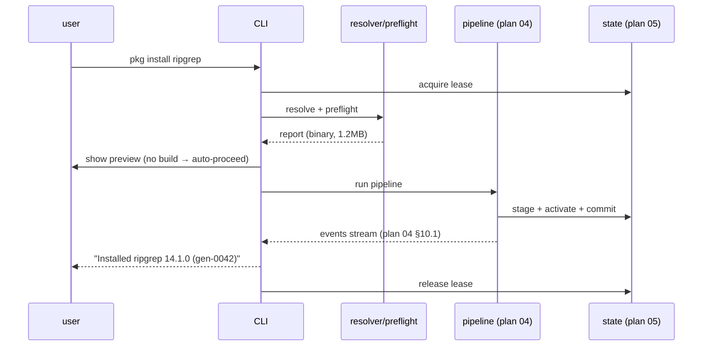
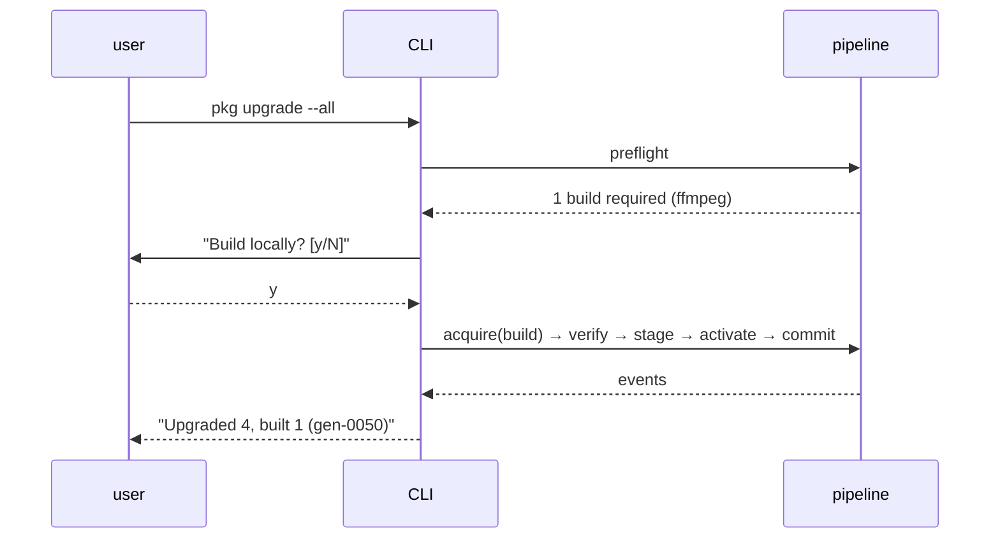

# 06 — CLI & User Experience

> Owner: execution track. **Planning only**; no Rust code.

## 1. Purpose

Define the **complete user-facing command surface** and the UX contracts
(human + machine output, progress, prompts, approvals, exit codes, completion)
for the product. The feel target is familiar **brew/paru**: short verbs,
human defaults, a clean `--json` mode for scripting, and a hidden Nix that the
user never types.

This plan defines the **exact behavior, flags, outputs, and exit codes** of
every verb the brief requires: `doctor`, `search`, `info`, `install`,
`remove`, `list`, `outdated`, `update`, `upgrade` (one & all), `pin`,
`unpin`, `history`, `rollback`, `gc`, `repair`, `completion`. It also defines
global flags, output formats, progress events, and the approval model.

## 2. Scope / Non-scope

**In scope**

- Verb inventory, flag grammar, semantics, and example outputs.
- Output formats: human (default) and machine (`--json` / `--jsonl`).
- Progress event protocol surfaced to the user/TUI.
- Approval prompts (build, remove, collisions, destructive ops).
- Shell completion generation.
- Error/exit-code mapping to plan 04's table.

**Non-scope**

- The mechanics of resolution/build/state (plans 04, 05).
- Trust/channel/index internals (plans 02, 03).
- Installer/daemon/PATH (plan 07).
- Threat model / test lanes (plans 08, 09).

## 3. Design principles

1. **Familiar verbs, no Nix vocabulary.** No "derivations", "profiles",
   "flakes", "channels", "overlays", "substituters" in default output. Use
   "package", "install", "generation", "cache", "build".
2. **Progress is structured first, rendered second.** Every long op emits the
   plan-04 NDJSON event stream; the human renderer is one consumer. Scripting
   via `--json` is first-class and stable.
3. **Fail closed, fail loudly.** Ambiguous input, unmanaged Nix (plan 07), or
   unsafe operations refuse with explicit remediation text.
4. **Non-destructive by default.** Anything that removes state or paths
   requires confirmation unless `--yes` is set. The previous generation is
   always recoverable via `rollback`.
5. **Offline-friendly.** Read-only verbs (`list`, `info` cached, `history`,
   `rollback`) work offline. `search`/`outdated`/`update` need the network and
   say so.

## 4. Global flags & environment

```
pkg [--json | --jsonl | --quiet | --verbose] [--no-color] [--config <path>]
    [--state <dir>] [--profile <name>] [--yes] [--dry-run] [--debug]
    <command> [args...]
```

| Flag | Effect |
|------|--------|
| `--json` | Emit a single JSON document per command (stable schema). |
| `--jsonl` | Emit NDJSON (event stream for long ops; records for tabular). |
| `--quiet` | Suppress progress UI; still print final result line. |
| `--verbose` | Include phase details and Nix log excerpts on errors. |
| `--no-color` | Disable ANSI. Auto-off when not a TTY. |
| `--config <path>` | Override `config.toml` location. |
| `--state <dir>` | Override state root (plan 05). Mainly for tests. |
| `--profile <name>` | Select among the invoking user's own profiles (v1: only `default`; authoritative state is per-user keyed by uid per D-17 — `--profile` does not cross users). |
| `--yes` | Assume "yes" to confirmations **except** first-time local-build approval which still prompts unless `PKG_YES_TO_BUILDS=1`. |
| `--dry-run` | Run preflight only; print the plan; change nothing. |
| `--debug` | Internal: dump subprocess argv, journal ops, keep staging. |

Env vars: `NO_COLOR`, `PKG_YES_TO_BUILDS`, `PKG_STATE_DIR`, `PKG_CONFIG`,
`PKG_CACHE_TTL_SECONDS`. The product **ignores** Nix env overrides
(`NIX_SUBSTITUTERS`, `NIX_TRUSTED_PUBLIC_KEYS`, `NIX_PATH`, `NIX_REMOTE`,
`FLAKE_*`) — trust is channel-locked (plan 02); `pkg doctor` flags any that
are set.

## 5. Output formats

### 5.1 Human (default)

- Tables for `list`, `outdated`, `search`, `history`. Color: headers dim,
  package names bold, warnings yellow, errors red, success green.
- A single-line progress bar for downloads/builds; multi-line for parallel
  builds with `--verbose`.
- Errors: `error[<SYMBOL>]: <message>` + a `hint:` line + `see: pkg <verb>
  --help` when relevant.

### 5.2 `--json` (stable, versioned)

Each command ships a `{"schemaVersion":1, ...}` document. Example
`install --json` final result:

```jsonc
{ "schemaVersion":1, "ok":true, "command":"install",
  "generation":{"id":"gen-0042","parent":"gen-0041"},
  "added":[{"attribute":"ripgrep","storePath":"...","version":"14.1.0"}],
  "events":[/* full NDJSON if --jsonl merged */] }
```

On error:

```jsonc
{ "schemaVersion":1, "ok":false, "command":"install",
  "error":{"symbol":"BUILD_FAILED","code":69,
           "message":"ffmpeg-6.1 build failed","hint":"see logs/<opId>.nix.log"},
  "generation":{"active":"gen-0041","unchanged":true} }
```

### 5.3 Progress event protocol (from plan 04 §10.1)

`--jsonl` streams the plan-04 events verbatim. The TUI subscribes to the same
stream. Events are additive and idempotent to replay.

## 6. Command reference

> Exit codes reference plan 04 §10.3. "Mutating" verbs take the state lease
> (plan 05 §12).

### 6.1 `pkg doctor`

**Purpose:** environment + trust + store + daemon health; the first command
new users run. Non-mutating.

**Checks:**
- Architecture & OS detection (plan 07): maps to a Nix `system`
  (`x86_64-linux`, `aarch64-linux`, `x86_64-darwin`, `aarch64-darwin`).
- Bundled Nix runtime present & version matches descriptor (plan 02/07).
- Daemon reachable (Unix socket) and responding to `nix ping-store`
  (*confirmed* [^ping-store]).
- Store prefix is `/nix/store` and writable by the daemon; free space.
- **Unmanaged-Nix detection** (plan 07): any pre-existing
  `/nix`, `nix` on PATH, `~/.nix-profile`, `/nix/var/nix`, launchd/plist,
  systemd unit, or `NIX_*` env → **refuse to proceed beyond doctor** with
  manual remediation text. V1 never auto-removes (plan 00).
- Channel descriptor present, signed, not expired (plan 02); offer `pkg update`
  if stale.
- Index present and fresh enough (plan 03).
- `current` symlink valid; active generation verifies (plan 05).
- Lease state; leftover `current.tmp.*` detritus; leftover staging roots.
- Substituter reachability to `cache.nixos.org` (HEAD request).
- Forbidden Nix env vars set.

**Output:** a checklist `[✓]/[x]/[!]` plus an overall status. `--json`
returns `{schemaVersion, checks:[{id,status,detail,hint}], overall}`.

**Exit:** 0 if all pass; 78 `CONFIG` for fixable config issues; 74
`UNMANAGED_NIX` if unmanaged Nix is detected.

### 6.2 `pkg search <query>`

**Purpose:** fuzzy/keyword search over the disposable index (plan 03).
Non-mutating, network needed if index stale (then refreshes).

**Flags:** `--limit N` (default 25), `--channel <id>`, `--json`,
`--exact`, `--category <cat>`, `--license <spdx>`.

**Human:** table of `name | version | description | license`. Selecting an
entry is copy-paste of `name` (the attribute) to `pkg info`/`install`.

**Note:** search uses the **disposable derived index**, which is not the
identity source — `install` re-evaluates the pinned Nixpkgs (plan 04). Search
results include the resolved `attribute` and a `stale` flag if the index lags
the channel.

**Exit:** 0; 66 `ACQUIRE_NETWORK` if offline and no index; 64 on bad query.

### 6.3 `pkg info <pkg...>`

**Purpose:** show metadata for one or more attributes. Pulls from the index
for speed; `--realize` resolves the exact derivation (network/eval).

**Output fields:** attribute, pname, version, homepage, license(s),
description, outputs + `outputsToInstall`, closure size (if realized),
availability per supported `system` (from index), known vulnerabilities,
whether already installed (and pinned), source rev.

**Exit:** 0; 64 `RESOLVE_NOT_FOUND` if attribute absent in pinned Nixpkgs.

### 6.4 `pkg install <pkg...> [flags]`

**Purpose:** add packages to desired state and activate a new generation. Full
plan-04 pipeline.

**Flags:**
- `--with-outputs out,lib` per-package (multi-output, plan 04 §12.1).
- `--on-collision abort|keep-first|keep-last|keep-all` (default `abort`).
- `--yes`, `--dry-run`, `--json`/`--jsonl`, `--keep-going`.
- `--channel <id>` to install from a non-current pinned channel (still signed).
- `--max-jobs`, `--cores` (override build resources; Linux).

**Flow:** resolve → preflight → [approval gate if builds] → acquire → verify
→ stage → activate → commit. On any failure the previous generation stays
active (plan 04 I1).

**Human preview** (preflight, before approval):

```
Resolving 3 packages... ok
  + ripgrep  14.1.0     closure 4.8 MB   download 1.2 MB   binary ✓
  + fd       10.1.0     closure 2.1 MB   download 0.6 MB   binary ✓
  + ffmpeg   6.1        closure 320 MB   BUILD required   est. 8–14 min
New downloads 1.8 MB · new disk 327 MB · free 9.0 GB
ffmpeg has no signed binary for x86_64-linux. Build locally (sandboxed)? [y/N]
```

**Exit:** 0 on success; see plan 04 table (64–76).

### 6.5 `pkg remove <pkg...> [flags]`

**Purpose:** drop selectors from desired state; rebuild generation without
them. Confirm before activation (default). `--yes` skips.

**Special:** removing a package that others depend on at runtime is *not*
modeled (Nix has no runtime dep graph between top-level packages); the product
warns if the removed package provided binaries referenced by others' `bin`
names (best-effort via closure file index). `--orphan-check` lists now-unused
dependencies' closures that GC will reclaim.

**Exit:** 0; 64 if not installed; 72 if locked.

### 6.6 `pkg list [flags]`

**Purpose:** show installed packages from the active generation (plan 05).
Non-mutating; offline.

**Flags:** `--json`, `--name-only`, `--with-outputs`, `--size` (closure
bytes), `--pinned`, `--outdated` (combine with lock+channel compare).

**Output:** table `name | version | pinned | source | size`. `--json` returns
the `outputs[]` array from the active manifest.

**Exit:** 0; 73 `STATE_CORRUPT` if active generation fails to load.

### 6.7 `pkg outdated [flags]`

**Purpose:** compare the lock (plan 05) against `channelSeq`. Non-mutating
but needs network to refresh channel/index if stale.

**Output:** table `name | current | available | pinned | kind`. `kind` ∈
`patch|minor|major|rev-only` (heuristic from `version` diff; rev-only when
versions equal but `nixpkgsRev` differs).

**Exit:** 0 (even if outdated) — exit nonzero only on failure; CI tip:
`pkg outdated --json | jq '.entries|length'`.

### 6.8 `pkg update [flags]`

**Purpose:** refresh **metadata only**: fetch & verify the new signed channel
descriptor (plan 02) and refresh the disposable index (plan 03). **Does not
change installed packages.** Updates `channelSeq` in state.

**Flags:** `--check` (dry: report what would change), `--force` (re-download
even if fresh), `--json`.

**Human:** "Channel updated to v1.2/d2024-08-02. 0 packages changed. Run
`pkg upgrade --all` to apply."

**Exit:** 0; 66 offline; 70 `VERIFY_FAIL` if descriptor signature invalid
(never apply).

### 6.9 `pkg upgrade [<pkg...> | --all] [flags]`

**Purpose:** re-resolve and activate newer versions.

- `pkg upgrade <pkg...>` — selective (plan 05 §7): only the named selectors,
  each at `channelSeq`. Pinned selectors skipped unless `--bump-pinned`.
- `pkg upgrade --all` — every non-pinned selector at `channelSeq`.
- No argument = error (avoid foot-gun) unless `PKG_UPGRADE_DEFAULT=all` is set.

**Flags:** same as `install` plus `--bump-pinned`, `--no-build` (refuse if any
target needs a build), `--include-removed-upstream` (handle attr removal:
report and skip by default).

**Preview:** per-target before/after `version`, download/build summary, total
disk delta. Approval gate as in `install`.

**Exit:** 0; 64 if a named selector isn't installed; plan-04 codes otherwise.

### 6.10 `pkg pin <pkg...>` / `pkg unpin <pkg...>`

**Purpose:** freeze a selector to its current realized identity (plan 05 §5.1).

- `pin` sets `pinnedTo = realized.storePath`; subsequent `upgrade`/`update`
  never move it. Records a `pin` journal op + new generation (so history
  reflects the intent change) but the *activated tree* is byte-identical.
- `unpin` clears `pinnedTo`; next `upgrade` may move it.

**Flags:** `--json`, `--yes`.

**Exit:** 0; 64 if not installed.

### 6.11 `pkg history [flags]`

**Purpose:** list generations (plan 05). Non-mutating; offline.

**Output:** table `gen | created | kind | changes | active`. `changes` =
`+3 ~1 -0` summary derived by diffing manifests. `--diff <a> <b>` shows the
attribute/store-path delta between two generations. `--delete <id>` prunes a
non-active generation (frees its GC root; requires `--yes`).

**Exit:** 0; 64 if id unknown.

### 6.12 `pkg rollback [<id>] [flags]`

**Purpose:** switch `current` to a prior generation by creating a new
monotonic generation row that references the same activation store path
(plan 05 §8.1).

- No arg → parent of active.
- `<id>` → that generation (must exist & verify).

**Output:** " Rolled back to gen-0040 (active gen-0043). Run `pkg rollback`
again to return."

**Exit:** 0; 64 if id missing; 73 if that generation's store path is missing
(suggest `repair`).

### 6.13 `pkg gc [flags]`

**Purpose:** prune old generations and run the Nix collector (plan 05 §9).

**Flags:** `--dry-run`, `--keep-generations N`, `--max-age-days N`,
`--json`, `--yes`. Defaults from config (`gc.keep_generations=10`,
`gc.max_age_days=30`).

**Safety:** never prunes the active generation; requires the lease; prints the
list of generations to prune and the byte estimate before acting (unless
`--yes`).

**Exit:** 0; 72 if locked; 77 if it cannot reach the daemon for `nix store gc`
(plan 05 §9).

### 6.14 `pkg repair [<id>] [flags]`

**Purpose:** verify and restore the active (or named) generation (plan 05 §10).

**Flags:** `--from-manifest <id>`, `--verify-only` (no re-acquire), `--json`.

**Output:** per-output verify status, re-acquired paths, final state.

**Exit:** 0 if repaired/verified; 70 if a path can't be re-acquired (e.g.
removed upstream) and `--verify-only` is off.

### 6.15 `pkg completion <shell>`

**Purpose:** emit shell completion script. Supports `bash`, `zsh`, `fish`,
`powershell` (via the CLI framework's completion engine). Output is static
for the verb/flag grammar; dynamic attribute completion is **not** provided in
v1 (it would require evaluating Nixpkgs per keystroke — too slow); a future
`pkg __complete` helper may index recently-installed + index-top-N attributes.

**Exit:** 0; 64 for unknown shell.

## 7. Approval & confirmation model

| Trigger | Default prompt | `--yes` | Force env |
|---------|----------------|---------|-----------|
| First-time local build (Linux) | required | still prompts | `PKG_YES_TO_BUILDS=1` skips |
| Subsequent builds same session | required | skips | as above |
| `remove` | required | skips | — |
| `gc` (destructive) | required | skips | — |
| `rollback` | none (safe) | n/a | — |
| `upgrade --all` | required | skips | — |
| Collision `keep-all` | requires `--force` | n/a | — |

Approvals are **per-operation**, recorded in the journal (plan 05 §5.4) with
policy version + timestamp. No approval persists across runs by default.

## 8. Interactive vs non-interactive

- `stdin` not a TTY (or `--yes`) → non-interactive: prompts that would block
  become safe refusals with the relevant exit code (e.g., unapproved build →
  68). This makes CI safe.
- The TUI (full-screen progress) is opt-in via `--tui` in a later release;
  v1 uses inline rendering. (Plan 06 v1 scope: inline only.)

## 9. Cancellation UX

- `Ctrl-C`/`SIGINT`: print "Cancelling…" trap, forward to Nix subprocess
  group, wait grace period, exit 75 `CANCELLED`. State unchanged (plan 04 §9).
- Second `Ctrl-C`: hard cancel (`SIGKILL` to subprocess), still exit 75, still
  no state mutation.
- `SIGTERM`: same as a single Ctrl-C.

## 10. Error rendering & remediation

Every error carries a `hint`. Examples:

- `error[UNMANAGED_NIX]: an existing Nix installation was detected at /nix.`
  `hint: V1 manages its own Nix exclusively. To proceed, remove the existing
  Nix manually (see <docs URL>) or set up on a clean machine. The product will
  not remove it for you.`
- `error[ACQUIRE_NO_BINARY]: no signed binary for aarch64-darwin for ffmpeg.`
  `hint: macOS is binary-only in v1. See `pkg info ffmpeg --realize`.` `
- `error[STAGE_COLLISION]: bin/rg provided by ripgrep and ripgrep-nightly.`
  `hint: pass --on-collision=keep-first or remove one of them.`

## 11. Exit-code summary (from plan 04 §10.3)

Mapped to verbs:

| Code | Symbol | Typical verbs |
|------|--------|---------------|
| 0 | OK | all |
| 2 | USAGE | all (bad flags) |
| 64 | RESOLVE_* | install, upgrade, info, pin |
| 65 | PREFLIGHT_FAIL | install, upgrade |
| 66 | ACQUIRE_NETWORK | install, upgrade, update, search, outdated |
| 67 | ACQUIRE_NO_BINARY | install, upgrade (macOS) |
| 68 | ACQUIRE_NEEDS_APPROVAL | install, upgrade (Linux build, no --yes) |
| 69 | BUILD_FAILED | install, upgrade (Linux) |
| 70 | VERIFY_FAIL | install, upgrade, repair, update |
| 71 | STAGE_COLLISION | install, upgrade |
| 72 | STATE_LOCKED | mutating verbs |
| 73 | STATE_CORRUPT | all |
| 74 | UNMANAGED_NIX | doctor, all mutating |
| 75 | CANCELLED | long ops |
| 76 | PARTIAL_FAILURE | install/upgrade --keep-going |
| 77 | PERMISSION | gc, anything needing daemon |
| 78 | CONFIG | doctor |

## 12. Accessibility & i18n

- v1 English only; strings externalized so a later release can localize.
- No information by color alone: symbols (`✓/✗/!`) and words accompany color.
- Machine output (`--json`) is the accessibility/scripting escape hatch.

## 13. Sequences

### 13.1 `install` interactive happy path



### 13.2 `upgrade --all` with a build



## 14. Failure matrix (CLI-specific)

| Scenario | Verb behavior |
|----------|---------------|
| Unmanaged Nix present | All mutating verbs + `doctor` exit 74 with remediation. |
| Offline, `install` cache hit | Works (binary in store already). |
| Offline, `install` cache miss | Exit 66 with hint to retry online. |
| Non-TTY, build required, no `--yes`/env | Exit 68 (safe refusal). |
| `upgrade` names a removed-upstream attr | Skip + warn; exit 0 if `--include-removed-upstream` else list and exit 76 if any. |
| `rollback` target missing store path | Exit 73, suggest `repair`. |
| `gc` while install holds lease | Exit 72. |
| `pin` on already-pinned | No-op success with note. |
| `install` duplicate of existing | No-op success ("already installed, gen unchanged") unless `--force`. |

## 15. Dependencies on other plans

- **plan 00** — verb set & UX tone decisions.
- **plan 01** — CLI layer ↔ pipeline/state module boundaries.
- **plan 02** — descriptor freshness for `doctor`/`update`.
- **plan 03** — `search`/`info`/`outdated` index source.
- **plan 04** — pipeline, progress events, exit codes (this plan maps verbs to
  them).
- **plan 05** — state reads/writes for every mutating verb.
- **plan 07** — installer that puts `pkg` on PATH; unmanaged-Nix detection
  surfaced by `doctor`.
- **plans 08–10** — UX-level error string review, CLI e2e tests, release notes.

## 16. PR-shaped implementation checkpoints

- **PR-C1 — CLI scaffold + global flags + `--json`/`--jsonl`.** Arg parsing,
  help, version, `completion`. *Acceptance:* `pkg --help` lists all verbs;
  `pkg completion bash` is valid bash.
- **PR-C2 — `doctor`.** All checks wired (some stubbed behind plan 07).
  *Acceptance:* clean host → exit 0; unmanaged-Nix fixture → 74 with text.
- **PR-C3 — Read-only verbs: `list`, `info`, `history`, `search`, `outdated`.**
  *Acceptance:* JSON schemas stable; offline `list` works.
- **PR-C4 — `update`.** Descriptor verify + index refresh. *Acceptance:* bad
  signature → 70, no state change.
- **PR-C5 — `install`/`upgrade`/`remove` shells** (pipeline from plan 04).
  *Acceptance:* end-to-end install + `--json` event stream.
- **PR-C6 — `pin`/`unpin`/`rollback`/`gc`/`repair`.** *Acceptance:* acceptance
  criteria in plan 05 §17 reproduced at CLI level.
- **PR-C7 — Approval & cancellation UX.** *Acceptance:* non-TTY build → 68;
  Ctrl-C → 75, state intact.
- **PR-C8 — Error/hint catalogue + i18n strings.** *Acceptance:* every exit
  code has a hint; symbols rendered with words not color alone.

## 17. Testable acceptance criteria

1. `pkg doctor` on a clean machine exits 0; on a machine with `/nix` present
   exits 74 with explicit, copy-pasteable remediation and never deletes
   anything.
2. `pkg install ripgrep --json` returns schemaVersion 1 and, on success, a
   `generation.id` whose manifest contains the installed output's exact
   `storePath`.
3. `pkg install <cache-miss>` on macOS exits 67; on Linux without approval
   exits 68; on Linux with `PKG_YES_TO_BUILDS=1` succeeds via sandboxed build.
4. `pkg list --json | jq` returns the active generation's outputs; offline.
5. `pkg outdated` after `update` reports the right per-selector kinds
   (`patch`/`rev-only`) against fixture locks.
6. `pkg upgrade <one>` updates only that selector's `nixpkgsRev` in the lock
   (mixed-rev acceptance from plan 05).
7. `pkg rollback` then `pkg history` shows a new monotonic generation row
   referencing the prior activation store path.
8. `pkg gc --dry-run` changes nothing; `pkg gc --yes` reclaims only
   out-of-window generations, never the active one.
9. `pkg pin x && pkg upgrade --all` leaves `x`'s realized identity unchanged.
10. `pkg completion zsh` sources cleanly in zsh and completes verbs/flags.
11. Non-TTY `pkg install <build-required>` exits 68 without prompting.
12. Two simultaneous `pkg install` invocations: one succeeds, the other exits
    72.

## 18. Unresolved questions / spikes

- **Q6.1 Dynamic attribute completion.** Shell completion of package names is
  omitted in v1. Decide if a `pkg __complete` caching top-N index attributes
  is worth it. *(Default: defer to post-v1.)*
- **Q6.2 `upgrade` with no argument.** Default-off (require `--all` or names)
  vs. brew-style "upgrade all". *(Default: require explicit; flag in plan 12.)*
- **Q6.3 Full-screen TUI.** Inline only in v1. *(Default: inline.)*
- **Q6.4 Global `--yes` vs first-build prompt.** Confirmed above
  (`PKG_YES_TO_BUILDS`). Revisit if UX research objects. *(Plan 12.)*
- **Q6.5 Removal of runtime-shared binaries.** Best-effort warning only;
  Nix has no runtime-dep graph across top-level packages. *(Default: warn.)*

## 19. Sources (current Nix behavior)

[^ping-store]: `nix ping-store`, Nix Reference Manual →
https://nixos.org/manual/nix/stable/command-ref/new-cli/nix3-store-ping.html
