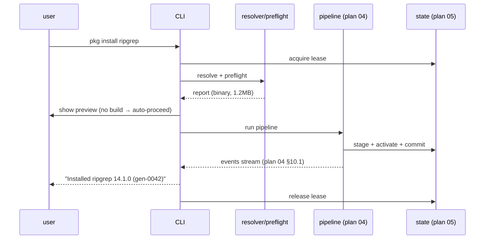
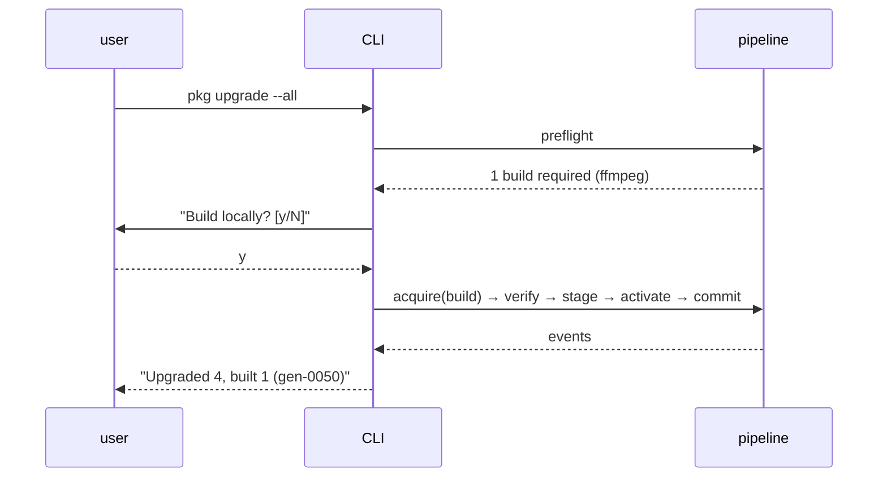

# 06 — CLI & User Experience

> Owner: execution track. **Planning only**; no Rust code.

## 1. Purpose

Define the **complete user-facing command surface** and the UX contracts
(human + machine output, progress, prompts, approvals, exit codes, completion)
for the product. The feel target is familiar **brew/paru**: short verbs,
human defaults, a clean `--json` mode for scripting, and a hidden Nix that the
user never types.

This plan defines the **exact behavior, flags, outputs, and exit codes** of
every verb the brief requires: `doctor`, `search`, `info`, `install`,
`remove`, `list`, `outdated`, `update`, `upgrade` (one & all), `pin`,
`unpin`, `history`, `rollback`, `gc`, `repair`, `completion`. It also defines
global flags, output formats, progress events, and the approval model.

## 2. Scope / Non-scope

**In scope**

- Verb inventory, flag grammar, semantics, and example outputs.
- Output formats: human (default) and machine (`--json` / `--jsonl`).
- Progress event protocol surfaced to the user via the CLI inline renderer.
- Approval prompts (build, remove, collisions, destructive ops).
- Shell completion generation.
- Error/exit-code mapping to plan 04's table.

**Non-scope**

- The mechanics of resolution/build/state (plans 04, 05).
- Trust/channel/index internals (plans 02, 03).
- Installer/daemon/PATH (plan 07).
- Threat model / test lanes (plans 08, 09).

## 3. Design principles

1. **Familiar verbs, no Nix vocabulary.** Default human output and every
   public `--json`/`--jsonl` field use only product-owned identities:
   selector, package name, version, output name, generation id, op id, phase,
   and byte counts. No "derivations", "profiles", "flakes", "channels",
   "overlays", "substituters", **resolved attributes**, **store/derivation
   paths**, **Nix system triples**, **flake refs**, or **Nix argv/trust/store-control
   knobs** appear in command output or public events. Use "package",
   "install", "generation", "cache", "build", "source revision". Raw Nix
   identities live only in internal lock/generation state (plan 05) and in
   diagnostic contexts where naming the managed Nix runtime is necessary
   (e.g. `doctor`, unmanaged-Nix remediation).
2. **Progress is structured first, rendered second.** Every long op produces
   a sanitized public NDJSON event stream surfaced via `--jsonl` (§5.3); the
   human inline renderer is one consumer of that same stream. Both machine
   contracts are first-class and stable: `--json` (one final document, §5.2)
   and `--jsonl` (the progress stream + terminal result, §5.3); they are
   mutually exclusive.
3. **Fail closed, fail loudly.** Ambiguous input, unmanaged Nix (plan 07), or
   unsafe operations refuse with explicit remediation text.
4. **Non-destructive by default.** Anything that removes state or paths
   requires confirmation unless `--yes` is set. The previous generation is
   always recoverable via `rollback`.
5. **Offline-friendly.** Read-only verbs (`list`, `info`, `history`,
   `rollback`) work offline. `search` and `outdated` work offline from the
   last locally verified index / accepted channel descriptor and warn when
   that data is stale (as policy allows); offline with **no usable local
   data** returns 66. Only `update` inherently requires the network. Default
   index-served `info` is offline (`--exact` may fetch the pinned source — §6.3).
   For `install`/`upgrade`, offline success is limited to outputs **already
   present in the local store** — a merely remote cache-hit still needs the
   network (§14).

## 4. Global flags & environment

```
pkg [--json | --jsonl] [--quiet | --verbose] [--no-color] [--config <path>]
    [--state <dir>] [--profile <name>] [--yes] [--dry-run]
    <command> [args...]
```

> **Output format is single-choice.** `--json` and `--jsonl` are **mutually
> exclusive**: specifying both is a `USAGE` error (exit 2). `--quiet`/`--verbose`
> tune the human renderer (default); under `--jsonl` they affect only the inline
> progress UI (never the stream records), and under `--json` there is no stream
> to tune.

| Flag | Effect |
|------|--------|
| `--json` | Emit **one** stable final JSON document per command (`schemaVersion:1`); never streams progress (§5.2). Mutually exclusive with `--jsonl` → `USAGE` (2). |
| `--jsonl` | Emit the sanitized public NDJSON progress stream (`schemaVersion:1` per line) plus a terminal `type:"result"` record (§5.3). Mutually exclusive with `--json` → `USAGE` (2). |
| `--quiet` | Suppress progress UI; still print final result line. |
| `--verbose` | Include phase details and **sanitized** product/build-log excerpts on errors. Never raw Nix identifiers (drv/store paths, attributes), Nix options, or subprocess argv. |
| `--no-color` | Disable ANSI. Auto-off when not a TTY. |
| `--config <path>` | Override `config.toml` location. |
| `--state <dir>` | Override state root (plan 05). Mainly for read-only tests; broker-backed mutations require the fixed per-platform production root so the privileged helper can revalidate it without accepting a path. |
| `--profile <name>` | Select among the invoking user's own profiles (v1: only `default`; authoritative state is per-user keyed by uid per D-17 — `--profile` does not cross users). |
| `--yes` | Assume "yes" for ordinary confirmations (`remove`/`gc`/`upgrade`): they skip. For local build approval it is **special**: it pre-approves the **single** local-build operation non-interactively against **one canonical `BuildPlan`** — the same preview is still emitted and journaled, approval is bound to the `BuildPlan` digest + policy version, and `--yes` **never** overrides a hard refusal (`ACQUIRE_NO_BINARY`, 67). Non-TTY build-required without `--yes` exits 68. |
| `--dry-run` | Run preflight only and print the plan. **No** local build, desired-state mutation, staging, activation, or generation change. May refresh signed metadata, query the managed binary cache, evaluate pinned inputs, and populate the evaluation/source cache; IFD remains disabled. |

> **No public `--debug` flag.** V1 ships no user-facing debug mode: a debug surface that retains the symlink forest or exposes internal ids/Nix state conflicts with hidden, exclusively-managed Nix. Internal developer instrumentation (phase traces, the kept staging tree, raw adapter events) is **compile/test-only** and is never a user flag. `--verbose` is the only increased-detail public flag and it stays **sanitized** (above): no subprocess argv, raw Nix options/journal, drv/store paths, attributes, or flake refs.

Env vars: `NO_COLOR`, `PKG_STATE_DIR`, `PKG_CONFIG`,
`PKG_CACHE_TTL_SECONDS`. A non-empty `PKG_STATE_DIR` is an explicit alternate,
read-only inspection origin with the same mutation limits as `--state`; an empty
value is unset. (There is **no** `PKG_YES_TO_BUILDS`: V1 has no
ambient/session/persistent build approval; use `--yes` to pre-approve the single
operation.) The product **ignores** Nix env overrides
(`NIX_SUBSTITUTERS`, `NIX_TRUSTED_PUBLIC_KEYS`, `NIX_PATH`, `NIX_REMOTE`,
`FLAKE_*`) — trust is channel-locked (plan 02); `pkg doctor` flags any that
are set.

## 5. Output formats

### 5.1 Human (default)

- Tables for `list`, `outdated`, `search`, `history`. Color: headers dim,
  package names bold, warnings yellow, errors red, success green.
- A single-line progress bar for downloads/builds; multi-line for parallel
  builds with `--verbose`.
- Errors: `error[<SYMBOL>]: <message>` + a `hint:` line + `see: pkg <verb>
  --help` when relevant.

### 5.2 `--json` (stable, versioned, single final document)

`--json` emits **exactly one** final JSON document per command and **never
streams progress** — progress lives on `--jsonl` (§5.3), and the two flags are
**mutually exclusive** (both → `USAGE`, 2). For long ops the single document is
produced only **after** the operation completes; a `--json` consumer learns
progress solely via `--jsonl`. Every document is `{"schemaVersion":1, ...}`.
Example `install --json` final result:

```jsonc
{ "schemaVersion":1, "ok":true, "command":"install",
  "generation":{"id":"gen-0042","parent":"gen-0041"},
  "added":[{"selector":"ripgrep","package":"ripgrep","version":"14.1.0","outputs":["out"]}] }
```

On error:

```jsonc
{ "schemaVersion":1, "ok":false, "command":"install",
  "error":{"symbol":"BUILD_FAILED","code":69,
           "message":"ffmpeg-6.1 build failed","hint":"see the sanitized operation log <user-state>/logs/<opId>.ndjson"},
  "generation":{"active":"gen-0041","unchanged":true} }
```

### 5.3 `--jsonl` progress stream (sanitized public; mutually exclusive with `--json`; from plan 04 §10.1)

`--jsonl` is the **sanitized public progress stream**: the product-owned mirror
of plan 04's private broker/adapter stream. It is **mutually exclusive** with
`--json` (both → `USAGE`, 2). Every line is **independently self-describing
and versioned** — each carries `"schemaVersion":1` — so a consumer can join,
resume, or replay from any line. The CLI inline renderer and every `--jsonl`
consumer subscribe **only** to this public stream, **never** to the verbatim
internal adapter events. The internal adapter stream (drv/store paths, Nix
argv, trust options, signature counts) is private to the broker (plan 04
§10.1), is not a public contract, and is **never** written to `--jsonl` or to
the user-owned `<user-state>/logs/<opId>.ndjson`.

The same public stream is journaled verbatim, append-only, to
`<user-state>/logs/<opId>.ndjson` (one file per operation; plan 04 §10.1/§10.2,
plan 05), so a live `--jsonl` consumer and an after-the-fact log reader see
byte-identical records.

Public events carry **only** product-owned identities — op id, phase,
selector/package name, version, output name, relative forest path, byte counts,
best-effort `pct`, and generation id. Example sanitized public events (one
NDJSON line each):

```jsonc
{ "schemaVersion":1, "type":"download_started","opId":"op_...","selector":"ripgrep","bytes":1234567 }
{ "schemaVersion":1, "type":"download_progress","opId":"op_...","selector":"ripgrep","done":700000,"total":1234567 }
{ "schemaVersion":1, "type":"build_started","opId":"op_...","selector":"ffmpeg","packageName":"ffmpeg","version":"6.1" }   // no drv/store path or Nix system
{ "schemaVersion":1, "type":"phase","opId":"op_...","phase":"stage","status":"started" }
{ "schemaVersion":1, "type":"collision","opId":"op_...","file":"bin/x","selectors":["a","b"] }
{ "schemaVersion":1, "type":"committed","opId":"op_...","generationId":"gen-42" }
```

**Terminal result record.** Every `--jsonl` stream **ends** with exactly one
terminal record `"type":"result"` carrying the same success/error/generation
summary as the `--json` envelope (§5.2), so a `--jsonl` consumer detects
completion **in-format** and never has to switch to `--json`:

```jsonc
{ "schemaVersion":1, "type":"result","opId":"op_...","ok":true,"command":"install",
  "generation":{"id":"gen-0042","parent":"gen-0041"} }
{ "schemaVersion":1, "type":"result","opId":"op_...","ok":false,"command":"install",
  "error":{"symbol":"BUILD_FAILED","code":69,"message":"ffmpeg-6.1 build failed",
           "hint":"see the sanitized operation log <user-state>/logs/<opId>.ndjson"},
  "generation":{"active":"gen-0041","unchanged":true} }
```

`ok`/`error` appear **only** on the terminal `result` record; progress events
never carry them. Tabular verbs (`list`, `search`, `outdated`, `history`) emit
one `schemaVersion:1` record per row plus a terminal `result` summary (no
progress events).

Events are **additive and idempotent to replay** — re-processing any subset of
records never changes the outcome, and the terminal `result` is authoritative.
A full-screen TUI is deferred (§8).

## 6. Command reference

> Exit codes reference plan 04 §10.3. "Mutating" verbs take the state lease
> (plan 05 §12).

### 6.1 `pkg doctor`

**Purpose:** environment + trust + store + daemon health; the first command
new users run. Non-mutating.

**Checks:**
- Architecture & OS detection (plan 07): maps to a Nix `system`
  (`x86_64-linux`, `aarch64-linux`, `x86_64-darwin`, `aarch64-darwin`).
- Bundled Nix runtime present & version matches descriptor (plan 02/07).
- Daemon reachable (Unix socket) and responding to `nix ping-store`
  (*confirmed* [^ping-store]).
- Store prefix is `/nix/store` and writable by the daemon; free space.
- **Unmanaged-Nix detection** (plan 07): any pre-existing
  `/nix`, `nix` on PATH, `~/.nix-profile`, `/nix/var/nix`, launchd/plist,
  systemd unit, or `NIX_*` env → **refuse to proceed beyond doctor** with
  manual remediation text. V1 never auto-removes (plan 00).
- Channel descriptor present, signed, not expired (plan 02); offer `pkg update`
  if stale.
- Index present and fresh enough (plan 03).
- `current` is a valid relative symlink resolving to a `activations/gen-<id>/` forest whose `treeDigest` matches the active generation (D-18); every selected output has a live per-output GC root (plan 05).
- Active generation's **closure health** — not marked unknown/unhealthy by a repair verify row whose damage set is nonempty (plan 05 §10/§11.1); if unhealthy, `doctor` reports it and points to `pkg repair` (a clean verify clears it).
- Lease state; leftover `current.tmp.*` detritus; leftover staging roots/forests.
- Substituter reachability to `cache.nixos.org` (HEAD request).
- Forbidden Nix env vars set.

**Output:** a checklist `[✓]/[x]/[!]` plus an overall status. `--json`
returns `{schemaVersion, checks:[{id,status,detail,hint}], overall}`.

**Exit:** 0 if all pass; 78 `CONFIG` for fixable config issues; 74
`UNMANAGED_NIX` if unmanaged Nix is detected.

### 6.2 `pkg search <query>`

**Purpose:** fuzzy/keyword search over the disposable index (plan 03).
Non-mutating. Works **offline** from the last locally verified index; when
online and the index lags the accepted channel descriptor it is refreshed
first. Stale-but-usable local data is served with a `stale` note (policy may
downgrade that to a warning).

**Flags:** `--limit N` (default 25; hard maximum 1000), `--channel <id>`,
`--json`, `--exact` (exact-name match), `--license <spdx>`. Nixpkgs exposes no
stable package-category field, so V1 does not invent a category taxonomy;
the CLI scaffold's provisional `--category` flag is removed when PR-24 wires
this query API.

**Human:** table of `package | version | description | license`. Selecting an
entry is copy-paste of `package` to `pkg info`/`install`.

**Note:** search uses the **disposable derived index**, which is not the
identity source — `install` re-evaluates the pinned Nixpkgs (plan 04). Search
results carry a product-owned `package` id (the value to copy into `pkg
info`/`install`) and a `stale` flag if the index lags the channel. With no
separate curated catalog, the only stable and unambiguous id is the index's
validated canonical Nixpkgs attribute path (for example `ripgrep` or
`python3Packages.requests`); it is presented simply as `package`, while raw
Nix expressions, store paths, derivations, and hashes remain internal.

**Exit:** 0; 66 `ACQUIRE_NETWORK` only when offline **and** there is no
usable local index; 64 on bad query.

### 6.3 `pkg info <pkg...>`

**Purpose:** show metadata for one or more packages. The **default** `info`
is index-served and fully **offline** (no eval, no network). `--exact`
performs **evaluate-only** inspection of the pinned package source: it may
fetch the pinned source if it is absent, **never** realizes/builds/activates,
and reports expected outputs plus cache/buildability metadata — **not** a
realized store identity.

**Flags:** `--exact` (evaluate the pinned package source; offline → 66 if the
required source/cache metadata is unavailable), `--json`/`--jsonl`,
`--channel <id>`.

**Output fields (product-owned):** package, version, homepage, license(s),
description, outputs + `outputsToInstall`, platform availability (derived
from the index's per-system data; rendered as friendly platform names, never
raw Nix system triples), known vulnerabilities, whether already installed
(and pinned), and source revision.

The pure PR-15 index response supplies catalog fields, source revision, and an
honest advisory status. V1 has no vulnerability feed (DR-009), so that status
is `unavailable`, never an empty list that could be mistaken for “no known
vulnerabilities.” PR-24 composes installed/pinned state and
`outputsToInstall` from the lock/manifest; the disposable index does not guess
them.

**Sizes are honest about what is knowable:**
- Default `info`: the schema currently carries no size estimate, so
  `installedSizeEstimateBytes` is `null`/shown as “unavailable.” A future
  publisher may add a clearly labeled disposable-index estimate through a
  schema revision; V1 never fabricates one.
- `--exact` **never** reports a "normalized" or "exact" realized closure/content
  size for an unbuilt output — that number is unknowable before a build. It
  reports: **exact known cache bytes** (download + content) for **cache-present**
  outputs, straight from their cache metadata; an **unknown-local-output count** for
  cache-miss outputs whose realized size is only knowable after building; and
  clearly **labeled heuristic estimates** (e.g. `≈` disk/time), never
  presented as exact. Cache availability and buildability for the current
  platform are reported as metadata, not as a built store identity.

**Exit:** 0; 64 `RESOLVE_NOT_FOUND` if the package is absent in pinned
Nixpkgs; 66 `ACQUIRE_NETWORK` if `--exact` needs source/cache metadata that
is unavailable offline.

### 6.4 `pkg install <pkg...> [flags]`

**Purpose:** add packages to desired state and activate a new generation. Full
plan-04 pipeline.

**Flags:**
- `--with-outputs out,lib` per-package (multi-output, plan 04 §12.1).
- `--on-collision abort|keep-first|keep-last` (default `abort`). `keep-first`/`keep-last` pick a deterministic per-file winner for the colliding path; the losing package's **other** (non-colliding) files remain visible in the forest. There is **no** `keep-all` and **no** `--force` for collisions in V1 (D-18).
- `--yes`, `--dry-run`, `--json`/`--jsonl`, `--keep-going`.
- `--channel <id>` to install from a non-current pinned channel (still signed).

V1 exposes **no** raw Nix resource knobs (`--max-jobs`/`--cores` are not public
flags): the build engine retains the product-managed settings of plan 04 §8 /
plan 07 §5.2.

**Flow:** resolve → preflight → [approval gate if builds] → acquire → verify
→ stage → activate → commit. On any failure the previous generation stays
active (plan 04 I1).

**Human preview** (preflight, before approval):

```
Resolving 3 packages... ok
  + ripgrep  14.1.0     cache ✓   download 1.2 MB   size 4.8 MB (exact, cache)
  + fd       10.1.0     cache ✓   download 0.6 MB   size 2.1 MB (exact, cache)
  + ffmpeg   6.1        BUILD required   size unknown (1 local output)   est. 8–14 min
Known downloads 1.8 MB (cache-present, exact) · new disk ≈1.1 GB (V1 estimate; 1 unbuilt local output) · free 9.0 GB
ffmpeg has no signed binary for your platform (Linux x86-64). Build locally (sandboxed)? [y/N]
```

> Numbers mirror the public sanitized `BuildPreview` (plan 04 §5.2.1.b):
> cache-present bytes are exact (`knownDownloadBytes`/`knownContentBytes`);
> unbuilt local outputs surface as an `unknownLocalOutputs` count with
> heuristic-only `estimates` (`approxBuildMinutes`, `approxNewDiskBytes`,
> `approxTotalClosureBytes: null`). No realized closure size is ever claimed
> for an unbuilt output.

**Exit:** 0 on success; see plan 04 table (64–76).

### 6.5 `pkg remove <pkg...> [flags]`

**Purpose:** drop selectors from desired state; rebuild generation without
them. Confirm before activation (default). `--yes` skips.

**Special:** removing a package that others depend on at runtime is *not*
modeled (Nix has no runtime dep graph between top-level packages); the product
warns if the removed package provided binaries referenced by others' `bin`
names (best-effort via closure file index). `--orphan-check` lists now-unused
dependencies' closures that GC will reclaim.

**Exit:** 0; 64 if not installed; 72 if locked.

### 6.6 `pkg list [flags]`

**Purpose:** show installed packages from the active generation (plan 05).
Non-mutating; offline.

**Flags:** `--json`, `--name-only`, `--with-outputs`, `--size` (closure
bytes), `--pinned`, `--outdated` (combine with lock+channel compare).

**Output:** table `name | version | pinned | source | size`. `--json` returns
a product-owned `entries[]` (name, version, pinned, source, outputsToInstall,
realized closure bytes for installed outputs) — never raw store paths or
resolved attributes; those live in the internal lock + immutable generation
records (plan 05). The manifest holds only desired selectors (and explicit
pin intent/reference), never store identities.

**Exit:** 0; 73 `STATE_CORRUPT` if active generation fails to load.

### 6.7 `pkg outdated [flags]`

**Purpose:** compare the lock (plan 05) against the last locally accepted
`channelSeq`. Non-mutating. Works **offline** from the accepted channel
descriptor + lock; when online and the descriptor lags, it is refreshed
first. Stale-but-usable local data is served with a `stale` note (policy may
downgrade that to a warning).

**Output:** table `name | current | available | pinned | kind`. `kind` ∈
`patch|minor|major|rev-only` (heuristic from `version` diff; `rev-only` when
versions are equal but the pinned source revision differs — internally the
lock's `nixpkgsRev`, exposed to users as "source revision").

**Exit:** 0 (even if outdated) — exit nonzero only on failure; 66
`ACQUIRE_NETWORK` only when offline **and** there is no usable accepted
descriptor. CI tip: `pkg outdated --json | jq '.entries|length'`.

### 6.8 `pkg update [flags]`

**Purpose:** refresh **metadata only**: fetch & verify the new signed channel
descriptor (plan 02) and refresh the disposable index (plan 03). **Does not
change installed packages.** Updates `channelSeq` in state.

**Flags:** `--check` (dry: report what would change), `--force` (re-download
even if fresh), `--json`.

**Human:** "Channel updated to v1.2/d2024-08-02. 0 packages changed. Run
`pkg upgrade --all` to apply."

**Exit:** 0; 66 `ACQUIRE_NETWORK` offline (this is the one verb that
inherently requires the network); 70 `VERIFY_FAIL` if descriptor signature
invalid (never apply).

### 6.9 `pkg upgrade [<pkg...> | --all] [flags]`

**Purpose:** re-resolve and activate newer versions.

- `pkg upgrade <pkg...>` — selective (plan 05 §7): only the named selectors,
  each at `channelSeq`. Pinned selectors skipped unless `--bump-pinned`.
- `pkg upgrade --all` — every non-pinned selector at `channelSeq`.
- No argument = error (avoid foot-gun) unless `PKG_UPGRADE_DEFAULT=all` is set.

**Flags:** same as `install` plus `--bump-pinned`, `--no-build` (refuse if any
target needs a build), `--include-removed-upstream` (handle attr removal:
report and skip by default).

**Preview:** per-target before/after `version`, download/build summary, total
disk delta. Approval gate as in `install`.

**Exit:** 0; 64 if a named selector isn't installed; plan-04 codes otherwise.

### 6.10 `pkg pin <pkg...>` / `pkg unpin <pkg...>`

**Purpose:** freeze a selector to its current realized identity (plan 05 §5.1).

- `pin` records the selector's realized identity internally (`pinnedTo` in
  the manifest, plan 05); subsequent `upgrade`/`update` never move it. The public
  output shows selector + version only — never the store path. Records a `pin`
  journal op + new generation (so history reflects the intent change) but the
  *activated tree* is byte-identical.
- `unpin` clears `pinnedTo`; next `upgrade` may move it.

**Flags:** `--json`, `--yes`.

**Exit:** 0; 64 if not installed.

### 6.11 `pkg history [flags]`

**Purpose:** list generations (plan 05). Non-mutating; offline.

**Output:** table `gen | created | kind | changes | active`. `changes` =
`+3 ~1 -0` summary derived by diffing manifests. `--diff <a> <b>` shows the
package/output delta (added/removed/version-changed) between two generations
in product terms. `--delete <id>` prunes a
non-active generation (frees its GC root; requires `--yes`).

**Exit:** 0; 64 if id unknown.

### 6.12 `pkg rollback [<id>] [flags]`

**Purpose:** restore a prior generation's verified manifest/lock state by
creating a new monotonic generation, freshly re-materializing its activation
forest, publishing a fresh root set, and atomically switching `current`
(D-18; plan 05 §8.1). The retained target remains immutable and is never
reactivated in place.

- No arg → parent of active.
- `<id>` → that generation (must exist & verify).

**Output:** " Rolled back to gen-0040 (active gen-0043). Run `pkg rollback`
again to return."

**Exit:** 0; 64 if id missing; 73 if that generation's outputs are no longer
present locally (suggest `repair`).

### 6.13 `pkg gc [flags]`

**Purpose:** prune old generations and run the Nix collector (plan 05 §9).

**Flags:** `--dry-run`, `--keep-generations N`, `--max-age-days N`,
`--json`, `--yes`. Defaults from config (`gc.keep_generations=10`,
`gc.max_age_days=30`).

**Safety:** never prunes the active generation; requires the lease; prints the
list of generations to prune and the byte estimate before acting (unless
`--yes`).

**Exit:** 0; 72 if locked; 79 `ENGINE_UNAVAILABLE` if the private broker (the
sole mediator to the managed collector) cannot be reached (plan 05 §9). Note:
79 applies to **any** verb needing the private broker, not only `gc`/`repair`
(§11); local-only read verbs may continue from verified local product state.

### 6.14 `pkg repair [<id>] [flags]`

**Purpose:** bring the active (or named) generation's store closure back to a
verified, complete state. V1 `repair` is the **whole privileged two-phase
store-repair operation** (plan 05 §10): a **Phase 0** broker read-only verify,
then — only if damage is found — the **two mutating phases** as one privileged
root-helper operation: **Phase A** (signed-cache-only repair) and, on a cache
miss, **Phase B** (an approved rebuild, split into **B.1** preview/approval and
**B.2** execution). Activation-forest rematerialization and manifest/lock
recovery are **separate, subordinate paths**, not the definition of store
repair (below).

**Phase 0 — read-only verify (mutates nothing).** The broker runs
`nix store verify --recursive` (**no** `--repair`) over the **full computed
closure** reachable from the target generation's selected output roots, after
re-checking the activation forest's `treeDigest`. It is safe, idempotent, and
marks nothing repaired.
- **Clean** → the op **exits success (0)**; nothing is mutated, no capability
  is issued, no GC-inhibit permit is held.
- **Damage found** (corrupt or missing registered/expected closure paths) →
  before **any** mutation the product **warns that commands whose `PATH`
  resolves through the affected outputs may be temporarily unavailable or
  observe partial content**, because Nix store repair is **non-atomic**
  (verified Nix 2.34.8: a cache repair deletes the live path before restoring
  it; a rebuild moves the original aside before the replacement lands — plan 05
  §10.9). It marks the affected closure **unknown/unhealthy** and **blocks
  dependent state mutations** (a new `install`/`upgrade`/`rollback` that would
  build on or switch onto an untrusted closure is refused), journals the damage
  set, then proceeds to Phase A.

**Phase A — signed-cache-only repair (automatic; stops before any build).**
Per-path `nix store repair` runs as the privileged root helper with
`max-jobs=0` and an empty `builders` list, so `Store::repairPath` can **only**
succeed via a Repair-mode **signed-cache substitution (cache hit)** — it
**cannot build**. A cache hit repairs the path **automatically, with no user
approval**. A **cache miss** is the mandatory stop point: the helper returns a
sanitized per-path outcome and **does not proceed to any build**. The phase is
per-path idempotent and resumable; a shared GC-inhibit permit spans it so a
broker `gc` cannot change root safety while a target is transiently absent.

**Phase B — approved rebuild fallback (only on a cache miss with a valid
deriver).** Reached only when Phase A leaves a path unrepaired that has a valid
deriver. An unconstrained `Store::repairPath` *would* rebuild here, so `pkg`
**must not let it**.
- **B.1 — preview + single-operation approval.** `pkg` **stops before any
  build** and emits the **same ordinary deterministic build preview used
  elsewhere** (§6.4; plan 04 §5.2.1), over an internal `RepairBuildPlan` whose
  digest covers **every output of every deriver** the repair may rebuild — not
  only the damaged output — bound to the canonical digest + policy version.
  Approval is **single-operation** (§7): interactive = yes-at-prompt; `--yes`
  pre-approves that one operation (preview still emitted + journaled); **non-TTY
  without `--yes` is refused and exits `ACQUIRE_NEEDS_APPROVAL` (68)**, exactly
  like a non-interactive install that needs a build; a granted approval
  **never** persists beyond this op.
- **B.2 — execution under the documented gates.** Only if useful (Phase A left
  a deriver-bearing path unrepaired **and** B.1 approval was granted):
  immediately before execution `pkg` re-derives the `RepairBuildPlan`, compares
  its digest to the approved one (fail closed on mismatch — interactive
  re-prompts, non-interactive exits 68), re-measures disk/free-space/load, and
  re-validates the single-use capability. The rebuild runs via the root helper
  at a small nonzero `max-jobs`, **no remote builders**, serialized by the
  broker's machine-global build-admission permit, held under the shared
  GC-inhibit permit for the whole non-atomic replace.

**Completion — never "repaired" until a fresh read-only verify.** No path is
marked repaired, and the closure is not restored to healthy, until a **final
Phase-0 read-only `nix store verify` confirms every target clean** (plan 05
§10.7); that clean verify also **clears the unknown/unhealthy marker** and
**unblocks dependent state mutations**. A path that cannot be re-verified (e.g.
removed upstream, no substitutable repair, and no approved build) is reported
and the op exits non-zero; `pkg` never fabricates a "repaired" state.

**Output is sanitized end to end.** The CLI emits **only** product-owned
identities: selector/package name, output name, version, phase, and a
**sanitized per-path outcome** (`verified-clean` / `repaired-via-cache` /
`needs-build-approval` / `still-damaged` + reason), plus the ordinary
sanitized `BuildPreview` when Phase B is reached. **Raw helper/Nix logs, raw
argv, derivers, store/derivation paths, substituter URLs, and trust details
stay service-private** (broker-private; plan 05 §4/§6); the public
request/response channels carry **only opaque ids/digests** (op id, capability
id, generation id, plan digest), and the user-facing log reference is the
**sanitized** `<user-state>/logs/<opId>.ndjson` (never a raw broker log or a
`<opId>.nix.log`). **Unapproved store-path detail is never shown.** `--json`
emits one final document (`summary` of `verified`/`repairedViaCache`/
`stillDamaged`/`needsBuildApproval` counts + a sanitized `targets[]` and the
`error`/`generation` envelope of §5.2); `--jsonl` emits the sanitized progress
stream of §5.3 — `phase` (verify/repair/approval) and per-path `repair_*`
events (package/output + a sanitized `mode` of `cache`/`build`, **never**
argv/options/store path), a `build_required` event carrying the sanitized
`BuildPreview` + `buildPlanDigest` when Phase B.1 is reached, and one terminal
`result` record.

**Flags:**
- `[<id>]` — target generation (default: active). Must exist and be rooted.
- `--verify-only` — **purely read-only Phase 0 only**. Performs no Phase A/B
  mutation, issues no capability, holds no GC-inhibit permit. Clean → exit 0;
  damage found → reports the sanitized damage set and exits 70 `VERIFY_FAIL`
  (no action taken). Safe to run any time.
- `--yes` — pre-approve the single Phase B.1 rebuild non-interactively (preview
  still emitted + journaled; never overrides a hard refusal). No effect on
  Phase A (already approval-free) or on `--verify-only`.
- `--json` / `--jsonl` — as §5.2/§5.3.
- `--from-manifest <gen-id>` / `--from-lock` — **subordinate manifest/lock
  recovery**, not store repair (below).

**Separate, subordinate recovery paths (not store repair).** Store repair
fixes `/nix/store` content at **unchanged** registered paths and **never**
creates or swaps a generation, rebuilds the Rust activation forest, re-roots,
or touches `current` (plan 05 §10.6). Two other damage classes are handled by
**distinct** flows that `pkg repair` may *detect* during Phase 0 and hand off
to, but never conflates with store repair:
- **Activation-forest / `current` metadata damage** (deleted forest, broken
  `current`, or a `treeDigest` that no longer recomputes): the **Rust-only,
  zero-Nix** startup-recovery flow — re-materialize the forest from the
  generation's durable, verified, rooted outputs and recompute `treeDigest`
  (D-18); if `current` is broken, repoint it to the most recent intact
  generation (plan 05 §11.1/§11.2). It substitutes/builds nothing.
- **Manifest/lock sidecar damage** (truncated/missing): restore from the
  generation's durable snapshots, or rebuild via `--from-manifest <gen-id>`
  (lock from manifest) / `--from-lock` (manifest from lock + store reality)
  (plan 05 §11.2); refuse if no trusted source remains.

**Exit codes:** 0 if verified clean or fully repaired; 70 `VERIFY_FAIL` if
damage remains after repair (e.g. removed upstream, no substitutable repair,
or a build that was declined/not-approved) **or** if `--verify-only` finds
damage; 66 `ACQUIRE_NETWORK` if a cache repair needs the network offline; 68
`ACQUIRE_NEEDS_APPROVAL` if Phase B needs a build non-interactively without
`--yes`; 72 `STATE_LOCKED`; 73 `STATE_CORRUPT`; 74 `UNMANAGED_NIX`; 75
`CANCELLED`; 79 `ENGINE_UNAVAILABLE` if any broker-mediated step (Phase 0
verify, Phase A repair, Phase B build) is needed and the private broker is
unreachable — the pure-Rust forest rematerialization needs no broker (D-18).

### 6.15 `pkg completion <shell>`

**Purpose:** emit shell completion script. Supports `bash`, `zsh`, `fish`,
`powershell` (via the CLI framework's completion engine). Output is static
for the verb/flag grammar; dynamic package-name completion is **not** provided
in v1 (it would require evaluating Nixpkgs per keystroke — too slow); a future
`pkg __complete` helper may index recently-installed + index-top-N package
names.

**Exit:** 0; 64 for unknown shell.

## 7. Approval & confirmation model

| Trigger | Default prompt | `--yes` |
|---------|----------------|---------|
| Local build (Linux/macOS, native; **one operation**) | required (after the final canonical `BuildPlan` is shown) | pre-approves that one operation non-interactively (preview still emitted+journaled); never overrides a hard refusal |
| `remove` | required | skips |
| `gc` (destructive) | required | skips |
| `rollback` | none (safe) | n/a |
| `upgrade --all` | required | skips |

Approvals are **one operation only**, recorded in the journal (plan 05 §5.4) with the canonical `BuildPlan` digest + policy version + timestamp. V1 has **no** ambient, session, or persistent build approval: there is no `PKG_YES_TO_BUILDS`, no same-session skipping, and no `build.always_local_after_preview`. Collisions are **not** an approval: under `abort` (default) a collision is a hard `STAGE_COLLISION` (71) error; `keep-first`/`keep-last` resolve deterministically with no prompt (D-18). **`pkg repair` Phase B.1 reuses the same single-operation build approval**, bound to a `RepairBuildPlan` digest that covers **every output of every deriver** the repair may rebuild (not only the damaged output); non-TTY without `--yes` exits `ACQUIRE_NEEDS_APPROVAL` (68), exactly like a non-interactive install that needs a build (§6.14).

## 8. Interactive vs non-interactive

- `stdin` not a TTY **and no `--yes`** → non-interactive: a build-required op
  cannot prompt, so it is a **safe refusal** that exits `ACQUIRE_NEEDS_APPROVAL`
  (68); other confirmations that would block also become safe refusals with the
  relevant exit code. This makes CI safe. `--yes` changes this in two distinct
  ways — ordinary confirmations (`remove`/`gc`/`upgrade`) **skip**, and the
  single local-build approval is **granted** (`source:"yes"`, bound to the one
  displayed canonical `BuildPlan`, preview still emitted+journaled). `--yes`
  **never** overrides a hard refusal (`ACQUIRE_NO_BINARY`, 67). (A non-TTY op
  **without** `--yes` is the refusal case above; it must not be confused with
  `--yes`, which accepts the one `BuildPlan` subject.) The same rule governs
  `pkg repair` Phase B: a cache-miss rebuild that needs approval cannot prompt
  non-interactively, so it exits `ACQUIRE_NEEDS_APPROVAL` (68) unless `--yes`
  pre-approves it (§6.14).
- V1 renders everything with the **CLI inline renderer** (single-line progress
  bar; multi-line under `--verbose`; inline tables) — there is **no** full-screen
  TUI in v1 and **no** `--tui` flag. A full-screen TUI is a clearly **deferred**
  future item (Q6.3); until then `--json`/`--jsonl` is the machine surface and
  the inline renderer is the human surface.

## 9. Cancellation UX

- `Ctrl-C`/`SIGINT`: print "Cancelling…" trap, forward to Nix subprocess
  group, wait grace period, exit 75 `CANCELLED`. State unchanged (plan 04 §9).
- Second `Ctrl-C`: hard cancel (`SIGKILL` to subprocess), still exit 75, still
  no state mutation.
- `SIGTERM`: same as a single Ctrl-C.

## 10. Error rendering & remediation

Every error carries a `hint`. Examples:

- `error[UNMANAGED_NIX]: an existing Nix installation was detected at /nix.`
  `hint: V1 manages its own Nix exclusively. To proceed, remove the existing
  Nix manually (see <docs URL>) or set up on a clean machine. The product will
  not remove it for you.`
- `error[ACQUIRE_NO_BINARY]: no signed binary and no buildable path for your platform (macOS/arm64) for ffmpeg.`
  `hint: this package has no acceptable cache binary and building is impossible/disallowed here (unsupported/broken/impure, sandbox/build-user unavailable, or policy-blocked). See `pkg info ffmpeg --exact`.`
- `error[ENGINE_UNAVAILABLE]: the private broker could not be reached.`
  `hint: the product's private broker (the sole mediator to the managed build engine) is not running or its socket is unavailable. Run `pkg doctor`; if it persists, restart the managed runtime (see your install docs). Local-only read commands (list, history, default info) still work from verified local product state.`
- `error[STAGE_COLLISION]: bin/rg provided by ripgrep and ripgrep-nightly.`
  `hint: pass --on-collision=keep-first|keep-last (deterministic per-file winner; the other package's non-colliding files stay visible) or remove one of them. V1 has no keep-all/--force (D-18).`
- `error[VERIFY_FAIL]: store repair could not complete: 2 paths still damaged (1 removed upstream, 1 build declined).`
  `hint: re-run pkg repair to retry cache repair, or approve the Phase B rebuild (run interactively or pass --yes). The affected closure stays unhealthy and dependent installs/upgrades stay blocked until a clean verify. See the sanitized operation log <user-state>/logs/<opId>.ndjson.`

## 11. Exit-code summary (from plan 04 §10.3)

Mapped to verbs:

| Code | Symbol | Typical verbs |
|------|--------|---------------|
| 0 | OK | all |
| 2 | USAGE | all (bad flags) |
| 64 | RESOLVE_* | install, upgrade, info, pin |
| 65 | PREFLIGHT_FAIL | install, upgrade |
| 66 | ACQUIRE_NETWORK | install, upgrade, update, search, outdated, repair (cache substitution) |
| 67 | ACQUIRE_NO_BINARY | install, upgrade (build impossible/disallowed on any OS) |
| 68 | ACQUIRE_NEEDS_APPROVAL | install, upgrade, repair (Phase B rebuild, no --yes) |
| 69 | BUILD_FAILED | install, upgrade (Linux/macOS local build) |
| 70 | VERIFY_FAIL | install, upgrade, repair, update |
| 71 | STAGE_COLLISION | install, upgrade |
| 72 | STATE_LOCKED | mutating verbs |
| 73 | STATE_CORRUPT | all |
| 74 | UNMANAGED_NIX | doctor, all mutating |
| 75 | CANCELLED | long ops |
| 76 | PARTIAL_FAILURE | install/upgrade --keep-going |
| 77 | PERMISSION | privileged helper refuses a not-permitted caller/op |
| 78 | CONFIG | doctor |
| 79 | ENGINE_UNAVAILABLE | any verb needing the private broker (resolve/eval/acquire/build/verify/`gc`/`repair`); local-only read verbs may continue from verified local product state |

## 12. Accessibility & i18n

- v1 English only; strings externalized so a later release can localize.
- No information by color alone: symbols (`✓/✗/!`) and words accompany color.
- Machine output (`--json`) is the accessibility/scripting escape hatch.

## 13. Sequences

### 13.1 `install` interactive happy path



### 13.2 `upgrade --all` with a build



## 14. Failure matrix (CLI-specific)

| Scenario | Verb behavior |
|----------|---------------|
| Unmanaged Nix present | All mutating verbs + `doctor` exit 74 with remediation. |
| `pkg repair`, Phase 0 clean | Exit 0; nothing mutated, no capability issued, no GC-inhibit permit held. |
| `pkg repair --verify-only`, damage found | Report the sanitized damage set; exit 70; **no** mutation, capability, or GC-inhibit permit (purely read-only). |
| `pkg repair`, cache-miss with valid deriver, non-TTY, no `--yes` | Phase A cache repairs done; Phase B.1 **stops before any build**; exit 68; closure stays unhealthy. |
| `pkg repair`, cache-miss, deriver invalid / removed upstream | Path stays damaged; final read-only verify fails; exit 70; no build attempted. |
| `pkg repair` with broker down | Exit 79 for any broker-mediated step (Phase 0/A/B); pure-Rust forest rematerialization needs no broker. |
| Active closure marked unhealthy (unfinished/failed repair) | Dependent `install`/`upgrade`/`rollback` refused until a clean verify; `doctor` surfaces it; `pkg repair` resumes per plan 05 §10.8. |
| Offline, `install`, output **already present in the local store** | Works (no network). Only already-local paths are offline-usable. |
| Offline, `install`, output **remote cache-hit, not yet local** | Exit 66 — a cache hit still needs the network to substitute; offline-usable means already-local only. |
| Offline, `install`, cache-miss / build-required | Build may proceed offline **only if** every build input is already local; otherwise exit 66 (acquire). |
| Non-TTY, build required, no `--yes` | Exit 68 (safe refusal). |
| `upgrade` names a removed-upstream package | Skip + warn; exit 0 if `--include-removed-upstream` else list and exit 76 if any. |
| `rollback` target whose outputs are no longer local | Exit 73, suggest `repair`. |
| `gc` while install holds lease | Exit 72. |
| `pin` on already-pinned | No-op success with note. |
| `install` duplicate of existing | No-op success ("already installed, gen unchanged"); a new generation/forest is committed only if the activated forest actually changes. |

## 15. Dependencies on other plans

- **plan 00** — verb set & UX tone decisions.
- **plan 01** — CLI layer ↔ pipeline/state module boundaries.
- **plan 02** — descriptor freshness for `doctor`/`update`.
- **plan 03** — `search`/`info`/`outdated` index source.
- **plan 04** — pipeline, progress events, exit codes (this plan maps verbs to
  them).
- **plan 05** — state reads/writes for every mutating verb.
- **plan 07** — installer that puts `pkg` on PATH; unmanaged-Nix detection
  surfaced by `doctor`.
- **plans 08–10** — UX-level error string review, CLI e2e tests, release notes.

## 16. PR-shaped implementation checkpoints

- **PR-C1 — CLI scaffold + global flags + `--json`/`--jsonl`.** Arg parsing,
  help, version, `completion`. *Acceptance:* `pkg --help` lists all verbs;
  `pkg completion bash` is valid bash; `pkg <verb> --json --jsonl` exits
  `USAGE` (2).
- **PR-C2 — `doctor`.** All checks wired (some stubbed behind plan 07).
  *Acceptance:* clean host → exit 0; unmanaged-Nix fixture → 74 with text.
- **PR-C3 — Read-only verbs: `list`, `info`, `history`, `search`, `outdated`.**
  *Acceptance:* JSON schemas stable; offline `list` works.
- **PR-C4 — `update`.** Descriptor verify + index refresh. *Acceptance:* bad
  signature → 70, no state change.
- **PR-C5 — `install`/`upgrade`/`remove` shells** (pipeline from plan 04).
  *Acceptance:* end-to-end install; `--json` emits a single final document and
  `--jsonl` emits the sanitized event stream terminated by a `type:"result"`
  record.
- **PR-C6 — `pin`/`unpin`/`rollback`/`gc`/`repair`.** *Acceptance:* acceptance
  criteria in plan 05 §17 reproduced at CLI level; `repair` runs Phase 0
  read-only verify (clean → 0; damage → non-atomicity warning +
  unknown/unhealthy marker blocking dependent mutations), Phase A cache-only
  auto-repair (`max-jobs=0`, `builders` empty, no approval), Phase B.1
  stop-before-build (non-TTY without `--yes` → 68) over a `RepairBuildPlan`
  digest covering all deriver outputs, and is **never** marked repaired until a
  fresh read-only verify; `--verify-only` is purely read-only;
  activation-forest rematerialization and manifest/lock recovery stay
  separate/subordinate; output is sanitized (no raw store path/deriver/argv;
  the log reference is the sanitized `.ndjson`).
- **PR-C7 — Approval & cancellation UX.** *Acceptance:* non-TTY build → 68;
  Ctrl-C → 75, state intact.
- **PR-C8 — Error/hint catalogue + i18n strings.** *Acceptance:* every exit
  code has a hint; symbols rendered with words not color alone.

## 17. Testable acceptance criteria

1. `pkg doctor` on a clean machine exits 0; on a machine with `/nix` present
   exits 74 with explicit, copy-pasteable remediation and never deletes
   anything.
2. `pkg install ripgrep --json` returns schemaVersion 1, a `generation.id`,
   and an `added[]` of **product-owned identities only** (selector/package/
   version/output names). The output contains **no** `attribute`, `storePath`,
   drv path, or flake ref — those exact store identities live in the internal
   lock + immutable generation records (plan 05); the manifest carries only
   desired selectors (and explicit pin intent/reference), never store
   identities. They are verified separately (e.g. via `pkg doctor`), not in
   command output.
3. `pkg install <buildable cache-miss>` on macOS or Linux without approval exits
   68 and changes no desired state or generation; with `--yes` it succeeds via a
   sandboxed native build (`nixbld`/`_nixbld`), but `--yes` never overrides a hard
   refusal — a cache miss that is impossible/disallowed
   (unsupported/broken/impure, or sandbox/build-user unavailable) exits 67 even
   with `--yes`.
4. `pkg list --json | jq` returns the active generation's outputs as
   product-owned fields (name/version/pinned/source/outputsToInstall) with no
   raw store path or attribute; offline.
5. `pkg outdated` after `update` reports the right per-selector kinds
   (`patch`/`rev-only`) against fixture locks.
6. `pkg upgrade <one>` updates only that selector's source revision (the
   internal lock's `nixpkgsRev` — plan 05; mixed-rev acceptance), while the
   command output shows product-owned "source revision" only.
7. `pkg rollback` then `pkg history` shows a new monotonic generation row
   referencing the prior activation forest (`activations/gen-<id>/`).
8. `pkg gc --dry-run` changes nothing; `pkg gc --yes` reclaims only
   out-of-window generations, never the active one.
9. `pkg pin x && pkg upgrade --all` leaves `x`'s realized identity unchanged.
10. `pkg completion zsh` sources cleanly in zsh and completes verbs/flags.
11. Non-TTY `pkg install <build-required>` exits 68 without prompting.
12. Two simultaneous `pkg install` invocations: one succeeds, the other exits
    72.
13. `pkg search` and `pkg outdated` succeed offline from the last locally
    verified index / accepted descriptor (with a `stale` note) and return 66
    **only** when offline with no usable local data; `pkg update` is the
    single verb that requires the network.
14. Default `pkg info <pkg>` is index-served and offline; because schema V1 has
    no size estimate, it reports installed-size estimate as unavailable rather
    than inventing one. `pkg info <pkg> --exact`
    evaluate-only-inspects the pinned package source (fetches the pinned
    source if absent, never builds/activates): it reports expected outputs +
    cache/buildability metadata — not a realized store identity — with **exact
    known cache bytes** for cache-present outputs, an **unknown-local-output
    count** for cache-miss outputs, and clearly labeled **heuristic**
    estimates; it never claims a "normalized"/"exact" realized closure size
    for an unbuilt output, and exits 66 if that metadata is unavailable
    offline.
15. Any broker-dependent verb (e.g. `install`, `upgrade`, `gc`, `repair`)
    with the private broker unreachable exits 79 `ENGINE_UNAVAILABLE`, while
    local-only read verbs (`list`, `history`, default `info`) continue from
    verified local product state; 77 remains reserved for `PERMISSION` only.
16. The `pkg install <pkg> --json` final document and every `--jsonl` record
    (progress events and the terminal `result`) contain no `drv`, store
    `path`, `attribute`, flake ref, Nix argv, or trust/store fields — only op
    id, phase, selector/package/version/output names, byte counts, best-effort
    `pct`, and generation id (the sanitized public stream of §5.3 / plan 04
    §10.1).
17. `pkg --verbose` emits **sanitized** diagnostics only: no subprocess argv,
    raw Nix options/journal, drv/store paths, or flake refs; error hints point
    to the sanitized operation log under `<user-state>/logs/<opId>.ndjson` (or
    the printed sanitized log reference), never a raw broker `<opId>.nix.log`.
    (There is
    no public `--debug` flag and no `pkg logs` command; internal developer
    instrumentation is compile/test-only.)
18. Offline `pkg install` of an output **already present in the local store**
    succeeds with no network; the same output as a **remote cache-hit not yet
    local** exits 66 (a cache hit still needs the network to substitute).
19. The `install`/`upgrade` preview reports cache-present bytes as **exact**
    and any unbuilt local output's size/time as **unknown or heuristic** —
    never an "exact closure" size for an unbuilt output (mirrors plan 04's
    public `BuildPreview`: `knownDownloadBytes`/`knownContentBytes` exact,
    `unknownLocalOutputs` count, `estimates.approxTotalClosureBytes: null`).
20. `pkg install <pkg> --json` emits **exactly one** final JSON document (no
    `events` array, no streamed progress); `pkg install <pkg> --jsonl` emits a
    `schemaVersion:1` NDJSON stream of public events **terminated by a single
    `type:"result"` record** carrying `ok`/`generation` (or `error`), after
    which the stream closes. `--json --jsonl` together exits `USAGE` (2).
21. `pkg repair` on a clean active generation runs **Phase 0 read-only verify
    only** and exits 0 with no mutation, no capability issued, and no
    GC-inhibit permit held; the `--json` final document and every `--jsonl`
    record contain **only** sanitized product-owned identities (no
    store/derivation path, deriver, argv, substituter, or trust field).
22. Deleting the store path of one installed output, then `pkg repair`, runs
    Phase 0 (marks the closure unknown/unhealthy, blocks dependent mutations,
    emits the non-atomicity warning), **automatically** repairs it via the root
    helper as Phase A (`nix store repair`, `max-jobs=0`, `builders` empty) with
    **no approval**, and exits 0 only after a **fresh read-only verify**
    confirms every target clean — which also clears the unhealthy marker and
    unblocks dependent mutations. A new `install`/`upgrade`/`rollback` that
    would build on or switch onto the unhealthy closure is refused until then.
23. `pkg repair` with a cache-miss whose deriver is not in any cache **stops
    before any build** (Phase B.1) and emits the ordinary deterministic build
    preview bound to a `RepairBuildPlan` digest covering **every deriver
    output** the repair may rebuild; **non-TTY without `--yes` exits 68** and
    stages nothing; interactively declining the build leaves the path damaged
    and the closure unhealthy (exit 70), with a sanitized per-path outcome and
    log reference only — no raw deriver/store path/argv.
24. `pkg repair --verify-only` is purely read-only: it runs Phase 0 only,
    performs no Phase A/B mutation, issues no capability, and holds no
    GC-inhibit permit; clean → exit 0, damage → reports the sanitized damage
    set and exits 70.
25. Activation-forest damage (deleted `activations/gen-<id>/`, broken
    `current`, or a `treeDigest` mismatch) detected during `pkg repair` Phase 0
    is **handed off** to the separate Rust-only, zero-Nix
    forest-rematerialization recovery path (D-18) and **never** conflated with
    store repair; manifest/lock sidecar damage routes to the separate
    `--from-manifest`/`--from-lock` paths (plan 05 §11.2).

## 18. Unresolved questions / spikes

- **Q6.1 Dynamic package-name completion.** Shell completion of package names
  is omitted in v1. Decide if a `pkg __complete` caching top-N index package
  names is worth it. *(Default: defer to post-v1.)*
- **Q6.2 `upgrade` with no argument.** Default-off (require `--all` or names)
  vs. brew-style "upgrade all". *(Default: require explicit; flag in plan 12.)*
- **Q6.3 Full-screen TUI (deferred).** V1 uses the CLI inline renderer only (no
  `--tui` flag); a full-screen TUI is a clearly deferred future item. *(Default:
  inline only in v1.)*
- **Q6.4 Global `--yes` as single-operation pre-approval.** Confirmed above:
  `--yes` pre-approves the one displayed `BuildPlan` non-interactively (preview
  still emitted+journaled; bound to the `BuildPlan` digest + policy version;
  never overrides a hard refusal). `PKG_YES_TO_BUILDS`, same-session skipping,
  and `build.always_local_after_preview` were removed. Revisit if UX research
  objects. *(Plan 12.)*
- **Q6.5 Removal of runtime-shared binaries.** Best-effort warning only;
  Nix has no runtime-dep graph across top-level packages. *(Default: warn.)*

## 19. Sources (current Nix behavior)

[^ping-store]: `nix ping-store`, Nix Reference Manual →
https://nixos.org/manual/nix/stable/command-ref/new-cli/nix3-store-ping.html
