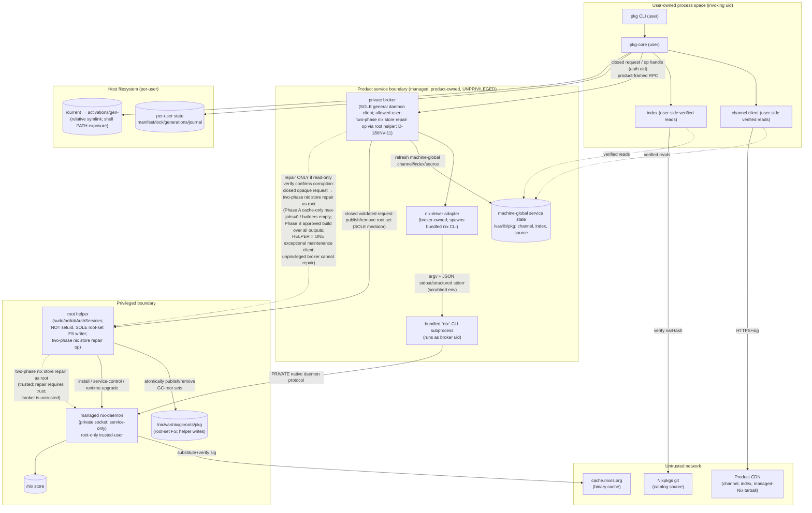

# 08 — Security Model & Threat Catalog

**Owner:** Assurance track (plans 08–12). **Status:** Draft v1 (planning only).
**Depends on:** `00-overview-and-decisions.md`, `01-system-architecture.md`, `02-trust-and-update-model.md`, `03-nixpkgs-source-and-index.md`, `04-resolution-install-build.md`, `05-state-locks-generations-gc.md`, `06-cli-and-user-experience.md`, `07-platform-installation-and-runtime.md`.
**Feeds into:** `09-testing-and-validation.md` (security test lane), `10-release-and-operations.md` (key/incident/revocation), `11-pr-roadmap.md` (security PRs), `12-open-decisions-and-risks.md` (security risks & crypto decisions).

---

## 1. Purpose & Scope

This document defines an **explicit, falsifiable threat model** for the product: a Rust
package manager that hides a bundled, **managed** Nix runtime behind brew/paru-style
commands, where Nixpkgs-at-an-exact-revision is the catalog and `cache.nixos.org` is the
v1 binary cache.

### In scope
- All v1 surfaces: installer, root helper / privileged daemon, the **product-owned private broker** (sole general Nix-daemon client for normal ops; the two-phase `nix store repair` maintenance op is delegated to the root helper; D-18/INV-11), broker↔Nix IPC, CLI,
  state/locks/generations, GC roots, channel metadata, the disposable search index,
  substitution, local Linux builds, uninstall, and **runtime execution of installed
  packages**.
- The full life cycle: first install → steady state → update → rollback → uninstall.

### Explicitly out of scope (v1)
- **Runtime sandboxing of installed applications.** Once a package is *activated* into the
  user's PATH, it executes with the user's normal privileges. v1 does **not** containerize,
  seccomp, or otherwise isolate installed apps at runtime. See §11 (honest limitations) and
  threat **T-RUN-1**.
- **Multi-user features beyond the D-17 per-user state split.** v1 *does* isolate
  users: authoritative package state (manifest/lock/generations/activation/journal)
  is per-user keyed by uid, and the privileged boundary is UID-authenticated
  (D-17/INV-10/ARCH-INV-06; see T-INST-6, AC-S11/S12). What remains out of scope is
  *deeper* multi-user features: per-user substituters/trust keys, shared or
  co-owned activations, and runtime isolation of one user's installed apps from
  another (those stay with the per-user trust model above, not a new surface).
- Windows (no v1 target).
- Arbitrary user-supplied Nix expressions, flakes, overlays, or substituters — these are
  **removed from the attack surface by design** (see `02` and §6.4).

### Reading convention
Throughout this document:

> **ℹ️ FACT (current Nix behavior)** — verifiable against official Nix documentation today.
>
> **📐 DECISION (product design)** — a choice we make on top of Nix; not a Nix guarantee.

Primary sources cited by short key (full list in §13):
`[NIX-MANUAL]`, `[NIXPKGS-MANUAL]`, `[NIX-SEC]` (security chapter), `[TUF]`, `[TOUGH]`,
`[SIGSTORE]`, `[RB]` (Reproducible Builds), `[NIX-CVE]`, `[NIXOS-SA]`, `[HYDRA]`.

---

## 2. System Under Consideration & Trust Boundaries

### 2.1 Components

| ID | Component | Owner plan | Runs as | Persisted where |
|----|-----------|-----------|---------|-----------------|
| CLI | User-facing command binary (`pkg`) | `06` | invoking user | — |
| CORE | Rust domain core: state, locks, generations, resolver, install pipeline | `04`,`05` | invoking user | product state dir |
| CHANNEL | Signed channel descriptor client (mature update metadata). **Refresh of machine-global channel is broker-mediated**; user-side does verified reads only | `02` | invoking user (verified reads); broker-mediated refresh | per-user cache (reads); `/var/lib/pkg/channel` (machine-global, broker-owned) |
| INDEX | Disposable search/list/info index (derived from pinned Nixpkgs). **Refresh is broker-mediated**; verified reads may be user-side | `03` | invoking user (verified reads); broker-mediated refresh | per-user cache (reads); `/var/lib/pkg/index` (machine-global, broker-owned) |
| BROKER | **Product-owned, unprivileged private broker service (D-18/INV-11):** sole **general** client of the private daemon socket for all normal operations — evaluate/build/substitute/path-info/read-only `nix store verify`/liveness-respecting GC — (a daemon `allowed-user`, **never** a Nix `trusted-user`; `trusted-users` are root-equivalent; the two-phase `nix store repair` maintenance op is delegated to the root helper, §6.1 T-INST-7); owns NIXCLIENT; spawns the bundled `nix` CLI; **sole mediator/requester** of per-output GC-root operations (root helper is the sole writer); **sole client** that may ask the root helper to run the two-phase repair op; mediates machine-global channel/index/source refresh; authenticates caller uid | `01` | product-owned unprivileged dedicated service (daemon-client capability; GC-root mediation; repair-delegation via opaque request only) | `/var/lib/pkg` machine-global service state |
| NIXCLIENT | Product's `nix-driver` adapter — **broker-owned, inside the service boundary**; spawns the bundled `nix` CLI subprocess (argv) and parses its JSON stdout/structured stderr where supported (§11). The bundled CLI→`nix-daemon` link is Nix's **private native daemon protocol, not JSON**; never runs as the invoking user | `01`,`04` | broker | — |
| NIXD | Managed Nix daemon (bundled, pinned); **private socket, service-only**; reached by the bundled `nix` CLI over Nix's private native daemon protocol (never by `pkg` directly) | `01`,`07` | privileged (root-owned svc, builder users) | `/nix`-style store |
| STORE | The Nix store (closure of built/substituted paths) | `01`,`07` | root-owned files, builder-writable during build | managed store prefix |
| HELPER | Privileged installer/root helper (**sudo/polkit/AuthorizationServices or narrow root service; NOT a Linux setuid binary in v1**); **sole root-set filesystem writer** that atomically publishes/removes GC-root sets under `/nix/var/nix/gcroots/pkg` on a closed validated request from the broker only; **and the one exceptional maintenance client** that runs the **two-phase `nix store repair`** maintenance operation as root (the modern mutating command; there is **no** `nix store verify --repair` — `verify` is read-only, `repair` mutates; repair requests require a **trusted** daemon client — verified Nix 2.34.8) against a broker-chosen validated set of registered StorePath targets within the FULL computed closure reachable from the generation's selected output roots (incl. missing-on-disk targets), invoked only on a closed opaque/typed broker request after the broker's read-only `nix store verify` confirms corruption: **Phase A** per-path cache-only repair (managed pinned substituters/keys, `max-jobs = 0`, `builders` empty; auto-repairs a signed cache hit, stops before any local/remote build on an unavailable substitute); **Phase B** the ordinary build preview/approval flow with a `RepairBuildPlan`/digest over **every output Nix may rebuild** (`Store::repairPath` rebuilds all outputs via `bmRepair`), holding the broker machine-wide build mutex + shared GC-inhibit permit, run locally with bounded nonzero `max-jobs`, `builders` empty; it resolves an opaque expiring single-use maintenance capability bound server-side to caller UID, an existing pkg-owned rooted generation, the exact typed corrupt targets within the FULL computed closure reachable from the generation's selected output roots (incl. missing-on-disk but registered/expected closure targets), the `RepairBuildPlan`/target digest, `policyVersion`, and mode (stale/replayed/mismatched/cross-UID fail closed), accepts no public/raw path, installable, derivation, expression, flake ref, argv, option, substituter/key, environment override, output selection, or arbitrary verb, executes per-path cache-only with final read-only verification (partial cache repairs resumable/idempotently reverified), and returns only sanitized per-path outcome (raw Nix logs service-private) — the user CLI never calls it directly | `07` | root | — |
| RELEASE | CI/release infra that signs channel metadata & publishes index/targets | `10` | release service | product CDN |

### 2.2 Trust boundary diagram

**Trust boundaries crossed (each is a control point):**
1. **Internet → product CDN → CHANNEL.** Signed update metadata must verify (T-CHAN-*).
2. **Internet → cache.nixos.org → STORE.** Substituted paths must verify against the
   channel-approved key set (T-CACHE-*).
3. **User space → product service (BROKER) → privileged (NIXD/HELPER).** The CLI crosses
   only the broker's closed product-framed-RPC boundary; the raw daemon socket is
   **service-only** and never user-connectable (D-18/INV-11), and only the unprivileged
   broker (a daemon `allowed-user`, never a `trusted-user`; root is the only `trusted-user`)
   may reach it for all normal operations — via the bundled `nix` CLI over Nix's private native daemon protocol (never
   JSON); the one operation the unprivileged broker cannot do — **repair** (`nix store repair` / `Store::repairPath` requires a **trusted** daemon client; verified Nix 2.34.8) — is delegated to HELPER as a **two-phase** operation (T-INST-7). The broker authenticates the caller uid; HELPER is a narrow root boundary for
   install/service-control, is the **sole filesystem writer** of GC-root sets, and is the **one exceptional maintenance client** that runs the two-phase `nix store repair` operation as root, accepting a
   closed validated/opaque request from the broker only (the user CLI never calls it).
   (T-DAEMON-*, T-HELPER-*, T-INST-*, T-PATH-*.)
4. **User space → Host FS (STATE, CUR).** Per-user state + the `current` relative symlink
   must be integrity-checked and atomic (T-STATE-*, T-PATH-*).
5. **STORE → user runtime (PATH).** The `current` symlink forest exposes activated binaries
   on the user's PATH; activation maps provenance → executed code (T-RUN-*); we provide
   *provenance + reproducibility*, not runtime isolation.

---

## 3. Assets & Security Goals

| Asset | Confidentiality | Integrity | Authenticity | Availability |
|-------|:---:|:---:|:---:|:---:|
| Product state (locks, generations, journal) | low | **critical** | **critical** (anti-rollback) | high |
| Channel metadata + signing keys (root/targets) | n/a | **critical** | **critical** | high |
| Managed Nix install (binaries, daemon config) | low | **critical** | **critical** | high |
| Disposable search index | low | medium (regenerable) | medium (narHash-pinned) | low |
| Nix store contents | low | **critical** | **critical** (signed/NAR-verified) | high |
| User data / shell environment | medium | high | n/a | high |
| Signing keys (release-side) | **critical** | **critical** | n/a | high |

**Primary security goals (G1–G6):**
- **G1 Authenticity of catalog & runtime.** Only the product-approved Nixpkgs revision,
  managed-Nix version, index hash, and substituter/key set are ever used.
- **G2 Integrity of installed software.** Every store path is either substituted under a
  channel-trusted key or locally built from the pinned Nixpkgs under sandbox; corrupted
  paths are detected and repaired.
- **G3 Anti-rollback / anti-freeze of channel metadata.** Clients reject stale, replayed,
  or frozen channel descriptors.
- **G4 State integrity & recoverability.** Operations are atomic; a failed install leaves
  the prior generation intact; tampered state is detected, not silently repaired from
  attacker data.
- **G5 Least privilege.** The privileged helper and daemon expose a minimal, authenticated
  surface; the daemon socket is service-only with the broker as its sole `allowed-user`
  (root alone `trusted`; `trusted-users` are root-equivalent) and sole **general** client —
  the two-phase `nix store repair` op is run by the root helper as root (repair requires a
  **trusted** daemon client; verified Nix 2.34.8), never by an end user — so no arbitrary
  eval/substituter/expression controls reach an end user and ordinary users get no socket
  access.
- **G6 No silent privilege escalation or persistence.** Installer/daemon setup is explicit
  and reversible; uninstall is bounded and never removes assets we did not create.

---

## 4. Actors & Positions

| Actor | Trust level | Capabilities assumed |
|-------|-------------|----------------------|
| End user (legitimate) | Trusted for their own data; **not** trusted to supply Nix inputs | Runs CLI; can edit files they own; **cannot** supply flakes/overlays/substituters |
| Network attacker (MITM) | Untrusted | Can tamper with/drop/replay HTTPS to CDN or cache; can serve old artifacts |
| Malicious package in Nixpkgs | **Partially trusted by Nix** as a *build recipe* | Can execute arbitrary build logic under sandbox; can produce malicious binaries (see §11) |
| Compromised CDN account | High impact, low likelihood | Can publish new channel/index/Nix artifacts; **cannot** forge signatures without keys |
| Compromised release-signing key | **Critical** | Can sign malicious channel metadata until detected & revoked |
| Local unprivileged attacker on host | Can read/write their own files; may try symlink/path tricks | Targets STATE/HOME/cache paths; cannot write `/nix` store or privileged dirs |
| Local privileged attacker (root) | **Out of scope** | Root on the host can always win (tamper with store, keys, kernel). We detect, we don't prevent. |

---

## 5. Nix Guarantees — Facts vs. What We Add

It is essential to be precise about what Nix **does** and **does not** promise, because a
naïve reading of "Nix is reproducible and signed" overstates our security posture.

### 5.1 What Nix actually guarantees (FACTs)

> **ℹ️ FACT.** Nix store paths are content-addressed by derivation input hash
> (`/nix/store/<hash>-<name>`); the hash binds all build inputs. `[NIX-MANUAL]`
>
> **ℹ️ FACT.** Binary caches sign each downloadable path with **Ed25519** keys; a client
> only accepts a substitute if the path's signature verifies against a configured
> **trusted-public-keys** set and the substituter is permitted. `[NIX-MANUAL]` "Secure
> Binary Caches".
>
> **ℹ️ FACT (modern new-CLI model pkg uses).** The modern commands are **`nix store verify`** (read-only NAR-integrity check; permitted to untrusted / `allowed-user` clients) and the **separate** mutating command **`nix store repair`** (there is **no** modern `nix store verify --repair` single flag). `Store::repairPath` (driven by `nix store repair`) re-fetches/rebuilds from trusted sources and **requires a trusted daemon client**. (The legacy `nix-store --verify --repair` single-flag form exists in old Nix but is **not** what pkg uses; pkg never performs a single-phase repair — see §5.3 and T-INST-7.) `[NIX-MANUAL]`
>
> **ℹ️ FACT.** With **`sandbox = true`**, Nix implements its **own** Linux namespaces/chroot sandbox
> (it does **not** invoke bubblewrap); macOS uses Nix's Darwin sandbox. Regular input-addressed
> derivations are filesystem-sandboxed and network-denied. **Fixed-output** derivations remain
> filesystem-sandboxed but are **intentionally network-enabled** — their output hash is the
> integrity boundary (on Linux they omit the private network namespace; on macOS the sandbox
> profile permits network for non-sandboxed derivation types). `__noChroot` is **rejected**
> under `sandbox=true` (it only bypasses under `sandbox=relaxed`). Verified against Nix 2.34.8
> (`src/libstore/unix/build/{linux,darwin}-derivation-builder.cc`, `derivation-builder.cc`,
> `src/libstore/derivations.cc`). `[NIX-MANUAL]` "Sandboxed builds".
>
> **ℹ️ FACT.** `nix-daemon` authenticates clients via Unix-socket permissions plus the
> `trusted-users` / `allowed-users` config; only trusted users can perform privileged
> operations. `[NIX-MANUAL]`
>
> **ℹ️ FACT.** In Nix's multi-user model, `trusted-users` are effectively **root-equivalent**,
> and **repair requests require a trusted daemon client**: the modern mutating command is
> **`nix store repair`** (there is **no** modern `nix store verify --repair` combination — `verify` is
> read-only, `repair` mutates), and `Store::repairPath` (driven by `nix store repair`) is trust-gated
> — untrusted / `allowed-user` clients cannot repair. Verified against Nix 2.34.8
> (`Store::repairPath`; `bmRepair`). `[NIX-MANUAL]`
> "Configuration" (`trusted-users`/`allowed-users`). **Consequence:** the product's
> unprivileged broker (an `allowed-user`, never a `trusted-user`) can `verify` (read-only)
> but **cannot** run `nix store repair`; repair is delegated to the root helper as a two-phase operation
> (§6.1 T-INST-7, `01` §12.4).
>
> **ℹ️ FACT.** Nixpkgs reproducibility is **per-derivation and incomplete**; many
> attributes are not bit-for-bit reproducible. Reproducible Builds tracks coverage.
> `[RB]`, `[NIXPKGS-MANUAL]`

### 5.2 What Nix does **not** guarantee — and therefore what the product must be honest about

> **ℹ️ FACT (the central honesty point).** **Nixpkgs is not a security audit or allowlist.**
> It is a large, community-reviewed repository. Pinning a revision gives **reproducibility
> and provenance of the build**, **not** assurance that the recipe or its upstream source is
> free of malware. Public supply-chain incidents have affected Nixpkgs. `[NIXOS-SA]`,
> `[NIXPKGS-MANUAL]`. **Consequence:** the product *inherits* this risk and must say so to
> users (see §11, T-RUN-1). We add **no** claim of "safe to install."

> **ℹ️ FACT.** Local builds run the **derivation's build script on the host.** Even with
> sandboxing, the build script is whatever the pinned Nixpkgs says; a malicious recipe can
> attempt to exfiltrate during build (**regular** derivations are network-denied under
> `sandbox=true`; **fixed-output** derivations are network-enabled and rely on their output
> hash as the integrity boundary) or produce a malicious output that is then *executed at runtime*.

> **ℹ️ FACT.** Signature verification only proves a path was vouched for by a trusted
> **cache key**. It does **not** prove the path is benign. Trusting `cache.nixos.org` means
> trusting whatever Hydra built from that Nixpkgs revision. `[HYDRA]`

### 5.3 What the product adds on top (DECISIONs)

> **📐 DECISION (G1).** The product reads **only** its signed channel descriptor for the set
> of `trusted-public-keys`, `substituters`, supported systems, Nixpkgs `rev`/`narHash`,
> managed-Nix version, and index hashes. User config cannot broaden this set. (`02`)
>
> **📐 DECISION (G3).** Channel metadata uses a **mature** signed-update framework with
> built-in rollback/freeze protection — **real TUF** via the Rust `tough` crate (used by AWS
> Bottlerocket), **not** a hand-rolled "TUF-lite." See §7 and DR-002 in `12`. `[TUF]`,
> `[TOUGH]`
>
> **📐 DECISION (G5).** The product owns GC roots, generations, and activation; Nix profile
> state is **not authoritative**. The managed Nix daemon socket is **service-only** and
> reachable by exactly **one** unprivileged identity — the dedicated **broker** service
> (D-18/INV-11), configured as a daemon **`allowed-user`** (never a `trusted-user`); **root
> alone is `trusted`**. Ordinary users get **no** socket access at all. Intended
> next-milestone concrete policy: `trusted-users = root`, `allowed-users = pkg-nix-broker`,
> substituters pinned to the channel set. The broker is never granted Nix `trusted-user`
> power (no arbitrary eval/substituter/expression control reaches an end user).
>
> **📐 DECISION (G5, repair privilege split).** Because `trusted-users` are effectively
> root-equivalent and **repair requests require a trusted daemon client** (the modern mutating
> command is **`nix store repair`** — there is **no** modern `nix store verify --repair` combination;
> `verify` is read-only, `repair` mutates; `Store::repairPath`, driven by `nix store repair`, first
> tries Repair-mode substitution and, failing that with a valid deriver, rebuilds **all** outputs via
> `bmRepair`; verified Nix 2.34.8), the broker — kept deliberately unprivileged — **cannot** repair;
> `pkg repair` is two-phase: the broker verifies read-only with **`nix store verify --recursive`**,
> and only confirmed corruption is forwarded as a **closed opaque/typed request** to the root
> helper, which is the **one exceptional maintenance client** and runs **`nix store repair` as root
> in two phases**. **Phase A (cache-only):** per-path `nix store repair` against a **nonempty
> sorted validated set of registered StorePath targets** (the corrupt targets plus any missing-on-disk but registered/expected closure targets, all within the FULL computed closure reachable from the generation's selected output roots; drawn from broker-held generation state), with
> **managed pinned substituters/keys**, **`max-jobs = 0`** (disables local build), and **`builders`
> empty** (prohibits remote build); it may auto-repair a **signed cache hit** and **must stop
> before any local/remote build** when a substitute is unavailable. **Phase B (fallback rebuild):**
> a corrupt path with no signed substitute but a valid deriver rebuilds via the **ordinary public
> build preview / explicit approval flow**, whose **`RepairBuildPlan`/digest covers every output
> Nix may rebuild, not just the corrupt output**, holding the **broker machine-wide build mutex**
> + **shared GC-inhibit permit**, run **locally** with **bounded nonzero `max-jobs`** and
> **`builders` empty**. The helper resolves an **opaque expiring single-use maintenance capability**
> bound server-side to the **caller UID**, an **existing pkg-owned rooted generation**, the
> **exact typed corrupt targets within the FULL computed closure reachable from the generation's selected output roots (incl. missing-on-disk targets)**, the **`RepairBuildPlan`/target digest**, the **policyVersion**, and the
> **mode** (stale/replayed/mismatched/cross-UID fail closed). The helper accepts **no** public/raw
> path, installable, derivation, expression, flake ref, argv, option, substituter/key, environment
> override, output selection, or arbitrary verb; it executes per-path cache-only with **final
> read-only verification** (partial cache repairs resumable/idempotently reverified), and returns
> **only sanitized per-path outcome** to the broker (raw Nix logs service-private; CLI/broker
> public output sanitized; public receives sanitized outcome/versioned events). Exact helper
> framing/RPC fields remain the next broker milestone; these state invariants are accepted now.
> **GC stays in the unprivileged broker** (liveness must never be ignored). (`01` §11/§12.4, `05`,
> `07`; threat T-INST-7.)
>
> **📐 DECISION (G4).** State writes are atomic (temp+fsync+rename), generation-numbered,
> and journal-backed; integrity is self-checked on load. Tampered state fails **closed** and
> surfaces the last known-good generation, never auto-repairing from attacker-controlled
> files. (`05`)

---

## 6. Threat Catalog

Each threat: **ID · component · STRIDE · attacker position · capability needed · impact ·
Nix-native control · Product control · residual · plan refs.** Severity = Likelihood ×
Impact (L/M/H) using the rubric in §6.0.

### 6.0 Severity rubric
- **Likelihood:** L = requires key compromise or privileged position; M = network position or
  public-cache write; H = any local user or trivial public input.
- **Impact:** L = degraded UX / regenerable data; M = denial of service / wrong version
  installed (still pinned & reproducible); H = code execution as user / persistence /
  loss of the product's authenticity guarantee.

### 6.1 Installer & root helper

| ID | Threat | STRIDE | Attacker pos. | Capability | Impact | Nix control | Product control | Residual | Refs |
|----|--------|--------|---------------|-----------|--------|-------------|-----------------|----------|------|
| **T-INST-1** | Malicious/modified installer script downloaded over MITM or from spoofed host | Spoofing/Tampering | Network | Serve altered installer | H | none | Pin installer checksum in docs; fetch over TLS with pinned cert/commit; verify detached signature; `pkg doctor` self-verify | M (key/cert compromise) | `07`,`10` |
| **T-INST-2** | TOCTOU / symlink swap in directories the installer writes before privilege drop | Tampering/EoP | Local unpriv. | Pre-create symlink in writable path | H | none | Installer uses `O_NOFOLLOW`, `mkdtemp` under product-owned root, `fchdir`+`openat` relative opens; rejects world-writable ancestors | L | `07` |
| **T-INST-3** | Root helper accepts unauthenticated commands from any local user | EoP | Local unpriv. | Talk to helper socket | H | n/a | The helper accepts **only** a closed validated request from the **broker** (its sole caller); it authenticates the broker via `SO_PEERCRED` (Linux) / `getpeereid` (macOS launchd-managed Unix transport) over a fixed `0660` socket inside a `root:pkg-nix-broker` `0750` parent, enforces a command allowlist (exactly: root-set publish/remove **and** the two-phase `nix store repair` maintenance op — a closed opaque request resolved via an opaque expiring single-use maintenance capability to a validated StorePath set; see T-INST-7) with no path/string passthrough to shell, and the user CLI never calls it directly | L | `07`,`04` |
| **T-INST-4** | Existing **unmanaged** Nix present; product silently co-mounts `/nix/store` and crosses trust domains | EoP/Tampering | Pre-existing install | Pre-seed store/profiles | H | none | **Fail closed**: refuse to install/manage; emit manual remediation; **never auto-delete** user's Nix. (G6) | L (UX: user must remediate) | `07`,`01` |
| **T-INST-5** | Installer leaves privileged helper with overly broad permissions | EoP | Local unpriv. | Invoke helper | H | n/a | **v1 uses no Linux `setuid` binary**: HELPER is sudo/polkit (Linux), AuthorizationServices-gated launchd (macOS), or a narrow root service, scoped to install/service-control/runtime-upgrade/root-set publish **and** the two-phase `nix store repair` maintenance op only (T-INST-7) | L | `07` |
| **T-INST-6** | Cross-user tampering / UID confusion: a local user tries to read/modify another user's authoritative state or trick the helper/daemon into creating GC roots under another uid | EoP/Tampering | Local unpriv. | Spoof identity / cross-uid path | H | socket peer creds | Per-user `<user-state>` owned by uid 0700 (D-17/INV-10); the **broker** authenticates the end-user uid on its closed-request channel and is the **sole mediator** that asks the helper to publish roots; the **helper is the sole writer** and its only peer is the broker (it never trusts an end-user uid presented by a local user directly), scoping each write to `/nix/var/nix/gcroots/pkg/users/<validated-uid>/` only (ARCH-INV-05/06); daemon `trusted-users = root` only, `allowed-users = pkg-nix-broker` only; package state never globally shared | L | `01`,`05`,`07` |
| **T-INST-7** | Confused-deputy repair: an attacker (or tampered broker state) tries to make the root helper run repair against attacker-chosen paths / arbitrary installables / flags, turning the privileged repair op into a primitive to repair or rebuild arbitrary store paths or to pass attacker argv/options/substituters to the daemon as root | EoP/Tampering | Local unpriv. via tampered state, or broker-adjacent input | Reach helper / craft repair request | H | repair requires trust (`Store::repairPath`/`nix store repair` reject untrusted clients; verified Nix 2.34.8) | The helper is the **one exceptional maintenance client** and runs **only** the modern mutating command **`nix store repair`** as root, in **two phases**, against a **fixed, nonempty, sorted, validated set of registered StorePath targets** — the corrupt targets plus any missing-on-disk but registered/expected closure targets, all within the FULL computed closure reachable from the generation's selected output roots (chosen from **broker-held generation state**, never from public/user input). It creates/retains an **opaque expiring single-use maintenance capability** bound **server-side** to: the **caller UID**, an **existing pkg-owned rooted generation**, the **exact typed corrupt targets within the FULL computed closure reachable from the generation's selected output roots (incl. missing-on-disk targets)**, the **`RepairBuildPlan`/target digest**, the **policyVersion**, and the **mode**; stale, replayed, mismatched, or cross-UID capabilities **fail closed** (single-use and invalidated on helper/broker restart; resume/retry per ARCH-INV-10 of `01` — cache-only Phase A auto-retries from the per-path journal, a Phase B build is never auto-retried and needs fresh preview/approval/capability). **Phase A:** per-path **cache-only** repair with **managed pinned substituters/keys**, **`max-jobs = 0`**, **`builders` empty** — auto-repairs a signed cache hit, and **must stop before any local/remote build** on an unavailable substitute (`max-jobs = 0` + empty `builders` makes the `Store::repairPath` rebuild branch unable to proceed). **Phase B:** any fallback rebuild uses the **ordinary public build preview / explicit approval flow**, whose **`RepairBuildPlan`/digest covers every output Nix may rebuild** (because `Store::repairPath` rebuilds **all** outputs via `bmRepair`, not just the corrupt output), holding the **broker machine-wide build mutex** + **shared GC-inhibit permit**, run **locally** with **bounded nonzero `max-jobs`**, **`builders` empty**. The helper accepts **no** public/raw path, installable, derivation, expression, flake ref, argv, option, substituter/key, environment override, output selection, or arbitrary verb; the broker reaches the helper only **after** its own read-only `nix store verify` confirms corruption; it executes per-path cache-only with **final read-only verification** (partial cache repairs resumable/idempotently reverified); it returns **only sanitized per-path outcome** to the broker (**raw Nix logs service-private only**; public receives sanitized outcome/versioned events); the user CLI never calls the helper. **Repair is an explicit user action that warns affected commands may be temporarily unavailable; it is non-atomic per path** (cache repair deletes the live path before NAR restore; local repair moves the old aside before replacement), **journaled per path with final read-only verify governing success, never creates/swaps a generation, and never auto-retries a Phase B build** (ARCH-INV-10 of `01`). Exact helper framing/RPC fields remain the next broker milestone; these state invariants are accepted now | L | `01`,`05`,`07` |
| **T-INST-8** | Repair-build amplification: because `Store::repairPath` rebuilds **all** outputs of a deriver (`bmRepair`), a Phase-B fallback repair could build outputs beyond the corrupt one (e.g. `debug`/`dev`/large outputs), widening the build surface and the approval blast radius if the preview only showed the corrupt output | Tampering/DoS | Tampered/corrupt store path whose deriver is multi-output | Trigger a Phase-B repair | M | n/a (Nix rebuilds all outputs on repair by design) | The Phase-B **`RepairBuildPlan`/digest enumerates every output Nix may rebuild, not just the corrupt output**; the explicit single-operation approval binds to that digest (no `PKG_YES_TO_BUILDS`/session skip; `--yes` pre-approves that one op only; approval never persists beyond the op); the op is **serialized by the broker machine-wide build mutex** (machine-global local-build admission permit) + **shared GC-inhibit permit** and run locally with **bounded nonzero `max-jobs`**, **`builders` empty**; the maintenance capability binds the exact `RepairBuildPlan` digest + `policyVersion`, so any output-set drift fails closed (re-derive-before-execute; non-interactive exits `ACQUIRE_NEEDS_APPROVAL`) | L | `01`,`04`,`05` |

### 6.2 Daemon & IPC protocol (product↔Nix and product↔helper)

| ID | Threat | STRIDE | Detail | Controls | Residual | Refs |
|----|--------|--------|--------|----------|----------|------|
| **T-DAEMON-1** | Untrusted client drives the managed `nix-daemon` to build/eval arbitrary expressions or pull from arbitrary substituters | EoP/Tampering | `trusted-users` too broad; user supplies `--expr`/`--substituters` | The raw daemon socket is **service-only** and reachable only by the unprivileged **broker** (a daemon **`allowed-user`**, never a `trusted-user`; `trusted-users = root` only), so an end user cannot reach the daemon at all — the broker reaches it only via the bundled `nix` CLI over Nix's private native protocol (never JSON); the broker forwards only closed requests (never expression/substituter flags); `restrict-eval` + `--allowed-uris` for any eval the broker performs; the one Nix op an unprivileged client cannot do — **repair** (`nix store repair` / `Store::repairPath` requires a **trusted** daemon client; verified Nix 2.34.8) — is delegated to the root helper as a **two-phase** operation (T-INST-7), never exposed to end users | L | `01`,`04` |
| **T-DAEMON-2** | JSON/CLI contract parsing: malformed or huge Nix output causes panic/RCE in product | DoS/RCE | Nix emits unexpected JSON | Parse with strict serde, size-capped, never `eval`; contract tests in `09` (golden + fuzz) | L | `04`,`09` |
| **T-DAEMON-3** | Replay of an old daemon command stream | Tampering | Capture socket traffic | Daemon ops are idempotent & validated against current state; no replay-sensitive tokens over the socket | L | `04` |
| **T-DAEMON-4** | Rogue process impersonates the daemon on the socket (path hijack) | Spoofing | Replace socket file | Setup owns the well-known parent `daemon-socket` dir `root:pkg-nix-broker` `0750`; **Linux** — systemd **socket activation** creates the socket `root:pkg-nix-broker` `0660`; **macOS** — Nix self-creates a hard-coded `0666` socket (not a `nix.conf` knob), so the `0750` parent dir + `allowed-users = pkg-nix-broker` + traversal restriction is the boundary; the **broker is the sole connector** to this service-only path; verify peer creds (Linux `SO_PEERCRED` / macOS Audit Token) **and the expected endpoint** | L | `07` |

### 6.3 Source evaluation (pinned Nixpkgs reevaluation)

| ID | Threat | STRIDE | Detail | Controls | Residual | Refs |
|----|--------|--------|--------|----------|----------|------|
| **T-EVAL-1** | A pinned Nixpkgs attribute performs **impure** fetches at eval time (e.g., `fetchTarball` without hash, `builtins.currentTime`) | Tampering/Info disclosure | Uncontrolled network/impurity during resolve | We pin `narHash`/`rev`; use `--pure-eval`/`restrict-eval`; forbid `--impure`; reject attributes that require impurity | L | `03`,`04` |
| **T-EVAL-2** | Eval-time side effects leak host info (env, paths) | Info disclosure | Impure eval reads env | Pure-eval enforces; product passes minimal env to the Nix invocation; env scrub documented | L | `04` |
| **T-EVAL-3** | Eval is expensive → DoS via pathological attribute | DoS | Resolve hangs/OOMs | Time + memory caps on eval (`RLIMIT`, `timeout`), cancellation, preflight cost preview to user | M | `04`,`09` |

### 6.4 Index poisoning (disposable search index)

| ID | Threat | STRIDE | Detail | Controls | Residual | Refs |
|----|--------|--------|--------|----------|----------|------|
| **T-IDX-1** | Attacker tampers with the published index to make `search`/`info` misdirect users (e.g., point "openssl" at a malicious pname) | Spoofing/Tampering | MITM or CDN compromise | Index is **disposable** and re-derived from the pinned Nixpkgs `narHash`; published index carries a hash recorded **in the signed channel descriptor**; client verifies hash before use, regenerates on mismatch | L | `03`,`02` |
| **T-IDX-2** | Local cache of the index is swapped for a poisoned one | Tampering | Local unpriv. writes to cache dir | Index path under product-owned dir with 0700; hash verified every load; on mismatch, re-derive (do **not** trust local copy) | L | `03` |
| **T-IDX-3** | Index regeneration is non-deterministic → silent drift | Tampering (false confidence) | Build nondeterminism | Reproducible index build (sorted, pinned inputs); CI asserts determinism across hosts (`09`) | L | `03`,`09` |
| **T-IDX-4** | "Typosquatting"/naming confusion **within Nixpkgs itself** is surfaced to the user as if curated | Spoofing | Nixpkgs contains confusing/duplicate names | We **do not** claim curation; search results show the **product package identity, version, and source/provenance** (catalog revision + build/cache origin) in product language — not raw `attribute`/`closure`/`narHash`/`substituter` internals; `info` surfaces upstream homepage/license so users can disambiguate (honesty, not a fix) | **M (inherited)** | `03`,`06` |

> **📐 DECISION.** The index is **defense-in-depth**, never a trust root. A package is
> *resolved and realized* from the pinned Nixpkgs, not "installed from the index." A poisoned
> index can mislead the UI but **cannot** change what bytes get installed (T-IDX-* impact is
> bounded to UX misleading, not RCE).

### 6.5 Channel rollback / freeze

| ID | Threat | STRIDE | Detail | Controls | Residual | Refs |
|----|--------|--------|--------|----------|----------|------|
| **T-CHAN-1** | **Rollback attack**: attacker serves an older, validly-signed channel descriptor (e.g., one pinning a vulnerable Nixpkgs with a known-bad package) | Tampering | Replay old descriptor | **Real TUF** provides timestamp+snapshot roles with expiry and a monotonically-checked version; client refuses descriptors past expiry or with lower version than previously seen | L | `02`,`12` (DR-002) |
| **T-CHAN-2** | **Freeze attack**: attacker blocks updates so client keeps using a stale-but-valid descriptor indefinitely | DoS/Tampering | Block HTTPS | TUF `timestamp.json` has a short expiry; product surfaces "channel is stale" to user and refuses `update`/`upgrade` after grace window | M (UX) | `02` |
| **T-CHAN-3** | **Mix-and-match**: attacker combines roles from different versions | Tampering | Combine snapshots/targets | TUF roles are cross-signed within a consistent snapshot; client verifies the snapshot hashes targets | L | `02` |
| **T-CHAN-4** | **Endless-data**: attacker serves huge metadata to exhaust resources | DoS | Large JSON | Size caps; TUF metadata is tiny by construction (small target set) | L | `02` |
| **T-CHAN-5** | **Key compromise**: a channel signing key is stolen | Tampering (forge) | Steal key | TUF **threshold** signatures + key rotation/revocation via a new root role; revocation procedure in `10`; offline root key | M (until rotation) | `02`,`10` |

### 6.6 Cache substitution (`cache.nixos.org`)

| ID | Threat | STRIDE | Detail | Controls | Residual | Refs |
|----|--------|--------|--------|----------|----------|------|
| **T-CACHE-1** | MITM serves an unsigned or differently-signed path | Tampering | Network | Nix verifies Ed25519 sig against channel-trusted keys; substituters pinned to `cache.nixos.org` only; product ignores `~/.config/nix/nix.conf` substituters | L | `02`,`01` |
| **T-CACHE-2** | cache.nixos.org itself is compromised and serves paths signed by its own (trusted) key that are malicious | Tampering (trusted!) | Cache-key abuse | We **cannot** prevent (we trust the key); mitigate via: pin Nixpkgs rev so the *closure* is fixed & reproducible; offer `repair` (re-verify NAR); document inherited risk; future: second-source/mirror for v2 | **H (inherited, low likelihood)** | `10`,`11` |
| **T-CACHE-3** | Path collides with local store but NAR differs (corruption masked) | Tampering | Local corruption | `nix store verify` (read-only) detects; product runs verify on `repair` and on doctor | L | `04` |
| **T-CACHE-4** | Substituter key rotation by upstream not reflected in channel | DoS | Old key removed | Channel descriptor is the single source of allowed keys; we update via signed channel update, not upstream nix.conf | L | `02` |

> **ℹ️ FACT.** Trusting `cache.nixos.org` is equivalent to trusting Hydra's build of that
> Nixpkgs revision. `[HYDRA]` **📐 DECISION.** v1 accepts this single source of binaries and
> says so explicitly; a multi-cache/threshold-binary-trust model is **deferred** to v2
> (T-CACHE-2 residual).

### 6.7 Local builds (Linux and macOS, native system, after preview+approval)

| ID | Threat | STRIDE | Detail | Controls | Residual | Refs |
|----|--------|--------|--------|----------|----------|------|
| **T-BUILD-1** | Build script (from Nixpkgs) runs arbitrary code during local build | RCE-as-builder | Any local build (Linux **and** macOS) | `sandbox=true`/`sandbox-fallback=false` (both platforms; **regular** derivations network-denied + fs-restricted; **fixed-output** derivations network-enabled with their output hash as the integrity boundary; `__noChroot` rejected under `sandbox=true`); builder users isolated (group `nixbld`; `nixbld*`/`_nixbld*`); **explicit single-operation user approval** after a deterministic preview (derivations/source inputs, closure, resource estimate, target system, sandbox status, and a fixed-output label), bound to the canonical `BuildPlan` digest + policy version (`--yes` pre-approves that one op non-interactively; no `PKG_YES_TO_BUILDS`/session skip); approval never overrides a hard policy refusal; `pkg` fails closed if sandbox/build-user readiness cannot be verified. Nix's macOS sandbox uses different, generally narrower primitives than Linux's | M (sandbox escapes are rare but exist; macOS isolation is narrower than Linux's) | `04`,`07` |
| **T-BUILD-2** | Resource exhaustion during build (fork bomb, disk fill) | DoS | Pathological derivation | **No stock per-build memory/CPU/IO cap exists in Nix 2.34.8.** What holds: `max-jobs=1` bounds concurrent derivations per client/connection (so `pkg` adds a machine-global local-build admission lease across users — a second build op waits or cancels, then revalidates approval/readiness once it acquires the lease); `timeout`/`max-silent-time`/`max-build-log-size` are daemon-enforced bounds; Nix `use-cgroups` (Linux only, experimental feature `cgroups`) is process grouping/lingering-process-cleanup/CPU-statistics, **not** caps (it does not write `memory.max`/`cpu.max`/`pids.max`/IO limits); preflight checks disk/free-space/load. Service-manager ceilings are **Pending** defense-in-depth, not accepted enforcement, and are **not** lumped together: systemd `MemoryMax`/`TasksMax`/`CPUQuota` (Linux) would be an **aggregate service-cgroup ceiling over the daemon plus all descendants** (a coarse whole-unit limit), whereas launchd `SoftResourceLimits`/`HardResourceLimits` (macOS — inherited per-process `setrlimit` values `CPU`/`Data`/`FileSize`/`NumberOfFiles`/`NumberOfProcesses`/`ResidentSetSize`/`Stack`; no `AddressSpace` key) are **per-process RLIMIT ceilings, not an aggregate daemon-subtree ceiling** (several keys are advisory or alter system `sysctls` for system daemons). The managed engine socket stays **product-private** (socket mode `0660` under Linux systemd socket activation / hard-coded `0666` on macOS where Nix self-creates it, under a `root:pkg-nix-broker` `0750` parent dir that blocks traversal by ordinary users; `trusted-users = root` only; the unprivileged broker is the sole `allowed-user` and never a `trusted-user`); v1 does **not** expose a group- or world-connectable raw Nix daemon socket to chase per-build caps (the raw managed daemon socket stays **product-private and non-user-connectable**; the product never recommends direct/raw socket access); the **private broker** — the daemon's sole general client (the two-phase `nix store repair` op is run by the root helper as root) and the sole mediator/requester of per-output GC-root operations (the root helper is the sole writer) — is the **accepted hidden-Nix V1 boundary** (D-18/INV-11; `00`), promoted from the former "next milestone" framing (DR-016 / `12`); its **detailed framed RPC schemas are the next milestone** (boundary ownership is fixed now) | **H (disclosed residual — RISK-07)** | `04` |
| **T-BUILD-3** | Build writes outside sandbox (sandbox escape) | Tampering/EoP | Kernel/CVE | Run as unprivileged builder users; drop all caps; monitor for sandbox=`broken`. **A seccomp profile is an open question (Q3), not an accepted v1 control** — do not claim one is in place | M (depends on kernel) | `07` |
| **T-BUILD-4** | Non-reproducible local build diverges from cache → "two valid builds" confusion | Tampering (trust) | Nondeterminism | When a cache path exists for the same drv, **prefer cache**; only build locally on a cache miss (V1 has no separate user-forced local-build path); `--check` available in `repair` | M | `04`,`03` |
| **T-BUILD-5** | Approval bypass (UI race) makes "build" the default | Tampering | UX bug | Approval is an **explicit** non-default action; never auto-build; the CLI records the consent event in the journal (V1 uses CLI inline rendering, not a TUI) | L | `06`,`04` |

### 6.8 Path / symlink attacks on state & activation

| ID | Threat | STRIDE | Detail | Controls | Residual | Refs |
|----|--------|--------|--------|----------|----------|------|
| **T-PATH-1** | Attacker pre-creates symlinks in product dirs to redirect writes (e.g., `current` → `/etc/passwd`) | Tampering/EoP | Local unpriv. | Product dirs `0700` owner=product; atomic `rename`/`symlink` with `O_NOFOLLOW`; reject if target exists & not owned; `openat`-relative | L | `05` |
| **T-PATH-2** | Activation swaps a binary in `<user-state>/current/bin` (the symlink forest) after verify but before exec | TOCTOU | Local unpriv. | Activation leaf symlinks point into the read-only store (`/nix/store/...`), not user-writable copies; `current` is a relative symlink to a `treeDigest`-verified forest; verify store path at activation time | L | `05`,`01` |
| **T-PATH-3** | PATH injection makes `pkg` invoke a trojaned `nix`/helper | EoP | PATH tamper | Product resolves managed-Nix & helper by **absolute path** from its install root, never `$PATH`; doctor warns on shadowing | L | `07`,`06` |
| **T-PATH-4** | World-writable ancestor directory of state files | Tampering | Bad perms | On load & write, walk ancestors, refuse if any is group/world-writable & not product-owned | L | `05` |

### 6.9 State tampering, concurrency, journal

| ID | Threat | STRIDE | Detail | Controls | Residual | Refs |
|----|--------|--------|--------|----------|----------|------|
| **T-STATE-1** | Direct edit of state to pin a malicious realized set or hide a downgrade | Tampering | Local unpriv./root | State is integrity-tagged (Merkle/sum over generations + signed anchor from channel); on mismatch, **fail closed** to last good; never auto-repair from local file | L (root can still win; detect only) | `05` |
| **T-STATE-2** | Two `pkg` instances race on the same state | Tampering/DoS | Concurrent CLI | Single-writer lock (flock on lockfile with pid+boot-id); stale-lock recovery via operation journal; operations idempotent & resumable | L | `05` |
| **T-STATE-3** | Crash mid-activation leaves inconsistent `current` | DoS | Power loss | Atomic `current` swap (rename), journal replay on startup to committed generation; previous generation always recoverable | L | `05` |
| **T-STATE-4** | Garbage-collecting a path still referenced by an active generation | DoS (broken activation) | GC bug | Product-owned GC roots mirror active generations; GC must consult generation manifest, not just roots | L | `05` |

### 6.10 Concurrency / process model

| ID | Threat | STRIDE | Detail | Controls | Residual | Refs |
|----|--------|--------|--------|----------|----------|------|
| **T-CONC-1** | Background `update`/`upgrade` racing interactive `install` | Tampering/DoS | Concurrent ops | Writer lock; long ops hold a *lease* renewed via journal; conflict surfaced to user | L | `05` |
| **T-CONC-2** | Daemon killed mid-substitute leaves partial path referenced | DoS | Crash | Nix atomic store import; product verifies completeness on next op | L | `04` |

### 6.11 Logs & secrets

| ID | Threat | STRIDE | Detail | Controls | Residual | Refs |
|----|--------|--------|--------|----------|----------|------|
| **T-LOG-1** | Logs leak secrets (tokens, private paths, env) | Info disclosure | Verbose logging | Structured logs with **allowlist** redactor; secret denylist; logs default to product dir 0600; never log env/args wholesale | L | `10`,`06` |
| **T-LOG-2** | Logs used to inject/mislead support (log injection) | Tampering | User-controlled strings in logs | Escape control chars; quote attacker-influenced fields | L | `10` |
| **T-LOG-3** | Crash dumps contain sensitive memory | Info disclosure | Panic | Rust panic = no core by default; opt-in minidump with redaction; `RUST_BACKTRACE` default 0 in release | L | `10` |

### 6.12 Update / release compromise

| ID | Threat | STRIDE | Detail | Controls | Residual | Refs |
|----|--------|--------|--------|----------|----------|------|
| **T-REL-1** | Compromised release pipeline signs malicious channel/index/Nix | Tampering (forge) | CI/CD hijack | Release signing on **offline/HSM-backed** step; threshold signatures (TUF); release attestation (provenance); 2-person release approval | M | `10` |
| **T-REL-2** | Signing key exfiltration | Forge | Key theft | Offline root key; online keys least-privilege & rotated; revocation procedure (§9 / `10`) | M | `10` |
| **T-REL-3** | Managed-Nix tarball or Nixpkgs tarball swapped on CDN | Tampering | CDN account | Hash recorded in **signed** channel descriptor; client verifies before use; pinning independent of CDN | L | `02`,`07` |
| **T-REL-4** | Supply-chain compromise of a Rust dependency | Tampering | Crate malice | `cargo deny`, `cargo audit` in CI, vendored lockfile, dependency review gate, reproducible builds of the CLI | M | `10`,`09` |

### 6.13 Uninstall

| ID | Threat | STRIDE | Detail | Controls | Residual | Refs |
|----|--------|--------|--------|----------|----------|------|
| **T-UNINST-1** | Uninstall removes the user's **own** Nix install/profile | Destruction | Over-broad cleanup | Uninstall removes **only** paths it created & recorded in an asset manifest; refuses to touch `/nix` if an unmanaged Nix is detected; dry-run preview | L | `07` |
| **T-UNINST-2** | Uninstall leaves privileged residue (daemon, root service/helper) | Persistence | Incomplete cleanup | Asset manifest is authoritative; uninstall verifies zero privileged residue and reports; `doctor --post-uninstall` | L | `07` |
| **T-UNINST-3** | Partial uninstall corrupts shell PATH permanently | DoS | Bad edit | PATH edits via a managed snippet file `source`d from rc, not inline edits; removal = delete snippet + warn | L | `06`,`07` |

### 6.14 Compromised packages at runtime

| ID | Threat | STRIDE | Detail | Controls | Residual | Refs |
|----|--------|--------|--------|----------|----------|------|
| **T-RUN-1** | An installed package contains malware that executes when the user runs it | RCE-as-user | Malicious upstream or Nixpkgs recipe | **No technical prevention in v1.** Mitigations: full provenance (attribute, rev, build source, build time, cache key) visible via `pkg info`/`pkg history`; reproducible re-verification via `repair`; rapid revocation path via channel update pinning a new Nixpkgs rev; **honest disclosure** that Nixpkgs is not curated | **H (inherited; this is the core residual risk)** | `06`,`10` |
| **T-RUN-2** | A "good" package is later found vulnerable; users not notified | Info/DoS | No vuln feed | v1: `pkg outdated` reflects channel updates; v2: CVE/vuln feed integration (deferred). Document gap. | M | `12` |

> **📐 DECISION (honesty).** The product positions itself as **provenance + reproducibility +
> fast revocation of the *catalog***, **not** as a guarantee that installed software is safe.
> All user-facing docs (`06`, `10`) carry this statement. This is a deliberate scoping
> decision recorded in `12` (DR-009).

---

## 7. Cryptography & Key Management

### 7.1 Channel metadata: real TUF via `tough`
> **📐 DECISION (DR-002).** Use the **real TUF** specification implemented by the Rust
> `tough` crate for channel metadata. Rationale: TUF directly mitigates the four named
> threats in §6.5 (rollback, freeze, mix-and-match, endless-data) and supports **threshold
> signatures** and **key revocation** — exactly the properties this design needs — using a
> mature, audited implementation rather than a bespoke scheme. `[TUF]`, `[TOUGH]`
>
> Alternative considered: Sigstore (cosign/rekor). Not chosen for v1 because the offline /
> air-gapped and low-volume nature of the channel favors TUF's static metadata model; a
> Sigstore-based *release attestation* layer may layer on top later (deferred). `[SIGSTORE]`

**TUF roles in use:**
| Role | Purpose | Key custody | v1 threshold |
|------|---------|-------------|--------------|
| root | Trust root; authorizes other keys & rotations | **offline / HSM** | 1-of-1 (v1) with documented rotation; target 2-of-3 at GA |
| targets | Pins Nixpkgs rev/narHash, managed-Nix version, index hashes, allowed substituters/keys, systems, policy version | online release service | 1-of-1 (v1) |
| snapshot | Binds consistent versions of all metadata | online | 1-of-1 |
| timestamp | Short-lived anti-freeze/rollback marker | online, frequent | 1-of-1 |

### 7.2 Binary cache trust
> **ℹ️ FACT.** `cache.nixos.org` uses Ed25519 key
> `cache.nixos.org-1:6NCHdD59X431o0gWypbMrAURkbJ16ZPMQFGspcDShjY=`. `[NIX-MANUAL]`
> **📐 DECISION.** This key, and only this key (plus the product's own key if/when it
> self-hosts artifacts), is admitted via the signed channel descriptor's `substituters` /
> `trusted-public-keys`. User config is ignored.

### 7.3 State integrity
> **📐 DECISION.** State integrity uses a **tamper-evident** structure (generation Merkle
> root anchored to a field inside the last-applied signed channel `targets`), not an
> independent keyed MAC — so we do **not** need to store a secret key on the client to detect
> tampering. This avoids a client-side secret-management problem (a key on disk protects
> nothing against a local root anyway; the goal is **detection + fail-closed**, not
> secrecy). `05`
>
> **Honesty scope (not an authentication claim).** These hashes **detect corruption and
> crash-inconsistency** and surface tampering/rollback; they do **not** authenticate that the
> writer is the legitimate same-uid owner (the uid owns its own state and can rewrite any
> bytes — and any self-computed hash — it likes). Isolation **between** users comes from OS
> per-user permissions (`<user-state>` owned `0700` by uid; D-17/INV-10), and a local **root
> is out of scope** (T-STATE-1). The Merkle anchor ties state to a signed channel version
> for anti-rollback, **not** to a per-user identity.

### 7.4 Key management lifecycle (release-side) — summary; full procedure in `10`
- Root key: generated offline, stored on HSM/air-gapped media; used only for root rotation.
- Online keys (targets/snapshot/timestamp): per-release-service, rotated quarterly, revocable.
- Revocation: new `root.json` / `targets.json` with the compromised key removed; short
  `timestamp` expiry bounds exposure; incident playbook in `10`.
- Loss-of-root recovery: pre-distributed offline backup quorum; documented break-glass.

---

## 8. Control Summary Matrix (threat → control → plan)

| Threat family | Primary Nix control | Primary product control | Owning plan(s) | Tested in |
|---------------|--------------------|-------------------------|---------------|-----------|
| Installer/helper (T-INST) | — | helper accepts closed validated request from broker only (user CLI never calls it); O_NOFOLLOW; fail-closed on unmanaged Nix; **no setuid in v1** (sudo/polkit/AuthServices/narrow root svc); helper is sole root-set GC-roots writer **and** the ONE exceptional maintenance client running the **two-phase `nix store repair`** op as root against a broker-chosen validated set of registered StorePath targets (the generation's full closure, incl. missing-on-disk targets) (resolves an authenticated broker-only **opaque expiring single-use maintenance capability** bound to caller UID / existing pkg-owned rooted generation / exact typed corrupt targets within the FULL computed closure reachable from the selected output roots (incl. missing-on-disk targets) / `RepairBuildPlan`/target digest / `policyVersion` / mode; Phase A cache-only with managed pinned substituters/keys, `max-jobs = 0`, `builders` empty; Phase B approved build over every rebuildable output, serialized by broker build mutex + GC-inhibit permit, run locally with bounded nonzero `max-jobs`, `builders` empty; stale/replayed/mismatched/cross-UID fail closed; accepts no public path/installable/derivation/expression/flake ref/argv/option/substituter-key/environment-override/output-selection/arbitrary-verb; raw Nix logs service-private; returns sanitized per-path outcome; confused-deputy repair + repair-build amplification mitigated — T-INST-7/T-INST-8); per-user uid-scoped state/roots (D-17) | `07` | `09` security lane |
| Daemon/IPC (T-DAEMON) | socket perms, `trusted-users=root` only | **unprivileged broker is the sole general daemon `allowed-user` (service-only socket; D-18/INV-11; never a `trusted-user`; `trusted-users` are root-equivalent)**; bundled CLI→daemon is native protocol; strict serde, size caps, no expr/substituter passthrough; the two-phase `nix store repair` op is run by the root helper as root (repair requests require a trusted daemon client; verified Nix 2.34.8; T-INST-7) | `01`,`04` | `09` contract+fuzz |
| Source eval (T-EVAL) | pure-eval, restrict-eval, allowed-uris | pin rev/narHash, env scrub, RLIMIT | `03`,`04` | `09` fault-injection |
| Index (T-IDX) | — | disposable + hash-in-channel + regen-on-mismatch | `03`,`02` | `09` e2e + determinism |
| Channel (T-CHAN) | — | **real TUF (tough)**, expiry, version monotonicity | `02` | `09` security lane |
| Cache (T-CACHE) | Ed25519 sig verify, trusted keys | pin substituters/keys via channel | `01`,`02` | `09` security lane |
| Local builds (T-BUILD) | sandbox, builder isolation | preview + single-operation approval gate (no `PKG_YES_TO_BUILDS`/session skip); machine-global local-build admission lease across users; `max-jobs`/`timeout`/`max-silent-time`/`max-build-log-size` daemon bounds; disk/free-space/load preflight; `use-cgroups` process grouping/statistics (Linux); service-manager ceilings Pending; `sandbox-fallback=false` fail-closed on both; no stock per-build cap (residual RISK-07) | `04`,`07` | `09` platform + fault |
| Path/symlink (T-PATH) | store is root-owned | 0700 dirs, O_NOFOLLOW, openat, store-relative symlinks | `05` | `09` security lane |
| State/concurrency (T-STATE/CONC) | — | atomic writes, flock+lease, journal, fail-closed | `05` | `09` fault-injection |
| Logs/secrets (T-LOG) | — | redactor, allowlist fields, 0600 | `06`,`10` | `09` security lane |
| Release (T-REL) | — | offline root, threshold, cargo deny/audit, attestation | `10` | `09` release gate |
| Uninstall (T-UNINST) | — | asset manifest, dry-run, never touch unmanaged Nix | `07` | `09` e2e |
| Runtime (T-RUN) | provenance/reproducibility | honest disclosure, revocation via channel | `06`,`10` | `10` incident drills |

---

## 9. Revocation & Incident Hooks (summary; procedures in `10`)

1. **Package-level badness discovered** → publish a new signed `targets.json` pinning a
   Nixpkgs rev that removes/fixes the attribute; clients see it on next `update`; v1 cannot
   *block* an attribute that still exists in the pinned rev without a re-pin (documented
   limitation).
2. **Channel key compromise** → TUF root rotation removing the key; short `timestamp` expiry
   bounds window; broadcast advisory.
3. **CLI/Nix runtime CVE** → emergency channel update bumping managed-Nix version; the
   managed-Nix tarball hash is signed in `targets`, so a swap is bounded by signature.
4. **Compromised cache.nixos.org (T-CACHE-2)** → v1 residual risk; mitigation is
   re-pinning Nixpkgs (closure reproducibility) + `repair`; full fix (second source) deferred.

---

## 10. Platform Differences (security-relevant)

| Aspect | Linux | macOS |
|--------|-------|-------|
| Privilege helper | sudo/polkit-gated service or narrow root service (**no setuid in v1**) | launchd daemon + authorized client via AuthorizationServices (no setuid) |
| Build sandbox | Nix's own namespaces/chroot sandbox (does **not** invoke bubblewrap); regular derivations network-denied, fixed-output network-enabled (hash boundary); `sandbox-fallback=false` | Nix macOS sandbox (supported but **different, generally narrower primitives** than Linux; profile permits network for non-sandboxed derivation types); `sandbox-fallback=false`; `pkg` fails closed if unready |
| Build users | `nixbld` group, `nixbld*` users | `nixbld` group, `_nixbld*` users |
| Caller auth | `SO_PEERCRED` | `getpeereid` on launchd-managed Unix sockets |
| PATH integration | rc-snippet sourced by shell | rc-snippet + `/etc/paths.d` considered; doctor verifies |
| Root-owned store | yes (daemon model) | encrypted ownership-enabled APFS `/nix` volume; exact synthetic.conf/keychain/UUID ownership recorded for rollback |

---

## 11. Honest Limitations & Residual Risk Statement

The product **deliberately** does **not** claim:

1. **"Installed packages are safe."** Nixpkgs is not audited/curated (T-RUN-1, T-IDX-4).
   We provide provenance and reproducibility, and a fast catalog-revocation lever. Runtime
   isolation of installed apps is **deferred** (DR-009 in `12`).
2. **"Immune to a compromised cache.nixos.org."** v1 trusts one binary source (T-CACHE-2).
3. **"Immune to local root."** A local root can always tamper with the store, state, and
   keys; we **detect** tampering and fail closed, we do not prevent root.
4. **"Index results are curated."** The index is convenience metadata; naming/typosquatting
   risk inside Nixpkgs is inherited (T-IDX-4).
5. **"Reproducibility = correctness."** Reproducible ≠ correct; a reproducible malicious
   build is still malicious.

These limitations are **features of the trust model**, not oversights. They are surfaced to
users in `06` (CLI copy / `doctor`), `10` (release notes), and tracked in `12`.

---

## 12. Implementation Checkpoints (PR-shaped; see `11` for full DAG)

- **CP-SEC-1** Channel crypto spike (TUF/tough fitness) → decision DR-002. (`11` spike S2)
- **CP-SEC-2** Path/symlink hardening in state/activation (`pkg-core`, `pkg-store`). (`11`)
- **CP-SEC-3** Authenticated helper + fail-closed unmanaged-Nix detection (`pkg-installer`). (`11`)
- **CP-SEC-4** Cache substitution hard-pinning + `restrict-eval` enforcement (`pkg-nix`). (`11`)
- **CP-SEC-5** Security test lane (tamper, replay, symlink, oversized, MITM fixtures) (`09`). (`11`)
- **CP-SEC-6** Release signing (offline root + threshold) and revocation rehearsal (`10`). (`11`)

---

## 13. Testable Acceptance Criteria

- **AC-S1** A signed channel descriptor with a `timestamp` older than its expiry is rejected
  with a user-facing "channel stale" message and `update`/`upgrade` are blocked (T-CHAN-2).
- **AC-S2** Replaying a valid-but-older `targets.json` is refused (version monotonicity)
  (T-CHAN-1).
- **AC-S3** A store path whose signature does not verify against the channel-trusted key set
  is **not** substituted (T-CACHE-1); `repair` re-verifies and restores integrity (T-CACHE-3; two-phase privilege split — broker verifies read-only, root helper runs `nix store repair` as root in two phases — per T-INST-7).
- **AC-S4** A pre-created symlink in a product dir cannot redirect a state/activation write
  (T-PATH-1); a world-writable ancestor is rejected (T-PATH-4).
- **AC-S5** A second `pkg` instance is serialized via the writer lock; a crash mid-operation
  recovers to the last committed generation (T-STATE-2/3).
- **AC-S6** The privileged helper accepts only a closed validated request from the broker
  (its sole caller; the user CLI never reaches it), refuses all other callers, and rejects
  any command outside its allowlist — exactly root-set publish/remove **and** the two-phase `nix store repair`
  maintenance op (closed opaque request → opaque expiring single-use maintenance capability → validated StorePath set; T-INST-7) — never a
  public/raw path, installable, derivation, expression, flake ref, argv, option,
  substituter/key, environment override, output selection, or arbitrary verb
  (T-INST-3/T-DAEMON-1/T-INST-7).
- **AC-S7** On a host with an existing **unmanaged** Nix, install refuses with remediation
  text and **does not** modify or delete it (T-INST-4).
- **AC-S8** `cargo audit` + `cargo deny` are clean in the release gate (T-REL-4).
- **AC-S9** Logs contain no env/args/secret fields by default; redactor unit-tested with
  known-secret fixtures (T-LOG-1).
- **AC-S10** `pkg info <package>` displays **product-level provenance** — catalog/source
  revision, package/source integrity basis, build source, and cache origin — so T-RUN-1's
  residual risk is visible to users. Surfaced in product language, **not** raw
  `attribute`/`closure`/`narHash`/`substituter` internals.
- **AC-S11** (Multi-user isolation, D-17) On a shared host, user A cannot read or modify
  user B's `<user-state>` (manifest/lock/generations/current/journal), and each user's GC
  roots live under their own `/nix/var/nix/gcroots/pkg/users/<uid>/` (T-INST-6).
- **AC-S12** (UID confusion) An end-user authenticated by the broker as uid A cannot cause
  GC roots (or state) to be written under uid B's directories: the broker mediates every
  root request, the helper (sole writer) accepts only the broker, and the broker only ever
  requests roots under the uid it authenticated (T-INST-3/T-DAEMON-1/T-INST-6).
- **AC-S13** (Build-readiness & full-closure preflight, cross-platform) A build that is impossible or disallowed (unsupported/broken/impure derivation, or sandbox/build-user unavailable, or `buildPolicy` denies the host system) fails with `ACQUIRE_NO_BINARY` and **never** runs, even with approval, on Linux and macOS. A buildable cache miss is **not** auto-rejected: it surfaces the build preview. The full-closure cache preflight (plan 04 §5/§6) classifies every closure path up front as an availability signal, and `pkg` fails closed if `sandbox=true`/`sandbox-fallback=false` or build-user readiness cannot be verified (D-11; plan 07 §16.4).
> **ℹ️ Numbering note.** The three repair criteria below are **AC-S31/S32/S33**, **not**
> S14/S15/S16, to avoid a collision with the **09-internal** AC-S14..S30 (heavily
> cross-referenced in `09` §6.6). `09` §6.6 covers S31..S33 with its existing repair tests
> (AC-S21/AC-S22/AC-S28/AC-S29/AC-S30) via an explicit coverage map rather than duplicate rows.

- **AC-S31** (Repair two-phase privilege split & confused-deputy resistance; Nix 2.34.8). The modern mutating command is **`nix store repair`** (there is **no** modern `nix store verify --repair` combination — `verify` is read-only, `repair` mutates); `Store::repairPath` (driven by `nix store repair`) first tries Repair-mode substitution and, failing that with a valid deriver, rebuilds **all** outputs via `bmRepair`, and a repair request requires a **trusted** daemon client. `pkg repair` first runs **`nix store verify --recursive`** (read-only) through the **unprivileged** broker; the daemon rejects any repair attempt by the broker (untrusted/`allowed-user`). Only when verification confirms corruption does the broker send a **closed opaque/typed request** to the root helper, which runs **`nix store repair` as root in two phases** against a **nonempty sorted validated set of registered StorePath targets** (the corrupt targets plus any missing-on-disk but registered/expected closure targets, all within the FULL computed closure reachable from the generation's selected output roots; drawn from broker-held generation state): **(A)** per-path **cache-only** repair with **managed pinned substituters/keys**, **`max-jobs = 0`**, **`builders` empty** — it auto-repairs a **signed cache hit** and, on an unavailable substitute, **stops before any local/remote build** (`max-jobs = 0` + empty `builders` makes the rebuild branch unable to proceed); **(B)** any fallback rebuild goes through the **ordinary build preview / explicit single-operation approval flow**, whose **`RepairBuildPlan`/digest covers every output Nix may rebuild, not just the corrupt output**, while holding the **broker machine-wide build mutex** + **shared GC-inhibit permit**, and is run **locally** with **bounded nonzero `max-jobs`** and **`builders` empty**. The helper resolves an **opaque expiring single-use maintenance capability** bound server-side to the **caller UID**, an **existing pkg-owned rooted generation**, the **exact typed corrupt targets within the FULL computed closure reachable from the generation's selected output roots (incl. missing-on-disk targets)**, the **`RepairBuildPlan`/target digest**, the **policyVersion**, and the **mode**; **stale, replayed, mismatched, or cross-UID capabilities fail closed**. The helper refuses any request carrying a public/raw path, installable, derivation, expression, flake ref, argv, option, substituter/key, environment override, output selection, or arbitrary verb; it executes per-path cache-only with **final read-only verification** (partial cache repairs resumable/idempotently reverified); it returns **only sanitized per-path outcome** to the broker (**raw Nix logs service-private only**; public receives sanitized outcome/versioned events); the user CLI never reaches the helper. **GC stays in the unprivileged broker** and never ignores liveness (T-INST-7/T-INST-8/T-DAEMON-1/AC-S6).
- **AC-S32** (Two-phase repair phase boundary; Nix 2.34.8). Phase A is demonstrably build-free: when a corrupt path has **no signed substitute**, a Phase-A `nix store repair` run with `max-jobs = 0` and `builders` empty **performs no local or remote build** — it stops/returns unrepairable rather than rebuilding (asserted by a test that no build is dispatched). Phase B's **`RepairBuildPlan`/digest enumerates every output Nix may rebuild** for the corrupt path's deriver (because `Store::repairPath` rebuilds all outputs via `bmRepair`), the approval binds to that digest (re-derive-before-execute fails closed on drift; non-interactive exits `ACQUIRE_NEEDS_APPROVAL`), and the approved build is serialized by the broker machine-wide build mutex + shared GC-inhibit permit and run locally with bounded nonzero `max-jobs` and `builders` empty (T-INST-7/T-INST-8).

- **AC-S33** (Repair execution & restart semantics; ARCH-INV-10 of `01`). `pkg repair` is an explicit user action that warns affected commands may be temporarily unavailable. Repair is non-atomic per path: a cache-only repair deletes the live (corrupt) path before restoring its NAR, and a local rebuild moves the old output aside before replacing it (a target can be transiently absent). Progress is journaled per path; a fresh read-only `nix store verify --recursive` governs success. On helper/broker restart, no stale capability is replayed (single-use, invalidated): cache-only Phase A auto-retries from the per-path journal with a fresh capability; a Phase B build is **not** auto-retried and requires a fresh preview/approval/capability. Normal repair never creates or swaps a generation and never touches activation; activation recovery (damaged symlink forest) is separate, Rust-only re-materialization from the generation record (ARCH-INV-09 of `01`).

---

## 14. Dependencies on Other Plans

| Depends on | Why |
|-----------|-----|
| `00` | Product goals/scope and the "Nix hidden" invariant define the threat surface. |
| `01` | Component layout, IPC contract, daemon socket model (T-DAEMON, T-INST). |
| `02` | Channel descriptor schema & signing model (T-CHAN, §7). |
| `03` | Index design & "disposable + narHash-pinned" (T-IDX). |
| `04` | Install pipeline purity/substitute/sandbox/approval controls (T-CACHE/T-BUILD/T-EVAL). |
| `05` | State atomicity, journal, GC roots, generations (T-STATE/T-PATH/T-CONC). |
| `06` | User-facing honesty copy, approval UX, `doctor` (T-RUN/T-IDX/T-BUILD-5). |
| `07` | Installer/helper/daemon/uninstall privilege model (T-INST/T-UNINST/T-PATH-3). |
| **Feeds** | `09` (security test lane), `10` (keys/incident/revocation), `11` (security PRs), `12` (DR/RISK). |

---

## 15. Primary Sources

- `[NIX-MANUAL]` Nix Reference Manual — https://nixos.org/manual/nix/stable/ (store model,
  binary cache security, sandboxed builds, daemon, `--verify`/`--repair`, `restrict-eval`).
- `[NIXPKGS-MANUAL]` Nixpkgs Manual — https://nixos.org/nixpkgs/manual/ (derivation model,
  review process, reproducibility caveats).
- `[NIX-SEC]` Nix manual Security chapter (binary caches, trusted users).
- `[NIXOS-SA]` NixOS security advisories — https://github.com/NixOS/nixpkgs/security and
  NixOS project security disclosures (supply-chain history).
- `[NIX-CVE]` Nix CVE history — https://github.com/NixOS/nix/security .
- `[HYDRA]` Hydra (build system behind cache.nixos.org) — https://nixos.org/hydra .
- `[TUF]` The Update Framework specification — https://theupdateframework.io/specification/latest/ .
- `[TOUGH]` `tough` Rust crate (TUF implementation, AWS Bottlerocket) —
  https://docs.rs/tough / https://github.com/awslabs/tough .
- `[SIGSTORE]` Sigstore (cosign/rekor) — https://www.sigstore.dev/ (considered, deferred).
- `[RB]` Reproducible Builds — https://reproducible-builds.org/ (per-derivation coverage).

---

## 16. Unresolved Questions (→ `12`)

- Q1 Threshold quorum size & rotation cadence for TUF root at GA (v1 = 1-of-1). (DR-002)
- Q2 Whether to ship a product-owned binary cache in v1 to reduce T-CACHE-2 (deferred to v2).
- Q3 Whether seccomp profile for builder isolation is mandatory on Linux (perf vs. hardening).
- Q4 Whether/when to add a vuln/CVE feed (T-RUN-2) — currently deferred.
- Q5 Runtime-isolation story (bubblewrap/firejail integration) for installed apps — deferred.
