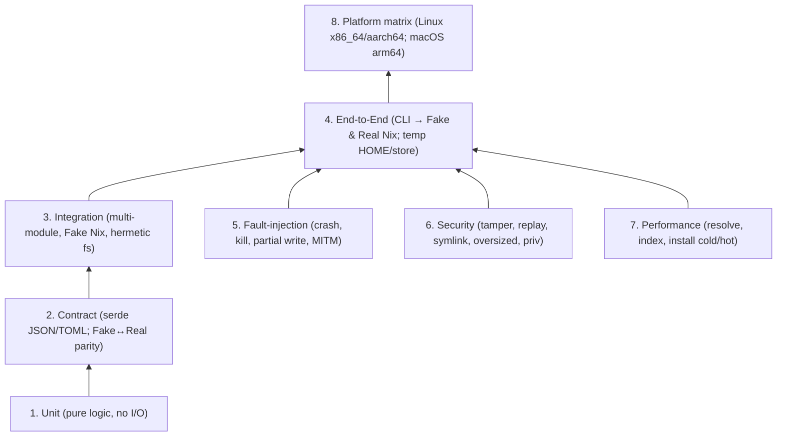
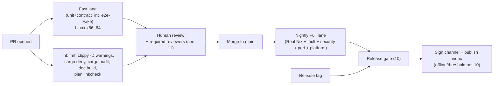

# 09 — Testing & Validation Strategy

**Owner:** Assurance track (plans 08–12). **Status:** Draft v1 (planning only).
**Depends on:** `00`,`01`,`02`,`03`,`04`,`05`,`06`,`07`,`08`.
**Feeds into:** `10` (release gates), `11` (test PRs & acceptance gates), `12` (test-driven go/no-go spikes).

---

## 1. Purpose & Scope

Define a **layered, hermetic, and reproducible** test strategy that proves the product's
security invariants (`08`), the state/lock/generation guarantees (`05`), the install
pipeline correctness (`04`), and the UX/platform contracts (`06`,`07`) — across Linux and
macOS, with both a **fake Nix** adapter (fast, hermetic, deterministic) and a **real Nix**
lane (authoritative, slow, gated).

### In scope
- All seven test layers: unit, contract, integration, end-to-end (e2e), fault-injection,
  security, performance, and platform.
- Hermetic fixtures (frozen Nixpkgs slices, signed-channel fixtures, fake binary cache).
- The Fake Nix adapter (`pkg-testkit`) used pervasively; the Real Nix lane used as a
  release gate.
- Test data management, determinism, CI matrix, and release gates.

### Out of scope
- Writing the production Rust code (planning only).
- Full perf budgets (target numbers agreed in `12` and reified here as gate thresholds).

### Convention
> **ℹ️ FACT** = current Nix behavior we rely on in tests. **📐 DECISION** = our test-design
> choice. Sources keyed as in `08` §13.

---

## 2. Test Pyramid (layers)



| # | Layer | Goal | Nix | Hermetic? | Speed target | Cadence |
|---|-------|------|-----|-----------|--------------|---------|
| 1 | Unit | Pure correctness of domain logic (selector/identity/state math) | none | yes | <5s | every commit |
| 2 | Contract | Wire formats & Fake↔Real parity; schema migrations | none | yes | <20s | every commit |
| 3 | Integration | Module composition with Fake Nix + hermetic fs + fake cache | Fake | yes | <60s | every commit |
| 4 | E2E | Real CLI flows via Fake **and** Real Nix in throwaway envs | both | yes (Fake), near (Real) | <5m Fake; <30m Real | Fake every commit; Real nightly + release |
| 5 | Fault-injection | Crash/kill/MITM/partial-write resilience | Fake/Real | yes | <5m | nightly + release |
| 6 | Security | All AC-S* from `08` §13 | Fake/Real | yes | <10m | nightly + release + on security PRs |
| 7 | Performance | Regression vs. budgets | Real | near | <30m | nightly + release |
| 8 | Platform | Cross-arch/OS correctness | Real | near | <60m | nightly per platform + release |

**Gate principle:** layers 1–3 block every PR; layer 4 (Fake) blocks every PR; layers 4
(Real)+5–8 block merge to release branches and any release. See `10` § release gates.

---

## 3. Hermeticity Principles (non-negotiable)

1. **No network in layers 1–4 (Fake) and 5–6.** All network is intercepted by a fake CDN /
   fake binary cache / MITM proxy fixture. Real Nix lane (4-Real, 7, 8) is the only place
   with controlled egress to `cache.nixos.org` and the product CDN.
2. **Throwaway roots.** Every integration/e2e test gets a fresh temp `HOME`, fresh product
   state dir, fresh temp store root (Real lane), and a scoped working dir. No test reads or
   writes the developer's real environment.
3. **Frozen fixtures in-repo.** Nixpkgs slices, channel metadata, and a tiny binary cache are
   checked in (or fetched via content hash in CI setup, never "latest").
4. **Determinism.** Index build, channel metadata, and state files must be byte-identical
   across hosts/runes; a determinism job asserts this (ties to `08` T-IDX-3).
5. **Time control.** A fake clock for expiry/rollback/freeze tests (T-CHAN-1/2); never rely
   on wall-clock.
6. **Isolation of privileges.** Tests never run privileged steps on dev machines;
   privileged/helper tests run in an ephemeral VM/container with a dedicated builder user.

---

## 4. The Fake Nix Adapter (`pkg-testkit`)

> **📐 DECISION (two test seams).** The hidden-Nix boundary is enforced by the **singleton
> unprivileged broker** (a daemon `allowed-user`, **never** a `trusted-user`; ARCH-INV-05,
> D-18/INV-11, doc `08` §5.3) and the narrow **privileged root-helper** (sole GC-roots writer,
> plus the two-phase mutating store repair — Phase A cache-only + Phase B approved rebuild, gated by Phase 0 broker read-only verify). Tests therefore split the seam into **two** object-safe traits owned by
> `pkg-nix` (`01`/`04`/`07`):
> 1. **`NixAdapter`** — the **unprivileged broker** seam. **Seven** methods, all **JSON-only**
>    (`01` §11, ARCH-INV-01): `version`, `evaluate_derivation`, `path_info`, `substitute`, `build`,
>    **read-only** `verify`, and a **liveness-respecting** `gc`. It holds **no** destructive
>    repair and **no** GC-root write — those are privileged. `repair` is denied to the broker by
>    the daemon (§4.1.2), so it is not even on this trait.
> 2. **`MaintenanceAdapter` / root-helper** — the **privileged** seam (§4.1.2). **Three** closed
>    operations: atomic `publish_root_set` / `remove_root_set` and a **two-phase mutating**
>    `repair_store_paths` gated by **Phase 0** broker read-only verify — **Phase A** cache-only
>    auto-repair and **Phase B** approved rebuild fallback (preview/approval then execution) —
>    authorized by broker peer-cred (root-set ops) or a **helper-issued expiring single-use
>    maintenance capability** bound server-side (repair), and accepting **no**
>    raw public path/installable/drv/expression/flake/argv/option/substituter/key/arbitrary verb.
> A `FakeNix` implementation of `NixAdapter` lives in `pkg-testkit`: PR-3 ships a **deterministic
> exact-FIFO transcript** replay engine (§4.4); richer simulation is phased to later checkpoints
> (§4.5). A Real `NixAdapter` is proven by the nightly parity lane (§4.3, §7). The privileged
> helper is tested by its own closed-grammar property/fuzz seam (§4.1.2) and in the privileged VM
> (§6.6 AC-S6/AC-S21–S27); it is **not** exercised through the FakeNix FIFO transcript.

### 4.1 Broker `NixAdapter` — object-safe, `Send + Sync`, seven unprivileged methods

The trait is **object-safe** (every method takes `&self`; none are generic; none return
`Self`) and `Send + Sync`, so it can live behind an `Arc<dyn NixAdapter>` shared across the
journal/worker threads. **Only validated, `pkg-nix`-owned request/report types cross this
boundary** — never raw Nix JSON, never `serde_json::Value`; and the only error type is a
**closed, redacted `NixAdapterError`** that never leaks a wire shape (T-DAEMON-2). This seam is
the **unprivileged broker**: every method maps to a `nix` invocation the broker — a daemon
`allowed-user`, **never** a `trusted-user` — is permitted to run. **Destructive repair and
GC-root writes are deliberately absent** (§4.1.2): repair is denied to the broker by Nix
2.34.8 (a `--repair` op requires a `trusted-user`), and GC-root publication/removal is the
root-helper's sole filesystem write (ARCH-INV-05).

```rust
// Unprivileged broker seam: a daemon allowed-user (NEVER a trusted-user).
// Seven methods. NO destructive repair, NO GC-root write (those are §4.1.2).
pub trait NixAdapter: Send + Sync {
    /// Pinned managed-Nix version + the upstream JSON format versions this adapter
    /// accepts/rejects (`01` §11). Read-only capability probe.
    fn version(&self) -> Result<VersionInfo, NixAdapterError>;

    /// Evaluate a selector into a normalized derivation plan (evaluate-only; NO realization,
    /// NO store-path identity — realization is acquired post-approval via build/path_info).
    fn evaluate_derivation(&self, req: &EvaluateDerivationRequest) -> Result<DerivationPlanReport, NixAdapterError>;
    /// NAR hash, deriver, narSize, references, signatures, closure size for one store
    /// path — promoted from the root-level `nix path-info --json --json-format 2`
    /// versioned v2 envelope (no `--deriver` flag).
    fn path_info(&self, path: &StorePath) -> Result<PathInfoReport, NixAdapterError>;
    /// Substitute (download) one path under the adapter's pinned trust set.
    fn substitute(&self, path: &StorePath) -> Result<SubstituteReport, NixAdapterError>;
    /// Approved, sandboxed local build. No per-call trust/flag toggles (see below).
    fn build(&self, req: &BuildRequest) -> Result<BuildReport, NixAdapterError>;
    /// Read-only integrity/trust verification. Never mutates the store.
    fn verify(&self, req: &VerifyRequest) -> Result<VerifyReport, NixAdapterError>;
    /// Collect unreachable paths. Liveness-respecting only: consults the on-disk gcroots
    /// tree AND waits at the broker-internal GC admission gate (§6.5/§6.6; plan 05 §8.5).
    /// NO roots argument; NO destructive repair here (that is §4.1.2).
    fn gc(&self) -> Result<GcReport, NixAdapterError>;
}
```

Each method returns **`Result<Report, NixAdapterError>`**. `NixAdapterError` is a **public,
validated, closed error enum** with **stable codes** and **bounded, redacted context** — it
**never exposes raw wire JSON or unbounded stdout/stderr**. The following are all
**`NixAdapterError` variants, never leaked wire data**: oversized input, malformed payload,
unsupported upstream JSON format, validation failure, timeout, unavailable daemon, and
transcript mismatch. **Reports model successful semantic results**; an operation-specific
*expected* result that is not a technical failure — e.g. "no substitute available" — may be a
**closed report enum** the caller matches on
(`SubstituteReport { outcome: SubstituteOutcome::AbsentFromSubstituters }`). Technical
failures are **not** forced into report outcome fields: they are `Err(NixAdapterError)`. The
request/report types are defined in `pkg-nix`, validated at construction, and **compose
`pkg-core` strong types** (`StorePath`, `NarHash`, `AttributePath`, `System`, `NixpkgsRevision`, `OutputSelection`, …). Their
concrete field shapes are owned by `pkg-nix` (jointly with `01` §10/§11 and `04`); the
semantic fields enumerated below are fixed here, and they carry **no dangerous knobs** — no
`--substituters`, `--trusted-public-keys`, `--sandbox`, `--builders`, `--max-jobs`, or
expression-string fields ever appear on any request or report (`01` §11.1):

| Method | Request carries | Report carries |
|---|---|---|
| `version` | — | managed-Nix version; accepted/rejected JSON format versions |
| `evaluate_derivation` | `EvaluateDerivationRequest` (AttributePath, System, NixpkgsRevision, Nixpkgs source NarHash pin, `OutputSelection` — the default selection **or** explicit nonempty output names) — built by the resolver from a Selector + verified source | normalized derivation plan: validated v4 envelope version, canonical derivation closure, expected output paths, authoritative pname/version, document and closure digests; **no** realized store-path identity |
| `path_info` | `StorePath` | narHash, deriver, narSize, references, signatures, closure size (promoted from the root-level `nix path-info --json --json-format 2` versioned v2 envelope `{version:2,storeDir,info:{…}}`; **no `--deriver` flag**) |
| `substitute` | `StorePath` | outcome (fetched / absent / no-binary); fetched requires a bounded substitution-time receipt carrying observed cache URL, NAR hash and signatures, while misses carry no receipt — cryptographic signature/trust failure is `Err(NixAdapterError)`, never a report outcome |
| `build` | `BuildRequest` (**typed `DerivedOutputTarget` targets**, `System`, a typed single-operation `BuildApprovalReceipt` binding the operation id + the exact `BuildPlan` digest + `policyVersion`) — **internal broker-only**; the public RPC carries an opaque operation handle / `buildPlanDigest`, never a raw target | outcome + built outputs with **per-output provenance** (`cache-signed` vs `local-build`) / `ACQUIRE_NO_BINARY` (AC-S13) |
| `verify` | `VerifyRequest` (paths, recursive/integrity mode only) | per-path NAR/trust status (**read-only**) |
| `gc` | — (on-disk gcroots are authoritative; the broker-internal GC admission gate, §6.5/§6.6, is **not** an adapter argument) | paths collected / refused-under-lease (T-STATE-4); the exclusive permit is taken only after every in-flight shared GC-inhibit permit has drained (plan 05 §8.5) |

> **Deliberately absent from `NixAdapter`** (moved to the privileged `MaintenanceAdapter`,
> §4.1.2): `repair` (destructive re-fetch/rebuild — denied to the unprivileged broker by Nix
> 2.34.8, which restricts `--repair` to `trusted-users`) and any GC-root write
> (`publish_root_set`/`remove_root_set` — the root-helper's sole filesystem write, ARCH-INV-05).

**Security semantics — trust/build policy is immutable, never per-call.** All trust and build
enforcement is fixed **once**, at adapter construction / managed-runtime config time, sourced
from the signed channel descriptor (doc `02`) and the product's channel-locked
`/opt/pkg/etc/pkg/nix.conf` (INV-03), and is **immutable for the life of the adapter**. The
adapter pins — and **never lets any caller override per call**: **substituters** (channel set
only, T-CACHE-1/4); **trusted-public-keys** (channel key set only, T-CACHE-1); **`restrict-eval`
+ `--allowed-uris`** for any eval `pkg` performs (T-DAEMON-1); **`sandbox=true` +
`sandbox-fallback=false`** on Linux and macOS, with `pkg` failing closed if the sandbox or the
build-user group cannot be verified ready (T-BUILD-1, AC-S13); the **build-users group**
(`nixbld` on both Linux and macOS; build users `nixbld*`/`_nixbld*`) (D-11); the **`builders`**
key set empty (`builders =` in `/opt/pkg/etc/pkg/nix.conf`, so **no remote builders in v1**);
and the substituter set (channel-pinned). There is **no** `--substituters "" --builders ""`
force-local override anywhere in `pkg` (plan `03` §9.3). The trait
therefore accepts **no caller trust/flag toggles**: `evaluate`, `substitute`, and `build`
take only selector/store-path/plan inputs plus already-pinned identifiers (`channelSeq`,
`system`, an approval token) — never `--substituters`, `--trusted-public-keys`, `--sandbox`,
`--builders`, or an expression string (`01` §11.1). This is the direct type-level enforcement
of T-DAEMON-1, T-CACHE-1, T-BUILD-1, INV-03, and AC-S13.

**Method-specific rules:**

- **`substitute` runs pure-substitute:** it internally enforces **`max-jobs=0`** so no local
  build slot can fire — only the daemon's pinned substituters may satisfy the path. The cache
  *classification* used to plan a build (doc `04`) is computed by **private, policy-fixed
  NarInfo / `--store <managed-cache>` queries** against the channel-pinned cache — **never** a
  local `path-info` against an unrealized path, and **never** a caller-provided cache URL.
- **`build` runs an approved local build:** it internally enforces **`max-jobs=1`** over the
  root-owned `builders =` empty config. **Neither `max-jobs` value is caller-controlled**
  (D-11): they are operation-specific internal policies of the adapter, *not* a single
  lifetime-wide adapter setting, and *not* applied to the other operation; there is **no**
  `--substituters "" --builders ""` force-local override anywhere (plan `03` §9.3).
  `BuildRequest` carries **typed `DerivedOutputTarget` targets** (each a derivation path plus
  a validated **nonempty, sorted, de-duplicated** output selection that the adapter renders
  **privately** as `x.drv^out,man` or `x.drv^*`; a bare `/nix/store/x.drv` is **never**
  accepted — Nix parses it as an opaque store path and it neither selects nor builds
  outputs), **`System`**, and a typed single-operation **`BuildApprovalReceipt` binding the
  operation id + the exact `BuildPlan` digest + `policyVersion`** — and **no
  sandbox/substituter/key/builders/build-user flags**. **The receipt is re-checked immediately
  before execution** under the **broker-internal machine-global build admission mutex/queue**
  (`machineGlobalMaxConcurrentBuildOperations = 1`; a fair single-writer admission structure
  inside the enforced singleton broker — §6.5/§6.6, AC-S19; **not** a `flock` on a backing file,
  since a single broker cannot represent independent waiters portably via `flock` on macOS); a
  digest mismatch fails/re-prompts. **Race-safe cache reappearance:** because substituters
  stay channel-pinned (not blanked), a build under `max-jobs=1` may **accept** a substitute
  the managed cache gained since classification — accepting a cache-signed path is **safer**
  than a local build — and the report records the **actual per-output provenance**
  (`cache-signed` vs `local-build`). If the miss set changed by admission-acquire time: **some** build
  remains → re-derive the plan, compare digests, re-approve (AC-S15); **no** build remains →
  the build/approval is **not consumed**. **PR-3 defines only the stable opaque receipt
  carrier and the typed target + output-selection carriers and their validation; PR-26 owns
  production issuance, journal binding, single-use verification, and rejection. PR-3 must not
  claim the carrier itself proves authorization** — it is a stable opaque token carried
  through the trait, not a capability the adapter defines or checks.
- **`BuildRequest` is internal broker-only.** The public RPC surface (CLI/IPC, doc `06`)
  never carries a raw `BuildRequest` or a raw derived-path target: it carries an **opaque
  operation handle / `buildPlanDigest`** plus the human-facing `BuildPreview`. The typed
  `DerivedOutputTarget` values and the `BuildApprovalReceipt` exist **only** inside the
  broker (the managed engine / `NixAdapter` boundary); the broker resolves the public handle
  to them **after** the plan is approved. **Raw derived paths are never accepted from CLI /
  public RPC / user JSON.**
- **`verify` is strictly read-only** — it never mutates the store; the **separate destructive
  `repair_store_paths`** (Phase 0 read-only verify; then the two mutating phases — Phase A cache-only substitute and Phase B approved local rebuild) lives on the privileged
  `MaintenanceAdapter` (§4.1.2), not on this trait, so a read-only broker caller can never
  trigger a write (AC-S3, T-CACHE-3, AC-S21). Nix 2.34.8 restricts `--repair` to `trusted-users`;
  the broker is an `allowed-user` only, so even an attempted broker repair is **denied by the
  daemon** — asserted as a negative parity test (§4.3, AC-S21).
- **`gc()` takes no roots argument and is liveness-respecting.** Collection consults the on-disk
  gcroots tree `/nix/var/nix/gcroots/pkg/users/<uid>/` (ARCH-INV-04, D-17) — the same roots the
  root-helper publishes atomically (§4.1.2). Passing roots as an argument would risk diverging
  from what actually protects paths on disk and would let a caller misrepresent reachability.
  `gc` is admitted only by the **broker-internal machine-global GC admission gate** — a fair
  counted read/write structure (one shared GC-inhibit permit per in-flight op handle; one
  exclusive permit for GC), **not** a `flock` and **not** a backing file/pid-record (plan `05`
  §8.5; §6.5/§6.6): GC waits for every active shared permit to drain before running, and is
  **never** admitted before the broker startup recovery barrier completes (plan `05` §11/§12;
  AC-T10/AC-T13).

### 4.1.2 Privileged `MaintenanceAdapter` / root-helper — atomic root sets + Phase 0/A/B store repair

The privileged boundary (`pkg-installer`/root-helper; ARCH-INV-05) is a **separate,
object-safe, closed-grammar test seam** (`MaintenanceAdapter`), distinct from the broker
`NixAdapter`. It exposes exactly **three** operations, each accepting **no** raw public
path/installable/derivation/expression/flake/argv/option/substituter/key/arbitrary verb
(`01` §11.1). Root-set publish/remove are authorized by **broker peer-credential
authentication** (`SO_PEERCRED`/`getpeereid`/Audit Token; the helper's only peer is the
broker; doc `08` §10). Store repair is authorized by a **helper-issued, expiring, single-use
maintenance capability** the helper **binds server-side** (see the contract below) and the
broker **sponsors only after** its own **Phase 0** read-only verify confirms corruption (plan
`05` §10.2). The canonical repair model is labeled in three phases — **Phase 0** broker
read-only verify (detects **absent, partially-restored, or corrupt live content even when the
Nix valid-path DB still marks the target registered-valid**, and marks the affected closure's
health **unknown/unhealthy**; the final Phase-0-style verify also governs success); **Phase A**
helper cache-only mutating repair (auto on a cache hit, auto-retries **only** after a fresh
Phase-0 verify); and **Phase B** approved rebuild fallback (preview/approval then execution;
**never silently resumes** — a fresh approval and a fresh single-use capability are required
after any restart). Only the two mutating phases (A, B) are the "two-phase mutating repair";
there is **deliberately no Phase 1/2/3 numbering** to avoid cross-plan ambiguity:

| Method | Request carries | Report carries |
|---|---|---|
| `publish_root_set` | a validated `RootSet` (the **sorted**, generation-scoped set of `<safe-id>` → validated output `StorePath` mappings derived from `activation.outputRoots[]`; plan `05` §8.3); broker peer-cred auth | the durable per-generation root-set dir `/nix/var/nix/gcroots/pkg/users/<uid>/gen-<id>/` (atomic staged-tmp + `rename` + parent `fsync`) |
| `remove_root_set` | the validated generation id (**resolved service-side**; **no** caller path); broker peer-cred auth | confirmation; removes exactly that generation's root-set dir (and any `gen-<id>.tmp.*` detritus) |
| `repair_store_paths` | a **helper-issued expiring single-use maintenance capability** (opaque) the helper binds server-side to: caller **uid**; an **existing pkg-owned rooted generation**; the **server-derived exact typed `StorePath` set** — the corrupt/missing registered-or-expected targets within the **FULL computed closure reachable from that generation's selected output roots** (`activation.outputRoots`), resolved service-side as a **nonempty, sorted, de-duplicated** `BTreeSet<StorePath>` (**never caller-supplied**, and **never merely `activation.outputRoots`** — the full closure, not just the roots); the **`RepairBuildPlan` digest covering ALL outputs** Nix may rebuild (mode `build`; plan `05` §10.4); `policyVersion`; and **mode** ∈ {`cache-only`,`build`} — **no** raw path/installable/drv/expression/flake/argv/option/substituter/key/verb | sanitized per-path restored/unchanged outcome (raw Nix log stays service-private; only sanitized versioned NDJSON is a public event) |

**Why repair is privileged + two-phase mutating (FACT + DECISION).** Nix 2.34.8 splits `nix
store verify` (read-only; the broker runs it as an `allowed-user`) from `nix store repair`
(mutating; daemon-rejected for untrusted/`allowed-user` clients — `--repair` is restricted to
`trusted-users`; `[NIX-MANUAL]`, doc `08` §5.1/§6.2). Under the hood `Store::repairPath`
**first substitutes**, and only on a cache miss with a valid deriver may **rebuild ALL
outputs** of that deriver (`bmRepair`); so the helper bounds that rebuild explicitly in the two
mutating phases (detailed design plan `05` §10). The broker is a daemon `allowed-user`,
**never** a `trusted-user` (root is the sole `trusted-user`); the daemon therefore **denies**
any broker-issued repair. **📐 DECISION:** repair is delegated to the root-helper, which runs
the pinned `nix store repair` command **as root** (the sole `trusted-user`), in the two
mutating phases (A, B) against the server-resolved typed `StorePath` set drawn from the full
computed closure (never merely `activation.outputRoots`):

- **Phase A — cache-only (helper-executed; automatic on a cache hit; plan `05` §10.3).** The
  helper runs `nix store repair` **one path at a time**, as root, with **`max-jobs = 0`**
  (blocks local build) **and `builders =` empty** (blocks remote build), using the managed
  pinned substituters/keys (never per-call flags). With both build paths blocked,
  `Store::repairPath` can only substitute: a **cache hit repairs the path automatically with
  no user approval**; a **cache miss** (no substitutable repair) with a valid deriver is
  detected as repair-not-possible and the helper **stops before any build**. The op handle
  holds a **shared GC-inhibit permit** (plan `05` §8.5) across the phase. Cache repair is
  **idempotent**; **Phase A is the only phase that auto-retries, and only after a fresh
  Phase-0 read-only verify re-confirms the still-damaged set** (plan `05` §10.8).
- **Phase B — approved rebuild fallback (helper-executed, serialized; plan `05` §10.4/§10.5).**
  On a cache miss with a valid deriver, an unconstrained `Store::repairPath` *would* rebuild;
  `pkg` instead **stops at the ordinary public preview + explicit approval flow** (plan
  `04`/`05`/`06`) — there is **no automatic rebuild**. Because `Store::repairPath` with a
  build slot rebuilds **ALL outputs of the deriver**, the internal **`RepairBuildPlan` and its
  digest MUST cover every output the repair may rebuild — not only the damaged output** (plan
  `05` §10.4). Once approved, the broker holds the **machine-wide build mutex**
  (§6.5/AC-S19) **and a shared GC-inhibit permit** for the duration, uses **no remote
  builders** (`builders =` empty), and the helper runs local `nix store repair` with a
  **bounded nonzero `max-jobs`** (call-site override of the managed default) so
  `Store::repairPath` may rebuild via `bmRepair`. The helper **re-derives the
  `RepairBuildPlan` and compares its digest** to the approved one (fail closed on mismatch).
  **Phase B never silently resumes:** after any restart the single-use `mode=build` capability
  is invalidated, so a **fresh preview + fresh approval + a fresh single-use capability** are
  required before repeating the local repair build.

**Completion + non-atomicity govern success and recovery (plan `05` §10.7/§10.8).** **The
final read-only `nix store verify` (a Phase-0-style verify run by the broker) governs
success:** the helper does **not** claim a path repaired until it confirms every target path
clean, at which point the affected closure's health clears from unknown/unhealthy to healthy.
Partial per-path cache repairs (Phase A) are **idempotent** and recover by re-verification.
Repair is **non-atomic even per path**: a **Phase-A** cache repair may leave content
**absent (after delete, before restore) OR partially restored/corrupt (mid-restore)** while the
Nix DB may still mark the path valid; a **Phase-B** local repair **moves the old path aside
before replacement**, leaving it **absent after move-aside** — so a crash/power-loss mid-phase
can leave a store path **absent or partially restored/corrupt yet still marked valid by the
Nix DB**, which recovery treats by re-running Phase-0 verify, **automatically resuming
Phase-A cache-only retry** (the only auto-retry) for still-cache-repairable paths, and
**requiring fresh preview + fresh approval + a fresh single-use capability before repeating
the Phase-B local repair build** (the prior `mode=build` capability is invalidated on restart,
so Phase B never silently resumes).
Affected commands see the path as transiently unavailable until verify succeeds.
**Normal store repair does not create or swap a generation** — it is in-place on store paths;
the separate **Rust-only** re-materialize / re-root / forest-rebuild step (plan `05` §10.6)
triggers only when the activation forest is damaged/missing, never as part of normal store
repair. **No** `nix-store --add-root` is ever used (plan `05` §8.3/§19 [^add-root]); root sets
are plain validated symlinks the helper publishes atomically.

**Negative parity + grammar-cannot-widen tests (§4.3, §6.6 AC-S21/AC-S22/AC-S28–S30):**
- **Broker repair is denied:** the Real `NixAdapter` (broker uid) issuing any repair-shaped
  command is denied by the daemon with a bounded `NixAdapterError` (a parity lane captures
  this denial against Real Nix 2.34.8); the broker `NixAdapter` trait has no repair method to
  call, and the Fake asserts the surface offers none.
- **Helper grammar cannot widen:** a property/fuzz test asserts every public input to
  `MaintenanceAdapter` is rejected unless it round-trips through the validated `RootSet` /
  generation-id / typed `StorePath`-set / helper-issued-capability constructors; raw
  path/installable/drv/expression/flake/argv/option/substituter/key/verb bytes are refused at
  construction and never reach argv. The Phase-A cache-only argv (`max-jobs=0`, `builders`
  empty) and the Phase-B approved argv (bounded nonzero `max-jobs`, `builders` empty) are each
  byte-constant across the corpus.

### 4.2 Serde & validation boundary — `pkg-core` stays serde-free

- **`pkg-core` remains serde-free.** It owns the pure strong types (`StorePath`, `NarHash`,
  `AttributePath`, `System`, `NixpkgsRevision`, `OutputSelection`, …) and the identity/state
  math, and depends on no serde.
- **The public trait request/report types are validated `pkg-nix` types that compose
  `pkg-core` strong types**; they are the *only* shapes that cross the trait boundary.
- **`DerivedOutputTarget` is a validated `pkg-nix` type** composing `pkg-core`'s
  `DerivationPath` + a **nonempty, sorted, de-duplicated** `OutputSelection`. It is the
  **only** shape a `BuildRequest` may name as a target; raw derived paths (and a bare
  `/nix/store/x.drv`) are rejected at construction and never cross the boundary.
- **The repair typed target set is a validated `pkg-nix` type** — a **nonempty, sorted,
  de-duplicated** `BTreeSet<StorePath>` resolved service-side from authoritative state: the
  exact corrupt/missing registered-or-expected targets within the **FULL computed closure
  reachable from the active/named generation's selected output roots** (`activation.outputRoots`)
  — **never merely `activation.outputRoots`** (the full closure, not just the roots); it is bound into the helper-issued
  maintenance capability and is the **only** shape `repair_store_paths` repairs. The
  **`RepairBuildPlan` digest** (Phase B) is a validated `pkg-nix` digest covering **every
  output** Nix may rebuild for the affected deriver (`Store::repairPath`/`bmRepair` rebuilds
  the whole deriver — not only the damaged output), so a deriver-fallback cannot rebuild
  outside the approved scope. Empty / duplicate / unsorted / raw-path inputs are rejected at
  construction (§4.1.2).
- **State hashes are corruption/crash-detection, not same-uid authentication** (plan `05` §5):
  sidecars, `generationHash`/`manifestHash`/`lockHash`, and the journal chain detect edits and
  crash inconsistency and surface tamper/rollback; they do **not** authenticate the writer as
  the legitimate same-uid owner (a uid owns its state and can rewrite any bytes — and any
  self-hash — it likes). Cross-uid isolation is OS permissions (`<user-state>` 0700 by uid;
  D-17/INV-10), never these hashes (§6.5, AC-T14).
- **Crate-private raw/wire DTOs** in `pkg-nix` (not public, absent from every trait signature)
  deserialize untrusted Nix JSON with **strict serde** — deny unknown fields, size-capped, and
  reject unknown/unsupported upstream JSON format versions (`01` §11). A fallible
  `TryFrom<WireDto> for ValidatedReport` (or equivalent fallible constructor) then **promotes**
  raw bytes into the validated report. **Unknown fields, unsupported schema versions, malformed
  data, and oversized input surface as bounded `NixAdapterError` variants — the raw wire JSON
  never crosses the trait boundary** (T-DAEMON-2; exercised by the contract/fuzz tests in §6.2
  and the oversized/malformed fault row in §6.5).
- **Every `pkg`-owned serialized report carries an explicit top-level `schemaVersion`** — the
  product's own contract version (matching the `schemaVersion = 1` convention of `05` §5 and
  the CLI envelopes of `06`). It is **deliberately decoupled from Nix's upstream JSON format
  versions** (which the adapter negotiates/validates privately, `01` §11); `pkg`'s
  `schemaVersion` is the public contract, owned and migrated here/`05`.

### 4.3 Fake↔Real parity (contract tests)

- A **capture/replay** harness records a Real Nix session to golden JSON; contract tests
  assert `FakeNix` reproduces the same typed outputs for the same scripted inputs.
- A diff in a parity job fails the build → forces Fake updates when Real behavior changes
  (e.g., a new managed-Nix version via channel update). Owned jointly with `04`/`10`; the Real
  capture/replay lane is §7 (nightly + release), **not** PR-3.
- **Rendered `^` target parity:** the Fake and Real adapters render the **identical**
  `x.drv^out,man` / `x.drv^*` argv from the same typed `DerivedOutputTarget`, and **both**
  reject a bare `/nix/store/x.drv` target (and any raw derived path) at construction — so a
  transcript captured against Real builds faithfully under Fake, and the bare-drv rejection
  is asserted on both backends (AC-S20).
- **Broker-repair-denied parity (negative):** a Real-Nix capture records that the broker uid
  (a daemon `allowed-user`, never a `trusted-user`) issuing any `--repair`-shaped command is
  **denied** by Nix 2.34.8; the Fake `NixAdapter` has **no** repair method, and a test asserts
  the broker surface offers none. The two-phase mutating repair that *does* run (as root, the
  sole `trusted-user`, via `repair_store_paths`) is parity-checked by the privileged-VM lane
  (§6.6 AC-S21/AC-S28), not the unprivileged FIFO transcript.
- **Two-phase mutating repair parity (privileged VM proves Real Nix 2.34.8 behavior):** the
  privileged-VM lane is the **authoritative** proof of Nix 2.34.8 behavior — it must run on
  Real Nix, not be substituted by FakeNix canned responses. Against Real Nix 2.34.8 it asserts:
  Phase-0 read-only `nix store verify` (no `--repair`) detects **absent, partially-restored,
  and corrupt live content even when the Nix DB still marks the path registered-valid** and
  reports the affected closure unhealthy; the Phase-A cache-only argv is byte-constant (`nix
  store repair`, one path at a time, `max-jobs=0`, `builders` empty, managed pinned
  substituters/keys — never per-call flags) and a **cache hit repairs a corrupted path
  automatically** while a **cache miss + valid deriver stops before build**; the Phase-B
  approved argv is byte-constant (`max-jobs` bounded nonzero, `builders` empty). Fake-side and
  Real-side closed grammars are identical and a fuzz lane asserts neither can widen
  (AC-S22/AC-S28).
- **Root-level path-info v2 parity:** both adapters normalize the **identical** root-level
  `nix path-info --json --json-format 2` v2 envelope (`{version:2,storeDir,info:{…}}`;
  `narHash`/`narSize`/`references`/`deriver`/`signatures`; **no `--deriver` flag**) and both
  reject a wrong top-level `version`/`storeDir` or a missing inner required field (spike S3
  `spikes/s3-macos`; AC-S18).
- **Helper-grammar parity:** the closed `MaintenanceAdapter` request grammar is identical
  Fake-side and Real-side (the Phase-A and Phase-B repair argvs are each byte-constant; root
  sets are validated `<safe-id>` → `StorePath` mappings), and a fuzz/property lane asserts the
  grammar cannot widen on either backend (AC-S22/AC-S28).

### 4.4 PR-3 `FakeNix` scope — deterministic exact-FIFO transcript

PR-3 ships a **deterministic, exact, first-in-first-out transcript replay** engine — *not* a
rich simulator. Its job is to let layers 1–3 (unit/contract/integration) and the Fake E2E lane
drive the install pipeline against a `NixAdapter` with byte-stable, hermetic outputs, **with no
Nix and no network** (§3).

**Replay transcript shape (defined now):** an ordered `Vec<Expectation>` where

```text
Expectation    := { call: MethodKind, expect: RequestMatcher, respond: canned }
MethodKind     := Version | EvaluateDerivation | PathInfo | Substitute | Build
               |  Verify | Gc     // seven BROKER methods only (NixAdapter); Repair and
                                 // GC-root publish/remove are privileged (§4.1.2)
RequestMatcher := the exact request value the head call must equal (per MethodKind)
canned         := Ok(Report) | Err(NixAdapterError)   // the canned result returned for a matching call
```

A `FakeNix` holds the transcript. Each adapter call pops the **head** expectation; the call must
match `MethodKind` **and** `RequestMatcher`. When the test is finished it calls
**`FakeNix::assert_exhausted()`** (or the harness returns the result) to confirm no expectations
remain.

**Two failure domains, two error types — never one impossible shared type:**

```text
// pkg-nix: the only trait error. Closed, bounded, redacted. Two variants, one code.
NixAdapterError::UnexpectedCall {           // a head existed and was consumed
    expected: MethodKind,                   // pkg-nix contract enum (Version | EvaluateDerivation | … | Gc)
    actual:   MethodKind,
    mismatch: <redacted, bounded static summary: "method mismatch" | "request mismatch">,
}
NixAdapterError::UnexpectedExtraCall {      // no head existed (empty/exhausted transcript)
    actual:  MethodKind,                    // the call that arrived with nothing to match
    summary: <redacted, bounded static summary: "extra call">,   // expected is honestly absent
}

// pkg-testkit: separate error for leftover expectations only.
TranscriptError::UnmetExpectations { remaining: usize }
```

`MethodKind` is a **`pkg-nix` contract enum** shared by the trait and the transcript, so
`pkg-testkit` depends on `pkg-nix` one way — **never the reverse** (`pkg-nix` cannot name a
`pkg-testkit` type). A trait call that **pops a head** of the wrong `MethodKind`, or whose
request does not equal the head matcher, returns
**`Err(NixAdapterError::UnexpectedCall { expected, actual, mismatch })`** — expected/actual
`MethodKind` plus a **redacted, bounded static mismatch summary** (one of two fixed strings:
`"method mismatch"` when the kinds differ, `"request mismatch"` when they are equal). A call
against an **empty or fully-consumed** transcript, where **no head exists** and no honest
`expected` can be named, returns the sibling
**`Err(NixAdapterError::UnexpectedExtraCall { actual, summary })`** — the fixed static summary
`"extra call"` with `expected` honestly absent — **never a synthetic `expected` value and never
a generic backend error**. Both variants reuse the single `NixAdapterErrorCode::UnexpectedCall`
code and carry **no raw request data and no `Vec<Expectation>`**. A canned `respond` outcome is
`Ok(Report)` or `Err(NixAdapterError)`, so wrong/mismatched/extra calls and canned technical
failures all flow through `NixAdapterError`. **Leftover expectations are a separate `pkg-testkit` concern:**
`FakeNix::assert_exhausted()` is **not a trait method** and returns `Result<(), TranscriptError>`;
a non-empty transcript yields `Err(TranscriptError::UnmetExpectations { remaining: usize })` (a
**count**, never the leftover `Expectation` values) that the test asserts on
(`assert_eq!(fake.assert_exhausted(), Ok(()))`). **`FakeNix` never panics** — not on an
unexpected call, not on drop — and the design contains **no `Drop`-panic, no `todo!`, no
`unimplemented!`, and no ignored placeholder**: every failure surfaces as a returned `Result`
(a trait call's `Result<_, NixAdapterError>`, or `assert_exhausted`'s
`Result<(), TranscriptError>`).

**Explicitly deferred out of PR-3** (so the plan never implies they land here): rich key maps,
simulated **latency**, **partial writes**, **kills/timeouts**, the **fake binary cache**, and
the **fake channel CDN** are owned by **CP-T-2** (fixture generators + frozen
`nixpkgs-slice-tiny` + fake cache + fake channel) and **CP-T-5** (fault-injection harness
`pkg-testkit::chaos`), and by later roadmap owners. PR-3 = the FIFO transcript + the seven broker trait
methods + the request/report skeletons + `assert_exhausted`, nothing more.

### 4.5 Long-term `FakeNix` capabilities (phased future scope — not PR-3)

The full simulation set `FakeNix` is intended to grow into, **phased across CP-T-2 / CP-T-5 and
later roadmap owners** (none of it is implied to land in PR-3, §4.4):

- Scripted responses keyed by Selector / StorePath / scenario.
- Deterministic narHash/signature generation using fixture keys.
- Simulated latency, partial writes, kills, and timeouts (drives layer 5).
- A **fake binary cache** (in-process HTTP server) serving signed NARs with controllable trust
  keys — used by the security lane for sig-mismatch/rollback tests (T-CACHE-1/3).
- A **fake channel CDN** serving TUF metadata with controllable staleness/versions — used for
  rollback/freeze/mix-and-match tests (T-CHAN-1/2/3).

---

## 5. Fixtures & Test Data

| Fixture | Purpose | Source | Pinned by |
|---------|---------|--------|-----------|
| `fixtures/nixpkgs-slice-tiny` | 5–10 attrs for unit/integration resolve | curated slice of a frozen Nixpkgs rev | git rev + narHash |
| `fixtures/channel-v1` | Signed TUF metadata (root/targets/snapshot/timestamp) | generated by `pkg-channel` test tooling | root key fixture (test-only) |
| `fixtures/cache-tiny` | Fake binary cache with a few signed NARs | generated by `nix-store --generate-binary-cache-key` in a setup script | fixture key (test-only) |
| `fixtures/state-v1/*` | State snapshots across migrations | hand-built | schema version |
| `fixtures/golden/*.json` | Golden outputs for contract + e2e | recorded from Real Nix | narHash + test version |
| `fixtures/cve-like` | A fake "malicious-looking" attr for T-RUN/T-IDX tests | synthetic | git |

> **📐 DECISION.** Fixture-generation scripts live in `pkg-testkit/fixtures/gen/` and are
> re-run in CI; their *outputs* are checked in when deterministic so PRs are reviewable.
> Fixture keys are **test-only** and never used in release signing.

---

## 6. Per-Layer Detail

### 6.1 Unit (layer 1) — `pkg-core`, `pkg-channel`, `pkg-index`
- Selector→evaluated-plan rules and the later evaluated-plan→Realization identity boundary (user intent vs exact realization; `05`/`06`).
- Version/rev comparison, policy-version checks, expiry arithmetic.
- State Merkle/integrity-tag math; generation ordering; rollback selection.
- Channel metadata parsing + TUF role validation logic (pure, no network).
- Index query correctness over fixture slices.
- **Gate:** `cargo test -p pkg-core -p pkg-channel -p pkg-index --lib`.

### 6.2 Contract (layer 2)
- Serde round-trip of every JSON/TOML type in `pkg-nix`, `pkg-channel`, `pkg-core`.
- Schema migration tests: load each historical `state-vN` fixture, migrate to current,
  assert equivalence on stable fields; assert migrations are forward-only & idempotent (`05`).
- Fake↔Real parity (§4.3).
- **Typed derived-target + bare-drv rejection:** `DerivedOutputTarget` round-trips and
  renders the stable `x.drv^out,man` / `x.drv^*` form; a bare `/nix/store/x.drv`, an empty
  output selection, and duplicate output names are all rejected at construction (parity with
  the Real adapter's argv, §4.3/AC-S20).
- **v2 path-info envelope fixtures:** a frozen root-level `nix path-info --json --json-format 2`
  document (`version`=2, `storeDir`=`/nix/store`; per-entry
  `narHash`/`narSize`/`references`/`deriver`/`signatures`) round-trips through
  `PathInfoReport` and is rejected when the top-level `version`/`storeDir`, an inner required
  field, or the queried-entry presence is wrong/missing (parity source: spike S3
  `spikes/s3-macos`).
- **Output-contract tests (`--json` / `--jsonl` / logs; plan 06 §5.2/§5.3):**
  - `--json` emits **exactly one** final document per command (`schemaVersion:1`), never
    streams progress, and is produced only after the op completes;
  - `--jsonl` emits the sanitized public NDJSON stream where **every** line carries
    `schemaVersion:1` and the stream ends with **exactly one** terminal `type:"result"`
    record; a consumer can join/resume/replay from any line;
  - `--json` and `--jsonl` are **mutually exclusive** → `USAGE` exit 2 when both are given;
  - the **sanitized public log** is written only to `<user-state>/logs/<opId>.ndjson`, and the
    raw broker/adapter/Nix subprocess log (`<opId>.nix.log`) **never** appears in `--json`,
    `--jsonl`, the public log, or any user-rendered surface — it stays service-private;
  - `--jsonl`/`--json` records carry no raw `storePath`/`drv`/Nix-system internals, only
    product-owned identities (sanitized fields, `opId`, generation/operation ids).
- **Gate:** `cargo test --test contract`.

### 6.3 Integration (layer 3)
- Install pipeline as a state machine: resolve→preflight→acquire→verify→stage→activate→commit
  with Fake Nix and hermetic fs; assert each transition and the rollback-on-failure invariant
  (T-STATE-3, `04`).
- Writer-lock + lease + journal under simulated concurrent invocations (`05`).
- Index build determinism (T-IDX-3) across two runs/hosts.
- GC consults generation manifest (T-STATE-4).
- **Gate:** `cargo test --test integration`.

### 6.4 End-to-End (layer 4)
- Drive the real CLI binary against Fake Nix and (Real lane) Real Nix in a throwaway env.
- Cover every command in `06`: `doctor, search, info, install, remove, list, outdated,
  update, upgrade (one/all), pin/unpin, history, rollback, gc, repair, completion`.
- Assert observable effects: state file contents, activation symlinks, exit codes, machine
  output (`--json`) stability, and that a failed op leaves the **previous generation** active.
- **Two-phase mutating `repair` flow (plan `05` §10):** against Fake Nix, drive a damaged path
  (absent / partially-restored / corrupt-live while the Nix DB still marks it valid) through
  **Phase 0** read-only verify, **Phase A cache-only** (cache hit auto-repairs with no
  approval; cache miss + valid deriver **stops before build**), and the **Phase B approved
  rebuild fallback** (ordinary preview + explicit approval then execution; the
  `RepairBuildPlan` covers all outputs; bounded nonzero `max-jobs`, `builders` empty); assert
  the affected closure is unknown/unhealthy until **a final read-only verify** governs
  success, that **only Phase A auto-retries** (after a fresh verify), that **Phase B never
  silently resumes** (fresh preview + fresh approval + fresh capability after restart), that normal repair
  does **not** create/swap a generation, and that only sanitized outcome reaches the user (raw
  Nix logs stay service-private). The Real-lane privileged VM **proves this on Real Nix
  2.34.8** — not via FakeNix — re-running the Phase-0 detection (incl. corrupt-live-while-
  DB-valid), cache-hit, and approved-fallback paths (AC-S28).
- **Fake gate (every PR):** `cargo test --test e2e --features fake-nix`.
- **Real gate (nightly/release):** `cargo test --test e2e --features real-nix` inside an
  ephemeral VM with the managed Nix installed by the product installer.

### 6.5 Fault-injection (layer 5)
Kill the process or break the environment at every checkpoint of the install pipeline and
prove recovery to a consistent state.

| Injected fault | Where | Expected |
|----------------|-------|----------|
| `SIGKILL` mid-substitute | acquire | next run resumes; no partial activation |
| Disk full mid-write | stage | op aborts cleanly; previous generation intact |
| Drop/replay/MITM HTTPS to CDN | channel/update | TUF rejects; fail-closed |
| Corrupt / partially-restore / delete a store path (NAR mismatch, torn restore, or absent live content while the Nix DB still marks it valid) | any time | broker **Phase 0** read-only `verify` detects and marks the affected closure unknown/unhealthy; two-phase mutating `repair` restores (Phase A cache-only hit; Phase B approved rebuild on a miss); **final read-only verify** governs success |
| Stale writer lock (dead pid) | startup | lock reclaimed via boot-id + journal |
| Power-loss simulation (no fsync) | commit | rename atomicity preserves `current` |
| Crash in the generation transaction — by state (plan 05 §8.4) | stage→commit | **prepared** (`gen-<id>.json` + its two **candidate-view snapshots** `gen-<id>.manifest.json`/`gen-<id>.lock.json` (+ `.sha256` sidecars) durable, no root, `current`=old): recovery **discards the snapshots + record + staging forest**; previous gen active. **rooted** (per-output root set durable, `current`=old): recovery removes the root set + deletes snapshots + record + forest; previous gen active. **activated** (`current` swapped, root+record+snapshots present, no `committed` row): the new gen is already rooted + documented + `treeDigest`-verified — recovery **restores the mutable `manifest`/`lock` views from the candidate snapshots** and appends `committed`; new gen stays active. In every case `current` resolves to a rooted, documented, `treeDigest`-verified tree and no unrooted staged path survives a later `gc` |
| Same-user `gc` + install | concurrency | per-user state `flock` (UNCHANGED, plan 05 §12): `gc` serialized/refused (`STATE_LOCKED`, exit 72); in-flight closure never collected |
| Cross-user realize→root GC window (user B install + user A `gc`) | concurrency | broker-internal GC admission gate (§6.6 AC-S23): B holds a shared GC-inhibit permit from before realize until its root set is durable; A's `gc` blocks at the gate until B roots/aborts — B's unrooted realized output is **never** collected. **No `gc` is admitted before the broker startup recovery barrier** (plan 05 §11/§12) |
| Oversized/malformed Nix JSON | contract | strict parse rejects, no panic |
| Clock skew past timestamp expiry | channel | freeze detected; `update` blocked |
| Journal NDJSON corruption (plan 05 §5.4/§11) | state | every row carries `schemaVersion`+`seq`+`prevRowHash`+`rowHash` (SHA-256 over RFC 8785/JCS canonical row excluding `rowHash`); a **torn final suffix** (partial line / bad-JSON tail / `seq` gap / hash break at the very end) is discarded/quarantined and recovery resumes; any corruption/reorder/deletion **inside** the accepted history **fails closed** (refuse mutating ops; require `repair`). Hashes are detection, **not** same-uid authentication |
| Retired-generation prune crash (plan 05 §9) | gc | pruning deletes **user-owned files first** (forest + record + the two candidate snapshots) **while the root set is still live**, then removes the per-output **root set last**; a leaked/orphaned root set (root present, record gone) is recovered and its outputs reclaimed by a later broker `gc` |
| Two-UID build admission (BUID) | concurrency | broker-internal build admission mutex/queue (`machineGlobalMaxConcurrentBuildOperations = 1`; §6.6 AC-S23): two UIDs needing an approved native build **serialize** machine-wide; a waiter may **cancel** (75); CLI disconnect/cancel releases admission (broker-owned); broker crash empties the queue; a waiter re-derives the `BuildPlan` + re-validates approval/readiness on grant (never reuses a prior approval) |
| Broker restart mid-op | lifecycle | replacement broker completes its **startup recovery barrier** and classifies every journal tail **before** admitting the first `gc` or build; in-flight realize→root windows are recovered by transaction state (plan 05 §8.4); no orphaned GC-inhibit permit survives (gate starts empty) |
| Crash mid cache-only repair — after delete before restore, OR torn restore mid-write (plan 05 §10.8) | repair Phase A | store path is **absent or partially restored/corrupt while the Nix DB may still mark it valid** (cache repair deletes the live path before restore, or tears a restore mid-write); restart re-runs **Phase 0** read-only verify and **automatically resumes Phase-A cache-only retry** — the only auto-retry — for still-cache-repairable paths (idempotent, approval-free); per-path journal progress is durable; **no** path marked `repaired` until a clean **final read-only verify** governs success |
| Power-loss mid approved rebuild — after move-aside, before replace (plan 05 §10.8) | repair Phase B | path **absent after move-aside** while the Nix DB may still mark it valid (local repair moves the old path aside before replacement); **Phase B never silently resumes** — the single-use `mode=build` capability is **invalidated on restart**, so **fresh preview + fresh approval + a fresh capability** are required before repeating the local repair build; Phase-A cache-only retry runs first; the broker build mutex + shared GC-inhibit permit are re-acquired on grant |
| Repair transient unavailability + per-path journal progress (plan 05 §10.7) | repair (any phase) | affected commands see the path unavailable until the **final read-only verify** governs success; the op handle holds a **shared GC-inhibit permit** across each phase; the damage set, issued capability, per-path sanitized outcome, and final verifying read-only verify are all journaled in the hash-chained NDJSON (AC-S26); normal store repair does **not** create/swap a generation; raw helper/broker Nix logs stay service-private |

**Tooling:** a `pkg-testkit::chaos` helper wrapping spawned processes with ptrace/`kill` +
fsync toggles; on macOS use `rename` atomicity + `kill`. Fault tests are tagged
`#[ignore]`-by-default in local runs, run in nightly.

### 6.6 Security (layer 6) — `08` §13 AC-S1..S13 mapped 1:1; `08` §13 AC-S31..S33 (repair) covered by existing 09 tests; plus 09-internal AC-S14..S30
Each AC-S*n* becomes one or more tests. AC-S1..S13 map 1:1 to `08` §13. AC-S14..S30 are
09-internal acceptance criteria derived from plans `03`/`04`/`05`/`06`/`07`/`08` and tracked
here (they feed `12` risks and `11` PRs). `08` §13 **also** defines **AC-S31/S32/S33**
(three repair security criteria — two-phase privilege split & confused-deputy resistance /
phase boundary / execution & restart semantics), numbered past the 09-internal AC-S14..S30 to
avoid a collision; they are **not** redefined as 09 rows and carry **no** contradictory
test ownership here. They are covered **without redundant rows** by existing 09 tests via this
explicit mapping:

- **`08` AC-S31** (repair two-phase privilege split & confused-deputy resistance; broker read-only `verify` + daemon-denied repair + root-helper two-phase `nix store repair` + opaque single-use maintenance capability + sanitized outcome) → covered by **09 AC-S21** (broker repair denied, negative parity) + **AC-S22** (helper grammar cannot widen) + **AC-S28** (two-phase mutating repair correctness) + **AC-S29** (repair capability confused-deputy resistance).
- **`08` AC-S32** (two-phase repair phase boundary — Phase A build-free under `max-jobs=0`/`builders` empty; Phase B all-output `RepairBuildPlan` digest, broker machine-wide build mutex + shared GC-inhibit permit, bounded nonzero `max-jobs`, `builders` empty) → covered by **09 AC-S28** (Phase A cache-only build-free / Phase B approved rebuild over all outputs; final read-only verify governs success), with the machine-wide build-mutex serialization asserted by **AC-S19**.
- **`08` AC-S33** (repair execution & restart semantics — non-atomic per path, per-path journal, final read-only verify governs success, Phase A auto-retry only / Phase B never silently resumes, normal repair never creates/swaps a generation) → covered by **09 AC-S30** (repair non-atomic crash safety) + **AC-S28** (final read-only verify governs success; normal store repair does not create/swap a generation).

This explicit mapping satisfies **AC-T3** (every `08` AC-S*n* has a passing test in the
security lane) for S31..S33. The table below remains the 09-internal AC-S1..S30 set
(S14..S30 unchanged — they are 09-internal, distinct from `08`'s S31..S33):

| AC | Test scenario | Layer |
|----|---------------|-------|
| AC-S1 | expired timestamp → `update` blocked | E2E + fake channel |
| AC-S2 | replay older `targets.json` → refused | E2E + fake channel |
| AC-S3 | mismatched-signature NAR not substituted; **two-phase mutating** `repair` restores (Phase 0 read-only verify; Phase A cache-only auto on a cache hit; Phase B approved rebuild on a miss; final verify governs success) | E2E + fake cache |
| AC-S4 | symlink/world-writable-ancestor redirection rejected | integration |
| AC-S5 | concurrent writers serialized; crash recovers last generation | fault-injection |
| AC-S6 | helper rejects unauth caller & disallowed commands | integration (privileged VM) |
| AC-S7 | unmanaged Nix present → install refuses, untouched | e2e (privileged VM) |
| AC-S8 | `cargo audit` + `cargo deny` clean | release gate |
| AC-S9 | logs redact env/args/secrets | unit + golden |
| AC-S10 | `pkg info` shows provenance fields | e2e golden |
| AC-S11 | two uids on a shared host: A cannot read/write B's `<user-state>`; GC roots scoped per uid (D-17) | e2e (privileged VM, multi-user) |
| AC-S12 | caller as uid A cannot create roots / touch state under uid B (peer-cred enforced) | integration (privileged VM) |
| AC-S13 | build impossible/disallowed → `ACQUIRE_NO_BINARY` never runs (cross-platform); buildable miss surfaces preview; `sandbox-fallback=false`/build-user readiness fail-closed | e2e (Linux + macOS) + fault |
| AC-S14 | **Exact platform `nix.conf` rendering:** Linux render contains `experimental-features = nix-command flakes cgroups` **and** `use-cgroups = true`; macOS render contains `experimental-features = nix-command flakes`, **omits the `cgroups` token**, and **omits `use-cgroups` entirely** (asserted absent, not `= false`). Both renders carry the finite defaults `max-jobs = 1`, `cores = 0`, `max-silent-time = 3600`, `timeout = 86400`, `max-build-log-size = 268435456`; no `timeout = 0`/unlimited anywhere; the build-log bound **kills the builder and never truncates** | unit (renderer) + integration |
| AC-S15 | **Canonical `BuildPlan` determinism + per-field-class mutation invalidation (private plan, public preview):** re-deriving the same closure for the same **descriptor/system/evaluated-derivation-closure/cache-classification/readiness/resource snapshot** yields a byte-identical plan and the **same** `sha256:<lowercase-hex>` digest (RFC 8785 JCS; sorted `builds` by `derivationDigest`). The canonical plan is **private** (managed-engine-held; never serialized raw to `--json`/human preview/RPC); the public `BuildPreview` carries only the `buildPlanDigest` pointer + sanitized fields. The digest binds **every** deterministic field class — `descriptorHash`, `policyVersion`, `channelSeq`, `nixRuntimeVersion`, `nixpkgs.rev`+`nixpkgs.narHash`, `system`, the product `target` identity, `derivationClosure` (`closureDigest`/`derivationCount`), the sorted `builds` (per-build `derivationDigest` + safe `fixedOutput`/`networkEnabled`), `cacheClassification` (`classificationDigest`/`hits`/`misses`/exact known-cache `downloadBytes`+`narBytes`), `readiness` (sandbox/build-user/cgroup), the unit-bearing `resources` (`maxJobsPerConnection`/`machineGlobalMaxConcurrentBuildOperations`/`coresHint`/`maxSilentTimeSeconds`/`timeoutSecondsPerDerivation`/`maxBuildLogSizeBytes`), and the deterministic `admission` ceilings (`diskHeadroomRatio`/`maxLoadavgCeiling`). It binds **no** per-cache-miss `narSizeBytes`, **no** `estimatedClosureBytes` (an unbuilt miss's size is unknowable pre-build), and **no** raw command/flake-ref source field; the cache identity is `classificationDigest`, not the counts. Mutating **any** class — descriptor hash, nixpkgs rev/narHash, policy version, channel seq/runtime, system, readiness, a cache-classification flip, adding/removing a build/derivation, or a resource/admission setting — changes the digest and **invalidates** approval (interactive re-prompts; non-interactive exits `ACQUIRE_NEEDS_APPROVAL`). Dynamic **measured** free bytes / `loadavg` / timestamps / build-time **estimates** live only in the public `BuildPreview` and do **not** affect the digest (they are re-checked **outside** it) | unit + property |
| AC-S16 | **Approval journal source + refusal fields + no persistence:** a granted op records `phase:"approval",status:"granted"` with `source` ∈ `interactive`\|`yes` (interactive = user answered yes; `yes` = `--yes` pre-approving the one displayed sanitized `BuildPreview`, bound to the private canonical `BuildPlan` digest), `buildPlanDigest`, and `policyVersion`; the digest is **re-checked immediately before execution** (under the **broker-internal machine-global build admission mutex/queue**, §6.5/AC-S23 — not a `flock`) and a mismatch fails/re-prompts. A refusal row — interactive decline **or** non-TTY-without-`--yes` — carries a **stable** `reason` + `resultCode` (e.g. `interactive_declined`/`no_tty_without_yes`, code 68) and **omits** `source`/`approvalSource` entirely; non-TTY-without-`--yes` is **distinct** from `--yes`. No desired-state/generation change on refusal; no approval row is reusable across a second operation (no `PKG_YES_TO_BUILDS`/session skip/`build.always_local_after_preview`) | e2e + integration |
| AC-S17 | **launchd-vs-systemd semantics are documented, not asserted as enforcement:** tests assert the **configuration text** distinguishes systemd `MemoryMax`/`TasksMax`/`CPUQuota` (aggregate service-cgroup ceiling over daemon + descendants) from launchd `Soft/HardResourceLimits` (inherited per-process RLIMIT ceilings, not a daemon-subtree ceiling; no `AddressSpace` key), and that both remain `Pending` (real managed-host evidence) — i.e. the product does **not** claim service-manager ceilings as accepted per-build caps | unit (config/docs) |
| AC-S18 | **Evaluate-only, no realization before approval (CAT-INV-03):** resolve and preflight issue **only** `nix derivation show --recursive` (JSON emitted unconditionally — no `--json` flag; validate the v4 envelope top-level `version` field = 4; no `--json-format` selector on `nix derivation show` in 2.34.8) and **never** `nix build`; IFD is disabled (`allow-import-from-derivation = false`); no realized store-path identity is read or recorded before the broker-internal build admission (§6.5/AC-S19) + approval gate. `nix build` and the **root-level** `nix path-info --json --json-format 2` (realization identity) appear **only** in acquire, post-approval; the adapter validates the versioned v2 envelope (top-level `version` = 2, `storeDir` = `/nix/store`; per-entry `narHash`/`narSize`/`references`/`deriver`/`signatures`; **no `--deriver` flag**; manual `nix3-path-info`) | integration + e2e (Fake) + contract |
| AC-S19 | **Broker-internal build admission + GC admission (two-UID serialization):** the machine-global local-build admission is a **fair single-writer mutex/queue inside the enforced singleton broker** (`machineGlobalMaxConcurrentBuildOperations = 1`), **distinct** from the per-user package-state `flock` (plan 05 §12) and **not** a `flock` on a backing file (a single broker cannot represent independent waiters portably via `flock` on macOS); two UIDs each needing an approved native build **serialize** machine-wide and a waiter may **cancel** (exit 75 `CANCELLED`, no state/build). The machine-global GC admission gate is a **fair counted read/write structure inside the broker** (one shared GC-inhibit permit per in-flight op handle; one exclusive permit for GC), **not** a `flock` and **not** a backing file/pid-record. On acquiring admission a waiter **does not reuse** the prior approval: it re-derives the `BuildPlan`, compares the digest (mismatch → re-prompt/`ACQUIRE_NEEDS_APPROVAL`), re-validates readiness, and re-measures disk/load **outside** the digest (failure → `PREFLIGHT_FAIL`). Both admission structures are **released on every exit** (success, `BUILD_FAILED`, `ACQUIRE_NO_BINARY`/`ACQUIRE_NEEDS_APPROVAL`/`PREFLIGHT_FAIL`, cancel); **process/broker death empties them** (a replacement broker starts with an empty mutex and an empty gate). Pure-substitution acquire never takes build admission | e2e (privileged VM, multi-user) + fault |
| AC-S20 | **Typed derived targets, bare-drv rejection, race-safe build/cache, per-output provenance (plan 03 §9.3):** build/substitute targets are typed `DerivedOutputTarget` values (derivation path + a validated **nonempty, sorted, de-duplicated** output selection) rendered **privately** by the adapter as `x.drv^out,man` / `x.drv^*`; a bare `/nix/store/x.drv` — and any raw derived path from CLI / public RPC / user JSON — is **rejected** (Nix parses it as an opaque store path; it neither selects nor builds outputs). Cache-only acquire uses internal `max-jobs=0`; the approved build (after `BuildPlan` approval + the broker-internal machine-global build admission, §6.5/AC-S19) uses internal `max-jobs=1` over the root-owned `builders =` empty config — **no** `--substituters "" --builders ""` force-local override exists anywhere. If the managed cache gains a substitute for a previously-missing path between classification and the build, the build **accepts** it (cache-signed is safer) and the report records the **actual per-output provenance** (`cache-signed` vs `local-build`). If the miss set changed by admission-acquire time: **some** build remains → re-derive the plan, compare digests, re-approve (AC-S15); **none** remain → build/approval **not consumed**. `BuildRequest` is **internal broker-only**; the public RPC carries an opaque operation handle / `buildPlanDigest`, never a raw target | unit + contract (rendered `^` parity, bare-drv rejection) + integration + e2e (Fake) |
| AC-S21 | **Broker repair is denied (negative parity):** the unprivileged broker (`NixAdapter`; a daemon `allowed-user`, **never** a `trusted-user`) has **no** repair method, and a Real-Nix capture proves any `--repair`-shaped command issued by the broker uid is **denied** by Nix 2.34.8 (which restricts `--repair` to `trusted-users`). The two-phase mutating repair runs only as root (the sole `trusted-user`) via `repair_store_paths` on `MaintenanceAdapter` (§4.1.2) | contract (negative) + privileged VM |
| AC-S22 | **Helper grammar cannot widen:** every public input to `MaintenanceAdapter` (`publish_root_set`/`remove_root_set`/`repair_store_paths`) is rejected unless it round-trips through the validated `RootSet` / generation-id / typed **nonempty, sorted, de-duplicated** `StorePath` set / helper-issued maintenance capability; raw path/installable/drv/expression/flake/argv/option/substituter/key/verb bytes are refused at construction and never reach argv. The Phase-A cache-only argv (`max-jobs=0`, `builders` empty) and Phase-B approved argv (bounded nonzero `max-jobs`, `builders` empty) are each byte-constant across the fuzz corpus; a closed-grammar property/fuzz lane asserts the surface cannot widen Fake-side or Real-side (§4.1.2/§4.3) | unit (property) + fuzz + privileged VM |
| AC-S23 | **Broker-internal admission, two-UID concurrency/cancel/disconnect/restart, no GC before recovery barrier (§4.1, §6.5):** (a) two-UID realize→root GC window — user B's install holds a shared GC-inhibit permit (acquired **before** any realize/build, held through durable root publication or abort); user A's `gc` blocks at the broker-internal GC gate until B roots or aborts, and an unrooted realized output is **never** collected; (b) CLI disconnect/cancel does not leak a permit — broker-owned cancellation + cleanup releases it; (c) broker crash fails all in-flight handles and a replacement broker starts with an empty mutex + empty gate; (d) **no** `gc` is admitted before the broker startup recovery barrier completes (plan 05 §11/§12). The per-user state `flock` (UNCHANGED) serializes same-user mutation/gc only | e2e (privileged VM, multi-user) + fault |
| AC-S24 | **Platform socket/config contracts (plan 07 §5.2/§7.4):** the rendered daemon `nix.conf` carries `trusted-users = root` and `allowed-users = pkg-nix-broker` (the broker is the sole `allowed-user`, root the sole `trusted-user`). On Linux the private daemon socket (systemd `Socket`) is `root:pkg-nix-broker` mode `0660` with its parent dir `0750`; on macOS the (self-created) socket may be `0666` but its **parent** dir is `root:pkg-nix-broker` `0750`, so traversal to the socket is impossible for an ordinary user (the `allowed-users` gate backs it). An ordinary (non-broker) user **cannot** `connect()` to the socket and **cannot** exec the bundled `nix`/helper. The product installs **no** automatic GC scheduler (no systemd timer / launchd job / `nix.conf` auto-GC key) and, on uninstall, removes only its own scheduler artifacts | unit (renderer) + integration (privileged VM) + platform |
| AC-S25 | **Output contracts (plan 06 §5.2/§5.3):** `--json` emits exactly one final `schemaVersion:1` document and never streams; `--jsonl` emits a sanitized public NDJSON stream where every line is `schemaVersion:1` and the stream ends with exactly one terminal `type:"result"`; `--json` and `--jsonl` together → `USAGE` exit 2; the sanitized public log is written only to `<user-state>/logs/<opId>.ndjson` and the raw broker/Nix subprocess log stays service-private (never in `--json`/`--jsonl`/public log) | contract + e2e |
| AC-S26 | **Journal NDJSON integrity (plan 05 §5.4/§11):** every row carries `schemaVersion` + monotonic `seq` + `prevRowHash` + `rowHash` (SHA-256 over RFC 8785/JCS canonical row excluding `rowHash`, chained to the prior accepted row); recovery accepts the longest prefix whose rows are newline-terminated, JSON-valid, schema-valid, sequence-contiguous, and hash-valid; a **torn final suffix** (partial line / bad-JSON tail / `seq` gap / hash break at the very end) is discarded/quarantined; any corruption/reorder/deletion **inside** the accepted history **fails closed** (refuse mutating ops; require repair). Hashes are corruption/crash-detection, **not** same-uid authentication | unit + fault |
| AC-S27 | **Crash-safe retired-generation prune order (plan 05 §9):** pruning a retired generation deletes **user-owned files first** (forest + record + the two candidate-view snapshots `gen-<id>.manifest.json`/`.lock.json`) **while its per-output root set is still live**, then removes the **root set last** — so no crash mid-prune can leave `current`/an active generation pointing at a forest whose outputs are already unrooted. A leaked/orphaned root set (root present, record gone) is recovered (removed) and its outputs reclaimed by a later broker `gc`; GC itself runs only after pruning, under the broker-internal GC admission gate (AC-S23) | fault (privileged VM) |
| AC-S28 | **Two-phase mutating store repair correctness (plan 05 §10; Nix 2.34.8):** the privileged-VM (Real) lane is the **authoritative** proof of Nix 2.34.8 behavior — not FakeNix canned responses. After the broker's **Phase 0** read-only `nix store verify` (**no** `--repair`) detects **absent, partially-restored, or corrupt live content even when the Nix DB still marks the target registered-valid** and marks the affected closure **unknown/unhealthy**: (a) **Phase A cache-only** — helper runs `nix store repair` one path at a time as root with `max-jobs=0` + `builders` empty + managed pinned substituters/keys; a **cache hit repairs automatically** with no approval, a **cache miss + valid deriver stops before build** (no automatic rebuild); (b) **Phase B approved rebuild** — on a miss the ordinary public preview + explicit approval then execution is mandatory, the internal **`RepairBuildPlan` digest covers ALL outputs** Nix may rebuild (`Store::repairPath`/`bmRepair` rebuilds the whole deriver), the broker holds the machine-wide build mutex + a shared GC-inhibit permit, the helper runs local repair with bounded nonzero `max-jobs`, `builders` empty, and re-derives/compares the plan digest (fail closed); **Phase B never silently resumes** (fresh approval + fresh capability after restart); (c) **completion** — **the final read-only `nix store verify` (broker) governs success**: no path is marked `repaired` (and closure health clears to healthy) until every target is confirmed clean; (d) **normal store repair does NOT create or swap a generation** (in-place on store paths; the separate **Rust-only** re-materialize/re-root/forest-rebuild of plan 05 §10.6 runs only on forest damage); (e) **raw helper/broker Nix logs stay service-private** (0700 dir, 0600 files; only sanitized versioned NDJSON reaches `<user-state>`) | e2e (Fake) + privileged VM (Real, authoritative) + parity |
| AC-S29 | **Repair capability confused-deputy resistance (plan 05 §10.2; T-INST-7):** the repair mutation is authorized solely by a **helper-issued, expiring, single-use maintenance capability** the helper **binds server-side** to caller **uid** + an existing **pkg-owned rooted generation** + the **server-derived exact typed `StorePath` set** — the corrupt/missing registered-or-expected targets within the **FULL computed closure reachable from `activation.outputRoots`** (**never merely `activation.outputRoots`**) + the `RepairBuildPlan` digest (mode `build`) + `policyVersion` + mode; **stale, replayed, digest-mismatched, and cross-UID capabilities all fail closed**, and a raw/unvalidated path/installable/drv/expression/flake/argv/option/substituter/key/verb is refused at construction and never reaches argv. The broker sponsors the capability **only after** its own **Phase 0** read-only verify confirms corruption; the user CLI never reaches the helper; the helper uses the root-owned channel-pinned substituters/keys, never per-call flags. A replay/re-cross-UID/mismatch harness drives each rejection path | unit (property) + fuzz + privileged VM |
| AC-S30 | **Repair non-atomic crash safety (plan 05 §10.8):** repair is non-atomic even per path — Phase A cache repair **may leave content absent (after delete, before restore) OR partially restored/corrupt (mid-restore)** while the Nix DB may still mark the path valid, Phase B local repair **moves the old aside before replacement, leaving it absent after move-aside** — so a crash/power-loss mid-phase can leave a store path **absent or partially restored/corrupt yet still marked valid by the Nix DB**. Tests assert: (a) per-path journal progress is durable (hash-chained NDJSON, AC-S26); (b) restart re-runs **Phase 0** read-only verify and **automatically resumes Phase-A cache-only retry** — the **only** auto-retry — for still-cache-repairable paths (idempotent, approval-free); (c) a partially-completed **Phase B approved rebuild does NOT silently resume** — its single-use `mode=build` capability is invalidated on restart, so **fresh preview + fresh approval + a fresh capability** are required before repeating the local repair build; (d) affected commands see the path transiently unavailable until the **final read-only verify** governs success; (e) no path is marked `repaired` (closure health stays unknown/unhealthy) until a clean final read-only verify. The privileged-VM (Real) lane proves this on **Real Nix 2.34.8**, not FakeNix | fault (privileged VM, Real authoritative) |
| (`10` AC-O4) | rotated-out TUF key can't sign new targets; rotation accepted within one `timestamp` window (T-CHAN-5) | e2e + fake channel |

Additional security tests beyond ACs: T-PATH-* matrix, T-LOG-* injection, T-REL-4 dependency
review, T-INST-2 TOCTOU, T-INST-6 cross-user/UID-confusion, T-UNINST-1/2 boundary checks.

### 6.7 Performance (layer 7)
- **Budgets (DR-004 accepted 2026-08-09):**
  - `search` p95 over fixture index: < 150 ms.
  - `info` p95: < 300 ms (Fake) / < 2 s (Real, cached).
  - `install` (cache hit, small closure) cold: < 8 s on Real lane reference host.
  - Index build (tiny slice): < 5 s.
  - Full one-system Nixpkgs meta-eval: p95 < 10 s Real, peak RSS < 2.5 GiB.
  - Four-system sequential publisher meta-eval: p95 < 30 s Real, peak RSS < 2.5 GiB.
  - Resolve (single attr, cached eval): p95 < 1.5 s Real, peak RSS < 512 MiB.
- **Method:** `criterion` benches in CI on a fixed reference runner; record baselines; fail
  on >25% regression vs. pinned baseline **or** an absolute ceiling (`10` perf
  gate). Bench vs. Fake for stability; Real for absolute budgets. Native x86_64
  reference baselines must be added before GA; QEMU timing is diagnostic only.

### 6.8 Platform matrix (layer 8)
| OS | Arch | Lane | Frequency |
|----|------|------|-----------|
| Linux | x86_64 | Real Nix (container) | every PR (Fast) + nightly (Full) |
| Linux | aarch64 | Real Nix (emulated/native runner) | nightly + release |
| macOS | arm64 (Apple Silicon) | Real Nix: cache hit; cache-miss preview; cancel; approval; successful native sandboxed build; sandbox-unavailable fail-closed; unsupported-package `ACQUIRE_NO_BINARY`; receipt/rollback | nightly + release |
| macOS | x86_64 | (best-effort) same matrix | release only |

macOS lanes additionally exercise the **full-closure cache preflight** as an
**availability signal** (AC-S13): every closure path is classified against
`cache.nixos.org` up front (via **private, policy-fixed NarInfo / `--store` queries — never
a local `path-info` on an unrealized path, never a caller URL**; plan `03` §9.3), buildable
misses surface the build preview, and
disallowed builds fail with `ACQUIRE_NO_BINARY`; `sandbox=true`/
`sandbox-fallback=false` and `_nixbld` build-user readiness are verified and
fail-closed when unready. This is **not** binary-only enforcement — a buildable
Darwin cache miss proceeds to an approved native sandboxed build. The lane does
**not** assert per-build memory/CPU/IO caps (none exist in stock Nix 2.34.8:
`max-jobs` bounds concurrency, `timeout`/`max-silent-time`/`max-build-log-size` are daemon
bounds, `use-cgroups` is cleanup/statistics on Linux, and service-manager
ceilings are Pending); it verifies the approval/sandbox/build-user gate and the
regular-derivation network denial, with fixed-output builds left network-enabled
(hash boundary). Resource exhaustion remains a disclosed residual (RISK-07).

**Platform socket/config contract lane (AC-S24):** the platform lane additionally asserts the
daemon-socket / `nix.conf` trust contract end-to-end on a privileged VM: the rendered `nix.conf`
carries `trusted-users = root` and `allowed-users = pkg-nix-broker`; the private daemon socket
is reachable only by the broker — on Linux a systemd `Socket` `root:pkg-nix-broker` `0660`
whose parent dir is `0750`, on macOS a self-created socket that may be `0666` but whose
**parent** dir is `root:pkg-nix-broker` `0750` (so traversal to the socket is impossible for an
ordinary user, and the `allowed-users` gate backs it). An ordinary (non-broker) user **cannot**
`connect()` to the socket and **cannot** exec the bundled `nix`/helper. The lane also asserts
the product installs **no** automatic GC scheduler (no systemd timer / launchd job / `nix.conf`
auto-GC key), and that uninstall removes only its own scheduler artifacts.

**Fast vs Full split:** "Fast" = unit+contract+integration+e2e(Fake) on every PR for the
primary arch (Linux x86_64). "Full" = adds e2e(Real)+fault+security+perf+platform nightly.

---

## 7. Real-Nix Lane Design

Because the Fake adapter is only as trustworthy as its parity with Real Nix, the Real lane
is a **release gate**, not optional.

- **Environment:** ephemeral VM (Linux: a CI runner with nested virt or a container with the
  product installer applied; macOS: a managed runner). Managed Nix is installed by the
  product's own installer (exercising `07`).
- **Fixture strategy:** pin a small set of Nixpkgs attrs known to substitute from
  `cache.nixos.org` for the target systems; assert substitution + activation. For
  **x86_64-darwin/aarch64-darwin** coverage, confirm in CI which chosen attrs substitute vs.
  which require a native build (this is part of spike S3, `12`); the macOS lane now covers both
  the cache-hit path **and** the approved native sandboxed build path, so a coverage gap is an
  availability/perf signal (a build happens) rather than a skipped test.
- **Cost control:** Real Nix ops are cached where safe (NAR store reused across a night's
  run via a CI cache keyed by Nixpkgs narHash), but **integrity-relevant tests always
  re-verify signatures and NAR hashes** (no trusting stale cache for security assertions).
- **Golden capture:** nightly job refreshes golden JSON from Real Nix; PRs that change wire
  formats must update goldens with a recorded session + parity justification.

---

## 8. CI Matrix & Workflow



- **Required for merge (every PR):** Fast lane + Lint green + at least the required
  reviewers from `11`.
- **Required for release:** latest Nightly Full green on all release platforms + security
  lane green + `cargo audit`/`deny` clean + perf within budget + manual 2-person sign-off
  (`10`).
- **Flake policy:** tests must be deterministic; a genuinely flaky test is treated as a bug
  and quarantined within 24h (no `#[ignore]` without a tracking issue).

---

## 9. Testability Requirements Imposed on Design

These are **constraints the implementation must satisfy** so testing is even possible:

1. **Both test seams must exist** (`pkg-nix`): the unprivileged broker `NixAdapter` (seven
   methods) **and** the privileged `MaintenanceAdapter`/root-helper (closed grammar: atomic
   root-set publish/remove + two-phase `repair_store_paths`; §4.1/§4.1.2) — no direct CLI
   scraping in core code (`04`), and the privileged grammar is closed-validated so a
   property/fuzz test can prove it cannot widen (`01` §11.1).
2. **All machine output must be JSON/structured** behind stable `--json` schemas (`06`).
3. **State must be file-based and migratable** with explicit schema versions (`05`).
4. **Time must be injectable** (channel expiry, lease renewal, GC) — a `Clock` trait.
5. **Privileged operations must be separately testable** via a `--dry-run` / no-op helper
   path in `pkg-installer` so non-privileged CI can exercise logic (`07`); the privileged
   `MaintenanceAdapter` request grammar must be **closed-validated** (the Phase-A cache-only and
   Phase-B approved repair argvs are each byte-constant; §4.1.2) so a property/fuzz test can
   prove it cannot widen, and the helper-issued repair capability must be exercisable for
   stale/replay/mismatch/cross-UID fail-closed paths (AC-S29).
6. **Index build must be deterministic** (sorted outputs, pinned inputs) (`03`).
7. **Network must be interceptable** — all HTTP via a single client that accepts a base URL
   + trust roots from config/test injection (`02`,`03`).
8. **Machine-global admission must be broker-internal and testable across two UIDs + broker
   restart**: the local-build admission mutex/queue and the GC admission counted R/W gate live
   inside the enforced singleton broker (not file `flock`s); only the per-user state `flock` is
   file-based (plan `05` §12). Tests must drive two UIDs, cancel, CLI disconnect, and broker
   restart (§6.5/§6.6, AC-S19/AC-S23).
9. **`nix.conf` + socket rendering must be assertable**: a unit/renderer test pins the
   `trusted-users = root` / `allowed-users = pkg-nix-broker` lines and the socket/parent-dir
   modes, and the installer must install **no** automatic GC scheduler (`07`; §6.8, AC-S24).

---

## 10. Release Gates (cross-ref `10` § release gates)

| Gate | Test layer | Blocks |
|------|-----------|--------|
| G-UNIT | 1 | PR |
| G-CONTRACT | 2 | PR |
| G-INTEGRATION | 3 | PR |
| G-E2E-FAKE | 4 (Fake) | PR |
| G-LINT (fmt/clippy/deny/audit/docs/linkcheck) | — | PR |
| G-E2E-REAL | 4 (Real) | release |
| G-FAULT | 5 | release |
| G-SECURITY | 6 | release + security PRs |
| G-PERF | 7 | release |
| G-PLATFORM | 8 (all release platforms) | release |
| G-SIGNOFF | human 2-person + security owner | release |

---

## 11. Dependencies on Other Plans

| Depends on | Why |
|-----------|-----|
| `01` | `NixAdapter` (unprivileged broker, 7 methods) **and** `MaintenanceAdapter` (privileged root-helper) traits + their wire/closed-grammar types (§4.1/§4.1.2). |
| `02` | Channel/TUF schema → contract tests & security lane. |
| `03` | Index determinism & disposable model → determinism + tamper tests. |
| `04` | Install pipeline checkpoints → integration/e2e/fault scenarios. |
| `05` | State schema, migrations, generations, GC, **two-phase repair (§10)** → contract/migration + fault + repair tests. |
| `06` | CLI commands & `--json` schemas → e2e golden set. |
| `07` | Installer/helper/uninstall, `nix.conf` rendering (`trusted-users`/`allowed-users`), daemon socket + parent-dir modes, **no automatic GC scheduler**, **two-phase store-repair helper contract (§7.4)** → privileged VM tests, repair lanes (AC-S28–S30) & platform socket/config lane (AC-S24). |
| `08` | Threat catalog & AC-S* → security lane one-to-one. |
| **Feeds** | `10` (release gates), `11` (test PRs), `12` (spike acceptance). |

---

## 12. Implementation Checkpoints (PR-shaped; see `11`)

- **CP-T-1** `pkg-testkit` crate + `NixAdapter`/`FakeNix` skeleton (with `pkg-nix`); defines the **two seams** — the unprivileged broker `NixAdapter` (7 methods) and the privileged `MaintenanceAdapter` closed grammar (§4.1/§4.1.2). (`11`)
- **CP-T-2** Fixture generators + frozen `nixpkgs-slice-tiny` + fake cache + fake channel. (`11`)
- **CP-T-3** Fast CI lane (unit+contract+integration+e2e-Fake+lint). (`11`)
- **CP-T-4** Security lane mapping AC-S1..S30 (incl. broker-repair-denied, helper-grammar-cannot-widen, two-phase repair correctness/capability/crash-safety, broker-internal admission, platform socket/config, output contracts, journal integrity, prune order). (`11`)
- **CP-T-5** Fault-injection harness (`pkg-testkit::chaos`). (`11`)
- **CP-T-6** Real-Nix nightly lane + golden capture/replay parity. (`11`)
- **CP-T-7** Performance benches + budget regression gate. (`11`)
- **CP-T-8** Platform matrix runners (aarch64-linux, arm64-darwin). (`11`)
- **CP-T-9** Privileged `MaintenanceAdapter` closed-grammar property/fuzz lane + broker-internal admission (build mutex/queue + GC counted R/W gate) two-UID/cancel/disconnect/restart harness + two-phase repair capability replay/cross-UID/mismatch and crash-during-delete/replace harness (AC-S28–S30). (`11`)

---

## 13. Testable Acceptance Criteria

- **AC-T1** A PR that changes a wire type fails contract tests unless goldens are updated
  with a justified Real capture.
- **AC-T2** Disabling fsync anywhere in the commit path causes a fault test to fail unless
  the rename-atomicity invariant holds.
- **AC-T3** Every `08` AC-S*n* has a passing test in the security lane; removing any control
  (e.g., substituter pinning) turns its test red.
- **AC-T4** Index build byte-identical across two CI hosts for the same inputs
  (determinism job green).
- **AC-T5** A full "clean host → install product → install package → rollback → uninstall"
  e2e passes on Real Nix on Linux x86_64 and macOS arm64.
- **AC-T6** Perf budgets enforced: a >N% regression fails the release gate.
- **AC-T7** No test in layers 1–6 touches the network; verified by a CI mode that null-routes
  all egress except the Real lane.
- **AC-T8** (Multi-user isolation) A two-user e2e on a shared host proves users cannot see or
  edit each other's `<user-state>` and GC roots are uid-scoped (AC-S11/S12).
- **AC-T9** (Crash ordering + candidate snapshots) A crash at *each* state of the generation transaction (prepared / rooted / activated / committed) recovers correctly (plan 05 §8.4): **prepared**/**rooted** (pre-swap) discard the unreachable staged generation — its record, its **two candidate-view snapshots** `gen-<id>.manifest.json`/`.lock.json` (+ `.sha256` sidecars), its (rooted-only) per-output root set, and its forest — and leave the previous generation active; the **activated** state (after the `current` swap, before the `committed` row) always leaves `current` pointing at a fully-rooted, fully-documented, `treeDigest`-verified tree and recovery **restores the mutable `manifest`/`lock` views from the candidate snapshots** and appends the `committed` row. Because the per-output root set is created **before** the swap, no crash ever leaves `current` pointing at an unrooted tree, and no orphaned unrooted staged path survives `gc`.
  PR-18 unit coverage fixes the dependency-safe storage boundary: all four
  reachable evidence combinations map to explicit recovery actions, impossible
  combinations fail closed, helper refusal leaves staging/current untouched,
  and the observed durability events are exactly `rooted → forest-retained →
  activated`. PR-19 supplies the fault-injected snapshot/journal executor that
  applies those actions end to end.
- **AC-T10** (GC admission) Same-user `gc` + a same-user mutating op is serialized by the
  **per-user state `flock`** (`STATE_LOCKED`, exit 72; plan 05 §12 — UNCHANGED). Cross-user —
  user B's install in its realize→root window vs user A's `gc` — is made safe by the
  **broker-internal GC admission gate** (a fair counted R/W structure; B holds a shared
  GC-inhibit permit, A's `gc` waits for it to drain; §6.5/§6.6, AC-S23), and **no** `gc` is
  admitted before the broker startup recovery barrier (plan 05 §11/§12). The in-flight closure
  is never collected in either case.
- **AC-T11** (Cache-miss build behavior, macOS) On macOS: a buildable cache miss shows
  the preview; cancelling leaves gen N active; with approval it builds natively under
  `sandbox=true`/`sandbox-fallback=false` via `_nixbld` over the root-owned `builders =`
  empty config (**no** `--substituters "" --builders ""` force-local forcing), records
  per-output provenance (`cache-signed`/`local-build`), and commits; a sandbox-unavailable
  state fails closed; an unsupported/impure derivation fails `ACQUIRE_NO_BINARY` even with
  approval; a successful build writes a receipt/journal row and is rollback-safe
  (plan 07 §16.4, plan 04 §5/§6/§7).
- **AC-T12** (Two seams) The unprivileged broker `NixAdapter` (7 methods) has **no** repair/
  GC-root method, and a Real-Nix capture proves a broker-issued `--repair` is **denied** by Nix
  2.34.8 (AC-S21); the privileged `MaintenanceAdapter` accepts only closed-validated inputs
  (sorted dedup `StorePath` set / `RootSet` / generation-id + helper-issued expiring single-use
  capability binding uid + rooted closure + `RepairBuildPlan` digest + `policyVersion` + mode)
  and a fuzz lane proves the grammar cannot widen (AC-S22/AC-S28/AC-S29).
- **AC-T13** (Broker-internal admission) Two UIDs needing an approved native build **serialize**
  via the broker-internal build mutex/queue; a waiter may cancel (75); CLI disconnect/cancel and
  broker restart release admission and the replacement broker completes its recovery barrier
  before admitting the first `gc`/build (AC-S19/AC-S23). The per-user state `flock` is unchanged.
- **AC-T14** (Journal integrity) Every journal row carries `schemaVersion`+`seq`+`prevRowHash`+
  `rowHash` (chained); a torn final suffix is discarded and recovery resumes, while corruption/
  reorder/deletion **inside** the accepted history fails closed. The hashes detect corruption/
  crash/tamper-rollback but **do not** authenticate the writer as the same uid (AC-S26).
- **AC-T15** (Platform socket/config) The rendered `nix.conf` pins `trusted-users = root` /
  `allowed-users = pkg-nix-broker`; the daemon socket + parent-dir modes match the platform
  contract; an ordinary user cannot connect/exec; **no** automatic GC scheduler is installed
  (AC-S24).
- **AC-T16** (Output contracts) `--json` is exactly one final `schemaVersion:1` document;
  `--jsonl` is one `schemaVersion:1` record per line + exactly one terminal `type:"result"`;
  the two flags together exit `USAGE` (2); the sanitized public log is the only user-facing log
  (`<user-state>/logs/<opId>.ndjson`) and raw broker logs stay service-private (AC-S25).
- **AC-T17** (Crash-safe prune order) Pruning deletes user-owned files (forest + record + the
  two candidate snapshots) while the root set is still live, then removes the **root set last**;
  a leaked/orphaned root set is recovered and reclaimed by a later broker `gc` (AC-S27).
- **AC-T18** (Two-phase store repair) `pkg repair` runs the broker's read-only `nix store
  verify` (no `--repair`); confirmed corruption drives **Phase A cache-only** repair (cache hit
  auto-repairs with no approval; cache miss + valid deriver **stops before build**) and, only
  with explicit approval, the **Phase B approved rebuild** (bounded nonzero `max-jobs`,
  `builders` empty, broker build mutex + shared GC-inhibit permit, `RepairBuildPlan` covers
  ALL outputs). No path is marked `repaired` before a final read-only verify; normal store
  repair does **not** create/swap a generation; capability replay/cross-UID/mismatch/stale
  fail closed; a crash mid Phase-A delete/restore leaves content **absent or partially
  restored/corrupt (DB may still mark valid)**, recovered by **Phase-A cache-only retry after a
  fresh verify**; a crash mid Phase-B move-aside leaves it **absent after move-aside**, recovered
  only by **fresh preview + fresh approval + a fresh capability**; raw helper/broker Nix logs
  stay service-private (AC-S28/AC-S29/AC-S30).

---

## 14. Primary Sources

- `[NIX-MANUAL]` — `nix build --json`; **root-level** `nix path-info --json --json-format 2`
  (versioned v2 envelope `{"version":2,"storeDir":"/nix/store","info":{…}}`; per-entry
  `narHash`/`narSize`/`references`/`deriver`/`signatures`; **no `--deriver` flag**;
  `nix3-path-info`); `nix derivation show` (v4 envelope, JSON unconditional — no `--json`
  flag); `nix-store --verify
  --repair`, `nix-store --generate-binary-cache-key`, `--option sandbox`, `restrict-eval`
  (used to build fixtures and the Real lane); **`--repair` is restricted to `trusted-users` in
  Nix 2.34.8**, so the unprivileged broker (an `allowed-user`) is denied repair and the
  **two-phase** repair runs as root via the root-helper (`Store::repairPath` substitutes first,
  then on a cache miss with a valid deriver may rebuild ALL outputs via `bmRepair` — so Phase A
  forces `max-jobs=0`/`builders` empty and Phase B bounds a nonzero `max-jobs` over an
  all-output `RepairBuildPlan`; §4.1.2, AC-S21/S28). https://nixos.org/manual/nix/stable/
- `--json`/`--jsonl` output + sanitized public log contracts (AC-S25) are owned by doc `06`
  §5.2/§5.3 (the root-level `nix path-info` v2 + `nix build --json` cited above are the Nix-side
  inputs; the public envelopes are product-owned, `schemaVersion:1`).
- `[TUF]`/`[TOUGH]` — TUF roles & expiry semantics underpin security lane fixtures.
- `cargo deny`, `cargo audit`, `criterion` — standard Rust toolchain for the respective gates.

---

## 15. Unresolved Questions (→ `12`)

- Q1 Exact perf budgets (defaults proposed in §6.7; finalize in `12`).
- Q2 How much of the macOS Real lane is cache-hit vs. native-build (aarch64-darwin/x86_64-darwin
  coverage on cache.nixos.org affects build frequency, not viability — builds are allowed per DR-003);
  spike S3 sizes this.
- Q3 Emulation strategy for aarch64-linux CI (QEMU vs native runners) cost tradeoff.
- Q4 Whether security lane runs on every PR (slow) or only nightly+security-PRs (proposed).
- Q5 Cross-doc consistency: this plan asserts the machine-global local-build admission is a
  **broker-internal fair mutex/queue** (not a `flock` on `/var/lib/pkg/run/build-admission`),
  mirroring the broker-internal GC admission gate (plan 05 §8.5). **RESOLVED** — plans `04`
  §5.3.1, `05` §4/§12, and `07` §5.4/§7.4 now all describe the build-admission permit and the
  GC admission gate as broker-internal in-process structures (only the per-user state lease
  remains a filesystem `flock`); this document is consistent with them. **Remaining** cross-doc
  work: (a) plan `07` §5.2 must emit the `trusted-users = root` / `allowed-users =
  pkg-nix-broker` lines + socket/parent-dir modes asserted by AC-S24/AC-T15; (b) plan `07` I7
  still calls store repair a "fixed" op while its §7.4 body describes the two-phase model —
  reconcile the "fixed" wording to "two-phase" for consistency with `04`/`05`/`08` and this
  plan; (c) plan `06` §6.14 (`pkg repair`) should surface the Phase A/Phase B preview/approval
  flow and the all-output `RepairBuildPlan` in the user-facing text (this plan's AC-S28/S29/S30
  encode the test contract regardless).
