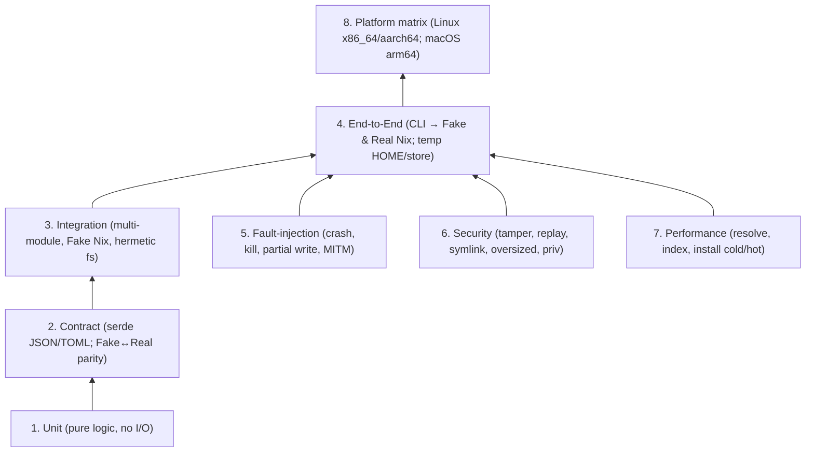
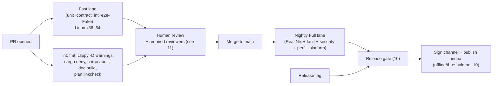

# 09 — Testing & Validation Strategy

**Owner:** Assurance track (plans 08–12). **Status:** Draft v1 (planning only).
**Depends on:** `00`,`01`,`02`,`03`,`04`,`05`,`06`,`07`,`08`.
**Feeds into:** `10` (release gates), `11` (test PRs & acceptance gates), `12` (test-driven go/no-go spikes).

---

## 1. Purpose & Scope

Define a **layered, hermetic, and reproducible** test strategy that proves the product's
security invariants (`08`), the state/lock/generation guarantees (`05`), the install
pipeline correctness (`04`), and the UX/platform contracts (`06`,`07`) — across Linux and
macOS, with both a **fake Nix** adapter (fast, hermetic, deterministic) and a **real Nix**
lane (authoritative, slow, gated).

### In scope
- All seven test layers: unit, contract, integration, end-to-end (e2e), fault-injection,
  security, performance, and platform.
- Hermetic fixtures (frozen Nixpkgs slices, signed-channel fixtures, fake binary cache).
- The Fake Nix adapter (`pkg-testkit`) used pervasively; the Real Nix lane used as a
  release gate.
- Test data management, determinism, CI matrix, and release gates.

### Out of scope
- Writing the production Rust code (planning only).
- Full perf budgets (target numbers agreed in `12` and reified here as gate thresholds).

### Convention
> **ℹ️ FACT** = current Nix behavior we rely on in tests. **📐 DECISION** = our test-design
> choice. Sources keyed as in `08` §13.

---

## 2. Test Pyramid (layers)



| # | Layer | Goal | Nix | Hermetic? | Speed target | Cadence |
|---|-------|------|-----|-----------|--------------|---------|
| 1 | Unit | Pure correctness of domain logic (selector/identity/state math) | none | yes | <5s | every commit |
| 2 | Contract | Wire formats & Fake↔Real parity; schema migrations | none | yes | <20s | every commit |
| 3 | Integration | Module composition with Fake Nix + hermetic fs + fake cache | Fake | yes | <60s | every commit |
| 4 | E2E | Real CLI flows via Fake **and** Real Nix in throwaway envs | both | yes (Fake), near (Real) | <5m Fake; <30m Real | Fake every commit; Real nightly + release |
| 5 | Fault-injection | Crash/kill/MITM/partial-write resilience | Fake/Real | yes | <5m | nightly + release |
| 6 | Security | All AC-S* from `08` §13 | Fake/Real | yes | <10m | nightly + release + on security PRs |
| 7 | Performance | Regression vs. budgets | Real | near | <30m | nightly + release |
| 8 | Platform | Cross-arch/OS correctness | Real | near | <60m | nightly per platform + release |

**Gate principle:** layers 1–3 block every PR; layer 4 (Fake) blocks every PR; layers 4
(Real)+5–8 block merge to release branches and any release. See `10` § release gates.

---

## 3. Hermeticity Principles (non-negotiable)

1. **No network in layers 1–4 (Fake) and 5–6.** All network is intercepted by a fake CDN /
   fake binary cache / MITM proxy fixture. Real Nix lane (4-Real, 7, 8) is the only place
   with controlled egress to `cache.nixos.org` and the product CDN.
2. **Throwaway roots.** Every integration/e2e test gets a fresh temp `HOME`, fresh product
   state dir, fresh temp store root (Real lane), and a scoped working dir. No test reads or
   writes the developer's real environment.
3. **Frozen fixtures in-repo.** Nixpkgs slices, channel metadata, and a tiny binary cache are
   checked in (or fetched via content hash in CI setup, never "latest").
4. **Determinism.** Index build, channel metadata, and state files must be byte-identical
   across hosts/runes; a determinism job asserts this (ties to `08` T-IDX-3).
5. **Time control.** A fake clock for expiry/rollback/freeze tests (T-CHAN-1/2); never rely
   on wall-clock.
6. **Isolation of privileges.** Tests never run privileged steps on dev machines;
   privileged/helper tests run in an ephemeral VM/container with a dedicated builder user.

---

## 4. The Fake Nix Adapter (`pkg-testkit`)

> **📐 DECISION.** Define a `NixAdapter` trait (`pkg-nix`, see `01`/`04`) with **JSON-only**
> methods (no scraping human output — see `04`). Provide a `FakeNix` implementation in
> `pkg-testkit` that is **programmable, deterministic, and in-process**, plus a recording
> mode that captures a Real Nix session to golden files so we can prove Fake↔Real parity.

### 4.1 Adapter trait (sketch — concrete types live in `pkg-nix`, owned by `01`/`04`)

```text
trait NixAdapter {
    fn version(&self) -> Result<VersionInfo>;                 // managed-Nix version
    fn eval_realize(&self, sel: &Selector, chan: &Channel) -> Result<Realization>;
    fn path_info(&self, path: &StorePath) -> Result<PathInfo>; // sigs, narHash, refs
    fn substitute(&self, path: &StorePath, subs: &Substituters) -> Result<SubstituteReport>;
    fn build(&self, drv: &DrvPath, caps: &BuildCaps) -> Result<BuildReport>;
    fn verify(&self, opts: VerifyOpts) -> Result<VerifyReport>;
    fn repair(&self, path: &StorePath) -> Result<RepairReport>;
    fn gc(&self, roots: &[StorePath]) -> Result<GcReport>;
    fn add_root(&self, path: &StorePath, name: &str) -> Result<RootRef>;
}
```

Every method returns **strict, size-capped, versioned JSON** typed in `pkg-nix` and
round-tripped by serde. This is the contract that layers 1–3 exercise without Nix and that
the Real lane proves against real Nix (T-DAEMON-2).

### 4.2 `FakeNix` capabilities
- Scripted responses keyed by Selector / StorePath / scenario.
- Deterministic narHash/signature generation using fixture keys.
- Simulated latency, partial writes, kills, and timeouts (drives layer 5).
- A **fake binary cache** (in-process HTTP server) serving signed NARs with controllable
  trust keys — used by security lane for sig-mismatch/rollback tests (T-CACHE-1/3).
- A **fake channel CDN** serving TUF metadata with controllable staleness/versions — used
  for rollback/freeze/mix-and-match tests (T-CHAN-1/2/3).

### 4.3 Fake↔Real parity (contract tests)
- A **capture/replay** harness records a Real Nix session to golden JSON; contract tests
  assert `FakeNix` reproduces the same typed outputs for the same scripted inputs.
- A diff in a parity job fails the build → forces Fake updates when Real behavior changes
  (e.g., new Nix version via channel update). Owned jointly with `04`/`10`.

---

## 5. Fixtures & Test Data

| Fixture | Purpose | Source | Pinned by |
|---------|---------|--------|-----------|
| `fixtures/nixpkgs-slice-tiny` | 5–10 attrs for unit/integration resolve | curated slice of a frozen Nixpkgs rev | git rev + narHash |
| `fixtures/channel-v1` | Signed TUF metadata (root/targets/snapshot/timestamp) | generated by `pkg-channel` test tooling | root key fixture (test-only) |
| `fixtures/cache-tiny` | Fake binary cache with a few signed NARs | generated by `nix-store --generate-binary-cache-key` in a setup script | fixture key (test-only) |
| `fixtures/state-v1/*` | State snapshots across migrations | hand-built | schema version |
| `fixtures/golden/*.json` | Golden outputs for contract + e2e | recorded from Real Nix | narHash + test version |
| `fixtures/cve-like` | A fake "malicious-looking" attr for T-RUN/T-IDX tests | synthetic | git |

> **📐 DECISION.** Fixture-generation scripts live in `pkg-testkit/fixtures/gen/` and are
> re-run in CI; their *outputs* are checked in when deterministic so PRs are reviewable.
> Fixture keys are **test-only** and never used in release signing.

---

## 6. Per-Layer Detail

### 6.1 Unit (layer 1) — `pkg-core`, `pkg-channel`, `pkg-index`
- Selector→Realization identity rules (user intent vs exact realization; `05`/`06`).
- Version/rev comparison, policy-version checks, expiry arithmetic.
- State Merkle/integrity-tag math; generation ordering; rollback selection.
- Channel metadata parsing + TUF role validation logic (pure, no network).
- Index query correctness over fixture slices.
- **Gate:** `cargo test -p pkg-core -p pkg-channel -p pkg-index --lib`.

### 6.2 Contract (layer 2)
- Serde round-trip of every JSON/TOML type in `pkg-nix`, `pkg-channel`, `pkg-core`.
- Schema migration tests: load each historical `state-vN` fixture, migrate to current,
  assert equivalence on stable fields; assert migrations are forward-only & idempotent (`05`).
- Fake↔Real parity (§4.3).
- **Gate:** `cargo test --test contract`.

### 6.3 Integration (layer 3)
- Install pipeline as a state machine: resolve→preflight→acquire→verify→stage→activate→commit
  with Fake Nix and hermetic fs; assert each transition and the rollback-on-failure invariant
  (T-STATE-3, `04`).
- Writer-lock + lease + journal under simulated concurrent invocations (`05`).
- Index build determinism (T-IDX-3) across two runs/hosts.
- GC consults generation manifest (T-STATE-4).
- **Gate:** `cargo test --test integration`.

### 6.4 End-to-End (layer 4)
- Drive the real CLI binary against Fake Nix and (Real lane) Real Nix in a throwaway env.
- Cover every command in `06`: `doctor, search, info, install, remove, list, outdated,
  update, upgrade (one/all), pin/unpin, history, rollback, gc, repair, completion`.
- Assert observable effects: state file contents, activation symlinks, exit codes, machine
  output (`--json`) stability, and that a failed op leaves the **previous generation** active.
- **Fake gate (every PR):** `cargo test --test e2e --features fake-nix`.
- **Real gate (nightly/release):** `cargo test --test e2e --features real-nix` inside an
  ephemeral VM with the managed Nix installed by the product installer.

### 6.5 Fault-injection (layer 5)
Kill the process or break the environment at every checkpoint of the install pipeline and
prove recovery to a consistent state.

| Injected fault | Where | Expected |
|----------------|-------|----------|
| `SIGKILL` mid-substitute | acquire | next run resumes; no partial activation |
| Disk full mid-write | stage | op aborts cleanly; previous generation intact |
| Drop/replay/MITM HTTPS to CDN | channel/update | TUF rejects; fail-closed |
| Corrupt a store path NAR | any time | `verify`/`repair` detects & restores |
| Stale writer lock (dead pid) | startup | lock reclaimed via boot-id + journal |
| Power-loss simulation (no fsync) | commit | rename atomicity preserves `current` |
| Crash in the generation transaction — by state (plan 05 §8.4) | stage→commit | **prepared** (`gen-<id>.json` written, no root, `current`=old): recovery deletes `gen-<id>.json`; previous gen active. **rooted** (root created, `current`=old): recovery removes root + deletes `gen-<id>.json`; previous gen active. **activated** (`current` swapped, root+record present, no `committed` row): recovery finalizes `manifest`/`lock` + the `committed` row; new gen stays active, rooted, documented. In every case `current` resolves to a rooted, documented tree and no unrooted staged path survives a later `gc`. (Supersedes the former “crash after GC-root create, before `committed` row” row, which assumed root-after-swap.) |
| `gc` during an in-flight op (lease held) | concurrency | `gc` serialized/refused (`STATE_LOCKED`, exit 72); in-flight closure never collected (plan 05 §9/§12) |
| Oversized/malformed Nix JSON | contract | strict parse rejects, no panic |
| Clock skew past timestamp expiry | channel | freeze detected; `update` blocked |

**Tooling:** a `pkg-testkit::chaos` helper wrapping spawned processes with ptrace/`kill` +
fsync toggles; on macOS use `rename` atomicity + `kill`. Fault tests are tagged
`#[ignore]`-by-default in local runs, run in nightly.

### 6.6 Security (layer 6) — maps 1:1 to `08` §13 AC-S*
Each AC-S*n* becomes one or more tests:

| AC | Test scenario | Layer |
|----|---------------|-------|
| AC-S1 | expired timestamp → `update` blocked | E2E + fake channel |
| AC-S2 | replay older `targets.json` → refused | E2E + fake channel |
| AC-S3 | mismatched-signature NAR not substituted; `repair` restores | E2E + fake cache |
| AC-S4 | symlink/world-writable-ancestor redirection rejected | integration |
| AC-S5 | concurrent writers serialized; crash recovers last generation | fault-injection |
| AC-S6 | helper rejects unauth caller & disallowed commands | integration (privileged VM) |
| AC-S7 | unmanaged Nix present → install refuses, untouched | e2e (privileged VM) |
| AC-S8 | `cargo audit` + `cargo deny` clean | release gate |
| AC-S9 | logs redact env/args/secrets | unit + golden |
| AC-S10 | `pkg info` shows provenance fields | e2e golden |
| AC-S11 | two uids on a shared host: A cannot read/write B's `<user-state>`; GC roots scoped per uid (D-17) | e2e (privileged VM, multi-user) |
| AC-S12 | caller as uid A cannot create roots / touch state under uid B (peer-cred enforced) | integration (privileged VM) |
| AC-S13 | build impossible/disallowed → `ACQUIRE_NO_BINARY` never runs (cross-platform); buildable miss surfaces preview; `sandbox-fallback=false`/build-user readiness fail-closed | e2e (Linux + macOS) + fault |
| (`10` AC-O4) | rotated-out TUF key can't sign new targets; rotation accepted within one `timestamp` window (T-CHAN-5) | e2e + fake channel |

Additional security tests beyond ACs: T-PATH-* matrix, T-LOG-* injection, T-REL-4 dependency
review, T-INST-2 TOCTOU, T-INST-6 cross-user/UID-confusion, T-UNINST-1/2 boundary checks.

### 6.7 Performance (layer 7)
- **Budgets (defaults; tuned in `12`):**
  - `search` p95 over fixture index: < 150 ms.
  - `info` p95: < 300 ms (Fake) / < 2 s (Real, cached).
  - `install` (cache hit, small closure) cold: < 8 s on Real lane reference host.
  - Index build (tiny slice): < 5 s; (full Nixpkgs slice): measured & regression-gated, not fixed.
  - Resolve (single attr, cached eval): p95 < 1.5 s Real.
- **Method:** `criterion` benches in CI on a fixed reference runner; record baselines; fail
  on >N% regression vs. pinned baseline (`10` perf gate). Bench vs. Fake for stability;
  Real for absolute budgets.

### 6.8 Platform matrix (layer 8)
| OS | Arch | Lane | Frequency |
|----|------|------|-----------|
| Linux | x86_64 | Real Nix (container) | every PR (Fast) + nightly (Full) |
| Linux | aarch64 | Real Nix (emulated/native runner) | nightly + release |
| macOS | arm64 (Apple Silicon) | Real Nix: cache hit; cache-miss preview; cancel; approval; successful native sandboxed build; sandbox-unavailable fail-closed; unsupported-package `ACQUIRE_NO_BINARY`; receipt/rollback | nightly + release |
| macOS | x86_64 | (best-effort) same matrix | release only |

macOS lanes additionally exercise the **full-closure cache preflight** as an
**availability signal** (AC-S13): every closure path is classified against
`cache.nixos.org` up front, buildable misses surface the build preview, and
disallowed builds fail with `ACQUIRE_NO_BINARY`; `sandbox=true`/
`sandbox-fallback=false` and `_nixbld` build-user readiness are verified and
fail-closed when unready. This is **not** binary-only enforcement — a buildable
Darwin cache miss proceeds to an approved native sandboxed build.

**Fast vs Full split:** "Fast" = unit+contract+integration+e2e(Fake) on every PR for the
primary arch (Linux x86_64). "Full" = adds e2e(Real)+fault+security+perf+platform nightly.

---

## 7. Real-Nix Lane Design

Because the Fake adapter is only as trustworthy as its parity with Real Nix, the Real lane
is a **release gate**, not optional.

- **Environment:** ephemeral VM (Linux: a CI runner with nested virt or a container with the
  product installer applied; macOS: a managed runner). Managed Nix is installed by the
  product's own installer (exercising `07`).
- **Fixture strategy:** pin a small set of Nixpkgs attrs known to substitute from
  `cache.nixos.org` for the target systems; assert substitution + activation. For
  **x86_64-darwin/aarch64-darwin** coverage, confirm in CI which chosen attrs substitute vs.
  which require a native build (this is part of spike S3, `12`); the macOS lane now covers both
  the cache-hit path **and** the approved native sandboxed build path, so a coverage gap is an
  availability/perf signal (a build happens) rather than a skipped test.
- **Cost control:** Real Nix ops are cached where safe (NAR store reused across a night's
  run via a CI cache keyed by Nixpkgs narHash), but **integrity-relevant tests always
  re-verify signatures and NAR hashes** (no trusting stale cache for security assertions).
- **Golden capture:** nightly job refreshes golden JSON from Real Nix; PRs that change wire
  formats must update goldens with a recorded session + parity justification.

---

## 8. CI Matrix & Workflow



- **Required for merge (every PR):** Fast lane + Lint green + at least the required
  reviewers from `11`.
- **Required for release:** latest Nightly Full green on all release platforms + security
  lane green + `cargo audit`/`deny` clean + perf within budget + manual 2-person sign-off
  (`10`).
- **Flake policy:** tests must be deterministic; a genuinely flaky test is treated as a bug
  and quarantined within 24h (no `#[ignore]` without a tracking issue).

---

## 9. Testability Requirements Imposed on Design

These are **constraints the implementation must satisfy** so testing is even possible:

1. **`NixAdapter` trait must exist** (`pkg-nix`) — no direct CLI scraping in core code (`04`).
2. **All machine output must be JSON/structured** behind stable `--json` schemas (`06`).
3. **State must be file-based and migratable** with explicit schema versions (`05`).
4. **Time must be injectable** (channel expiry, lease renewal, GC) — a `Clock` trait.
5. **Privileged operations must be separately testable** via a `--dry-run` / no-op helper
   path in `pkg-installer` so non-privileged CI can exercise logic (`07`).
6. **Index build must be deterministic** (sorted outputs, pinned inputs) (`03`).
7. **Network must be interceptable** — all HTTP via a single client that accepts a base URL
   + trust roots from config/test injection (`02`,`03`).

---

## 10. Release Gates (cross-ref `10` § release gates)

| Gate | Test layer | Blocks |
|------|-----------|--------|
| G-UNIT | 1 | PR |
| G-CONTRACT | 2 | PR |
| G-INTEGRATION | 3 | PR |
| G-E2E-FAKE | 4 (Fake) | PR |
| G-LINT (fmt/clippy/deny/audit/docs/linkcheck) | — | PR |
| G-E2E-REAL | 4 (Real) | release |
| G-FAULT | 5 | release |
| G-SECURITY | 6 | release + security PRs |
| G-PERF | 7 | release |
| G-PLATFORM | 8 (all release platforms) | release |
| G-SIGNOFF | human 2-person + security owner | release |

---

## 11. Dependencies on Other Plans

| Depends on | Why |
|-----------|-----|
| `01` | `NixAdapter` trait & wire contract types it produces. |
| `02` | Channel/TUF schema → contract tests & security lane. |
| `03` | Index determinism & disposable model → determinism + tamper tests. |
| `04` | Install pipeline checkpoints → integration/e2e/fault scenarios. |
| `05` | State schema, migrations, generations, GC → contract/migration + fault tests. |
| `06` | CLI commands & `--json` schemas → e2e golden set. |
| `07` | Installer/helper/uninstall → privileged VM tests & platform lane. |
| `08` | Threat catalog & AC-S* → security lane one-to-one. |
| **Feeds** | `10` (release gates), `11` (test PRs), `12` (spike acceptance). |

---

## 12. Implementation Checkpoints (PR-shaped; see `11`)

- **CP-T-1** `pkg-testkit` crate + `NixAdapter`/`FakeNix` skeleton (with `pkg-nix`). (`11`)
- **CP-T-2** Fixture generators + frozen `nixpkgs-slice-tiny` + fake cache + fake channel. (`11`)
- **CP-T-3** Fast CI lane (unit+contract+integration+e2e-Fake+lint). (`11`)
- **CP-T-4** Security lane mapping AC-S1..S10. (`11`)
- **CP-T-5** Fault-injection harness (`pkg-testkit::chaos`). (`11`)
- **CP-T-6** Real-Nix nightly lane + golden capture/replay parity. (`11`)
- **CP-T-7** Performance benches + budget regression gate. (`11`)
- **CP-T-8** Platform matrix runners (aarch64-linux, arm64-darwin). (`11`)

---

## 13. Testable Acceptance Criteria

- **AC-T1** A PR that changes a wire type fails contract tests unless goldens are updated
  with a justified Real capture.
- **AC-T2** Disabling fsync anywhere in the commit path causes a fault test to fail unless
  the rename-atomicity invariant holds.
- **AC-T3** Every `08` AC-S*n* has a passing test in the security lane; removing any control
  (e.g., substituter pinning) turns its test red.
- **AC-T4** Index build byte-identical across two CI hosts for the same inputs
  (determinism job green).
- **AC-T5** A full "clean host → install product → install package → rollback → uninstall"
  e2e passes on Real Nix on Linux x86_64 and macOS arm64.
- **AC-T6** Perf budgets enforced: a >N% regression fails the release gate.
- **AC-T7** No test in layers 1–6 touches the network; verified by a CI mode that null-routes
  all egress except the Real lane.
- **AC-T8** (Multi-user isolation) A two-user e2e on a shared host proves users cannot see or
  edit each other's `<user-state>` and GC roots are uid-scoped (AC-S11/S12).
- **AC-T9** (Crash ordering) A crash at *each* state of the generation transaction (prepared / rooted / activated / committed) recovers correctly (plan 05 §8.4): pre-swap states (prepared/rooted) leave the previous generation active and delete the unreachable staged generation/root; the **activated** state (after the `current` swap, before the `committed` row) always leaves `current` pointing at a fully-rooted, fully-documented tree and recovery finalizes `manifest`/`lock` + the committed row. Because the GC root is created **before** the swap, no crash ever leaves `current` pointing at an unrooted tree, and no orphaned unrooted staged path survives `gc`.
- **AC-T10** (GC leases) `gc` invoked while another op holds the lease is serialized/refused
  and never collects the in-flight closure (plan 05 §9/§12).
- **AC-T11** (Cache-miss build behavior, macOS) On macOS: a buildable cache miss shows
  the preview; cancelling leaves gen N active; with approval it builds natively under
  `sandbox=true`/`sandbox-fallback=false` via `_nixbld` and commits; a sandbox-unavailable
  state fails closed; an unsupported/impure derivation fails `ACQUIRE_NO_BINARY` even with
  approval; a successful build writes a receipt/journal row and is rollback-safe
  (plan 07 §16.4, plan 04 §5/§6/§7).

---

## 14. Primary Sources

- `[NIX-MANUAL]` — `nix build --json`, `nix path-info --json`, `nix-store --verify
  --repair`, `nix-store --generate-binary-cache-key`, `--option sandbox`, `restrict-eval`
  (used to build fixtures and the Real lane). https://nixos.org/manual/nix/stable/
- `[TUF]`/`[TOUGH]` — TUF roles & expiry semantics underpin security lane fixtures.
- `cargo deny`, `cargo audit`, `criterion` — standard Rust toolchain for the respective gates.

---

## 15. Unresolved Questions (→ `12`)

- Q1 Exact perf budgets (defaults proposed in §6.7; finalize in `12`).
- Q2 How much of the macOS Real lane is cache-hit vs. native-build (aarch64-darwin/x86_64-darwin
  coverage on cache.nixos.org affects build frequency, not viability — builds are allowed per DR-003);
  spike S3 sizes this.
- Q3 Emulation strategy for aarch64-linux CI (QEMU vs native runners) cost tradeoff.
- Q4 Whether security lane runs on every PR (slow) or only nightly+security-PRs (proposed).
