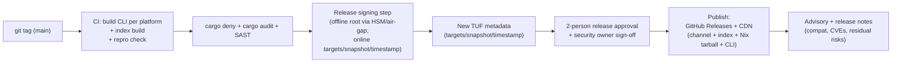

# 10 — Release & Operations

**Owner:** Assurance track (plans 08–12). **Status:** Draft v1 (planning only).
**Depends on:** `00`,`01`,`02`,`03`,`04`,`05`,`06`,`07`,`08`,`09`.
**Feeds into:** `11` (release/ops PRs), `12` (release risks, key decisions, compat policy).

---

## 1. Purpose & Scope

Define **how the product is released, signed, distributed, observed, supported, rolled back,
and decommissioned** — across four operational surfaces:

1. **Release** — building, signing, and publishing the CLI, the **managed Nix runtime**, the
   **signed channel metadata**, and the **disposable search index**.
2. **Keys** — TUF key custody, rotation, and revocation.
3. **Index & Channel** — day-2 operations for catalog updates (re-pinning Nixpkgs, publishing
   a new index, freezing/rolling back a channel).
4. **Support** — observability, incident response, compatibility policy, support data
   collection, and decommissioning.

### In scope (v1)
- The release pipeline, signing topology, publishing flow, release gates.
- Channel & index operations run by maintainers (pin, freeze, rollback, revocation).
- Client-side observability (logs, metrics, telemetry), incident response runbooks,
  compatibility/upgrade/downgrade policy, uninstall/decommission.

### Out of scope (v1)
- A product-hosted binary cache (deferred to v2; affects T-CACHE-2 in `08`).
- Federated/multi-source artifact trust (deferred).

### Convention
> **ℹ️ FACT** = current Nix/upstream behavior. **📐 DECISION** = our ops choice. Sources
> keyed as in `08` §13.

---

## 2. Artifacts & Release Topology

| Artifact | Producer | Signed by | Published to | Verified by client via |
|----------|----------|-----------|--------------|------------------------|
| CLI binaries (Linux x86_64/aarch64, macOS arm64) | CI build | release key (Sigstore attestation) + checksum pinned in signed release notes & installer (`07`) | GitHub Releases + product CDN | Sigstore attestation + pinned checksum (the CLI is released alongside the channel, **not** a TUF channel target — see note below) |
| Managed Nix runtime tarball (pinned) | upstream Nix release (we do **not** build Nix) | TUF `targets` | product CDN | TUF `targets.json` hash |
| Channel metadata (root/targets/snapshot/timestamp) | release service | TUF role keys (offline root; online others) | product CDN | TUF chain (`02`,`08`) |
| Disposable search index | indexer job (from pinned Nixpkgs narHash) | hash recorded in `targets` | product CDN | hash in `targets.json` |
| Installer scripts / docs | CI | checksum pinned in docs + release notes | docs site + CDN | pinned commit + detached sig |

> **ℹ️ FACT.** The product does **not** compile Nix. The managed runtime is a pinned,
> verifiably-hashed Nix release tarball distributed via the product CDN, recorded in signed
> channel metadata (`01`,`07`). We trust upstream Nix releases by hash, not by rebuild.

> **📐 DECISION.** v1 distribution is **GitHub Releases (source of truth) + product CDN
> (mirror)**. The CDN is a performance/availability layer; authenticity is **never** derived
> from the CDN — only from TUF signatures and hashes (`08` T-REL-3).
>
> **📐 DECISION (TUF target set).** The TUF channel target set is **exactly** the three
> "release targets" of doc 02 §6.4: the channel `descriptor.json`, the managed-Nix runtime
> tarballs, and the per-system index files. TUF provides
> rollback/freeze/mix-and-match protection, threshold signatures, and key rotation/revocation
> for **these** targets only. The CLI binary is **not** a TUF channel target, and TUF
> enumerates **no package catalog** (packages are resolved/realized from pinned Nixpkgs +
> `cache.nixos.org`, never “installed from TUF”). CLI authenticity comes from Sigstore
> attestation + a checksum pinned in signed release notes/installer (`07`).

### Release topology diagram

---

## 3. Release Gates

Gates aggregate `09` §10. **Every release (and release-candidate)** must pass:

| Gate | Source | Hard block? |
|------|--------|-------------|
| G-UNIT, G-CONTRACT, G-INTEGRATION, G-E2E-FAKE, G-LINT | `09` | yes |
| G-E2E-REAL (all release platforms) | `09` | yes |
| G-FAULT (fault-injection) | `09` | yes |
| G-SECURITY (all `08` AC-S*) | `09` | yes |
| G-PERF (within budget) | `09` | yes |
| G-PLATFORM (Linux x86_64/aarch64, macOS arm64) | `09` | yes |
| G-DEPS (`cargo audit`/`cargo deny` clean) | `09`,`08` T-REL-4 | yes |
| G-SIGNOFF (2-person + security owner) | this doc | yes |
| G-ADVISORY (release notes drafted: compat, CVEs, residual risks) | this doc | yes |
| G-REVOKE-READINESS (revocation rehearsal passed this cycle) | §6 | yes (quarterly) |

**Versioning & channels:** `pkg` follows **SemVer** for the CLI; channel metadata carries an
independent `policyVersion` (monotonic) and `sequence`/`expiry` (TUF). A CLI release targets
a **minimum policyVersion** and refuses to operate below it (forward-compat guard, `05`).

---

## 4. Key Management (TUF)

### 4.1 Roles, custody, thresholds (recap of `08` §7)

| Role | Custody | v1 threshold | Rotation |
|------|---------|--------------|----------|
| root | offline (HSM/air-gapped media, backed up via quorum) | 1-of-1 (v1) → **2-of-3 at GA** (DR-002) | rare; documented break-glass |
| targets | release service (online, least-priv) | 1-of-1 (v1) | quarterly + on-incident |
| snapshot | release service | 1-of-1 | quarterly |
| timestamp | release service | 1-of-1 | quarterly; **short expiry** (anti-freeze) |

### 4.2 Generation & storage
- Root key generated **once**, offline, on HSM or air-gapped media; two geographically
  separated encrypted backups under a Shamir/quorum split (≥2 custodians).
- Online keys in a managed KMS/HSM with audit logging; **never** on disk in plaintext.
- Test-only keys (`09` §5) are isolated and can never validate a release artifact.

### 4.3 Rotation
- Routine rotation every quarter for online roles; published as a TUF root/metadata update.
- Rotation drills (dry-run) at least once per cycle; results logged.
- Loss-of-online-key recovery: revoke via a new `targets`/`root` excluding the key; bounded
  by short `timestamp` expiry (≤24–48h proposed; finalize in `12`).

### 4.4 Revocation (keys)
Triggered by suspected/confirmed compromise (`08` T-CHAN-5, T-REL-2):
1. **Declare incident** (§7), assign IC.
2. **Revoke the compromised key** by publishing new TUF metadata without it (root rotation if
   root/targets key).
3. **Cut a new release** if the artifact set is suspect; clients pick it up via `update`.
4. **Post-mortem + advisory** within 5 business days.

---

## 5. Index & Channel Operations

### 5.1 Catalog update (re-pin Nixpkgs) — normal flow
| Step | Action | Artifact |
|------|--------|----------|
| 1 | Choose target Nixpkgs `rev`; compute `narHash`. | — |
| 2 | Confirm chosen attrs substitute from `cache.nixos.org` for x86_64/aarch64-linux and x86_64-darwin/aarch64-darwin; for attrs without binaries, confirm they build natively (macOS via `_nixbld`/sandbox per DR-003). Gaps are an availability/perf signal, not a hard block (spike S3, `12`). | availability + buildability report |
| 3 | Build the disposable index from the pinned rev; assert **determinism** across hosts (`09` T-IDX-3). | index + hash |
| 4 | Decide managed-Nix version bump if needed. | — |
| 5 | Author new `targets.json` (rev, narHash, index hashes, substituters/keys, systems, policyVersion, sequence, expiry); sign; cut snapshot+timestamp. | TUF metadata |
| 6 | Publish to CDN; advisory. | — |

### 5.2 Channel freeze
- A **freeze** = stop advancing `sequence` while keeping `timestamp` fresh (anti-stale) —
  used during incidents. Documented, time-boxed; clients see no new packages but do see
  freshness. (`08` T-CHAN-2 UX: user warned, not bricked.)
- **📐 DECISION.** Freeze never silently downgrades; it holds the current pinned rev.

### 5.3 Channel rollback (revert to prior catalog)
- Publish a `targets.json` restoring a prior pinned rev **with a higher `sequence`** (TUF
  forbids lowering sequence; rollback = forward-numbered re-publication of old content).
- Recorded in a **public rollback log** so users can see *why* a version regressed.
- Bounded by the managed-Nix-version compatibility window (§9).

### 5.4 Index re-publication & poisoning response (`08` T-IDX-1)
- The index is **disposable**: re-publishing is cheap; a poisoned index is replaced by a
  freshly derived one whose hash is signed into a new `targets`. Clients verify the hash and
  regenerate on mismatch — no "trusted old index" state.

### 5.5 Bad-package response (`08` T-RUN-1)
- v1 lever: re-pin Nixpkgs to a rev that fixes/removes the attribute, publish new channel.
- **Honest limitation:** if the bad attribute still exists in the currently-pinned rev and no
  upstream fix exists yet, v1 **cannot block a single attribute** without a fork/re-pin; we
  document this and, if severe, freeze then rollback to a prior rev. v2 may add an attribute
  denylist (deferred, `12`).

---

## 6. Compatibility Policy

### 6.1 What we promise
- **CLI SemVer:** backward-compatible within a major; breaking changes bump major and ship
  with migration notes.
- **Channel `policyVersion`:** monotonic; the CLI enforces a minimum and refuses to operate
  below it. Old CLIs may be told to self-upgrade.
- **State schema:** forward-only migrations; an older CLI will refuse (not corrupt) a newer
  state and instruct upgrade (`05`).
- **Generation rollback:** a user can roll back to any generation created under a compatible
  managed-Nix version; cross-major-Nix rollbacks are unsupported (documented).

### 6.2 Lifecycle & support windows (proposed defaults; finalize in `12`)
| Surface | Support window |
|---------|----------------|
| Latest CLI major | full support (security + features) |
| Previous CLI major | security-only for 6 months after next major |
| Channel policyVersion | N-1 supported concurrently for 90 days |
| Managed Nix runtime | updated via channel; old runtimes removed from circulation only after a full release cycle |
| Platforms | Linux x86_64/aarch64 + macOS arm64 for v1; EOL announced ≥1 release ahead |

### 6.3 Upgrade & downgrade
- **Upgrade CLI:** self-update fetches the new binary from GitHub Releases + CDN and verifies
  the Sigstore attestation + the checksum pinned in signed release notes/installer (`07`);
  atomic install with rollback to the previous CLI binary on failure. The CLI is **not** a
  TUF channel target — the signed channel (TUF) governs descriptor/runtime/index only
  (doc 02 §6.4); CLI rollback is binary keep-prev, not channel-sequence rollback.
- **Downgrade CLI:** supported only within the managed-Nix compatibility window; refuses if
  state schema/policyVersion is incompatible (fail-closed, `05`).

---

## 7. Observability

### 7.1 Client-side logging
- Structured logs to product dir (`0600`, owner=product), rotating, size-capped (`08` T-LOG-1).
- **Allowlist** fields; **denylist** redactor for env/args/secrets; control-char escaping
  (T-LOG-2). `pkg doctor` surfaces log path + a "safe to share" export that re-redacts.
- Verbose/debug levels opt-in; release default = INFO with no sensitive fields.

### 7.2 Metrics (local, opt-in)
- Counters/timers for: resolve latency, cache-hit/miss, install success/fail by phase,
  index build time, GC bytes reclaimed. Emitted as a **local file**; **not** auto-shipped.
- Telemetry is **opt-in**, minimal (aggregate counts + product/channel versions + OS/arch),
  and documented; never includes package lists, paths, or args (`08` T-LOG-1).

### 7.3 Crash handling
- Rust panics write a short structured crash record (channel rev, CLI version, phase,
  last-operation id) — **no** memory dumps by default. Opt-in minidump with redaction.
- `RUST_BACKTRACE=0` in release; user can enable for a support session.

### 7.4 Server-side / release-side observability
- CDN access logs + download counts (aggregate). No per-user tracking.
- Release-service audit log for every signing operation (who/what/when/key id) — retained
  for incident forensics (T-REL-1/2).

**PR-33 implementation boundary.** `pkg-release` validates a closed release manifest and
the exact 13 channel targets (descriptor; four runtime archives; four static asset manifests;
four indexes), while three CLI binaries and their Sigstore bundles remain explicitly outside
TUF. A provider-supplied authorization lease authenticates both independent approvals, reserves
the authoritative next sequence, supplies the authenticated signing-service identity, keeps the
lease reacquirable until separately authorized cleanup, and commits idempotently after publication.
The signer accepts only already-signed offline-root metadata and provider-supplied online
`KeySource`s, derives TUF hashes from the reviewed manifest, binds the exact current trusted-root
digest into that approval, rehashes artifacts immediately before signing, creates
consistent-snapshot targets through `tough`, verifies the repository with a real client, seals all bytes into
anonymous read-only files, and emits a mandatory create-only allowlisted audit event. Its
destination-neutral publisher preflights, idempotently ensures, and remotely verifies immutable
objects at the CDN and GitHub, then activates GitHub source-of-truth before the CDN mirror. The repo
deliberately contains no local-key/authority/publisher production adapter, cloud credentials, or
reusable test key. CI signs with fresh in-memory keys and verifies with the real client.
Selecting/deploying the KMS/HSM and concrete GitHub/CDN adapters remains operational configuration;
it cannot silently fall back to plaintext GitHub secrets.
Short-lived timestamp metadata has its own monotonic version and authority lease: it can be
re-signed against the currently verified snapshot and atomically routed at both destinations
without inventing a new product channel sequence. Exact partial uploads and post-publication
authority-commit failures are retryable with the same sealed transaction; conflicting bytes fail
closed.
Before the first remote write, the exact blobs, closed transaction manifest, hashes, and opaque
authority lease id are atomically persisted with private permissions. Restart recovery rehashes
those blobs and reacquires the same durable lease only when the authority-bound transaction digest
matches; it never re-signs a half-published release or trusts a substituted local record.
Root-expiry policy also requires the trusted root to outlive every child metadata expiry.
Timestamp refresh authority independently checks that same root digest. V1 refuses root
substitution; root rotation later requires the complete sequential update chain.
For a not-yet-active transaction, publication re-parses sealed metadata before upload and before
authoritative activation, requiring at least one hour of remaining validity; an aged-out
transaction cannot become a new authoritative release. If GitHub already reports the exact digest active, recovery may finish only that same
mirror and authority lease after expiry; remote status prevents expiry from stranding
reconciliation.

---

## 8. Incident Response

### 8.1 Severity & roles
| Severity | Meaning | Response time | Lead |
|----------|---------|---------------|------|
| SEV1 | Authenticated channel/cache compromise, RCE in shipped code, mass breakage | ≤1h ack, ≤4h mitigation | Security owner → Incident Commander (IC) |
| SEV2 | Significant subset broken, no auth compromise | ≤4h ack, ≤1 business day mitigation | Release owner |
| SEV3 | Minor/cosmetic, workaround exists | next release | on-call |

### 8.2 Runbooks (each is a checked-off checklist, rehearsed quarterly)
1. **Channel/cache key compromise** (`08` T-CHAN-5, T-REL-2): §4.4.
2. **Bad package discovered** (`08` T-RUN-1): §5.5.
3. **Index poisoning** (`08` T-IDX-1): §5.4.
4. **Managed-Nix CVE**: emergency channel update bumping managed-Nix version (hash signed in
   `targets`); advisory with CVE + affected versions; coordinated disclosure with upstream.
5. **CLI dependency CVE** (`08` T-REL-4): `cargo audit`→patch→release; assess if exploitable
   in our threat model before emergency vs. routine.
6. **Mass client breakage** (bad channel publish): freeze then rollback (§5.3); publish
   post-mortem.
7. **CDN outage**: clients continue to function against cached channel (within `timestamp`
   grace) and local store/index; we publish to alternate mirror if extended.

### 8.3 Disclosure & advisories
- Security advisories via GitHub Security Advisories + release notes + docs site.
- Coordinated Vulnerability Disclosure (CVD) for reporter-identified issues; credit optional.
- Post-mortems published (sans sensitive detail) within 5 business days for SEV1/2.

---

## 9. Support Data & Privacy

### 9.1 What `pkg doctor --support` collects (user-explicit, previewable, re-redacted)
- CLI version, channel policyVersion/sequence/expiry, managed-Nix version, OS/arch.
- Last N operations' **phase + outcome** (no args/paths), redacted.
- Index/channel verification results (hashes, freshness).
- Disk/state-dir health (sizes, perms — no contents).
- **Never:** package names by default (opt-in toggle), env vars, file contents, network
  addresses beyond configured substituters.

> **📐 DECISION.** Support export is **preview-before-send** and the user is shown the exact
  bundle. Privacy review is a release gate for any new field (`08` T-LOG-1, GDPR/minimization).

### 9.2 Data retention
- Client logs: rotating, max size configurable, default cap (e.g., 50 MB total).
- Server-side: signing audit logs retained per policy; CDN logs per provider policy, minimal.

---

## 10. Rollback & Revocation (client-visible mechanics)

| Scenario | Client experience | Mechanism |
|----------|-------------------|-----------|
| Bad CLI release | auto-rollback to previous CLI binary | atomic CLI self-update + keep-prev |
| Bad channel publish | `update` shows rollback; installs use new (reverted) rev | signed `targets` w/ higher sequence |
| Stale/frozen channel | `update`/`upgrade` blocked with reason | TUF `timestamp` expiry + version checks |
| Bad package in pinned rev | re-pin to fixed rev; `outdated`/`upgrade` surfaces it | channel update (§5.5) |
| Compromised cache key | ignored (only channel-trusted keys admitted) | substituter/keys from `targets` |
| Local corruption | `repair` re-verifies & restores from cache | `nix-store --verify --repair` |

---

## 11. Decommissioning / End-of-Life

- **Product EOL:** announced ≥1 major release ahead; final release keeps channel `timestamp`
  fresh for a stated wind-down period so clients don't go stale-bricked; explicit "product
  archived" notice.
- **Per-user uninstall:** removes only recorded product assets; never touches unmanaged Nix
  (`08` T-UNINST-1); `doctor --post-uninstall` verifies zero privileged residue (T-UNINST-2).
- **Key destruction at EOL:** root/online keys destroyed per policy; final advisory states no
  further updates will validate.

---

## 12. Operations RACI (roles; people TBD)

| Activity | Responsible | Accountable | Consulted | Informed |
|----------|-------------|-------------|-----------|----------|
| Release cut | Release owner | Maintainer lead | Security, Platform | Users |
| Signing (root) | Key custodian | Security owner | Release owner | — |
| Channel re-pin | Release owner | Catalog owner | Security | Users |
| Incident (SEV1) | On-call IC | Security owner | All owners | Users, upstream |
| Key rotation | Key custodian | Security owner | Release owner | — |

---

## 13. Dependencies on Other Plans

| Depends on | Why |
|-----------|-----|
| `01`,`07` | Managed-Nix as a hashed tarball (we don't build Nix); installer layout. |
| `02` | TUF channel schema & signing model → all release/key/channel ops. |
| `03` | Index determinism & disposable model → re-publication & poisoning response. |
| `04`,`05` | Pipeline phases, state schema → release gates & rollback mechanics. |
| `06` | `doctor`, `--json`, copy/honesty → support data & advisories. |
| `08` | Threat catalog → incident runbooks & key revocation. |
| `09` | Test layers → release gates G-* and Real-Nix lane. |
| **Feeds** | `11` (release/ops PRs), `12` (release risks, compat defaults). |

---

## 14. Implementation Checkpoints (PR-shaped; see `11`)

- **CP-O-1** Release pipeline: build per-platform CLI + index + repro check + audit/deny. (`11`)
- **CP-O-2** Signing step: offline root + online targets/snapshot/timestamp; audit log. (`11`)
- **CP-O-3** Publish to GitHub Releases + CDN; channel publish tooling. (`11`)
- **CP-O-4** Observability: structured logs, redactor, opt-in telemetry, crash record. (`11`)
- **CP-O-5** `doctor --support` previewable export. (`11`)
- **CP-O-6** Incident runbooks + quarterly revocation rehearsal (process + checklist repo). (`11`)
- **CP-O-7** Compatibility gates: policyVersion min, schema-refuse, CLI self-update/rollback. (`11`)

---

## 15. Testable Acceptance Criteria

- **AC-O1** A release that skips any G-* gate cannot be published (CI enforcement).
- **AC-O2** Re-publishing an index changes its hash; a client with the old hash regenerates
  and refuses the mismatched one (`08` AC-S… index integrity).
- **AC-O3** A rollback publishes a higher-`sequence` `targets`; a client that saw the bad
  revision accepts the rollback and logs the reason.
- **AC-O4** A key revocation (root rotation) is accepted by a client within one `timestamp`
  window; the revoked key can no longer validate new artifacts.
- **AC-O5** `doctor --support` output contains no env/args/secrets and is byte-identical to
  the preview the user approved.
- **AC-O6** An emergency managed-Nix bump propagates as a signed `targets` update and a
  client applies it without re-trusting the CDN.
- **AC-O7** An EOL wind-down keeps `timestamp` fresh for the stated period and the final
  advisory is machine-discoverable.

---

## 16. Primary Sources

- `[NIX-MANUAL]` — managed-Nix distribution semantics, `--verify`/`--repair`, binary cache
  keys (`nix-store --generate-binary-cache-key`). https://nixos.org/manual/nix/stable/
- `[TUF]`/`[TOUGH]` — TUF roles, expiry, version monotonicity, key rotation/revocation.
  https://theupdateframework.io/specification/latest/ , https://docs.rs/tough
- `[SIGSTORE]` — release attestation layer (considered, deferred). https://www.sigstore.dev/
- GitHub Security Advisories / CVD norms for disclosure process.

---

## 17. Unresolved Questions (→ `12`)

- Q1 TUF root threshold at GA: 2-of-3 vs 3-of5 (DR-002).
- Q2 `timestamp` expiry window default (24h vs 48h) — availability vs. freeze detection.
- Q3 Whether to product-host a binary cache in v1 (affects T-CACHE-2 mitigation).
- Q4 Exact support windows (§6.2 defaults to confirm).
- Q5 Telemetry opt-in granularity (counts vs. durations vs. feature usage).
