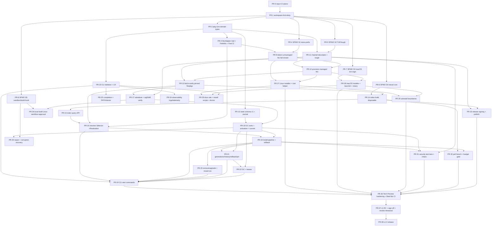

# 11 — PR Roadmap & DAG (Foundations → Technical Preview → v1)

**Owner:** Assurance track (plans 08–12). **Status:** Draft v1 (planning only).
**Depends on:** `00`..`10` (every prior plan). **Feeds into:** `12` (spike decisions referenced here as DRs).

> **Note on module paths.** The *authoritative* module/file layout is defined in `01`
> (architecture), `04`/`05` (core/state), and `07` (platform). The crate paths below are the
> **proposed workspace** this roadmap assumes; if `01`/`04`/`07` choose different names, PR
> ownership transfers with the rename but the DAG, dependencies, and gates are unchanged.

---

## 1. Principles

1. **One purpose per PR.** A reviewer can hold the whole change in their head.
2. **Spikes before irreversible architecture.** Every risky unknown (store-prefix, TUF
   fitness, macOS binary coverage, reeval cost, sandbox/caps) is resolved by a numbered
   **spike PR** that *produces a Decision Record in `12`* before the PR that depends on it.
3. **Foundations before features; tests before trust.** No PR touches channel/keys/state/
   helper/substitute/eval-purity without a security review and the relevant test lane green.
4. **Parallelism is explicit.** PRs with no edge between them in §3 may be developed in
   parallel; the matrix in §5 says which.
5. **Every PR is reversible.** Each entry lists a rollback strategy (revert + what state is
   left behind).
6. **Small enough for serious review.** Target: a PR lands in ≤ a few hundred lines of
   *logic* (fixtures/tests excluded); anything larger is split.

---

## 2. Reviewer Model

Three area owners (people TBD; roles fixed):
- **F** = Foundations & Trust owner (`00`–`03`): architecture, channel/TUF, Nixpkgs/index, Nix adapter contract.
- **E** = Execution & Platform owner (`04`–`07`): resolve/install/build, state/locks/gen/GC, CLI/UX, installers.
- **A** = Assurance owner (`08`–`12`, this track): security, tests, release/ops, roadmap, risks.

**Rules:** every PR has a **primary** reviewer (owner of the most-touched plan), ≥1
**cross-area** reviewer (a different owner), and a **mandatory security review by A** for any
PR in the **trust surface** (channel/keys, state integrity, helper/privilege, substitute,
eval purity, uninstall, release signing). Spikes additionally require sign-off by the owner
whose plan the spike informs.

---

## 3. The PR DAG (PR-0 … PR-38)



---

## 4. PR Entries

> Fields: **Purpose · Owns · Depends · Migration/compat · Tests & gates · Demo · Reviewers ·
> Rollback · Parallel · Milestone.** "Fast" = layers 1–4(Fake)+lint (`09`). "Full" =
> nightly/release lanes.

### Milestone M0 — Foundations

#### PR-0 — Repo bootstrap, CI skeleton, plans cross-links, threat-model baseline
- **Purpose:** establish the repo, the plans directory as the source of truth, and CI that
  enforces plan cross-references and the `08` threat model as a living baseline.
- **Owns:** `.gitignore`, `README.md`, `plans/` (links only — do **not** edit others' plans),
  `.github/workflows/docs-linkcheck.yml`, `CONTRIBUTING.md` (PR rules from §1–§2).
- **Depends:** — (first PR).
- **Migration/compat:** n/a.
- **Tests & gates:** docs linkcheck green; CONTRIBUTING references the reviewer model.
- **Demo:** `act -W .github/workflows/docs-linkcheck.yml` (or CI run).
- **Reviewers:** primary A; cross F,E.
- **Rollback:** revert; repo is empty so no state impact.
- **Parallel:** no (blocks all).
- **Milestone:** M0.

#### PR-1 — Cargo workspace, toolchain, lint/license/deny/audit
- **Purpose:** create the workspace skeleton and the lint/security gates that every later PR
  inherits.
- **Owns:** `Cargo.toml` (workspace), `rust-toolchain.toml`, `deny.toml`, `rustfmt.toml`,
  `clippy.toml`, `.github/workflows/ci-fast.yml` (lint job: fmt, `clippy -D warnings`,
  `cargo deny check`, `cargo audit`, `cargo doc`), license headers.
- **Depends:** PR-0.
- **Migration/compat:** pins MSRV; documented in `CONTRIBUTING`.
- **Tests & gates:** G-LINT green on empty workspace.
- **Demo:** `cargo build --workspace && cargo deny check && cargo audit`.
- **Reviewers:** primary F; cross A; (E informed).
- **Rollback:** revert.
- **Parallel:** no.
- **Milestone:** M0.

#### PR-2 — `pkg-core` domain types
- **Purpose:** the vocabulary everything else uses: user intent vs exact realization, identity,
  system triples, channel/policyVersion, version comparison.
- **Owns:** `crates/pkg-core/src/{identity.rs,selector.rs,realization.rs,channel.rs,version.rs,system.rs}`, `crates/pkg-core/Cargo.toml`, unit tests.
- **Depends:** PR-1.
- **Migration/compat:** defines the (display-only) `pname@version` vs unique-identity
  distinction (`00`,`05`). No persistence yet.
- **Tests & gates:** G-UNIT; property tests for version compare + identity equality.
- **Demo:** `cargo test -p pkg-core`.
- **Reviewers:** primary F; cross E; (A informed).
- **Rollback:** revert (no consumers yet).
- **Parallel:** with PR-3's *planning* but not merge (PR-3 needs these types).
- **Milestone:** M0.

#### PR-3 — `NixAdapter` trait + JSON contract + `FakeNix` skeleton + Fast CI
- **Purpose:** the seam that lets us build/test the entire core without Real Nix.
- **Owns:** `crates/pkg-nix/src/{adapter.rs,contract.rs,error.rs}`, `crates/pkg-testkit/src/{fake_nix.rs,lib.rs}`, Fast-CI test job wiring (unit+contract+integration-stub).
- **Depends:** PR-1, PR-2.
- **Migration/compat:** defines the **JSON-only** contract (`04`) — no human-output scraping.
- **Tests & gates:** G-UNIT + G-CONTRACT (serde round-trips) on FakeNix.
- **Demo:** `cargo test -p pkg-nix -p pkg-testkit`.
- **Reviewers:** primary F; cross E; **security A** (contract is a trust boundary, `08` T-DAEMON-2).
- **Rollback:** revert.
- **Parallel:** no (foundation of all Nix-touching PRs).
- **Milestone:** M0.

### Milestone M0.5 — Spikes (gated, parallel-able)

> Each spike PR contains **investigation scripts/notes + a Decision Record stub in `12`**
> (no production code merged except tiny repro helpers). Acceptance = the DR is filled with a
> concrete go/no-go and the blocking PR unblocks. Spikes are the **only** thing allowed to
> land large exploratory diffs; they are reviewed for *soundness of the conclusion*, not code.

#### PR-4 — SPIKE S1: Nix store-prefix & coexistence
- **Purpose:** determine whether a non-`/nix/store` prefix is viable and how the managed
  daemon/store can coexist with or exclude an existing unmanaged Nix. **Gates the installer
  layout (PR-27/28) and the managed-Nix provision model (PR-12).**
- **Owns:** `spikes/s1-store-prefix/` (scripts, findings.md), DR in `12` (DR-001).
- **Depends:** PR-1.
- **Migration/compat:** expected conclusion confirms the v1 "exclusive managed `/nix/store`"
  invariant (`00`,`07`) OR mandates a different layout before PR-12.
- **Tests & gates:** DR accepted by F, E, and A.
- **Demo:** `cat spikes/s1-store-prefix/findings.md`.
- **Reviewers:** primary F; cross E; **A** (security: T-INST-4).
- **Rollback:** archive spike dir.
- **Parallel:** with PR-5,6,7,8.
- **Milestone:** M0.5.

#### PR-5 — SPIKE S2: TUF/`tough` fitness
- **Purpose:** confirm real TUF via `tough` expresses our small target set (rev/narHash,
  managed-Nix version, index hashes, substituters/keys, systems, policyVersion, sequence,
  expiry) and supports threshold + revocation. **Gates PR-11.**
- **Owns:** `spikes/s2-tough/`, DR-002 in `12`.
- **Depends:** PR-1.
- **Migration/compat:** locks the channel-signing choice (`02`,`08` §7).
- **Tests & gates:** DR accepted by F and **A** (security).
- **Demo:** a tiny signed metadata set that the spike client verifies end-to-end.
- **Reviewers:** primary F; cross A (security owner); E informed.
- **Rollback:** archive spike.
- **Parallel:** with PR-4,6,7,8.
- **Milestone:** M0.5.

#### PR-6 — SPIKE S4: single-attribute reevaluation cost
- **Purpose:** measure time/memory of realizing one attribute at a pinned rev (Fake vs Real)
  to size resolve UX and the index. **Gates PR-14/16 budgets.**
- **Owns:** `spikes/s4-reeval-cost/`, DR-004 in `12`.
- **Depends:** PR-1.
- **Migration/compat:** informs `09` perf budgets and `04` resolve design.
- **Tests & gates:** DR with measured numbers accepted by E and A.
- **Demo:** `spikes/s4-reeval-cost/run.sh` output table.
- **Reviewers:** primary E; cross F; A informed.
- **Rollback:** archive spike.
- **Parallel:** with PR-4,5,7,8.
- **Milestone:** M0.5.

#### PR-7 — SPIKE S3: macOS binary coverage + Apple signing/notarization
- **Purpose:** confirm chosen attrs substitute from `cache.nixos.org` for `aarch64-darwin`
  (binary-only v1) and that a notarized signed installer is achievable. **Gates PR-28 and the
  Real-Nix macOS lane (`09`).**
- **Owns:** `spikes/s3-macos/`, DR-003 in `12`.
- **Depends:** PR-1.
- **Migration/compat:** confirms or revises the macOS binary-only policy (`07`).
- **Tests & gates:** DR accepted by E and A.
- **Demo:** availability matrix for a fixture attr set on `aarch64-darwin`.
- **Reviewers:** primary E; cross F; **A** (security: signing).
- **Rollback:** archive spike.
- **Parallel:** with PR-4,5,6,8.
- **Milestone:** M0.5.

#### PR-8 — SPIKE S5: Linux sandbox/build-hook + resource caps
- **Purpose:** confirm `sandbox=true` works with the managed daemon, that we can intercept a
  build for preview/approval, and that cgroups/RLIMIT caps are effective. **Gates PR-26.**
- **Owns:** `spikes/s5-sandbox/`, DR-005 in `12`.
- **Depends:** PR-1.
- **Migration/compat:** informs `04`/`07` build/caps design and `08` T-BUILD-* controls.
- **Tests & gates:** DR accepted by E and **A**.
- **Demo:** a sandboxed build that fails to reach the network as predicted.
- **Reviewers:** primary E; cross F; **A** (security: T-BUILD-1/3).
- **Rollback:** archive spike.
- **Parallel:** with PR-4,5,6,7.
- **Milestone:** M0.5.

### Milestone M1 — Managed Nix lifecycle & state

#### PR-9 — Managed-Nix detection (fail-closed on unmanaged Nix)
- **Purpose:** detect any existing **unmanaged** Nix and refuse with remediation text; never
  delete it (`08` T-INST-4, G6).
- **Owns:** `crates/pkg-nix/src/managed/detect.rs` + tests.
- **Depends:** PR-3, PR-4 (S1).
- **Migration/compat:** first user-facing gate; documented in `07`.
- **Tests & gates:** G-UNIT + G-INTEGRATION (Fake host with "unmanaged Nix" fixture → refuse).
- **Demo:** `pkg doctor` on a host with a stray `/nix` → refusal + remediation.
- **Reviewers:** primary E; cross F; **A** (security).
- **Rollback:** revert; detection is non-destructive.
- **Parallel:** with PR-10, PR-11.
- **Milestone:** M1.

#### PR-10 — `pkg-core` state schema v1 + migrations + journal + integrity
- **Purpose:** the authoritative state: schema-versioned, forward-only migrations, operation
  journal, tamper-evident integrity anchor to the channel (`08` §7.3, T-STATE-1).
- **Owns:** `crates/pkg-core/src/state/{mod.rs,schema.rs,migrate.rs,journal.rs,integrity.rs}` + tests + `fixtures/state-v1/`.
- **Depends:** PR-2.
- **Migration/compat:** establishes `stateVersion=1`; all later schema PRs add migrations.
- **Tests & gates:** G-UNIT + G-CONTRACT (migration idempotence, fail-closed on tamper).
- **Demo:** `cargo test -p pkg-core state::`.
- **Reviewers:** primary E; cross F; **A** (security: state integrity).
- **Rollback:** revert (no writers yet beyond tests).
- **Parallel:** with PR-9, PR-11.
- **Milestone:** M1.

#### PR-11 — `pkg-channel` descriptor + `tough` client + verify
- **Purpose:** load/verify signed channel metadata; enforce version monotonicity, expiry,
  allowed substituters/keys/systems/policyVersion (`02`,`08` §6.5, §7).
- **Owns:** `crates/pkg-channel/src/{descriptor.rs,tuf.rs,keys.rs,policy.rs}` + tests + fixture `fixtures/channel-v1/`.
- **Depends:** PR-2, PR-5 (S2).
- **Migration/compat:** defines `policyVersion=1`; CLI min-policyVersion enforced later (PR-37).
- **Tests & gates:** G-UNIT + G-CONTRACT + security-scoped tests for rollback/freeze/mix-match.
- **Demo:** `cargo test -p pkg-channel`.
- **Reviewers:** primary F; cross A; **A mandatory security** (channel = trust root).
- **Rollback:** revert; no runtime consumers yet.
- **Parallel:** with PR-9, PR-10.
- **Milestone:** M1.

#### PR-12 — Managed-Nix provisioning (fetch/verify/install)
- **Purpose:** download the pinned managed-Nix tarball, verify hash from signed `targets`,
  lay it down, launch the daemon; refuse if detection (PR-9) failed.
- **Owns:** `crates/pkg-nix/src/managed/{provision.rs,daemon.rs}` + tests.
- **Depends:** PR-9, PR-11.
- **Migration/compat:** records the managed-Nix asset manifest (consumed by uninstall PR-29).
- **Tests & gates:** G-UNIT + G-INTEGRATION (Fake CDN + FakeNix); Real-Nix smoke deferred to PR-36.
- **Demo:** provision against a fixture tarball in a temp root.
- **Reviewers:** primary E; cross F; **A** (security: T-REL-3, T-INST-1).
- **Rollback:** remove laid-down files via manifest; documented.
- **Parallel:** no (consumes 9+11).
- **Milestone:** M1.

### Milestone M2 — Catalog & resolve

#### PR-13 — Fetch + verify pinned Nixpkgs (rev/narHash)
- **Purpose:** materialize the pinned Nixpkgs rev and verify `narHash` from signed channel.
- **Owns:** `crates/pkg-nix/src/nixpkgs.rs` + tests + FakeNix hooks.
- **Depends:** PR-11, PR-12.
- **Migration/compat:** pinned rev is the catalog source of truth (`00`,`03`).
- **Tests & gates:** G-UNIT + G-INTEGRATION (narHash mismatch → refuse).
- **Demo:** realize a fixture attr's derivation path from the pinned slice.
- **Reviewers:** primary F; cross E; **A** (security: T-EVAL-1).
- **Rollback:** revert; cache is disposable.
- **Parallel:** no.
- **Milestone:** M2.

#### PR-14 — `pkg-index` disposable, deterministic build
- **Purpose:** derive the search/list/info index from the pinned Nixpkgs; assert
  cross-host determinism (`08` T-IDX-3, `03`).
- **Owns:** `crates/pkg-index/src/build.rs` + tests + determinism job in CI.
- **Depends:** PR-13, PR-6 (S4 budgets).
- **Migration/compat:** index hash recorded into channel `targets` later (PR-33 publish).
- **Tests & gates:** G-UNIT + G-INTEGRATION + **determinism** (two-host identical bytes).
- **Demo:** build index for `fixtures/nixpkgs-slice-tiny`, hash stable.
- **Reviewers:** primary F; cross A; (E informed).
- **Rollback:** rebuild (disposable).
- **Parallel:** with PR-15 planning (PR-15 consumes its output).
- **Milestone:** M2.

#### PR-15 — `pkg-index` query API (search/list/info)
- **Purpose:** read-side API used by the CLI; pure over the index; no network.
- **Owns:** `crates/pkg-index/src/{query.rs,search.rs,list.rs,info.rs}` + tests.
- **Depends:** PR-14.
- **Migration/compat:** exposes `--json` shapes the CLI pins (PR-24).
- **Tests & gates:** G-UNIT + golden query outputs.
- **Demo:** `cargo test -p pkg-index`.
- **Reviewers:** primary F; cross E; A informed.
- **Rollback:** revert.
- **Parallel:** no.
- **Milestone:** M2.

#### PR-16 — `pkg-core` resolver (Selector → Realization)
- **Purpose:** map user intent to exact realization via the pinned Nixpkgs under pure eval
  (`04`, `08` T-EVAL).
- **Owns:** `crates/pkg-core/src/resolver.rs` + tests.
- **Depends:** PR-3 (adapter), PR-13, PR-15.
- **Migration/compat:** the intent-vs-realization contract (`00`,`05`).
- **Tests & gates:** G-UNIT + G-INTEGRATION (Fake Nix eval, pure-eval enforced, impure attrs rejected).
- **Demo:** resolve `openssl` selector → exact realization + closure preview.
- **Reviewers:** primary E; cross F; **A** (security: T-EVAL-1/2).
- **Rollback:** revert.
- **Parallel:** no.
- **Milestone:** M2.

### Milestone M3 — Install / activate

#### PR-17 — Substitute from `cache.nixos.org` + signature/NAR verify
- **Purpose:** acquire store paths only from channel-approved substituters/keys; verify
  Ed25519 sig + NAR hash (`08` T-CACHE-1/3).
- **Owns:** `crates/pkg-nix/src/substitute.rs` + tests + FakeNix fake-cache hooks.
- **Depends:** PR-13, PR-11 (keys).
- **Migration/compat:** only `cache.nixos.org` + product keys admitted (`02`).
- **Tests & gates:** G-UNIT + G-INTEGRATION + security (sig mismatch not substituted).
- **Demo:** substitute a fixture path; show verify report.
- **Reviewers:** primary E; cross F; **A mandatory security** (substitution = trust boundary).
- **Rollback:** revert; substituted paths remain in disposable store.
- **Parallel:** with PR-18 planning (PR-18 needs its output).
- **Milestone:** M3.

#### PR-18 — `pkg-store` GC roots + activation + atomic `current`
- **Purpose:** product-owned GC roots (per-user, uid-scoped under
  `/nix/var/nix/gcroots/pkg/users/<uid>/`, created by the authenticated root-helper —
  D-17/ARCH-INV-06; `05` §8.3), store-relative activation symlinks, atomic current
  generation pointer, and the generation-transaction ordering in which the GC root
  is created **before** the `current` swap and the `committed` journal row is
  appended **after** (`05` §8.4; `08` T-PATH-1/2/4, T-STATE-3).
- **Owns:** `crates/pkg-store/src/{roots.rs,activate.rs,current.rs}` + tests.
- **Depends:** PR-10, PR-17.
- **Migration/compat:** Nix profile state is **not** authoritative (`05`).
- **Tests & gates:** G-UNIT + G-INTEGRATION + security (symlink/world-writable rejection) + fault: kill at each transaction state (prepared/rooted/activated/committed, `05` §8.4) recovers correctly, the GC root always precedes the `current` swap, and no crash leaves `current` unrooted.
- **Demo:** activate a fixture closure into a temp HOME; verify the GC root exists before `current` switches and the swap is atomic.
- **Reviewers:** primary E; cross F; **A mandatory security** (path/symlink hardening).
- **Rollback:** revert to previous activation via `current`.
- **Parallel:** no.
- **Milestone:** M3.

#### PR-19 — Install pipeline state machine + rollback-on-failure
- **Purpose:** resolve→preflight→acquire→verify→stage→activate→commit with the invariant
  that **failure leaves the previous generation active** (`04`,`08` T-STATE-3).
- **Owns:** `crates/pkg-core/src/pipeline/{mod.rs,resolve.rs,preflight.rs,acquire.rs,verify.rs,stage.rs,activate.rs,commit.rs}` + tests.
- **Depends:** PR-16, PR-18.
- **Migration/compat:** writes generations via PR-10 state.
- **Tests & gates:** G-UNIT + G-INTEGRATION + fault (kill at each transaction state — prepared/rooted/activated/committed, `05` §8.4 — → correct recovery; the previous generation stays active on any pre-swap failure).
- **Demo:** install a fixture package; kill after the `current` swap but before the `committed` row; rerun → recovery finalizes and the rooted generation N+1 is active.
- **Reviewers:** primary E; cross F; **A** (security/reliability).
- **Rollback:** revert; pipeline is idempotent + resumable.
- **Parallel:** no (core of the product).
- **Milestone:** M3.

#### PR-20 — Remove / upgrade-one / upgrade-all + mixed-revision handling
- **Purpose:** lifecycle ops that edit the desired-state set; handle mixed Nixpkgs revisions
  during selective upgrades (`04`,`05` §7). Per INV-04/`00`, a generation may legitimately
  contain outputs realized from multiple Nixpkgs revisions (selectors may pin
  `channel:current` | `channel:pinned:<id>` | `rev:<gitsha>`), and **every** such rev is
  exact/pinned — never floating; `upgrade` re-resolves only the named/non-pinned selectors at
  the current `channelSeq`.
- **Owns:** `crates/pkg-core/src/{remove.rs,upgrade.rs}` + tests.
- **Depends:** PR-19.
- **Migration/compat:** defines the upgrade semantics users see (`06`).
- **Tests & gates:** G-UNIT + G-INTEGRATION + golden desired-state diffs.
- **Demo:** upgrade one package while others stay pinned.
- **Reviewers:** primary E; cross F; A informed.
- **Rollback:** revert; ops are generation-based.
- **Parallel:** with PR-21 (both consume PR-19).
- **Milestone:** M3.

### Milestone M4 — Generations & UX

#### PR-21 — Generations / history / rollback / pin-unpin
- **Purpose:** surface and roll back generations; pinning expresses user intent (`05`,`06`).
- **Owns:** `crates/pkg-core/src/{generation.rs,history.rs,pin.rs}` + tests.
- **Depends:** PR-10, PR-19.
- **Migration/compat:** rollback stays within managed-Nix compat window (`10` §6).
- **Tests & gates:** G-UNIT + G-INTEGRATION (rollback restores prior activation).
- **Demo:** install → install → `history` → `rollback`.
- **Reviewers:** primary E; cross F; A informed.
- **Rollback:** revert.
- **Parallel:** with PR-20, PR-22 planning.
- **Milestone:** M4.

#### PR-22 — GC + leases
- **Purpose:** collect unreferenced store paths using product-owned roots + generation
  manifest; operation leases for long ops (`05`,`08` T-STATE-4, T-CONC-1).
- **Owns:** `crates/pkg-store/src/{gc.rs,leases.rs}` + tests.
- **Depends:** PR-18, PR-21.
- **Migration/compat:** GC must consult generations, not only roots.
- **Tests & gates:** G-UNIT + G-INTEGRATION (GC never breaks an active generation).
- **Demo:** `gc` reclaims space; active rollback still works.
- **Reviewers:** primary E; cross F; **A** (security/reliability).
- **Rollback:** revert.
- **Parallel:** with PR-21.
- **Milestone:** M4.

#### PR-23 — `pkg-cli` clap skeleton + UX/progress/TTY/exit-codes
- **Purpose:** the command shell: clap structure, progress events, TTY detection, stable exit
  codes, `--json` harness (`06`).
- **Owns:** `crates/pkg-cli/src/{main.rs,cli.rs,ux.rs,progress.rs,exit.rs}` + tests.
- **Depends:** PR-2.
- **Migration/compat:** defines exit-code & `--json` contracts other PRs fill.
- **Tests & gates:** G-UNIT + G-CONTRACT (JSON schema presence).
- **Demo:** `pkg --help` with all command stubs.
- **Reviewers:** primary E; cross F; A informed.
- **Rollback:** revert.
- **Parallel:** yes (only depends on PR-2) — can start in M1/M2.
- **Milestone:** M4.

#### PR-24 — Wire all CLI commands to core
- **Purpose:** connect `doctor, search, info, install, remove, list, outdated, update,
  upgrade, pin/unpin, history, rollback, gc, repair, completion` to PR-15..22.
- **Owns:** `crates/pkg-cli/src/commands/*.rs` + e2e-Fake suite.
- **Depends:** PR-16, PR-19, PR-20, PR-21, PR-22, PR-23.
- **Migration/compat:** first user-complete surface; `06` copy/honesty applied.
- **Tests & gates:** G-UNIT + G-INTEGRATION + **G-E2E-FAKE** (every command).
- **Demo:** full `install`→`list`→`rollback`→`gc` happy path on Fake Nix.
- **Reviewers:** primary E; cross F; A (honesty copy, T-RUN-1 disclosure).
- **Rollback:** revert (core intact).
- **Parallel:** no (integration apex).
- **Milestone:** M4.

#### PR-25 — Shell completion + PATH integration + `doctor`
- **Purpose:** completions for supported shells; PATH snippet detection; `doctor` health
  checks (`06`,`07`).
- **Owns:** `crates/pkg-cli/src/completion.rs`, `crates/pkg-cli/src/commands/doctor.rs` + tests.
- **Depends:** PR-23.
- **Migration/compat:** PATH edits via managed snippet file (`08` T-UNINST-3).
- **Tests & gates:** G-UNIT + G-INTEGRATION (doctor detects shadowing/permissions).
- **Demo:** `pkg completion bash` + `pkg doctor`.
- **Reviewers:** primary E; cross F; A informed.
- **Rollback:** revert.
- **Parallel:** with PR-26..29.
- **Milestone:** M4.

### Milestone M5 — Local builds & platform installers

#### PR-26 — Linux local build (sandbox + caps + preview/approval)
- **Purpose:** the **explicit**, non-default local build path with closure preview, sandbox,
  RLIMIT/cgroup caps, and approval journaling (`08` T-BUILD-*, `04`).
- **Owns:** `crates/pkg-nix/src/build.rs` + tests.
- **Depends:** PR-17, PR-8 (S5). **Linux only** (feature-gated).
- **Migration/compat:** macOS remains binary-only (`00`,`07`).
- **Tests & gates:** G-UNIT + G-INTEGRATION + security (approval is non-default; sandbox on).
- **Demo:** cache-miss → preview → explicit approval → sandboxed build.
- **Reviewers:** primary E; cross F; **A mandatory security** (T-BUILD-1/3).
- **Rollback:** revert; users fall back to substitution.
- **Parallel:** with PR-27/28/29.
- **Milestone:** M5.

#### PR-27 — Linux installer + root helper (polkit/setuid)
- **Purpose:** install the product + managed Nix with a least-privilege privileged helper;
  caller-authenticated IPC (`07`,`08` T-INST-1/2/3/5).
- **Owns:** `crates/pkg-installer/src/{installer.rs,helper.rs,assets.rs,platform/linux.rs}` + privileged-VM tests.
- **Depends:** PR-9, PR-12, PR-4 (S1).
- **Migration/compat:** records the install asset manifest (PR-29 consumes).
- **Tests & gates:** G-UNIT + privileged-VM integration (helper auth, allowlist, fail-closed).
- **Demo:** install in an ephemeral VM → `pkg doctor` clean.
- **Reviewers:** primary E; cross F; **A mandatory security** (privilege).
- **Rollback:** uninstall path (PR-29).
- **Parallel:** with PR-28 (different OS), PR-26, PR-25.
- **Milestone:** M5.

#### PR-28 — macOS installer + launchd daemon + notarization
- **Purpose:** same on macOS: launchd-based privileged setup, authorized-client auth,
  notarized + signed installer (`07`, DR-003 from S3).
- **Owns:** `crates/pkg-installer/src/platform/macos.rs`, notarization tooling, packaging.
- **Depends:** PR-12, PR-7 (S3).
- **Migration/compat:** binary-only (no local build) on macOS.
- **Tests & gates:** G-UNIT + macOS runner integration.
- **Demo:** install on macOS arm64 → `pkg doctor` clean.
- **Reviewers:** primary E; cross F; **A mandatory security** (signing/notarization).
- **Rollback:** uninstall path.
- **Parallel:** with PR-27 (different OS).
- **Milestone:** M5.

#### PR-29 — Uninstall boundaries (asset manifest; never touch unmanaged Nix)
- **Purpose:** remove only recorded product assets; dry-run preview; refuse to touch
  unmanaged Nix; verify zero privileged residue (`08` T-UNINST-1/2/3).
- **Owns:** `crates/pkg-installer/src/uninstall.rs` + tests.
- **Depends:** PR-27, PR-28.
- **Migration/compat:** authoritative asset manifests from PR-12/27/28.
- **Tests & gates:** G-UNIT + e2e (install→uninstall→`doctor --post-uninstall`).
- **Demo:** `pkg uninstall --dry-run` then real uninstall on a VM.
- **Reviewers:** primary E; cross F; **A mandatory security** (T-UNINST-*).
- **Rollback:** uninstall is itself the rollback; reinstall restores.
- **Parallel:** no.
- **Milestone:** M5.

### Milestone M6 — Hardening & operations

#### PR-30 — Repair flow + corruption recovery
- **Purpose:** `pkg repair` re-verifies NAR/signatures and restores integrity
  (`04`,`08` T-CACHE-3).
- **Owns:** `crates/pkg-nix/src/{verify.rs,repair.rs}`, `crates/pkg-cli/src/commands/repair.rs` + tests.
- **Depends:** PR-18, PR-8 (S5).
- **Tests & gates:** G-UNIT + G-INTEGRATION + security (corrupt→detect→repair).
- **Demo:** corrupt a fixture path → `pkg repair` restores.
- **Reviewers:** primary E; cross F; **A** (integrity).
- **Rollback:** revert.
- **Parallel:** with PR-31..35.
- **Milestone:** M6.

#### PR-31 — Security test lane + fault-injection harness
- **Purpose:** the `09` security lane (AC-S1..S10) + `pkg-testkit::chaos` + nightly Full job.
- **Owns:** `crates/pkg-testkit/src/{chaos.rs,http.rs}`, `tests/security/`, CI `security.yml` + `nightly.yml`.
- **Depends:** PR-11, PR-18, PR-19.
- **Tests & gates:** the lane **is** the gate (G-SECURITY + G-FAULT).
- **Demo:** run the security lane in CI on a fixture channel/cache.
- **Reviewers:** primary A; cross F,E (this is the Assurance owner's lane; F/E consult on fixtures).
- **Rollback:** revert.
- **Parallel:** with PR-30,32,33,34,35.
- **Milestone:** M6.

#### PR-32 — Performance bench lane + budget gate
- **Purpose:** `criterion` benches + budget regression gate (`09` §6.7, DR-004 budgets).
- **Owns:** `benches/`, CI perf job, baseline pinning.
- **Depends:** PR-14, PR-19.
- **Tests & gates:** G-PERF.
- **Demo:** `cargo bench` vs. pinned baseline.
- **Reviewers:** primary A; cross E (budgets from `04`).
- **Rollback:** relax/re-baseline only with sign-off (not silently).
- **Parallel:** with PR-30,31,33,34,35.
- **Milestone:** M6.

#### PR-33 — Release signing (offline root + threshold) + channel/index publish
- **Purpose:** the release-service that signs TUF metadata and publishes the channel (TUF),
  index, and managed-Nix runtime to GitHub Releases + CDN; the CLI is published alongside with
  Sigstore attestation + pinned checksum (it is **not** a TUF channel target — `10` §2,
  doc 02 §6.4). (`10` §2–§4.)
- **Owns:** `tools/release/`, signing workflow `release.yml`, publish scripts, audit logging.
- **Depends:** PR-11, PR-14.
- **Tests & gates:** dry-run sign on test keys; 2-person approval enforced; audit log present.
- **Demo:** sign a fixture channel with test keys; client verifies.
- **Reviewers:** primary A; cross F; **E informed**; **mandatory security review + key-custodian sign-off**.
- **Rollback:** a published channel can be rolled back via higher-sequence republish (`10` §5.3).
- **Parallel:** with PR-30,31,32,34,35.
- **Milestone:** M6.

#### PR-34 — Observability: structured logs, redactor, opt-in telemetry, crash record
- **Purpose:** the `08` T-LOG-* controls and `10` §7 observability.
- **Owns:** `crates/pkg-cli/src/{log.rs,telemetry.rs,crash.rs}`, redactor unit tests + golden.
- **Depends:** PR-23.
- **Tests & gates:** G-UNIT + G-SECURITY (redactor golden, no env/args).
- **Demo:** run a command; inspect redacted log + telemetry toggle.
- **Reviewers:** primary A; cross E; **A security** (T-LOG-1/2/3).
- **Rollback:** revert.
- **Parallel:** with PR-30,31,32,33,35.
- **Milestone:** M6.

#### PR-35 — Docs site + install scripts + `doctor` support export
- **Purpose:** user-facing docs, install instructions (pinned checksums), and `doctor
  --support` previewable export (`06`,`10` §9).
- **Owns:** `docs/`, `docs/install.sh` (pinned), support-export code in `pkg-cli`.
- **Depends:** PR-23, PR-27, PR-28.
- **Tests & gates:** docs build + support-export redaction tests.
- **Demo:** `pkg doctor --support` preview.
- **Reviewers:** primary A; cross E; A privacy review.
- **Rollback:** revert docs; support export opt-in.
- **Parallel:** with PR-30..34.
- **Milestone:** M6.

### Milestone M7 — Technical Preview

#### PR-36 — Technical-preview hardening + Real-Nix nightly CI + e2e parity
- **Purpose:** turn the nightly Real-Nix lane on, capture/refresh goldens, prove Fake↔Real
  parity, and self-host the product on Real Nix end-to-end (`09` §7).
- **Owns:** `.github/workflows/nightly.yml` (Full), golden capture harness, parity diffing.
- **Depends:** PR-24 (wired CLI), PR-27/PR-28 (Linux+macOS installers), PR-29 (uninstall),
  PR-31, PR-32, PR-33. (The demo runs clean-host install → install → rollback → uninstall on
  Real Nix, so it requires the installers, uninstall, and the full CLI surface — not only the
  M6 hardening batch.)
- **Tests & gates:** G-E2E-REAL + G-FAULT + G-SECURITY + G-PERF + G-PLATFORM green on Linux x86_64 & macOS arm64.
- **Demo:** clean-host install → install package → rollback → uninstall, on Real Nix in CI.
- **Reviewers:** primary A; cross F,E; **A mandatory**.
- **Rollback:** hold the preview channel at the prior `sequence`.
- **Parallel:** no (gate apex).
- **Milestone:** M7.

### Milestone M8 — v1

#### PR-37 — v1 RC: compatibility matrix, migration dry-run, sign-off, revoke rehearsal
- **Purpose:** exercise compatibility/downgrade boundaries, run a **revocation rehearsal**
  (`10` §4.4, §8.2), and obtain 2-person + security sign-off.
- **Owns:** `tools/release/rc-checklist.md`, compat tests, min-policyVersion enforcement in CLI.
- **Depends:** PR-36.
- **Tests & gates:** all G-* green on all release platforms; revoke rehearsal passed.
- **Demo:** cut an RC; rehearse a key revocation end-to-end.
- **Reviewers:** primary A; cross F,E; **mandatory security + key-custodian + maintainer-lead**.
- **Rollback:** RC channel can be frozen/rolled back.
- **Parallel:** no.
- **Milestone:** M8.

#### PR-38 — v1.0 release
- **Purpose:** publish v1.0: signed channel, index, managed-Nix, CLI; advisory + compat notes.
- **Owns:** `CHANGELOG.md`, release notes, signed artifacts, public advisory (`10` §3,§8.3).
- **Depends:** PR-37.
- **Tests & gates:** all release gates G-* + G-SIGNOFF + G-ADVISORY.
- **Demo:** the public install one-liner against the signed channel.
- **Reviewers:** primary A; cross F,E; **mandatory security + maintainer-lead**.
- **Rollback:** publish higher-`sequence` rollback channel; CLI self-rollback.
- **Parallel:** no.
- **Milestone:** M8.

---

## 5. Parallelism Matrix

| Can run in parallel with | PRs |
|--------------------------|-----|
| **Spikes (M0.5)** | PR-4 ‖ PR-5 ‖ PR-6 ‖ PR-7 ‖ PR-8 (all independent after PR-1) |
| **State vs Channel vs Detect (M1)** | PR-9 ‖ PR-10 ‖ PR-11 (all depend only on PR-2/PR-3 + spikes) |
| **CLI skeleton (M4 start)** | PR-23 only needs PR-2 → can start during M1/M2 |
| **Lifecycle ops (M3→M4)** | PR-20 ‖ PR-21 (both consume PR-19) |
| **Hardening batch (M6)** | PR-30 ‖ PR-31 ‖ PR-32 ‖ PR-33 ‖ PR-34 ‖ PR-35 |
| **Installers (M5)** | PR-27 (Linux) ‖ PR-28 (macOS); PR-26 (build) ‖ PR-25 (doctor) ‖ PR-27/28 |

---

## 6. Critical Path (longest chain gating v1)

```
PR-0 → PR-1 → PR-2 → PR-3
  → PR-11(needs PR-5 spike) → PR-12(needs PR-9) → PR-13
  → PR-14(needs PR-6) → PR-16 → PR-19(needs PR-18) → PR-24
  → PR-36(needs PR-31/32/33) → PR-37 → PR-38
```

**Interpretation:** the channel/TUF choice (S2 → PR-11) and the resolve→install chain
(PR-13→16→19→24) are on the critical path; the installers (PR-27/28), local build (PR-26),
and most of M6 hardening run **off** the critical path and can be parallelized. Store-prefix
spike S1 (PR-4) gates PR-9/12/27 and must not slip past M0.5.

---

## 7. Milestone → PR → Exit-Criteria Map

| Milestone | PRs | Exit criteria |
|-----------|-----|---------------|
| **M0 Foundations** | 0–3 | Workspace builds; Fake Nix + Fast CI green; domain types & JSON contract stable. |
| **M0.5 Spikes** | 4–8 | All five DRs (DR-001..005) accepted; no irreversible architecture locked before this. |
| **M1 Managed Nix & state** | 9–12 | Managed Nix can be detected/provisioned in a temp root; state schema v1 + journal + integrity landed; channel verify works on fixtures. |
| **M2 Catalog & resolve** | 13–16 | Pinned Nixpkgs realized + narHash-verified; disposable deterministic index built/queried; Selector→Realization resolves under pure eval. |
| **M3 Install/activate** | 17–20 | Substitute+verify; atomic activation; install pipeline with rollback-on-failure; remove/upgrade with mixed revisions. |
| **M4 Generations & UX** | 21–25 | Generations/history/rollback/pin; GC+leases; full CLI wired to Fake Nix; completions + doctor. |
| **M5 Local build & installers** | 26–29 | Linux local build w/ sandbox+approval; Linux + macOS installers with authenticated helpers; bounded uninstall. |
| **M6 Hardening & ops** | 30–35 | Repair; security lane; perf gate; release signing; observability; docs/support export. |
| **M7 Technical Preview** | 36 | Real-Nix nightly green on Linux x86_64 + macOS arm64; Fake↔Real parity; self-hosted e2e. |
| **M8 v1** | 37–38 | RC with compat matrix + revoke rehearsal + sign-off; v1.0 published with advisory. |

---

## 8. Dependencies on Other Plans (per-PR alignment)

| Plan | Owns which PR decisions |
|------|-------------------------|
| `00` | scope/invariants → PR-0, PR-2, PR-24 honesty copy |
| `01` | architecture/NixAdapter contract → PR-3, PR-9, PR-12 |
| `02` | channel/TUF schema → PR-5, PR-11, PR-33 |
| `03` | index model → PR-14, PR-15, PR-33 |
| `04` | resolve/install/build pipeline → PR-13, PR-16, PR-17, PR-19, PR-20, PR-26, PR-30 |
| `05` | state/locks/gen/GC → PR-10, PR-18, PR-21, PR-22 |
| `06` | CLI/UX → PR-23, PR-24, PR-25, PR-34, PR-35 |
| `07` | installers/runtime → PR-4, PR-9, PR-12, PR-27, PR-28, PR-29 |
| `08` | security → security reviews on PR-3,9,10,11,12,16,17,18,19,26,27,28,29,31,33,34,36,37,38 |
| `09` | test lanes → PR-3, PR-31, PR-32, PR-36 |
| `10` | release/ops → PR-33, PR-34, PR-35, PR-36, PR-37, PR-38 |

---

## 9. Risky-Before-Irreversible Guardrails

- **No installer layout is merged before S1 (PR-4).** If S1 unexpectedly shows `/nix/store`
  is unusable, the entire managed-Nix model (PR-9/12/27/28) replans — cheap now, expensive later.
- **No channel implementation before S2 (PR-5).** A wrong crypto choice (e.g., accidental
  "TUF-lite") is the single most expensive mistake to unwind post-release.
- **No macOS binary-only commitment before S3 (PR-7).** If `aarch64-darwin` coverage gaps are
  material, v1 must either curate the catalog or ship a product cache — a scope decision, not
  a late surprise.
- **No local-build UX before S5 (PR-8).** Sandbox escape / resource caps must be proven.
- **No perf budgets set before S4 (PR-6).** Otherwise budgets are fiction and the perf gate
  (PR-32) misfires.

---

## 10. Testable Acceptance Criteria (roadmap-level)

- **AC-R1** The DAG in §3 matches the actual PR graph (no PR merges with an unsatisfied
  dependency; enforced by a CI check that parses `Depends:` headers).
- **AC-R2** No PR in the trust surface merges without the §2 security review (enforced by
  CODEOWNERS + a required-label rule).
- **AC-R3** Every spike PR closes with an accepted DR in `12` before its dependent PR opens.
- **AC-R4** M7 exit is gated on Real-Nix nightly green on both Linux x86_64 and macOS arm64.
- **AC-R5** M8 exit is gated on a completed revocation rehearsal + 2-person sign-off.

---

## 11. Primary Sources

- `[NIX-MANUAL]`, `[NIXPKGS-MANUAL]` — underpin the contract (PR-3) and resolve/build PRs.
- `[TUF]`/`[TOUGH]` — underpin the channel PRs (PR-5/11/33).
- `[RB]` — reproducibility framing for index determinism (PR-14) and perf (PR-32).
- Workspace/CI tooling: `cargo`, `cargo deny`, `cargo audit`, `criterion`, GitHub Actions.

---

## 12. Unresolved Questions (→ `12`)

- Q1 Whether aarch64-linux uses native runners or QEMU (affects PR-36 platform matrix cost).
- Q2 Whether v1 ships a product-hosted cache (affects T-CACHE-2 and PR-33 scope).
- Q3 Final perf budgets (PR-32) once S4 numbers land.
- Q4 Exact TUF threshold at GA (PR-33/37, DR-002).
