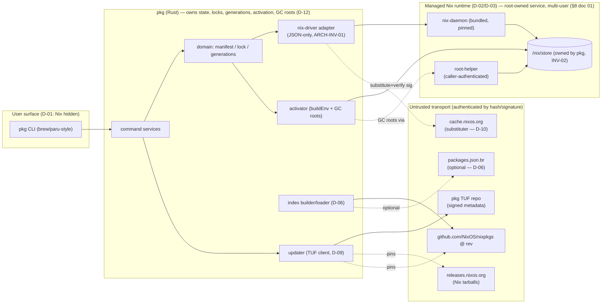

# `pkg` Plan Set — Canonical Entrypoint

> **Status:** Draft (planning only — no implementation code). This `README.md` is the
> **index and navigator** for the reconciled plan set `00`–`12`. It owns no new decisions;
> it summarizes and links. Every binding decision lives in
> [`00-overview-and-decisions.md`](00-overview-and-decisions.md); every open go/no-go question
> lives in [`12-open-decisions-and-risks.md`](12-open-decisions-and-risks.md).

---

## 1. What `pkg` is (V1 summary)

`pkg` (working codename) is a single **Rust** binary providing a **brew-/paru-style
imperative package workflow** — `search`, `info`, `install`, `remove`, `list`, `outdated`,
`update`, `upgrade`, `pin`/`unpin`, `history`, `rollback`, `gc`, `repair`, `doctor`,
`completion` — built on top of a **fully hidden, bundled, product-managed Nix**.

The four load-bearing V1 design choices (full set: **D-01…D-17** in doc 00 §7):

- **Nix is invisible and unconfigurable.** Users never type or configure raw Nix; no flakes,
  overlays, `NIX_PATH`, `--impure`, user substituters, or trust keys reach the daemon
  (**D-01**, **INV-03**). `pkg` drives Nix **only as a subprocess over JSON** — it does not
  link Nix's C++ (**D-02**).
- **Exclusive managed ownership of `/nix`.** `pkg` bundles and pins a `nix-daemon` + store at
  `/nix/store`; if it detects any *unmanaged* Nix it **fails closed** and **never auto-deletes**
  user state (**D-03**, **D-04**, **INV-01/02**).
- **Exactly pinned Nixpkgs + a disposable derived index.** The catalog is one pinned Nixpkgs
  revision (**D-05**); search/list/info use a regenerable index that is **never authoritative**
  for what can be installed (**D-06**); install **re-evaluates the exact attribute on host**
  (**D-07**).
- **A small signed channel descriptor distributed via real TUF** pins the Nix runtime, Nixpkgs
  rev/narHash, index hashes, substituters/keys, supported systems, and policy/sequence/expiry
  (**D-08**, **D-09**). `cache.nixos.org` is the **only** artifact cache in V1 (**D-10**).

**Platforms:** `x86_64-linux`, `aarch64-linux`, `x86_64-darwin`, `aarch64-darwin` (**D-14**).
Cache substitution is first and preferred on **every** platform; on a cache miss, v1 may
build locally for the host's **native** Nix system on **both Linux and macOS**, only after a
deterministic build preview and explicit single-operation approval, under `sandbox=true`/
`sandbox-fallback=false` and the daemon's unprivileged build users (`nixbld` / `_nixbld`). No
Rosetta, cross-compilation, emulation, or remote builders in v1 (**D-11**, **INV-08**).

**Multi-user ownership split (D-17 / INV-10):** the immutable runtime, channel, index, source,
and store *service* are **root-owned and machine-global (shared, read-only to users)**; the
**authoritative package environment state** (manifest, lock, generations, activation, journal)
is **per-user, keyed by OS uid**, owned by that user. A narrow authenticated root-helper exists
**only** for GC roots, service control, runtime upgrade, and `/nix` ownership.

---

## 2. Status legend (used across all plan documents)

| Mark | Meaning |
|---|---|
| ✅ **Confirmed** | Current, verifiable Nix/Nixpkgs behavior with a primary-source citation. |
| 🛠 **Decision** | A `pkg` product design choice (`D-NN`) that constrains implementation. |
| ⚠️ **Spike** | Requires a short verification spike before commitment; a default is stated (`S1`–`S5`). |

Document status line is always **Draft (planning only — no implementation code)**.

---

## 3. Recommended reading order

1. [`00-overview-and-decisions.md`](00-overview-and-decisions.md) — **read first.** Decisions,
   invariants, glossary, CLI surface, cross-doc map.
2. [`01-system-architecture.md`](01-system-architecture.md) — layers, subprocess contract,
   directory layout, data-contract names.
3. [`02-trust-and-update-model.md`](02-trust-and-update-model.md) — TUF layout, channel
   descriptor schema, update/runtime-upgrade flows.
4. [`03-nixpkgs-source-and-index.md`](03-nixpkgs-source-and-index.md) — source pinning, index
   schema, the authoritative on-host install-eval.
5. [`04-resolution-install-build.md`](04-resolution-install-build.md) and
   [`05-state-locks-generations-gc.md`](05-state-locks-generations-gc.md) — the execution
   track (pipeline + state machine; read together).
6. [`06-cli-and-user-experience.md`](06-cli-and-user-experience.md) and
   [`07-platform-installation-and-runtime.md`](07-platform-installation-and-runtime.md) — the
   user + platform track.
7. [`08-security-model.md`](08-security-model.md) → [`09-testing-and-validation.md`](09-testing-and-validation.md)
   → [`10-release-and-operations.md`](10-release-and-operations.md) — the assurance track, in
   order.
8. [`11-pr-roadmap.md`](11-pr-roadmap.md) and [`12-open-decisions-and-risks.md`](12-open-decisions-and-risks.md)
   — the build plan and the living registry of decisions, risks, and go/no-go spikes.

---

## 4. Document map — what each owns and consumes

| # | Document | **Owns** (authority) | **Consumes** (inputs) |
|---|---|---|---|
| 00 | [Overview & Decisions](00-overview-and-decisions.md) | All `D-NN`/`INV-NN`, glossary, scope, platform set, CLI surface, spike IDs | (root — nothing) |
| 01 | [System Architecture](01-system-architecture.md) | Layered components, **Nix subprocess contract** (§11), **state-directory layout** (§9), data-contract *names*, privilege model | 00 decisions |
| 02 | [Trust & Update](02-trust-and-update-model.md) | **Channel descriptor schema** (§7), **TUF role/target layout** (§6.4), update + runtime-upgrade flows, trust bootstrap | 00, 01 |
| 03 | [Nixpkgs Source & Index](03-nixpkgs-source-and-index.md) | Source fetch+verify, **index schema** (§7), **install-eval contract** (§9), `packages.json.br` relationship | 00, 01, 02 |
| 04 | [Resolution/Install/Build](04-resolution-install-build.md) | Resolve→preflight→acquire→verify→stage→activate→**commit** pipeline, build preview/approval, sandbox/caps | 00, 01, 02, 03 |
| 05 | [State/Locks/Gen/GC](05-state-locks-generations-gc.md) | **Authoritative state model**, schema migrations, journal, generations, atomic `current`, GC roots, `gc`/`repair` | 00, 01, 04 |
| 06 | [CLI & UX](06-cli-and-user-experience.md) | Per-command flags/exit codes, `--json` + progress protocol, approvals, error rendering | 00, 01, 04, 05 |
| 07 | [Platform Install/Runtime](07-platform-installation-and-runtime.md) | Bundled runtime, generated `nix.conf`, installers, daemon supervision, unmanaged-Nix refusal, uninstall | 00, 01, 02, 08 |
| 08 | [Security Model](08-security-model.md) | Threat catalog (T-*), trust boundaries, control matrix, crypto/key policy | 00–07 |
| 09 | [Testing & Validation](09-testing-and-validation.md) | Test pyramid, `FakeNix`/`pkg-testkit`, parity job, CI lanes, release gates | 00–08 |
| 10 | [Release & Operations](10-release-and-operations.md) | Artifacts/topology, release gates, key custody, channel ops, compat policy, incident runbooks | 00–09 |
| 11 | [PR Roadmap](11-pr-roadmap.md) | PR DAG (PR-0…PR-38), milestones, parallelism matrix, critical path, guardrails | 00–10 |
| 12 | [Open Decisions & Risks](12-open-decisions-and-risks.md) | **DR-*** decision records, **S1–S5** spike registry, **RISK-*** register, v1 defaults/deferrals | 00–11 |

> Schema-authority rule (from 00 §7): the *canonical JSON shape* of each artifact is owned by
> exactly one doc; **doc 05 owns all versioning/migrations**. Doc 01 owns the *names*;
> doc 02 owns `descriptor.json`; doc 03 owns index records.

---

## 5. System dependency diagram



---

## 6. Install transaction sequence (canonical happy path)

Derived from doc 04 §5 (pipeline), doc 01 §12.2, and the canonical crash-consistency
contract in doc 05 §8.4. The generation transaction creates the **GC root before** the
atomic `current` swap, so the swap always lands on a durably-rooted, fully-documented
tree; the **committed journal row is appended after** the swap. The operation lease
(doc 05 §12) protects the staged path only during stage→rooted (before the root exists)
and serializes `gc` for the whole transaction.

```mermaid
sequenceDiagram
  participant U as user
  participant CLI as pkg CLI
  participant R as resolver
  participant N as nix-driver → daemon
  participant DOM as domain (manifest/lock/gen)
  participant ACT as activator
  participant HELP as root-helper
  U->>CLI: pkg install ripgrep
  CLI->>R: resolve(ripgrep, currentSeq, system)
  R->>N: nix derivation show / build nixpkgs#ripgrep --json
  N-->>R: drvPath + outputs
  CLI->>N: preflight: path-info --recursive --closure-size
  N-->>CLI: closure + download/build classification
  CLI->>CLI: ensure closure realized (substitute per D-10; or explicit native build D-11)
  CLI->>N: verify: store verify + path-info (narHash/sigs)
  CLI->>N: stage: buildEnv activation tree → store path P (no current change)
  CLI->>DOM: prepared: write generations/gen-N.json + fsync (immutable metadata)
  CLI->>HELP: rooted: create GC root gcroots/pkg/users/<uid>/gen-N → P + fsync (D-17/ARCH-INV-06)
  CLI->>ACT: activated: atomic swap current → P (D-16)
  CLI->>DOM: write manifest.json + lock.json (fsync) to match gen-N
  CLI->>DOM: committed: append committed row to journal (fsync)
  DOM-->>CLI: committed generation N
  CLI-->>U: installed ripgrep 14.1.0
```

> Failure before the `current` swap **discards the prepared/rooted generation and leaves
generation N-1 active** (D-16); the staged generation/root is unreachable from `current`
and recovery deletes it. Failure after the swap leaves generation N rooted and documented;
recovery finalizes `manifest`/`lock` + the `committed` row. Cancellation is
SIGTERM-to-subprocess-group + lease release + staging cleanup (doc 04 §9, doc 05 §8.4).

---

## 7. Machine-global vs per-user ownership (D-17 / INV-10)

| Artifact / location | Scope | Owner | Rationale |
|---|---|---|---|
| `/nix/store` + `/nix/var/nix/*` | machine-global | root (exclusive, INV-02) | Fixed store prefix; cache.nixos.org path hashing. |
| `/opt/pkg/{bin,nix/<ver>}` runtime | machine-global | root (read-only to users) | Bundled pinned `nix`; `nix/current` atomic swap (doc 02 §10). |
| `/var/lib/pkg/channel/{tuf,descriptor.json}` | machine-global | root (shared, read-only) | Single trust root per host (TRU-INV-01). |
| `/var/lib/pkg/index/<seq>/` | machine-global | root (shared, read-only) | Disposable derived index; verified per-host. |
| `/var/lib/pkg/nixpkgs/<rev>/` | machine-global | root (shared, read-only) | Pinned catalog source; shared cache. |
| `/var/lib/pkg/{cache,log}` | machine-global | root | Service downloads + service logs. |
| `/nix/var/nix/gcroots/pkg/users/<uid>/gen-<id>` | **per-user (uid)** | root-owned symlink, uid-scoped dir | GC roots pinning each user's generation closures (ARCH-INV-06). |
| `<user-state>/manifest.json` | **per-user (uid)** | that uid, 0700 | Desired state — authoritative. |
| `<user-state>/lock.json` | **per-user (uid)** | that uid, 0700 | Realized state — authoritative. |
| `<user-state>/generations/`, `current`, `journal/`, `logs/` | **per-user (uid)** | that uid, 0700 | Generation history + activation pointer + journal. |
| `$XDG_CONFIG_HOME/pkg/config.toml` | **per-user (uid)** | that uid | Prefs **only** — cannot override trust/substituters/store (INV-03). |

`<user-state>` = `$XDG_DATA_HOME/pkg/` (Linux) or `~/Library/Application Support/pkg/` (macOS),
with a root-owned fallback `/var/lib/pkg/users/<uid>/` for accounts without a usable HOME
(doc 01 §9.3, doc 05 §4).

---

## 8. Authoritative source vs derived state

| Thing | Status | Authority |
|---|---|---|
| Channel descriptor (`descriptor.json`) | **Authoritative** | TUF targets metadata; `pkg` cross-checks descriptor fields *and* TUF target hashes (defense in depth, doc 02 §12). |
| TUF metadata (root/timestamp/snapshot/targets) | **Authoritative** | Embedded `root.json` is the only a-priori trust anchor (doc 02 §8). |
| Pinned Nixpkgs source | **Authoritative** | `descriptor.nixpkgs.{rev,narHash}`; verified via `nix flake metadata` (CAT-INV-01). |
| **Index** records | **Derived / disposable** | Regenerable from Nixpkgs; hash-pinned in descriptor; **never** a source of store paths or realizability (D-06/07, INV-07). |
| On-host install evaluation | **Authoritative for realizability** | `nix build`/`path-info` on host is the *only* statement a package is realizable here (CAT-INV-03). |
| `manifest.json` (desired state) | **Authoritative (user-owned)** | User intent; per-user, keyed by uid. |
| `lock.json` (realization) | **Authoritative (user-owned)** | Exact realized identities; `storePath` is the join key (D-13). |
| Generation record | **Authoritative snapshot** | Immutable (manifest + lock + activation) snapshot; content-hashed (doc 05 §5.3). |
| `cache.nixos.org` narinfo/signatures | **Authoritative for path integrity** | Nix verifies substituted paths against the descriptor-pinned key (D-10). |
| Nix profile state | **Not authoritative** | Ignored/mirrored, never trusted (D-12, DR-008). |
| `pname@version` | **Display metadata only** | Never a key (D-13, INV-06). |

---

## 9. Canonical data-contract flow

```mermaid
flowchart TD
  TUF["TUF metadata<br/>root → timestamp → snapshot → targets<br/>(doc 02 §6.4)"]
  DESC["descriptor.json<br/>sequence / policyVersion / expiry / supportedSystems<br/>nixRuntime · nixpkgs.rev+narHash · index.perSystem.sha256 · substituters/keys<br/>(doc 02 §7)"]
  SRC["Nixpkgs source @ rev<br/>fetched + narHash-verified (CAT-INV-1)<br/>(doc 03 §6)"]
  IDX["Index per (seq,system)<br/>disposable, sha256-verified (CAT-INV-2)<br/>(doc 03 §7)"]
  RES["Resolver: selector → attrPath<br/>(doc 03 §9.1, 04 §5.1)"]
  EVAL["On-host eval → realization<br/>storePath / drvPath / narHash / outputs<br/>(CAT-INV-3, doc 03 §9.2)"]
  LOCK["lock.json — realization per entry id<br/>(doc 01 §10.2 / 05 §5.2)"]
  GEN["generation gen-N.json<br/>manifestHash + lockHash + activation.storePath<br/>(doc 01 §10.3 / 05 §5.3)"]
  ACT["activation = buildEnv store object<br/>current → that path (atomic, D-16)<br/>(doc 04 §5.5)"]
  ROOT["GC root<br/>gcroots/pkg/users/<uid>/gen-N → activation<br/>(doc 05 §8.3, ARCH-INV-06)"]

  TUF -->|verifies| DESC
  DESC -->|pins rev+narHash| SRC
  DESC -->|pins index sha256| IDX
  SRC --> IDX
  IDX --> RES
  SRC --> EVAL
  RES --> EVAL
  EVAL --> LOCK
  LOCK --> GEN
  GEN -->|prepared: gen-N.json fsynced| ROOT
  ROOT -->|rooted (GC root) → activated (current swap)| ACT
```

Key invariant: a corrupt/absent **index** never blocks a known-attribute install (it re-evaluates
on host); a corrupt/stale **descriptor** is a hard stop requiring `pkg update` (doc 00 §14,
doc 03 §12).

---

## 10. Command-to-subsystem routing

`channel` = TUF/descriptor · `index` = search catalog · `resolve` = selector→realization ·
`pipeline` = resolve→preflight→acquire→verify→stage→activate→commit · `state` = manifest/lock/
generations · `store` = activation + GC roots + verify/gc.

| Command | channel | index | resolve | pipeline | state | store | Owned detail |
|---|:--:|:--:|:--:|:--:|:--:|:--:|---|
| `doctor` | read | — | — | — | read | check | [06 §6.1](06-cli-and-user-experience.md) |
| `update` | **✓** | (lazy fetch) | — | — | — | — | [06 §6.8](06-cli-and-user-experience.md), [02 §9](02-trust-and-update-model.md) |
| `search` | — | **✓** | — | — | — | — | [06 §6.2](06-cli-and-user-experience.md) |
| `info` | — | **✓** | (candidates) | — | — | — | [06 §6.3](06-cli-and-user-experience.md) |
| `install` | read seq | — | **✓** | **✓** | stage+commit | **✓** | [06 §6.4](06-cli-and-user-experience.md), [04 §5](04-resolution-install-build.md) |
| `remove` | — | — | — | **✓** | stage+commit | **✓** | [06 §6.5](06-cli-and-user-experience.md) |
| `list` | — | — | — | — | read lock | — | [06 §6.6](06-cli-and-user-experience.md) |
| `outdated` | read seq | **✓** | — | — | read lock | — | [06 §6.7](06-cli-and-user-experience.md) |
| `upgrade` | read seq | — | **✓** | **✓** | stage+commit | **✓** | [06 §6.9](06-cli-and-user-experience.md), [05 §7](05-state-locks-generations-gc.md) |
| `pin`/`unpin` | — | — | — | — | edit manifest | — | [06 §6.10](06-cli-and-user-experience.md) |
| `history` | — | — | — | — | read gens | — | [06 §6.11](06-cli-and-user-experience.md) |
| `rollback` | — | — | — | rebuild act. | new gen + `current` | **✓** re-root | [06 §6.12](06-cli-and-user-experience.md), [05 §8](05-state-locks-generations-gc.md) |
| `gc` | — | — | — | — | prune gens | **✓** `nix store gc` | [06 §6.13](06-cli-and-user-experience.md), [05 §9](05-state-locks-generations-gc.md) |
| `repair` | — | — | — | re-acquire | read | **✓** `nix store verify` | [06 §6.14](06-cli-and-user-experience.md), [05 §10](05-state-locks-generations-gc.md) |
| `completion` | — | — | — | — | — | — | [06 §6.15](06-cli-and-user-experience.md) |

---

## 11. Failure / recovery boundary summary

Policy is fixed in doc 00 §14; per-operation matrices live in doc 01 §13, doc 04 §11, doc 05
§13, and the full model in doc 08. Core rules:

- **Never break the working environment (D-16):** any failed install/upgrade/rollback leaves
  the previously-committed generation active via the atomic `current` swap; staged temp state
  is discarded.
- **Never trust unverifiable bytes (INV-09):** any hash/signature/sequence failure aborts the
  operation; no silent fallback to unsigned data.
- **Fail closed, never auto-delete (D-04):** foreign-Nix detection or store-ownership
  ambiguity refuses and prints manual remediation; user data is never destroyed automatically.
- **Disposables are disposable (INV-07):** a corrupt/missing index never blocks a known-attr
  install (re-evaluates on host); a corrupt/stale descriptor is a hard stop requiring
  `pkg update`.
- **Restart-safe:** an interrupted op is detected via the journal/lease and resumes from the
  last committed generation — never from a half-built activation tree (doc 04 §9, doc 05 §11).
- **GC safety (INV-05):** every realized output pinned in a retained generation has a GC root;
  `gc` prunes generations *before* running `nix store gc` so only rooted closures survive.

---

## 12. Security / trust boundary summary

Five trust boundaries crossed in normal operation (full catalog in doc 08 §2.2, threats T-* in
doc 08 §6, control matrix in doc 08 §8):

1. **Internet → product CDN → channel client.** Signed TUF metadata must verify to the embedded
   root; anti-rollback/freeze via sequence + timestamp expiry (T-CHAN-*).
2. **Internet → cache.nixos.org → store.** Substituted paths verify against the
   descriptor-pinned key only; users cannot change substituters/keys (D-10, T-CACHE-*).
3. **User space → privileged (nix-daemon / root-helper).** Caller is authenticated by uid;
   strict serde, size caps, no expression/substituter passthrough; the helper creates GC roots
   only under uid-scoped dirs (T-DAEMON-*, T-INST-*, T-PATH-*).
4. **User space → host FS (state, `~`).** Per-user 0700 state dirs; `O_NOFOLLOW`/`openat`;
   store-relative symlinks; atomic writes; tamper-evident journal anchored to the channel
   (DR-013, T-STATE-*, T-PATH-*).
5. **Store → user runtime (PATH).** Activation maps provenance → executed code. V1 provides
   **provenance + reproducibility + fast catalog revocation, not runtime isolation** (DR-009,
   T-RUN-1, honest disclosure).

Primary goals G1–G6 (doc 08 §3): authenticity of catalog/runtime; integrity of installed
software; anti-rollback/anti-freeze; state integrity & recoverability; least privilege; no
silent privilege escalation/persistence. Top watch-list risks (doc 12 §3.1): malicious/insecure
pinned package (RISK-01/20), cache.nixos.org single-source compromise (RISK-02), store-prefix
coexistence (RISK-04), crypto correctness (RISK-05), supply chain (RISK-13).

---

## 13. PR roadmap overview

Per-PR detail, the full DAG, reviewer model, and per-PR gates live in
**[`11-pr-roadmap.md`](11-pr-roadmap.md)** (DAG §3, entries §4, milestone/exit map §7,
guardrails §9). Go/no-go decisions, the DR registry, and the risk register live in
**[`12-open-decisions-and-risks.md`](12-open-decisions-and-risks.md)** (DRs §1, spikes §2,
risks §3, defaults/deferrals §4).

**Milestones → PRs:**

| Milestone | PRs | Theme | Exit criteria (summary) |
|---|---|---|---|
| **M0 Foundations** | 0–3 | repo, CI/lint/deny, `pkg-core` types, `NixAdapter`+`FakeNix`+Fast CI | workspace builds; Fake Nix + Fast CI green; JSON contract stable |
| **M0.5 Spikes** | 4–8 | S1–S5 (parallel, gated) | all five DRs **Accepted** before irreversible architecture |
| **M1 Managed Nix & state** | 9–12 | unmanaged-Nix detection, state schema v1+journal, channel descriptor+`tough`, provision Nix | detect/provision in temp root; state v1 landed; channel verify on fixtures |
| **M2 Catalog & resolve** | 13–16 | fetch+verify Nixpkgs, deterministic index, query API, resolver | Selector→Realization under pure eval; narHash verified |
| **M3 Install/activate** | 17–20 | substitute+verify, GC roots+activation+`current`, install pipeline, remove/upgrade+mixed-rev | install w/ rollback-on-failure; mixed revisions |
| **M4 Generations & UX** | 21–25 | generations/history/rollback/pin, GC+leases, CLI skeleton, wired commands, completion+doctor | full CLI wired to Fake Nix |
| **M5 Local build & installers** | 26–29 | Cross-platform local build (sandbox+approval, Linux + macOS native), Linux + macOS installers, uninstall | installers + bounded uninstall |
| **M6 Hardening & ops** | 30–35 | repair, security lane, perf gate, release signing, observability, docs/support | all G-* lanes green on fixtures |
| **M7 Technical Preview** | 36 | Real-Nix nightly CI, Fake↔Real parity, self-hosted e2e | Real-Nix e2e green on Linux x86_64 + macOS arm64 |
| **M8 v1** | 37–38 | RC + revoke rehearsal + sign-off; v1.0 release | all release gates + advisory |

**Parallel workstreams (doc 11 §5):**

- **Spikes (M0.5):** PR-4 ‖ PR-5 ‖ PR-6 ‖ PR-7 ‖ PR-8 (all independent after PR-1).
- **M1:** PR-9 ‖ PR-10 ‖ PR-11 (state, detect, channel).
- **M3→M4:** PR-20 ‖ PR-21 (lifecycle ops both consume PR-19).
- **M5:** PR-27 (Linux installer) ‖ PR-28 (macOS installer+build, depends on PR-26); PR-25 ‖ PR-26 ‖ PR-27.
- **M6:** PR-30 ‖ PR-31 ‖ PR-32 ‖ PR-33 ‖ PR-34 ‖ PR-35 (whole hardening batch).
- **CLI skeleton (PR-23)** only needs PR-2 → can start during M1/M2.

**Critical path (doc 11 §6):**

```
PR-0 → PR-1 → PR-2 → PR-3
  → PR-11 (needs S2/PR-5) → PR-12 (needs PR-9) → PR-13
  → PR-14 (needs S4/PR-6) → PR-16 → PR-19 (needs PR-18) → PR-24
  → PR-36 (needs PR-31/32/33) → PR-37 → PR-38
```

The **channel/TUF choice (S2)** and the **resolve→install chain** are on the critical path;
installers, local build, and most of M6 hardening run **off** it and parallelize. **Store-prefix
spike S1 must not slip past M0.5** (it gates PR-9/12/27).

---

## 14. Remaining go/no-go spikes (S1–S5)

These are **open** (DR-001…005 are `Proposed`, not `Accepted`) — listed here as unresolved, not
solved. No irreversible architecture merges before the corresponding DR is `Accepted`
(doc 11 §9). Full detail: [doc 12 §2](12-open-decisions-and-risks.md), [doc 00 §11](00-overview-and-decisions.md).

| Spike | PR → DR | Question (unresolved) | Default if spike confirms |
|---|---|---|---|
| **S1 — store prefix / runtime layout** | PR-4 → DR-001 | Can `pkg` exclusively own `/nix/store` under a managed daemon socket/state, with no V1 need for a relocatable store? How to safely detect/refuse unmanaged Nix? | Hard requirement on `/nix/store`; fail-closed otherwise (D-04). |
| **S2 — TUF fit / key custody** | PR-5 → DR-002 | Does real TUF via `tough` express the small target set (rev/narHash, Nix version, index hashes, substituters/keys, systems, policyVersion, sequence, expiry) with threshold + revocation? | Use `tough`; 1-of-1 v1 → 2-of-3 at GA; offline root (DR-002). |
| **S3 — macOS cache coverage** | PR-7 → DR-003 | Do v1 attrs substitute for `aarch64-darwin`/`x86_64-darwin`? Is a notarized+signed installer feasible, and are native macOS local builds (sandbox, `_nixbld` build users, Xcode toolchain, resource caps) viable? | Darwin cache coverage + approved native sandboxed local builds; signed/notarized installer/runtime (DR-003). |
| **S4 — Nixpkgs reevaluation / index cost** | PR-6 → DR-004 | What are realistic single-attr realize + four-system index meta-eval costs? flake `narHash` vs raw GitHub archive hash difference? | Disposable index for browse; on-host re-eval for install; publisher precompute. |
| **S5 — sandbox / resource enforcement** | PR-8 → DR-005 | Does `sandbox=true`/`sandbox-fallback=false` work under the managed daemon on both Linux and macOS? Can we intercept builds for preview/approval? Are resource caps effective (cgroups/RLIMIT on Linux; RLIMIT/guards on macOS)? | Local builds (Linux **and** macOS, native) only after explicit approval + fail-closed readiness; sandbox + caps (DR-005). |

> SPK-02 (Nix-as-subprocess JSON stability) is **not** a standalone spike: it is enforced
> continuously by pinning the managed Nix version and isolating all Nix output — including the
> nominally-internal `--log-format internal-json` — behind the single versioned `nix-driver`
> adapter, validated by the Fake↔Real parity job (doc 01 §11, doc 09 §4.3).

---

## 15. Initial implementation starting instructions

Mirror the PR DAG (doc 11). The first four PRs unblock everything else and contain **no Nix
dependency**, so they can begin immediately:

1. **PR-0 — Repo + CI + plans cross-links.** Establish the repo, this `plans/` directory as the
   source of truth, `CONTRIBUTING.md` (reviewer model from doc 11 §2), and a docs-linkcheck CI
   that fails on broken plan cross-references. *(No code.)*
2. **PR-1 — Cargo workspace + lint/license/deny/audit.** `Cargo.toml` (workspace),
   `rust-toolchain.toml`, `deny.toml`, `rustfmt.toml`, `clippy.toml`, and the Fast-CI lint job
   (`fmt`, `clippy -D warnings`, `cargo deny check`, `cargo audit`, `cargo doc`).
3. **PR-2 — `pkg-core` domain types.** `identity`, `selector`, `realization`, `channel`,
   `version`, `system` — the intent-vs-realization vocabulary (D-13) and the display-only
   `pname@version` distinction. Property tests for version compare + identity equality.
4. **PR-3 — `NixAdapter` trait + JSON contract + `FakeNix` + Fast CI.** The seam that lets the
   entire core be built/tested **without Real Nix** (the JSON-only contract from doc 04, a trust
   boundary per doc 08 T-DAEMON-2). Fast-CI wires unit + contract (serde round-trips) on `FakeNix`.

**In parallel (after PR-1):** open the five spike PRs (**PR-4…PR-8**) so DR-001…005 land before
M1 architecture is locked. **PR-23 (CLI skeleton)** needs only PR-2 and can start in M1/M2.

**Hard ordering constraints (doc 11 §9):** no installer layout before S1; no channel
implementation before S2; no macOS build-security commitment (cache coverage **and** native local-build readiness) before S3; no local-build UX before
S5; no perf budgets before S4.

---

## 16. Reconciliation summary

This plan set was produced from parallel drafts and reconciled for cross-document consistency.
The non-obvious corrections encoded across `00`–`12`:

- **Mixed exact revisions (INV-04).** A generation may legitimately contain outputs realized
  from **multiple Nixpkgs revisions**: each selector pins `channel:current` |
  `channel:pinned:<id>` | `rev:<gitsha>`. **Every** such rev is exact/pinned, never floating.
  `upgrade` re-resolves only the named/non-pinned selectors at the current `channelSeq`
  (doc 05 §7, PR-20).
- **UID-scoped authoritative state (D-17 / INV-10).** Manifest/lock/generations/activation/
  journal are **per-user keyed by OS uid**, *not* a single shared profile. This supersedes the
  earlier single-shared-profile assumption (former UD-00.4). Only the immutable runtime/channel/
  index/source/store *service* is root-owned and shared. GC roots are scoped to
  `/nix/var/nix/gcroots/pkg/users/<uid>/` (doc 01 §9, doc 05 §4, PR-18, RISK-21).
- **Generation schema / GC-root-before-swap ordering.** The GC root is created **before**
  the atomic `current` swap (the **rooted** step precedes the **activated** step), and the
  `committed` journal row is appended **after** the swap (doc 04 §5.7, doc 05 §8.4). All
  immutable generation metadata (`gen-N.json`) is fsynced first (**prepared**); the GC root
  is fsynced next (**rooted**); then `current` is swapped (**activated**); then
  `manifest`/`lock` and the `committed` row are written. A crash before the swap leaves the
  previous generation active and the staged generation/root unreachable (recovery deletes
  them); a crash after the swap always leaves a rooted, documented active generation. Nix
  treats any symlink in a scanned gcroots dir as a root, so **no** `--add-root` operation is
  used.
- **Index authority (D-06 / D-07).** The index is **derived and disposable**, hash-pinned in
  the descriptor; it is **never** a source of store paths, narHash, or realizability. A
  corrupt/absent index never blocks a known-attr install (re-evaluates on host). `list` reads
  the **lock**, not the index (doc 03 §7.3/§11, doc 01 §10.2).
- **TUF target scope (doc 02 §6.4).** TUF targets are exactly: `descriptor.json`, the per-system
  **Nix runtime tarballs**, the pinned **Nixpkgs source**, and the per-system **index files**.
  The **`pkg` CLI itself is NOT a TUF channel target** — it is published alongside with a
  pinned checksum + Sigstore attestation (doc 10 §2).
- **Closure preflight (doc 04 §5.2).** Download/build classification is over the **full
  recursive closure**, not the output root. A **single** closure path with an absent narInfo
  (and a non-empty builder) ⇒ build required ⇒ build preview. Preflight never reports
  "binary available" unless *every* closure path is a cache hit.
- **Tests and PR dependencies.** Test lanes (`G-*` in doc 09 §8) and release gates (doc 10 §3)
  are referenced as acceptance criteria by the PR DAG (doc 11); PR-0's docs-linkcheck makes
  broken DR/RISK/`D-NN`/`INV-NN` references fail CI. The **Fake↔Real parity job** (doc 09 §4.3)
  continuously attests the stable subprocess surface rather than treating Nix JSON stability as
  a one-off spike.

---

## 17. Document-set verdict

The set `00`–`12` is **internally reconciled and navigable**: every cross-cutting concept
(intent vs realization, the channel descriptor, the index, the subprocess contract, the
state/generation/GC-root model, the per-user/machine-global split) resolves to a single owning
document and a single schema owner, with migrations centralized in doc 05. Decisions (`D-*`/
`INV-*`), threats (`T-*`), risks (`RISK-*`), decision records (`DR-*`), and PRs (`PR-*`) form a
closed reference graph enforced by CI linkcheck. The architecture is sound and bounded for V1
(hidden, exclusively-managed, TUF-pinned Nix; per-user authoritative state; rollback-safe
generations). The set is **honest about what is not yet decided**: five go/no-go spikes
(S1–S5) gate the irreversible parts of the build, and several high-severity residuals
(RISK-01/02/20) are disclosed rather than hidden. **Recommended next action:** begin PR-0…PR-3
and open PR-4…PR-8 in parallel so DR-001…005 land before M1 locks in.
